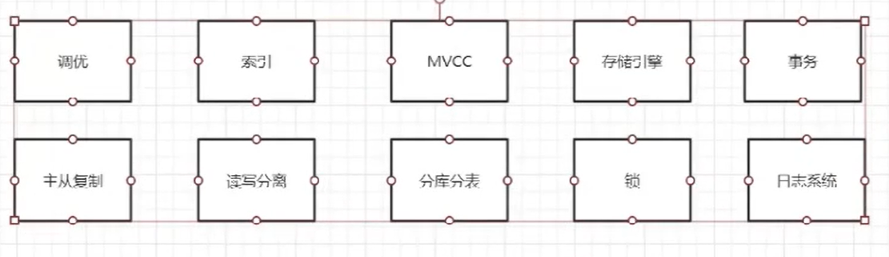
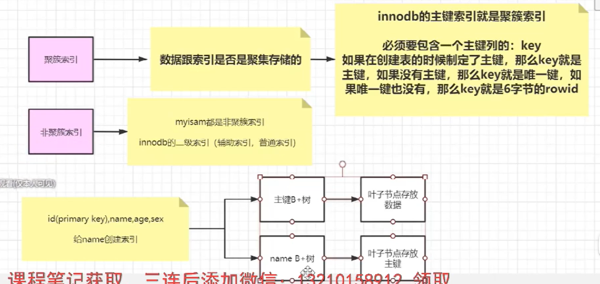
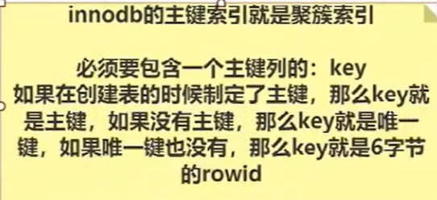
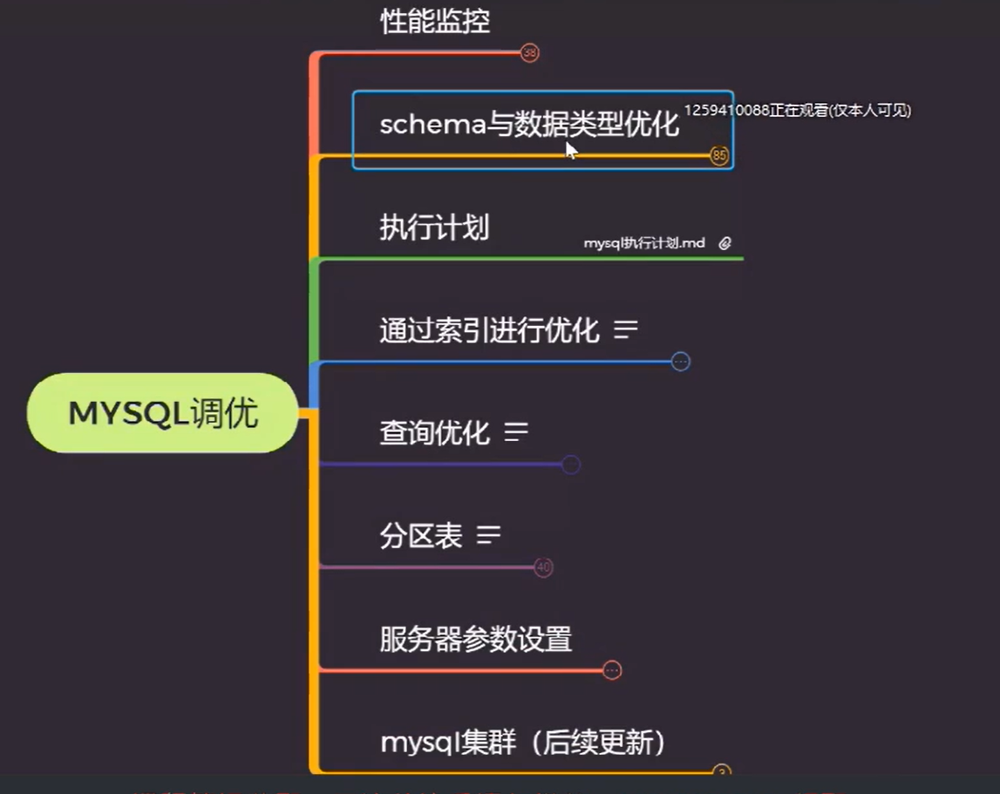
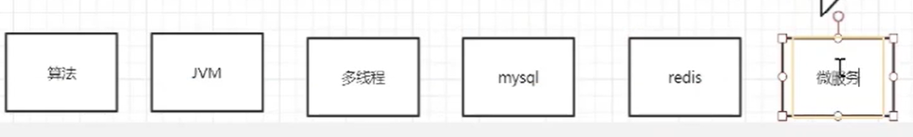

春节假期学习笔记及待办

常见的设计模式：

适配器模式—— Java 中有字节流和字符流，以及在字符流和字节流之间进行转换的转换流，如InputStreamReader 和 OutputStreamReader，这两个类是字节流和字符流之间的适配器类，承担了编码转换的任务

spring SpringMVC springbot Springcloud之间的区别联系？

分布式：一致性哈希？

分布式锁？

Redis的集群中哈希槽为什么是16384？

将视频中的标题列表列出作为复习知识点清单

1、JVM
视频学习收藏中马士兵的JVM讲解中的实战教学，需要自己搭建虚拟机环境动手实践

2、并发视频
待看缓存行相关

3、MySQL

常问知识点

