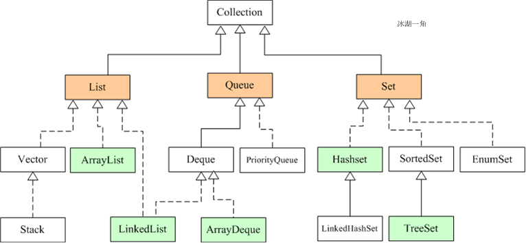

# Java集合框架概述

​	集合可以看作是一种容器，用来存储对象信息。所有集合类都位于java.util包下，但支持多线程的集合类位于java.util.concurrent包下。

数组与集合的区别如下：

1. 数组长度不可变化而且无法保存具有映射关系的数据；集合类用于保存数量不确定的数据，以及保存具有映射关系的数据。
2. 数组元素既可以是基本类型的值，也可以是对象；集合只能保存对象。


​	集合类主要由两个根接口Collection和Map派生出来的，Collection派生出了三个子接口：List、Set、Queue（Java5新增的队列），因此Java集合大致也可分成List、Set、Queue、Map四种接口体系，（注意：Map不是Collection的子接口）。

​	其中List代表了有序可重复集合，可直接根据元素的索引来访问；Set代表无序不可重复集合，只能根据元素本身来访问；Queue是队列集合；Map代表的是存储key-value对的集合，可根据元素的key来访问value。

​	下图中淡绿色背景覆盖的是集合体系中常用的实现类，分别是**ArrayList、LinkedList、ArrayQueue、HashSet、TreeSet、HashMap、TreeMap**等实现类。

类体系结构如下：




# 常见实现类介绍

# Collection接口常见方法

属于集合类的基本接口方法，详见API。这些 API 分为这四大类：

| 功能 |            方法             |
| :--- | :-------------------------: |
| 增   |       add()/addAll()        |
| 删   |    remove()/ removeAll()    |
| 改   | Collection Interface 里没有 |
| 查   |  contains()/ containsAll()  |
| 其他 | isEmpty()/size()/toArray()  |


# List接口

List 的实现方式有 LinkedList 和 ArrayList 两种，那面试时最常问的就是这两个数据结构如何选择。

对于这类选择问题：
一是考虑数据结构是否能**完成需要的功能**；
如果都能完成，二是考虑哪种**更高效**。

那具体来看这两个 classes 的 API 和它们的时间复杂度：

| 功能 |        方法         | ArrayList | LinkedList |
| :--- | :-----------------: | :-------: | :--------: |
| 增   |      add(E e)       |   O(1)    |    O(1)    |
| 增   | add(int index, E e) |   O(n)    |    O(n)    |
| 删   |  remove(int index)  |   O(n)    |    O(n)    |
| 删   |     remove(E e)     |   O(n)    |    O(n)    |
| 改   | set(int index, E e) |   O(1)    |    O(n)    |
| 查   |   get(int index)    |   O(1)    |    O(n)    |


造成时间复杂度的区别的原因是：

- 因为 ArrayList 是用数组来实现的。
- 而数组和链表的最大区别就是**数组是可以随机访问的（random access）**。

这个特点造成了在数组里可以通过下标用 O(1) 的时间拿到任何位置的数，而链表则做不到，只能从头开始逐个遍历。

**所以说：**

1. **改查选择 ArrayList；**
2. **增删在尾部的选择 ArrayList；**
3. **其他情况下，如果时间复杂度一样，推荐选择 ArrayList，因为 overhead 更小，或者说内存使用更有效率。**


### ArrayList


### LinkedList


### Vector

Vector 和 ArrayList 一样，也是继承自 java.util.AbstractList，底层也是用数组来实现的。但是现在已经被弃用了，因为...它加了太多的 synchronized！

面试常问题：**Vector 和 ArrayList 的区别是什么？**

**一是刚才已经说过的线程安全问题；**
**二是扩容时扩多少的区别。**

ArrayList 的扩容实现源码：新容量 = 原容量 + （原容量 >> 1） = 1.5 倍*原容量 （通过位运算的**算术右移**操作完成除以2的计算）

Vector 的扩容实现源码：新容量 = 原容量 +  （capacityIncrement > 0 ?  capacityIncrement  : 原容量）capacityIncrement  一般并不定义，默认情况为扩容两倍


### Stack

基本已弃用。


# Set接口


Set 的特定是无序、不重复的，就和数学里学的「集合」的概念一致。

Set集合与Collection的方法相同，由于Set集合不允许存储相同的元素，所以如果把两个相同元素添加到同一个Set集合，则添加操作失败，新元素不会被加入，add()方法返回false。

常用实现类有：

### HashSet

采用 Hashmap 的 key 来储存元素，主要特点是无序的，基本操作都是 O(1) 的时间复杂度，很快。

### LinkedHashSet

这个是一个 HashSet + LinkedList 的结构，特点就是既拥有了 O(1) 的时间复杂度，又能够保留插入的顺序。

### TreeSet

采用红黑树结构，特点是可以有序，可以用自然排序或者自定义比较器来排序；缺点就是查询速度没有 HashSet 快。

### EnumSet


# Map接口

说明：***Hashtable与HashMap对比记忆***


## Hashtable

（基本上已经弃用，因为为了保证线程安全，底层实现加了太多的Synchronize。）

### 继承关系

HashTable是继承自Dictionary类，同时实现了map、Cloneable（可复制）、Serializable（可序列化）这三个接口（与HashMap相同）。

Dictionary类是一个已经被废弃的类（见其源码中的注释）。父类都被废弃，自然而然也没人用它的子类Hashtable了。

### 线程安全

Hashtable是线程安全的。在多线程并发的环境下，可以直接使用Hashtable，不需要自己为它的方法实现同步，但导致效率过低。

### 初始大小及扩容

Hashtable默认的初始大小为11，之后每次扩充，容量变为原来的2n+1。HashMap默认的初始化大小为16。之后每次扩充，容量变为原来的2倍。

创建时，如果给定了容量初始值，那么Hashtable会直接使用你给定的大小，之所以会有这样的不同，是因为Hashtable和HashMap设计时的侧重点不同。Hashtable的侧重点是哈希的结果更加均匀，使得哈希冲突减少。当哈希表的大小为素数时，简单的取模哈希的结果会更加均匀。


## HashMap

### 继承关系

HashMap是继承自AbstractMap类，同时实现了map、Cloneable（可复制）、Serializable（可序列化）这三个接口

### 线程安全

HashMap不是线程安全的，在多线程并发的环境下，可能会产生死锁等问题。使用HashMap时就必须要自己增加同步处理。虽然HashMap不是线程安全的，但是它的效率会比Hashtable要好很多。这样设计是合理的。在我们的日常使用当中，大部分时间是单线程操作的。当需要多线程操作的时候可以使用线程安全的ConcurrentHashMap。ConcurrentHashMap虽然也是线程安全的，但是它的效率比Hashtable要高好多倍。因为ConcurrentHashMap使用了分段锁，并不对整个数据进行锁定。

### 初始大小及扩容

HashMap则总是使用2的幂作为哈希表的大小，初始默认为16。之所以会有这样的不同，是因为Hashtable和HashMap设计时的侧重点不同。HashMap则更加关注hash的计算效率问题。在取模计算时，如果模数是2的幂，那么我们可以直接使用位运算来得到结果，效率要大大高于做除法。HashMap为了加快hash的速度，将哈希表的大小固定为了2的幂。当然这引入了哈希分布不均匀的问题，所以HashMap为解决这问题，又对hash算法做了一些改动。这从而导致了Hashtable和HashMap的计算hash值的方法不同。

HashMap的扩容机制，有两个因素：

- Capacity：HashMap当前长度。
- LoadFactor：负载因子，默认值0.75f。

分为两步：

- 扩容：创建一个新的Entry空数组，长度是原数组的2倍。
- ReHash：遍历原Entry数组，把所有的Entry**重新Hash到新数组**。

说明：这里重新hash是因为下边讲的hash实现，HashMap对这一过程有特殊处理，与长度有关，故扩容后需要重新计算hash


**？？？**最后，留一个思考题，既然HashMap并不会直接接收用户传入的初始容量，那么为什么《阿里巴巴Java开发手册》还是建议开发者在创建HashMap的时候制定一个初始容量呢？这个容量设置成多少合适呢？为什么？


### 迭代器

HashMap的Iterator是fail-fast迭代器。当有其它线程改变了HashMap的结构（增加，删除，修改元素），将会抛出ConcurrentModificationException。不过，通过Iterator的remove()方法移除元素则不会抛出ConcurrentModificationException异常。但这并不是一个一定发生的行为，要看JVM。

### hash的实现

HashMap中 hash 方法的实现原理，在具体实现上，由两个方法int hash(Object k)和int indexFor(int h, int length)来实现。

```java
hash ：该方法主要是将Object转换成一个整型。

indexFor ：该方法主要是将hash生成的整型转换成链表数组中的下标。
```

重点看一下indexFor方法。我们先来看下Java 7（Java8中虽然没有这样一个单独的方法，但是查询下标的算法也是和Java 7一样的）中该实现细节：

```java
static int indexFor(int h, int length) {

    return h & (length-1);

}
```

**indexFor方法其实主要是将hashcode换成链表数组中的下标**。其中的两个参数h表示元素的hashcode值，length表示HashMap的容量。那么return h & (length-1) 是什么意思呢？

> 位运算(&)效率要比代替取模运算(%)高很多，主要原因是位运算直接对内存数据进行操作，不需要转成十进制，因此处理速度非常快。

所以，return h & (length-1);只要保证length的长度是2^n 的话，就可以实现取模运算了。

所以，因为位运算直接对内存数据进行操作，不需要转成十进制，所以位运算要比取模运算的效率更高，所以HashMap在计算元素要存放在数组中的index的时候，使用位运算代替了取模运算。之所以可以做等价代替，前提是要求HashMap的容量一定要是2^n 。

使用2的幂的数字的时候，Length-1的值是所有二进制位全为1，这种情况下，index的结果等同于HashCode后几位的值。只要输入的HashCode本身分布均匀，Hash算法的结果就是均匀的。这是为了**实现均匀分布**。


那么，既然是2^n ，为啥一定要是16呢？为什么不能是4、8或者32呢？关于这个默认容量的选择，JDK并没有给出官方解释，这应该就是个经验值（Experience Value），既然一定要设置一个默认的2^n 作为初始值，那么就需要在效率和内存使用上做一个权衡。这个值既不能太小，也不能太大。太小了就有可能频繁发生扩容，影响效率。太大了又浪费空间，不划算。所以，16就作为一个经验值被采用了。


### 1.7与1.8版本区别

主要体现在链表插入新的Entry节点时采用的方法（头插法、尾插法），具体如下：

**java8之前是头插法**，就是说新来的值会取代原有的值，原有的值就顺推到链表中去，但是，**在java8之后，都是所用尾部插入了。**

这是因为头插法在多线程操作HashMap时可能引起死循环，原因是扩容转移后前后链表顺序倒置，在转移过程中修改了原来链表中节点的引用关系：

链表头插法的会颠倒原来一个散列桶里面链表的顺序。在并发的时候原来的顺序被另外一个线程a颠倒了，而被挂起线程b恢复后拿扩容前的节点和顺序继续完成第一次循环后，又遵循a线程扩容后的链表顺序重新排列链表中的顺序，最终形成了环。


### LinkedHashMap

为了保证HashMap的输出顺序和插入顺序一致，新增LinkedHashMap。LinkedHashMap继承自HashMap，所以HashMap的所有功能在LinkedHashMap都可以用。LinkedHashMap 和 HashMap 的区别就是新创建了一个Entry:

```java
    static class Entry<K,V> extends HashMap.Node<K,V> {
        Entry<K,V> before, after;
        Entry(int hash, K key, V value, Node<K,V> next) {
            super(hash, key, value, next);
        }
    }
```

这个Entry继承自HashMap.Node，多了一个before，after来实现Node之间的连接。通过这个新创建的Entry，就可以保证遍历的顺序和插入的顺序一致。


### TreeMap


### Properties


## Queue


## CurrentHashMap

