## 红黑树

## 原理理解

红黑树是对概念模型2-3-4树的一种实现，由于直接进行不同节点间的转化会造成较大的开销，所以选择以二叉树为基础，在二叉树的属性中加入一个**颜色属性**来表示2-3-4树中不同的节点。

对应关系如下：

- 2-3-4树中的2节点对应着红黑树中的黑色节点；
- 2-3-4树中的非2节点是以**红节点+黑节点**的方式存在，红节点的作用就是是通过与黑色父节点结合来表达2-3-4树中的3，4节点。

我们先看2-3-4树到红黑树的节点转换：

- 2节点直接转化为黑色节点；
- 3节点这里可以有两种表现形式：左倾红节点或者右倾红节点。
- 4节点被强制**要求**转化为一个黑父带着左右两个红色儿子。

如图：

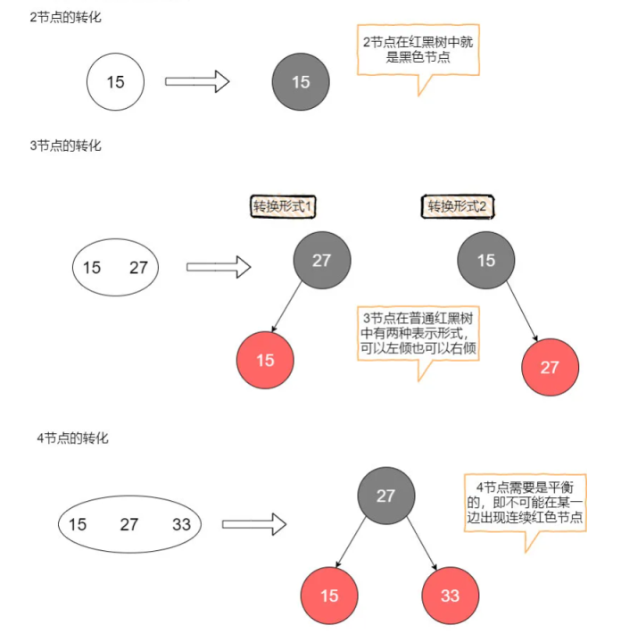

以下介绍基于的红黑树是基于2-3树实现，而且这种实现的红黑树**十分特殊**，它要求概念模型中的3节点在红黑树中必须用左倾的红色节点来表示。这种限定能够很大的减少红黑树调整过程中的复杂性（不用考虑2-3-4树中复杂的**4节点分裂**）。

### 2-3树介绍

#### 插入

对于2-3树的插入。我们的插入操作需要遵循一个**原则**：先将这个元素尝试性地放在**已经存在的节点中**，如果要存放的节点是2节点，那么插入后会变成3节点，如果要存放的节点是3节点，那么插入后会变成4节点（**临时**）。然后，我们对可能生成的临时4节点进行分裂处理，使得临时4节点消失。

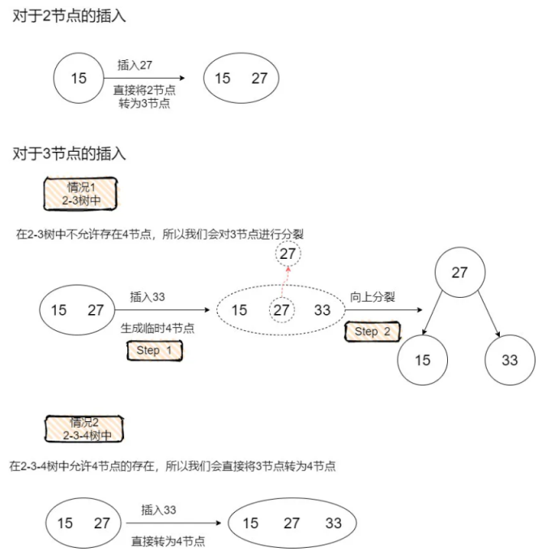

如果需要在2-3-4树中向4节点内插入元素，那么会引发如**下图所示**的分裂过程：

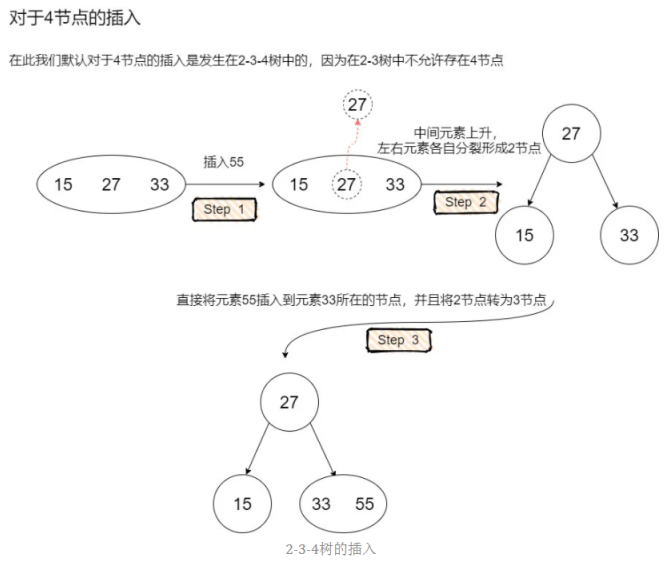

事实上，这正对应了红黑树在插入的时候一定会把待插入节点涂成红色，因为红色节点的意义是**与父节点进行关联**，形成概念模型2-3树中的3节点或者临时4节点。

而红黑树之所以需要在插入后进行调整，正是因为可能存在着**概念模型中的临时4节点**（反应在红黑树中是双红的情况）。

试想在2-3树中如果待插入节点是个2节点，那么反应在红黑树中，不正好对应着黑色父节点吗，在黑色父节点下面增加一个红色儿子，确实不会违背红黑树的任何规则，这也对应着我们向2-3树中的2节点插入一个元素，只需要简单的把2节点变成3节点。

#### 删除

对于2-3树的删除我们主要要考虑待删除元素在2节点这种情况，因为如果待删除元素在3节点，那么可以直接将这个元素删除，而不会破坏2-3树的任何性质（删除这个元素不会引起高度的变化）。

当待删除元素在2节点的时候，由于删除这个元素会导致2节点失去自己**唯一的元素**，引发2节点自身的删除，会使得树中某条路径的高度发生变化，树变得**不平衡**。

因此我们有两种方案去解决这个问题：

- 第一种方案，先删除这个2节点，然后对树进行平衡调整。
- 第二种方案，我们想办法让这个被删除的元素不可能出现在2节点中。

本文选择第二种方案，我们在搜索到这个节点的路径中，不断地判断当前节点是否为2节点，如果是，就从它的兄弟节点或者它的父节点借一个元素，使得当前节点由2节点成为一个3节点或者一个临时4节点（视具体情况而定，在后面的红黑树部分会详细介绍）。

这种操作会产生一种结果：**除非当前节点是根节点，否则当前节点的父节点一定是一个非2节点**（因为搜索的路径是自上而下，父节点已经进行过了这种操作，所以不可能是2节点），那么我们可以保证到达叶子节点的时候，也能顺利的从父节点或者兄弟节点处借到元素，使得自己成为非2节点。从而能够直接删除某个元素（现在这个元素不在2节点中了）。

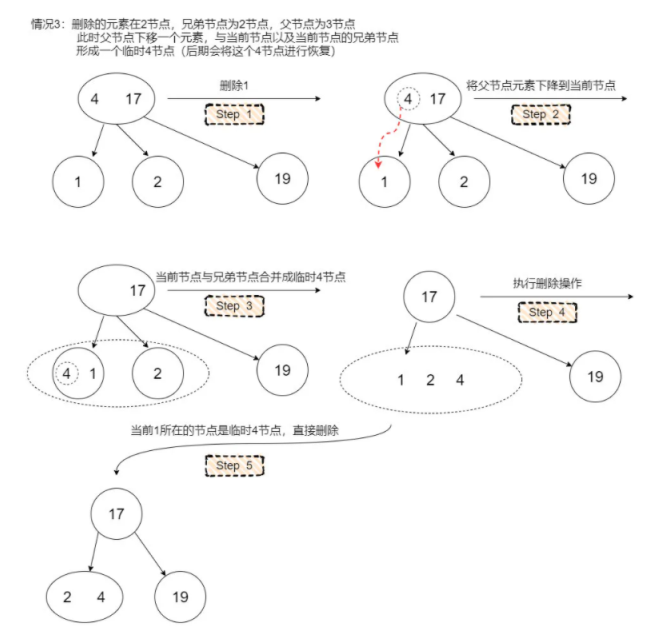

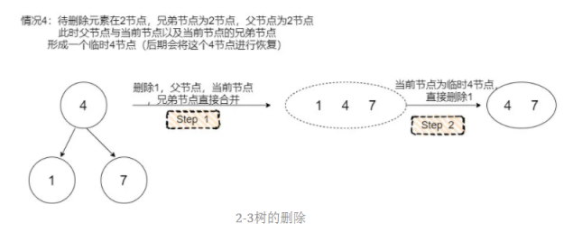

## 定义及特性

红黑树的概念是为了解决二叉查找树多次插入导致的不平衡问题而提出的（另一种树叫AVL树，也需要了解）

首先，二叉查找树（BST）具备什么特性呢？

1. **左**子树上所有结点的值均**小于或等于**它的根结点的值。
2. **右**子树上所有结点的值均**大于或等于**它的根结点的值。
3. 左、右子树也分别为二叉排序树。

下图中这棵树，就是一颗典型的二叉查找树：

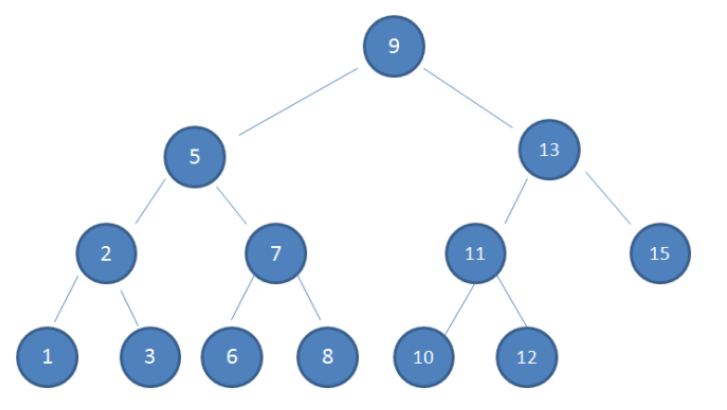

红黑树基于二叉查找树进行拓展，除了满足二叉查找树的基本特性外，还需要满足一下特性（同时与原理理解部分的内容对应）：

1. 节点是红色或黑色。

   【2-3树到红黑树的转化已经解释过】

2. 根节点是黑色。

   【2-3树中如果根节点为2节点，那么它本来就对应红黑树中黑节点；如果根节点为3节点，也可以用黑色节点表示较大的那个元素，然后较小的元素作为左倾红节点存在于红黑树中】

3. 每个叶子节点都是黑色的空节点（NIL节点）。

   【此处提到的叶子其实是空链接，因篇幅问题不便全部画出】

4. 每个红色节点的两个子节点都是黑色。(从每个叶子到根的所有路径上不能有两个连续的红色节点)

   【2-3树中本来就规定没有4节点，2-3-4树中虽然有4节点，但是要求在红黑树中体现为一黑色节点带两红色儿子，分布左右，所以也不会有连续红节点】

5. 从任一节点到其每个叶子的所有路径都包含相同数目的黑色节点。

   【红黑树中的红节点是和黑色父节点绑定的，在2-3树中本来就是同一层的，只有黑色节点才会在2-3树中真正**贡献高度**，由于2-3树的任一节点到空链接距离相同，因此反应在红黑树中就是**黑色完美平衡**】

下图中这棵树，就是一颗典型的红黑树：

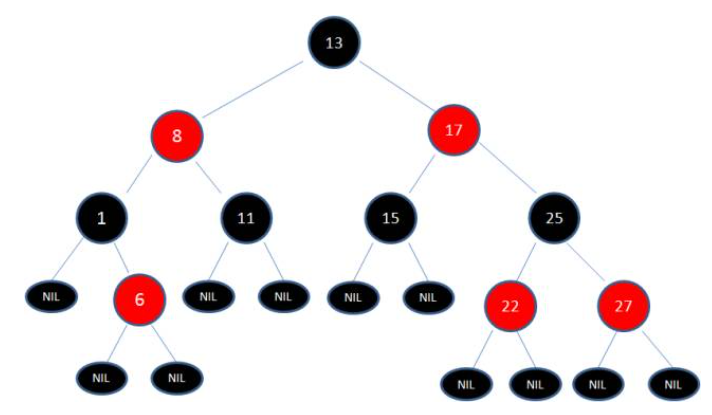

当插入或者删除节点时，红黑树规则可能被打破，此时需要进行调整，使得其继续保持红黑树特性，相关操作分为变色和旋转两种，见下文。

## 变色

变色：

为了重新符合红黑树的规则，尝试把红色节点变为黑色，或者把黑色节点变为红色。

下图所表示的是红黑树的一部分，需要注意节点25并非根节点。因为节点21和节点22连续出现了红色，不符合规则4，所以把节点22从红色变成黑色：

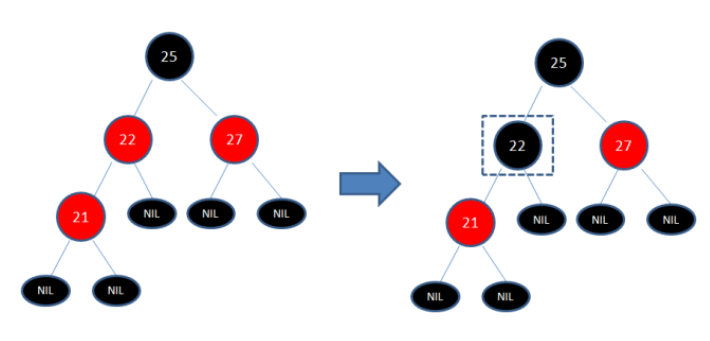

但这样并不算完，因为凭空多出的黑色节点打破了规则5，所以发生连锁反应，需要继续把节点25从黑色变成红色：

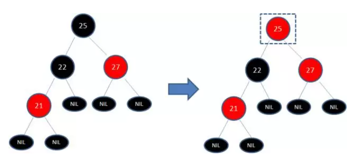

此时仍然没有结束，因为节点25和节点27又形成了两个连续的红色节点，需要继续把节点27从红色变成黑色：

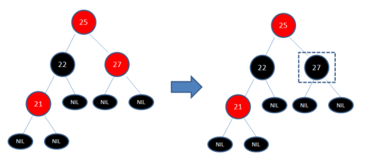

## 旋转

### 左旋

**逆时针**旋转红黑树的两个节点，使得父节点被自己的右孩子取代，而自己成为自己的左孩子。说起来很怪异，大家看下图：

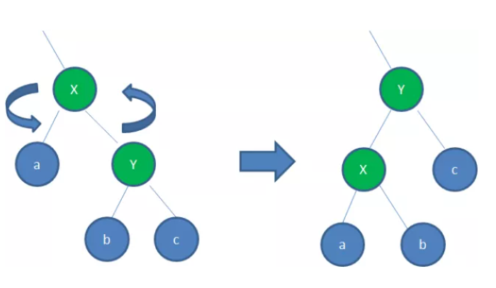

图中，身为右孩子的Y取代了X的位置，而X变成了自己的左孩子。此为左旋转。

### 右旋

**顺时针**旋转红黑树的两个节点，使得父节点被自己的左孩子取代，而自己成为自己的右孩子。大家看下图：

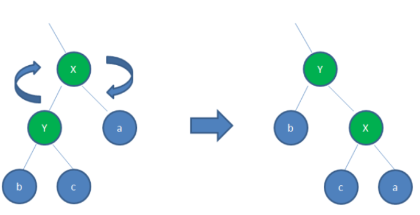

图中，身为左孩子的Y取代了X的位置，而X变成了自己的右孩子。此为右旋转。

## 典型场景

红黑树插入和删除会有多种处理情况，具体罗列如下：

总结：祖宗根节点必黑，允许黑连黑，不允许红连红；新增红色，爸叔通红就变色，爸红叔黑就旋转，那黑往那旋

称呼约定：

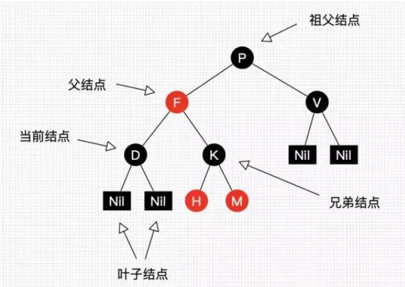

### 插入

| 一级情景                      | 二级场景                                                     | 三级场景                            | 处理                                                         |
| ----------------------------- | ------------------------------------------------------------ | ----------------------------------- | ------------------------------------------------------------ |
| 1、红黑树为空树               | 无                                                           | 无                                  | 插入节点作为根节点，并设为黑色                               |
| 2、插入节点前key已存在        | 无                                                           | 无                                  | 将插入节点颜色设为当前节点颜色；将节点值设为插入节点值       |
| 3、插入节点的父节点为黑色节点 | 无                                                           | 无                                  | 直接插入                                                     |
|                               | 4.1、叔叔节点存在且为红色                                    | 无                                  | （1）父节点和叔叔节点设为黑色（2）将祖父节点设为红色（3）将祖父节点设为当前插入节点（循环执行） |
|                               | 4.2、叔叔节点不存在或为黑色，且插入节点的父节点是其祖父节点的左子节点 | 4.2.1、插入节点是其父节点的左子节点 | （1）父节点设为黑色（2）将祖父节点设为红色（3）将祖父节点进行右旋 |
| 4、插入节点父节点为红色节点   |                                                              | 4.2.2、插入节点是其父节点的右子节点 | （1）父节点左旋（2）将父节点设为当前插入节点（3）按照4.2.1场景进行处理 |
|                               | 4.3、叔叔节点不存在或为黑色，且插入节点的父节点是其祖父节点的右子节点 | 4.3.1、插入节点是其父节点的左子节点 | （1）父节点设为黑色（2）将祖父节点设为红色（3）将祖父节点进行左旋 |
|                               |                                                              | 4.3.2、插入节点是其父节点的右子节点 | （1）父节点右旋（2）将父节点设为当前插入节点（3）按照4.3.1场景进行处理 |

### 删除

