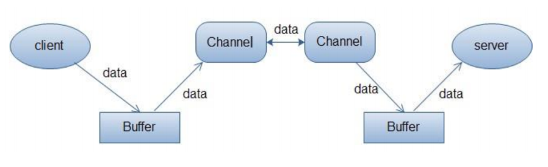

# 第一部分 Java语言


#  Java语言OOP特性 


## Java常用包有那些

Java.lang
Java.io
Java.sql
Java.util
Java.awt
Java.net
Java.math


## Object类常用方法有那些

Equals
Hashcode
toString
wait
notify
clone
getClass


## a=a+b与a+=b有什么区别吗?

+= 操作符会进行隐式自动类型转换,此处a+=b隐式的将加操作的结果类型强制转换为持有结果的类型, 而a=a+b则不会自动进行类型转换.


## &和&&的区别

&是位运算符。&&是布尔逻辑运算符，在进行逻辑判断时用&处理的前面为false后面的内容仍需处理，用&&处理的前面为false不再处理后面的内容（**逻辑短路**）。


## final、finalize()、finally

性质不同：

- final为关键字；
- finalize()为方法；
- finally为区块标志，用于try语句中；

作用：

- final为用于标识常量的关键字，final标识的关键字存储在常量池中
- finalize()方法在Object中进行了定义，用于在对象“消失”时，由JVM进行调用用于对对象进行垃圾回收，类似于C++中的析构函数；用户自定义时，用于释放对象占用的资源（比如进行I/0操作）；
- finally{}用于标识代码块，与try{}进行配合，不论try中的代码执行完或没有执行完（这里指有异常），该代码块之中的程序必定会进行；


## Static关键字有什么作用

Static可以修饰内部类、方法、变量、代码块：

- Static修饰的类是静态内部类
- Static修饰的方法是静态方法，表示该方法属于当前类的，而不属于某个对象的，静态方法也不能被重写，可以直接使用类名来调用。在static方法中不能使用this或者super关键字。
- Static修饰变量是静态变量，静态变量被所有实例所共享，不会依赖于对象。静态变量在内存中只有一份拷贝，在JVM加载类的时候，只为静态分配一次内存。
- Static修饰的代码块叫静态代码块，通常用来做程序优化的。静态代码块中的代码在整个类加载的时候只会执行一次。静态代码块可以有多个，如果有多个，按照先后顺序依次执行。


## final在java中的作用，有哪些用法

- 1. 被final修饰的类不可以被继承
- 2. 被final修饰的方法不可以被重写
- 3. 被final修饰的变量不可以被改变.如果修饰引用,那么表示引用不可变,引用指向的内容可变.
- 4. 被final修饰的方法,JVM会尝试将其内联,以提高运行效率
- 5. 被final修饰的常量,在编译阶段会存入常量池中.

除此之外,编译器对final域要遵守的两个重排序规则更好:
在构造函数内对一个final域的写入,与随后把这个被构造对象的引用赋值给一个引用变量,这两个操作之间不能重排序

初次读一个包含final域的对象的引用,与随后初次读这个final域,这两个操作之间不能重排序


## 数组有没有length()这个方法? String有没有length()这个方法

数组没有length()这个方法，有length的属性。String有length()这个方法


## String类的常用方法有那些

String 类是 final 类，不可以被继承，继承 String 本身就是一个错误的行为，对 String 类型最好的重用方式是关联关系（Has-A）和依赖关系（Use-A）而不是继承关系（Is-A）

- charAt：返回指定索引处的字符
- indexOf()：返回指定字符的索引
- replace()：字符串替换
- trim()：去除字符串两端空白
- split()：分割字符串，返回一个分割后的字符串数组
- getBytes()：返回字符串的byte类型数组
- length()：返回字符串长度
- toLowerCase()：将字符串转成小写字母
- toUpperCase()：将字符串转成大写字符
- substring()：截取字符串
- format()：格式化字符串
- equals()：字符串比较


## String、StringBuffffer和StringBuilder的区别是什么

- String是只读字符串，它并不是基本数据类型，而是一个对象。从底层源码来看是一个fifinal类型的字符数组，所引用的字符串不能被改变，一经定义，无法再增删改。每次对String的操作都会生成新的String对象

- StringBuffer与StringBuilder都继承了AbstractStringBulder类，而AbtractStringBuilder又实现了CharSequence接口，两个类都是用来进行字符串操作的。在做字符串拼接修改删除替换时，效率比string更高。
- StringBuffer是线程安全的，Stringbuilder是非线程安全的。所以Stringbuilder比stringbuffer效率更高，StringBuffer的方法大多都加了synchronized关键字


## Hashcode的作用，与 a.equals(b) 有什么关系？

java的集合有两类，一类是List，还有一类是Set。前者有序可重复，后者无序不重复。当我们在set中插入的时候怎么判断是否已经存在该元素呢，可以通过equals方法。但是如果元素太多，用这样的方法就会比较慢。于是有人发明了哈希算法来提高集合中查找元素的效率。这种方式将集合分成若干个存储区域，每个对象可以计算出一个哈希码，可以将哈希码分组，每组分别对应某个存储区域，根据一个对象的哈希码就可以确定该对象应该存储的那个区域。

hashCode方法可以这样理解：它返回的就是根据对象的内存地址换算出的一个值。这样一来，当集合要添加新的元素时，先调用这个元素的hashCode方法，就一下子能定位到它应该放置的物理位置上。如果这个位置上没有元素，它就可以直接存储在这个位置上，不用再进行任何比较了；如果这个位置上已经有元素了，就调用它的equals方法与新元素进行比较，相同的话就不存了，不相同就散列其它的地址。这样一来实际调用equals方法的次数就大大降低了，几乎只需要一两次。


hashCode() 方法是相应对象整型的 hash 值。它常用于基于 hash 的集合类，如 Hashtable、HashMap、LinkedHashMap 等等。它与equals() 方法关系特别紧密。

根据 Java 规范，两个使用 equal() 方法来判断相等的对象，必须具有相同的 hash code。
Java 对于 eqauls 方法和 hashCode 方法是这样规定的：

- 如果两个对象相同（equals 方法返回 true），那么它们的 hashCode 值一定要相同；
- 如果两个对象的 hashCode 相同，它们并不一定相同。

当然，你未必要按照要求去做，但是如果你违背了上述原则就会发现在使用容器时，相同的对象可以出现在 Set 集合中，同时增加新元素的效率会大大下降（对于使用哈希存储的系统，如果哈希码频繁的冲突将会造成存取性能急剧下降）。 


## 有没有可能两个不相等的对象有相同的hashcode

有可能.在产生hash冲突时,两个不相等的对象就会有相同的 hashcode 值.当hash冲突产生时,一般有以下几种方式来处理:
**拉链法:**
每个哈希表节点都有一个next指针,多个哈希表节点可以用next指针构成一个单向链表，被分配到同一个索引上的多个节点可以用这个单向链表进行存储.

**开放定址法:**
一旦发生了冲突,就去寻找下一个空的散列地址,只要散列表足够大,空的散列地址总能找到,并将记录存入

**再哈希:**
又叫双哈希法,有多个不同的Hash函数.当发生冲突时,使用第二个,第三个….等哈希函数计算地址,直到无冲突.


## HashMap相关内容（参见敖丙公众号内容）


## Java创建对象有几种方式？

java中提供了以下四种创建对象的方式:

1. new创建新对象
2. 通过反射机制
3. 采用clone机制（实现 Cloneable 接口并重写 Object 类中的 clone()方法）
4. 通过序列化机制（通过对象的序列化和反序列化实现克隆，可以实现真正的深度克隆）


## 拷贝和浅拷贝的区别是什么?

**浅拷贝:**
被复制对象的所有变量都含有与原来的对象相同的值,而所有的对其他对象的引用仍然指向原来的对象.
换言之,浅拷贝仅仅复制所考虑的对象,而不复制它所引用的对象.

**深拷贝:**
被复制对象的所有变量都含有与原来的对象相同的值.而那些引用其他对象的变量将指向被复制过的新对象.而不再是原有的那些被引用的对象.
换言之.深拷贝把要复制的对象所引用的对象都复制了一遍.


## 什么是接口？为什么需要接口？接口有什么特点？

接口就是某个事物对外提供的一些功能的声明，是一种特殊的java类，接口弥补了java单继承的缺点

- 接口中声明全是public static final修饰的常量
- 接口中所有方法都是抽象方法
- 接口是没有构造方法的
- 接口也不能直接实例化
- 接口可以多继承


## 抽象类和接口的区别

接口比抽象类更加抽象，因为：

- 抽象类中可以定义构造器，可以有抽象方法和具体方法，而接口中不能定义构造器而且其中的方法全部都是抽象方法。
- 抽象类中的成员可以是 private、默认、protected、public 的，而接口中的成员全都是 public 的。
- 抽象类中可以定义成员变量，而接口中定义的成员变量实际上都是常量。
- 有抽象方法的类必须被声明为抽象类，而抽象类未必要有抽象方法。


**抽象类：**

1. 抽象方法，只有行为的概念，没有具体的行为实现。
2. 使用abstract关键字修饰，没有方法体。
3. 子类必须重写这些抽象方法。
4. 包含抽象方法的类，一定是抽象类。
5. 抽象类只能被继承，一个类只能继承一个抽象类。

**接口：**

1. 全部的方法都是抽象方法，属性都是常量
2. 不能实例化，可以定义变量。
3. 接口变量可以引用具体实现类的实例
4. 接口只能被实现，一个具体类实现接口，必须实现全部的抽象方法
5. 接口之间可以多实现
6. 一个具体类可以实现多个接口，实现多继承现象


## 接口是否可继承（extends）接口？抽象类是否可实现（implements）接口？抽象类是否可继承具体类（concreteclass）？

接口可以继承接口，而且支持多重继承。
抽象类可以实现 (implements)接口。
抽象类可继承具体类也可以继承抽象类。 


#  Java语言泛型


## 泛型定义及常用特点

泛型是Java SE 1.5之后的特性，《Java 核心技术》中对泛型的定义是：
`“泛型” 意味着编写的代码可以被不同类型的对象所重用。` 

“泛型”，顾名思义，“泛指的类型”。我们提供了泛指的概念，但具体执行的时候却可以有具体的规则来约束，比如我们用的非常多的ArrayList就是个泛型类，ArrayList作为集合可以存放各种元素，如Integer, String，自定义的各种类型等，但在我们使用的时候通过具体的规则来约束，如我们可以约束集合中只存放Integer类型的元素，如：
`List<Integer>iniData=newArrayList<>()`


## 使用泛型的好处？

以集合来举例，使用泛型的好处是我们不必因为添加元素类型的不同而定义不同类型的集合，如整型集合类，浮点型集合类，字符串集合类，我们可以定义一个集合来存放整型、浮点型，字符串型数据，而这并不是最重要的，因为我们只要把底层存储设置了Object即可，添加的数据全部都可向上转型为Object。更重要的是我们可以通过规则按照自己的想法控制存储的数据类型。


## 泛型类

泛型类的声明和非泛型类的声明类似，除了在类名后面添加了类型参数声明部分。和泛型方法一样，泛型类的类型参数声明部分也包含一个或多个类型参数，参数间用逗号隔开。一个泛型参数，也被称为一个类型变量，是用于指定一个泛型类型名称的标识符。因为他们接受一个或多个参数，这些类被称为参数化的类或参数化的类型。 

```
public class Box<T> {
  private T t;
  public void add(T t){
    this.t = t ;
  }

  public T get(){
    return t ;
  }
}
```


## 类型通配符?

类型通配符一般是使用 ? 代替具体的类型参数。例如 `List<?>` 在逻辑上是List,List等所有 `List<具体类型实参>`的父类。


## 类型擦除

Java 中的泛型基本上都是在编译器这个层次来实现的。
在生成的 Java 字节代码中是不包含泛型中的类型信息的。使用泛型的时候加上的类型参数，会被编译器在编译的时候去掉。这个过程就称为类型擦除。如在代码中定义的 List和 List等类型，在编译之后都会变成 List。 JVM 看到的只是 List，而由泛型附加的类型信息对 JVM 来说是不可见的。类型擦除的基本过程也比较简单，首先是找到用来替换类型参数的具体类。这个具体类一般是 Object。如果指定了类型参数的上界的话，则使用这个上界。把代码中的类型参数都替换成具体的类。 


#  Java异常


## Java中异常分为哪两种?处理机制有几种？

**分类：**

编译时异常
运行时异常

**处理：**

异常捕捉：try…catch…finally，
异常抛出：throws


## thow与thorws区别

**位置不同**

- throws 用在函数上，后面跟的是异常类，可以跟多个；
- 而 throw 用在函数内，后面跟的是异常对象。

**功能不同**

- throws 用来声明异常，让调用者只知道该功能可能出现的问题，可以给出预先的处理方式；
- throw 抛出具体的问题对象，执行到 throw，功能就已经结束了，跳转到调用者，并将具体的问题对象抛给调用者。也就是说 throw 语句独立存在时，下面不要定义其他语句，因为执行不到。
- throws 表示出现异常的一种可能性，并不一定会发生这些异常；throw 则是抛出了异常，执行 throw 则一定抛出了某种异常对象。
- 两者都是消极处理异常的方式，只是抛出或者可能抛出异常，但是不会由函数去处理异常，真正的处理异常由函数的上层调用处理。


## try catch finally，里面的return处理顺序？

结论：

- 不管有没有出现异常，finally块中代码都会执行；
- 当try和catch中有return时，finally仍然会执行；
- finally是**在return后面的表达式运算后执行的**（此时并没有返回运算后的值，而是先把要返回的值保存起来，管finally中的代码怎么样，返回的值都不会改变，任然是之前保存的值），所以函数返回值是在finally执行前确定的；
- finally中最好不要包含return，否则程序会提前退出，返回值不是try或catch中保存的返回值。


## error和exception有什么区别

- error 表示恢复不是不可能但很困难的情况下的一种严重问题。比如说内存溢出。不可能指望程序能处理这样的情况。
- exception 表示一种设计或实现问题。也就是说，它表示如果程序运行正常，从不会发生的情况。


## Error与Exception区别

- Error和Exception都是java错误处理机制的一部分，都继承了Throwable类。
- Exception表示的异常，异常可以通过程序来捕捉，或者优化程序来避免。
- Error表示的是系统错误，不能通过程序来进行错误处理。


## Excption与Error包结构

Java可抛出(Throwable)的结构分为三种类型：

- 被检查的异常(CheckedException)
- 运行时异常(RuntimeException)
- 错误(Error)


### **运行时异常**

**定义:**
RuntimeException及其子类都被称为运行时异常。
**特点:**
Java编译器不会检查它。也就是说，当程序中可能出现这类异常时，倘若既"没有通过throws声明抛出它"，也"没有用try-catch语句捕获它"，还是会编译通过。

**例如：**
除数为零时产生的ArithmeticException异常，
数组越界时产生的IndexOutOfBoundsException异常，
fail-fast机制产生的ConcurrentModificationException异常等，都属于运行时异常。

常见的五种运行时异常：

- ClassCastException（类转换异常）
- IndexOutOfBoundsException（数组越界）
- NullPointerException（空指针异常）
- ArrayStoreException（数据存储异常，操作数组是类型不一致）
- BufferOverflowException


**补充：fail-fast 、 Fail-safe**

**fail-fast**
“快速失败”也就是fail-fast，它是Java集合的一种错误检测机制。java.util包下面的所有的集合类都是快速失败的。

当多个线程对集合进行结构上的改变的操作时，有可能会产生fail-fast机制。记住是有可能，而不是一定。

例如：假设存在两个线程（线程1、线程2），线程1通过Iterator在遍历集合A中的元素，在某个时候线程2修改了集合A的结构（是结构上面的修改，而不是简单的修改集合元素的内容），那么这个时候程序就会抛出ConcurrentModificationException 异常，从而产生fail-fast机制，这个错叫并发修改异常。


**Fail-safe**
Fail-safe，java.util.concurrent包下面的所有的类都是安全失败的，在遍历过程中，如果已经遍历的数组上的内容变化了，迭代器不会抛出ConcurrentModificationException异常。如果未遍历的数组上的内容发生了变化，则有可能反映到迭代过程中。这就是ConcurrentHashMap迭代器弱一致的表现。ConcurrentHashMap的弱一致性主要是为了提升效率，是一致性与效率之间的一种权衡。要成为强一致性，就得到处使用锁，甚至是全局锁，这就与Hashtable和同步的HashMap一样了。


### **被检查异常**

**定义:**
Exception类本身，以及Exception的子类中除了"运行时异常"之外的其它子类都属于被检查异常。
**特点 :** 
Java编译器会检查它。此类异常，要么通过throws进行声明抛出，要么通过try-catch进行捕获处理，否则不能通过编译。

**例如：**
CloneNotSupportedException就属于被检查异常。当通过clone()接口去克隆一个对象，而该对象对应的类没有实现Cloneable接口，就会抛出CloneNotSupportedException异常。被检查异常通常都是可以恢复的。

如：

- IOException
- FileNotFoundException
- SQLException

被检查的异常适用于那些不是因程序引起的错误情况，比如：读取文件时文件不存在引发的FileNotFoundExcep

**错误**
**定义 :** 
Error类及其子类。
**特点 :** 
和运行时异常一样，编译器也不会对错误进行检查。当资源不足、约束失败、或是其它程序无法继续运行的条件发生时，就产生错误。程序本身无法修复这些错误的。

**例如：**
VirtualMachineError就属于错误。出现这种错误会导致程序终止运行。
OutOfMemoryError
ThreadDeath。
Java虚拟机规范规定JVM的内存分为了好几块，比如堆，栈，程序计数器，方法区等


## 如何自定义一个异常

继承一个异常类，通常是RumtimeException或者Exception


# Java语言IO与NIO


## Java中IO流

Java中IO流分为几种?

- 按照流的流向分，可以分为输入流和输出流；
- 按照操作单元划分，可以划分为字节流和字符流；
- 按照流的角色划分为节点流和处理流。

Java Io 流共涉及 40 多个类，这些类看上去很杂乱，但实际上很有规则，而且彼此之间存在非常紧密的联系， Java I0 流的 40 多个类都是从如下 4 个抽象类基类中派生出来的。

- InputStream/Reader: 所有的输入流的基类，前者是字节输入流，后者是字符输入流。
- OutputStream/Writer: 所有输出流的基类，前者是字节输出流，后者是字符输出流。


## 字节流与字符流的区别

- 以字节为单位输入输出数据，字节流按照8位传输
- 以字符为单位输入输出数据，字符流按照16位传输


## Java IO与 NIO的区别

NIO即New IO，这个库是在JDK1.4中才引入的。
**NIO 和传统 IO 之间第一个最大的区别是， IO 是面向流的， NIO 是面向缓冲区的。**

NIO和IO有相同的作用和目的，但实现方式不同，NIO 主要用到的是块，所以NIO的效率要比IO高很多。
在Java API中提供了两套NIO，一套是针对标准输入输出NIO，另一套就是网络编程NIO。


## 常用IO类有那些

- File
- FileInputSteam，FileOutputStream
- BufferInputStream，BufferedOutputSream
- PrintWrite
- FileReader，FileWriter
- BufferReader，BufferedWriter
- ObjectInputStream，ObjectOutputSream


## 阻塞 IO 模型

最传统的一种 IO 模型，即在读写数据过程中会发生阻塞现象。
当用户线程发出 IO 请求之后，内核会去查看数据是否就绪，如果没有就绪就会等待数据就绪，而用户线程就会处于阻塞状态，用户线程交出 CPU。当数据就绪之后，内核会将数据拷贝到用户线程，并返回结果给用户线程，用户线程才解除 block 状态。
典型的阻塞 IO 模型的例子为： data = socket.read();如果数据没有就绪，就会一直阻塞在 read 方法


## 非阻塞 IO 模型

当用户线程发起一个 read 操作后，并不需要等待，而是马上就得到了一个结果。
如果结果是一个error 时，它就知道数据还没有准备好，于是它可以再次发送 read 操作。一旦内核中的数据准备好了，并且又再次收到了用户线程的请求，那么它马上就将数据拷贝到了用户线程，然后返回。
所以事实上，在非阻塞 IO 模型中，用户线程需要不断地询问内核数据是否就绪，也就说非阻塞 IO不会交出 CPU，而会一直占用 CPU。
典型的非阻塞 IO 模型一般如下： 

```
while(true){
  data=socket.read();
  if(data!=error){
    //处理数据break;
  }
}
```

但是对于非阻塞 IO 就有一个非常严重的问题，在 while 循环中需要不断地去询问内核数据是否就绪，这样会导致 CPU 占用率非常高，因此一般情况下很少使用 while 循环这种方式来读取数据。 


## 多路复用 IO 模型

多路复用 IO 模型是目前使用得比较多的模型。 Java NIO 实际上就是多路复用 IO。
在多路复用 IO模型中，会有一个线程不断去轮询多个socket 的状态，只有当 socket 真正有读写事件时，才真正调用实际的 IO 读写操作。因为在多路复用 IO 模型中，只需要使用一个线程就可以管理多个socket，系统不需要建立新的进程或者线程，也不必维护这些线程和进程，并且只有在真正有socket 读写事件进行时，才会使用IO 资源，所以它大大减少了资源占用。

在 Java NIO 中，是通过 selector.select()去查询每个通道是否有到达事件，如果没有事件，则一直阻塞在那里，因此这种方式会导致用户线程的阻塞。多路复用 IO 模式，通过一个线程就可以管理多个 socket，只有当socket 真正有读写事件发生才会占用资源来进行实际的读写操作。因此，多路复用 IO 比较适合连接数比较多的情况。 

另外多路复用 IO 为何比非阻塞 IO 模型的效率高是因为在非阻塞 IO 中，不断地询问 socket 状态时通过用户线程去进行的，而在多路复用IO 中，轮询每个 socket 状态是内核在进行的，这个效率要比用户线程要高的多。 

不过要注意的是，多路复用 IO 模型是通过轮询的方式来检测是否有事件到达，并且对到达的事件逐一进行响应。因此对于多路复用 IO 模型来说，一旦事件响应体很大，那么就会导致后续的事件迟迟得不到处理，并且会影响新的事件轮询。


## 信号驱动 IO 模型

在信号驱动 IO 模型中，当用户线程发起一个 IO 请求操作，会给对应的 socket 注册一个信号函数，然后用户线程会继续执行，当内核数据就绪时会发送一个信号给用户线程，用户线程接收到信号之后，便在信号函数中调用 IO 读写操作来进行实际的 IO 请求操作。


## 异步 IO 模型

异步 IO 模型才是最理想的 IO 模型，在异步 IO 模型中，当用户线程发起 read 操作之后，立刻就可以开始去做其它的事。而另一方面，从内核的角度，当它受到一个 asynchronous read 之后，它会立刻返回，说明 read 请求已经成功发起了，因此不会对用户线程产生任何block。然后，内核会等待数据准备完成，然后将数据拷贝到用户线程，当这一切都完成之后，内核会给用户线程发送一个信号，告诉它read 操作完成了。也就说用户线程完全不需要实际的整个 IO 操作是如何进行的，只需要先发起一个请求，当接收内核返回的成功信号时表示 IO 操作已经完成，可以直接去使用数据了。 

也就说在异步 IO 模型中， IO 操作的两个阶段都不会阻塞用户线程，这两个阶段都是由内核自动完成，然后发送一个信号告知用户线程操作已完成。用户线程中不需要再次调用 IO 函数进行具体的读写。这点是和信号驱动模型有所不同的，在信号驱动模型中，当用户线程接收到信号表示数据已经就绪，然后需要用户线程调用 IO 函数进行实际的读写操作；而在异步 IO 模型中，收到信号表示 IO 操作已经完成，不需要再在用户线程中调用 IO 函数进行实际的读写操作。 


## JAVA NIO

NIO 主要有三大核心部分： 

- Channel    (通道)
- Buffer   	 (缓冲区)
- Selector   (选择区)

传统 IO 基于字节流和字符流进行操作，而 NIO 基于 Channel 和Buffer(缓冲区)进行操作，数据总是从通道读取到缓冲区中，或者从缓冲区写入到通道中。
Selector(选择区)用于监听多个通道的事件（比如：连接打开，数据到达）。因此，单个线程可以监听多个数据通道。  


### Channel

首先说一下 Channel，国内大多翻译成“通道”。 
Channel 和 IO 中的 Stream(流)是差不多一个等级的。只不过 Stream 是单向的，譬如：InputStream, OutputStream，而 Channel 是双向的，既可以用来进行读操作，又可以用来进行写操作。

NIO 中的 Channel 的主要实现有：

- FileChannel
- DatagramChannel
- SocketChannel
- ServerSocketChannel

这里看名字就可以猜出个所以然来：分别可以对应文件 IO、 UDP 和 TCP（Server 和 Client）。


### Buffer

Buffer，故名思意，缓冲区，实际上是一个容器，是一个连续数组。 Channel 提供从文件、网络读取数据的渠道，但是读取或写入的数据都必须经由 Buffer。



上面的图描述了从一个客户端向服务端发送数据，然后服务端接收数据的过程:

客户端发送数据时，必须先将数据存入 Buffer 中，然后将Buffer 中的内容写入通道。
服务端这边接收数据必须通过 Channel 将数据读入到 Buffer 中，然后再从 Buffer 中取出数据来处理。

在 NIO 中， Buffer 是一个顶层父类，它是一个抽象类，常用的 Buffer 的子类有：

- ByteBuffer
- IntBuffer
- CharBuffer
- LongBuffer
- DoubleBuffer
- FloatBuffer
- ShortBuffer 


### Selector

Selector 类是 NIO 的核心类， Selector 能够检测多个注册的通道上是否有事件发生，如果有事件发生，便获取事件然后针对每个事件进行相应的响应处理。这样一来，只是用一个单线程就可以管理多个通道，也就是管理多个连接。这样使得只有在连接真正有读写事件发生时，才会调用函数来进行读写，就大大地减少了系统开销，并且不必为每个连接都创建一个线程，不用去维护多个线程，并且避免了多线程之间的上下文切换导致的开销。 

### NIO 的非阻塞

IO 的各种流是阻塞的。这意味着，当一个线程调用 read() 或 write()时，该线程被阻塞，直到有一些数据被读取，或数据完全写入。该线程在此期间不能再干任何事情了。 

NIO 的非阻塞模式，使一个线程从某通道发送请求读取数据，但是它仅能得到目前可用的数据，如果目前没有数据可用时，就什么都不会获取。而不是保持线程阻塞，所以直至数据变的可以读取之前，该线程可以继续做其他的事情。非阻塞写也是如此。一个线程请求写入一些数据到某通道，但不需要等待它完全写入，这个线程同时可以去做别的事情。

线程通常将非阻塞 IO 的空闲时间用于在其它通道上执行 IO 操作，所以一个单独的线程现在可以管理多个输入和输出通道（channel）。 


### NIO 的缓冲区

Java IO 面向流意味着每次从流中读一个或多个字节，直至读取所有字节，它们没有被缓存在任何地方。此外，它不能前后移动流中的数据。如果需要前后移动从流中读取的数据，需要先将它缓存到一个缓冲区。 

NIO 的缓冲导向方法不同。数据读取到一个它稍后处理的缓冲区，需要时可在缓冲区中前后移动。这就增加了处理过程中的灵活性。但是，还需要检查是否该缓冲区中包含所有您需要处理的数据。而且，需确保当更多的数据读入缓冲区时，不要覆盖缓冲区里尚未处理的数据。


#  Java语言反射


## java反射的作用？哪里会用到反射机制？

反射机制是在运行时，对于任意一个类，都能够知道这个类的所有属性和方法；对于任意个对象，都能够调用它的任意一个方法。在java中，只要给定类的名字，就可以通过反射机制来获得类的所有信息。

**这种动态获取的信息以及动态调用对象的方法的功能称为Java语言的反射机制。**

jdbc就是典型的反射：

```
Class.forName('com.mysql.jdbc.Driver.class');//加载MySQL的驱动类
```

这就是反射。如hibernate，struts等框架使用反射实现的。


## 反射机制的优缺点

**优点：**

1. 能够运行时动态获取类的实例，提高灵活性；
2. 与动态编译结合


**缺点：**

1. 使用反射性能较低，需要解析字节码，将内存中的对象进行解析。
   可以通过以下方案解决：

- 通过setAccessible(true)关闭JDK的安全检查来提升反射速度；
- 多次创建一个类的实例时，有缓存会快很多
- ReflflectASM工具类，通过字节码生成的方式加快反射速度

2. 相对不安全，破坏了封装性（因为通过反射可以获得私有方法和属性）


## 实现Java反射的类及API

1. **Class**：表示正在运行的Java应用程序中的类和接口。反射的核心类，可以获取类的属性，方法等信息
   	注意：所有获取对象的信息都需要Class类来实现。
2. **Field**：提供有关类和接口的属性信息，以及对它的动态访问权限。Java.lang.reflec 包中的类，表示类的成员变量，可以用来获取和设置类之中的属性值。
3. **Constructor**：提供关于类的单个构造方法的信息以及它的访问权限。Java.lang.reflec 包中的类，表示类的构造方法。
4. **Method**：提供类或接口中某个方法的信息。Java.lang.reflec 包中的类，表示类的方法，它可以用来获取类中的方法信息或者执行方法。


## 反射的实现方式

1. 获取想要操作的类的 Class 对象，他是反射的核心，通过 Class 对象我们可以任意调用类的方法。
2. 调用 Class 类中的方法，既就是反射的使用阶段。
3. 使用反射 API 来操作这些信息。


## 获取Class对象四种方法

获取Class对象有4中方法：

- 1）Class.forName(“类的路径”)；

```java
		Classclazz=Class.forName("类的全路径");(最常用)
```

- 2）类名.class

```java
		Classclazz=Person.class;
```

- 3）对象名.getClass()

```java
		Personp=newPerson();
		Classclazz=p.getClass();
```

- 4）基本类型的包装类，可以调用包装类的Type属性来获得该包装类的Class对象


当我们获得了想要操作的类的 Class 对象后，可以通过 Class 类中的方法获取并查看该类中的方法和属性。

```java
//获取Person类的Class对象
Class clazz = Class.forName("reflection.Person");

//获取Person类的所有方法信息
Method[] method = clazz.getDeclaredMethods();
for( Method m : method) {
	System.out.println(m.toString());
}

//获取Person类的所有成员属性信息
Field[]field=clazz.getDeclaredFields();
for( Field f : field){
	System.out.println(f.toString());
}

//获取Person类的所有构造方法信息
Constructor[] constructor = clazz.getDeclaredConstructors();
for(Constructor c : constructor){
	System.out.println(c.toString());
}
```


## 利用反射动态创建对象实例

**Class对象的newInstance()**
使用 Class 对象的 newInstance()方法来创建该 Class 对象对应类的实例，但是这种方法要求该 Class 对象对应的类有默认的空构造器。

**调用Constructor对象的newInstance()**
先使用 Class 对象获取指定的 Constructor 对象，再调用 Constructor 对象的 newInstance()方法来创建 Class 对象对应类的实例,通过这种方法可以选定构造方法创建实例。

```java
//获取Person类的Class对象
Classclazz = Class.forName("reflection.Person");
//使用.newInstane方法创建对象
Personp = (Person)clazz.newInstance();
//获取构造方法并创建对象
Constructorc = clazz.getDeclaredConstructor(String.class,String.class,int.class);
//创建对象并设置属性
Personp1 = (Person)c.newInstance("李四","男",20);
```


# Java语言序列化


## 什么是java序列化，如何实现java序列化？序列化作用？

序列化就是一种用来处理对象流的机制，所谓对象流也就是将对象的内容进行流化。可以对流化后的对象进行读写操作，也可将流化后的对象传输于网络之间。序列化是为了解决在对对象流进行读写操作时所引发的问题。

**序列化的实现**：将需要被序列化的类实现Serializable接口，该接口没有需要实现的方法，implements Serializable只是为了标注该对象是可被序列化的，然后使用一个输出流(如：FileOutputStream)来构造一个ObjectOutputStream(对象流)对象，接着，使用ObjectOutputStream对象的writeObject(Object obj)方法就可以将参数为obj的对象写出(即保存其状态)，要恢复的话则用输入流。

Java 平台允许我们在内存中创建可复用的 Java 对象，但一般情况下，只有当 JVM 处于运行时，这些对象才可能存在，即，这些对象的生命周期不会比 JVM 的生命周期更长。但在现实应用中，就可能要求在**JVM停止运行之后能够保存(持久化)指定的对象，并在将来重新读取被保存的对象**。Java 对象序列化就能够帮助我们实现该功能。

除了在持久化对象时会用到对象序列化之外，当**使用 RMI(远程方法调用)，或在网络中传递对象**时，都会用到对象序列化。 Java序列化API为处理对象序列化提供了一个标准机制，该API简单易用。

**序列化（深 clone的一种实现）**。在 Java 语言里深复制一个对象，常常可以先使对象实现 Serializable 接口，然后把对象（实际上只是对象的一个拷贝）写到一个流里，再从流里读出来，便可以重建对象。 


## 如何实现序列化

Serializable 实现序列化
在 Java 中，只要一个类实现了 java.io.Serializable 接口，那么它就可以被序列化。ObjectOutputStream 和 ObjectInputStream 对对象进行序列化及反序列化通过 ObjectOutputStream 和 ObjectInputStream 对对象进行序列化及反序列化。


## writeObject 和 readObject 自定义序列化策略

在类中增加 writeObject 和 readObject 方法可以实现自定义序列化策略。


## 序列化特性

**序列化对象以字节数组保持-静态成员不保存**
使用 Java 对象序列化，在保存对象时，会把其状态保存为一组字节，在未来，再将这些字节组装成对象。必须注意地是，对象序列化保存的是对象的”状态”，即它的成员变量。由此可知，对象序列化不会关注类中的静态变量。

**序列化子父类说明**
要想将父类对象也序列化，就需要让父类也实现 Serializable 接口。 

**序列化 ID**
虚拟机是否允许反序列化，不仅取决于类路径和功能代码是否一致，一个非常重要的一点是两个类的序列化 ID 是否一致（就是 privatestatic final long serialVersionUID 

**Transient 关键字阻止该变量被序列化到文件中**

- 在变量声明前加上 Transient 关键字，可以阻止该变量被序列化到文件中，在被反序列化后， transient 变量的值被设为初始值，如 int 型的是 0，对象型的是 null。
- 服务器端给客户端发送序列化对象数据，对象中有一些数据是敏感的，比如密码字符串等，希望对该密码字段在序列化时，进行加密，而客户端如果拥有解密的密钥，只有在客户端进行反序列化时，才可以对密码进行读取，这样可以一定程度保证序列化对象的数据安全。


# Java注解


## 什么是注解

「java.lang.annotation.Annotation」接口中有这么一句话，用来描述『注解』。

```java
The common interface extended by all annotation types
所有的注解类型都继承自这个普通的接口（Annotation）
```


注解的本质就是一个继承了 Annotation 接口的接口。有关这一点，你可以去反编译任意一个注解类，你会得到结果的。

**一个注解准确意义上来说，只不过是一种特殊的注释而已，如果没有解析它的代码，它可能连注释都不如。**

解析一个类或者方法的注解往往有两种形式，**一种是编译期直接的扫描，一种是运行期反射**。
编译器的扫描指的是编译器在对 java 代码编译字节码的过程中会检测到某个类或者方法被一些注解修饰，这时它就会对于这些注解进行某些处理。**典型的就是注解 @Override**


## Java四种元注解

『元注解』是用于修饰注解的注解，通常用在注解的定义上，JAVA 中有以下四个『元注解』：

- @Target：注解的作用目标
  用于指明被修饰的注解最终可以作用的目标是谁，也就是指明，你的注解到底是用来修饰方法的？修饰类的？还是用来修饰字段属性的。
- @Retention：注解的生命周期
  一种是只能在编译期可见，编译后会被丢弃，一种会被编译器编译进 class 文件中，无论是类或是方法，乃至字段，他们都是有属性表的，而 JAVA 虚拟机也定义了几种注解属性表用于存储注解信息，但是这种可见性不能带到方法区，类加载时会予以丢弃，最后一种则是永久存在的可见性。
- @Documented：注解是否应当被包含在 JavaDoc 文档中
  当我们执行 JavaDoc 文档打包时会被保存进 doc 文档，反之将在打包时丢弃。
- @Inherited：是否允许子类继承该注解
  也就说我们的注解修饰了一个类，而该类的子类将自动继承父类的该注解。


## JAVA 的内置三大注解

除了上述四种元注解外，JDK 还为我们预定义了另外三种注解，它们是：

- @Override
- @Deprecated
- @SuppressWarnings


## 注解与反射

注解的本质就是一个继承了 Annotation 接口的接口，对于一个类或者接口来说，Class 类中提供了以下一些方法用于反射注解。

- getAnnotation：返回指定的注解
- isAnnotationPresent：判定当前元素是否被指定注解修饰
- getAnnotations：返回所有的注解
- getDeclaredAnnotation：返回本元素的指定注解
- getDeclaredAnnotations：返回本元素的所有注解，不包含父类继承而来的

当通过反射去获取一个注解类实例的时候，其实 JDK 是通过动态代理机制生成一个实现我们注解（接口）的代理类。 JAVA 中有专门用于处理注解的 Handler，为AnnotationInvocationHandler。
最终问题还是回到了**动态代理**，详见动态代理相关章节


# 第二部分 设计模式


