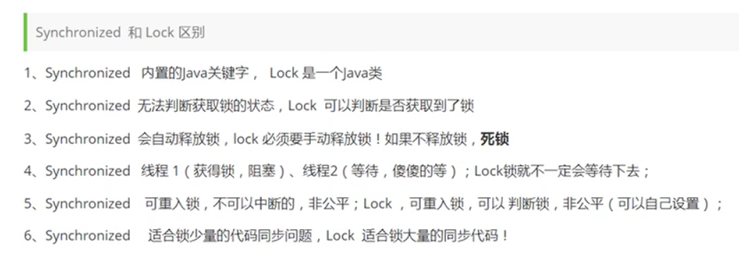
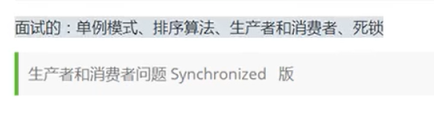

## Lock接口与synchronized的区别




## volatile与synchronized的区别

volatile只能修饰实例变量和类变量，而synchronized可以修饰方法，以及代码块。

volatile保证数据的可见性，但是不保证原子性(多线程进行写操作，不保证线程安全);而synchronized是一种排他(互斥)的机制。

volatile用于禁止指令重排序：可以解决单例双重检查对象初始化代码执行乱序问题。

volatile可以看做是轻量版的synchronized，volatile不保证原子性，但是如果是对一个共享变量进行多个线程的赋值，而没有其他的操作，那么就可以用volatile来代替synchronized，因为赋值本身是有原子性的，而volatile又保证了可见性，所以就可以保证线程安全了。


# 线程池必问：


三大方法，七大参数，四种拒绝策略 ：

## 三大方法：

 ```java
//Executors.newCachedThreadPool();
//Executors.newFixedThreadPool(3);
//Executors.newScheduledThreadPool(3);
//Executors.newSingleThreadExecutor();


threadPool = Executors.newCachedThreadPool();//有缓冲的线程池，线程数 JVM 控制
threadPool = Executors.newFixedThreadPool(3);//固定大小的线程池
threadPool = Executors.newScheduledThreadPool(2);
threadPool = Executors.newSingleThreadExecutor();//单线程的线程池，只有一个线程在工作
 ```


## 七大参数：

上述三大方法底层都是调用的**ThreadPoolExecutor**进行的创建，因此本质是一样的ThreadPoolExecutor，其参数有以下几个：

```java
ThreadPoolExecutor(int corePoolSize,
                          int maximumPoolSize,
                          long keepAliveTime,
                          TimeUnit unit,
                          BlockingQueue<Runnable> workQueue,
                          ThreadFactory threadFactory,
                          RejectedExecutionHandler handler) {}
```


int corePoolSize,
int maximumPoolSize,
long keepAliveTime,
TimeUnit unit,
BlockingQueue<Runnable> workQueue,
ThreadFactory threadFactory,
RejectedExecutionHandler handler


## 四种拒绝策略：

    RejectedExecutionHandler rejected = null;
    rejected = new ThreadPoolExecutor.AbortPolicy();//默认，队列满了丢任务抛出异常
    rejected = new ThreadPoolExecutor.DiscardPolicy();//队列满了丢任务不异常
    rejected = new ThreadPoolExecutor.DiscardOldestPolicy();//将最早进入队列的任务删，之后再尝试加入队列
    rejected = new ThreadPoolExecutor.CallerRunsPolicy();//如果添加到线程池失败，那么主线程会自己去执行该任务


## 三种阻塞队列：

​    BlockingQueue<Runnable> workQueue = null;
​    workQueue = new ArrayBlockingQueue<>(5);//基于数组的先进先出队列，有界
​    workQueue = new LinkedBlockingQueue<>();//基于链表的先进先出队列，无界
​    workQueue = new SynchronousQueue<>();//无缓冲的等待队列，无界


# 最大线程数如何设置

## CPU密集型

几核就将最大线程数设置为几，保证CPU利用率

## I/O密集型

判断I/O耗时长的线程数量，设置最大线程数为该数量的2倍，保证进行I/O操作时程序不阻塞


# 函数式编程

## 函数式接口

Function接口：输入泛型参数，返回泛型参数


## 断定式接口

Predicate接口：输入一个参数，返回一个布尔值


## 消费者接口

consumer接口：输入参数，不返回值：

## 供给型接口

supplier接口：没有输入，只用返回泛型值


# 流式计算

```java
public class StreamDemo {
    public static void main(String[] args) {
        User user1 = new User(1,"a",1);
        User user2 = new User(2,"b",2);
        User user3 = new User(3,"c",3);
        User user4 = new User(4,"d",4);
        User user5 = new User(5,"e",5);

        List<User> list = Arrays.asList(user1,user2,user3,user4,user5);
        list.stream()
                .filter(user->{return user.getAge() % 2 == 0;})
                .filter(user -> {return user.getAge() > 0;})
                .map(user -> {return user.getName().toUpperCase();})
                .sorted((uu1,uu2)->{ return uu1.compareTo(uu2); })
                .limit(1)
                .forEach(System.out::println);
    }
}
```


# ForkJoin（待完成）

工作窃取的原理，分而治之，递归思想

分两步：

1、使用ForkJoinPool

2、使用ForkJoinPool执行forkjointask（需要创建forkjointask）


# 异步回调（Future接口）


# 代码笔试：



