# 待办1：数据库高可用？读写分离？主从复制？


# 基础知识

## MySQL的基本架构

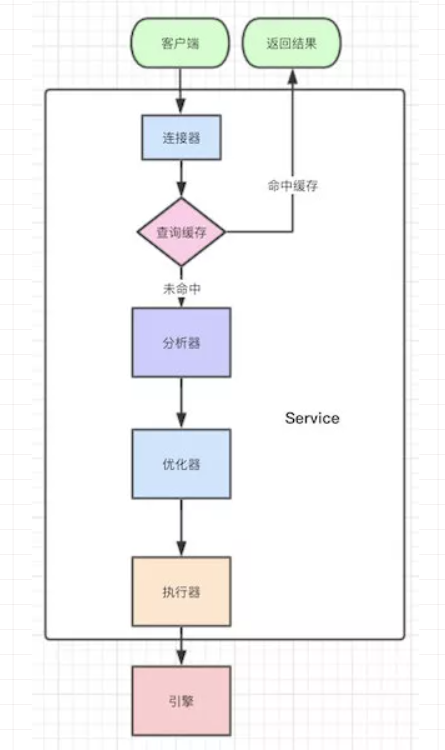


### 连接器

我们要进行查询，第一步就是先去链接数据库，那这个时候就是连接器跟我们对接。他负责跟客户端建立链接、获取权限、维持和管理连接。链接的时候会经过TCP握手，然后身份验证，然后我们输入用户名密码就好了。验证ok后，我们就连上了这个MySQL服务了，但是这个时候我们处于空闲状态。

使用**show processlist**，可以查看连接状态，其中的Command列显示为**Sleep**的这一行，就表示现在系统里面有一个空闲连接。这里需要注意的是，我们数据库的客户端太久没响应，连接器就会自动断开了，这个时间参数是**wait_timeout**控制住的，默认时长为8小时。断开后重连的时候会报错，如果你想再继续操作，你就需要重连了。

> 除了重新链接，还可以使用长连接的方式解决，避免因为重新建立链接造成的资源开销。

但是这里有个缺点，使用长连接之后，内存会飙得很快，我们知道MySQL在执行过程中临时使用的内存是管理在连接对象里面的。

只有在链接断开的时候才能得到释放，那如果一直使用长连接，那就会导致OOM（Out Of Memory），会导致MySQL重启，在JVM里面就会导致频繁的Full GC。这种情况下，我们一般会定期断开长连接，使用一段时间后，或者程序里面判断执行过一个占用内存比较大的查询后就断开连接，需要的时候重连就好了。

也可以执行比较大的一个查询后，执行**mysql_reset_connection**可以重新初始化连接资源。这个过程相比上面一种会好点，不需要重连，但是会初始化连接的状态。


### 查询缓存

MySQL拿到一个查询请求后，会先到查询缓存看看，之前是不是执行过这条语句。他跟Redis一样，只要是你之前执行过的语句，都会在内存里面用key-value形式存储着。查询的时候就会拿着语句先去缓存中查询，如果能够命中就返回缓存的value，如果不命中就执行后面的阶段。

但是我总体来说，使用缓存弊大于利。因为缓存的失效很容易，只要对表有任何的更新，这个表的所有查询缓存就会全部被清空，就会出现缓存还没使用，就直接被清空了，或者积累了很多缓存准备用来着，但是一个更新打回原形。这就导致查询的命中率低的可怕，只有那种只查询不更新的表适用缓存，但是这样的表往往很少存在，一般都是什么配置表之类的。

是否使用缓存可以通过参数控制，可以显示调用，把**query_cache_type**设置成为DEMAND，这样SQL默认不适用缓存，想用缓存就用SQL_CACHE。

**tips：**有个小技巧就是，我们之前开发的时候，都会去库里看看sql执行时间，但是可能是有缓存的，一般我们就在sql前面使用SQL_NO_CACHE就可以知道真正的查询时间了。

```
 select SQL_NO_CACHE * from B
```

缓存在MySQL8.0之后就**取消**了，所以大家现在应该不需要太关注这个问题


### 分析器

开始执行语句前，需要检查语句有没有语法错误。

第一步会先做**词法分析**，你的语句有这么多单词、空格，MySQL就需要识别每个字符串所代表的是什么，是关键字，还是表名，还是列名等等。

然后就开始**语法分析**，根据词法分析的结果，语法分析会判断你sql的对错，错了会提醒你的，并且会提示你哪里错了。

检查没有问题之后进入优化器。


### 优化器

优化就比较简单了，因为我们建立表可能会建立很多索引，优化有一步就是要确认使用哪个索引，比如使用你的主键索引，联合索引还是什么索引更好。

还有就是对执行顺序进行优化，条件那么多，先查哪个表，还是先关联，会出现很多方案，最后由优化器决定选用哪种方案。

最后就是执行了，执行就交给执行器去做。


### 执行器

第一步可能就是权限的判断，其实这里我不确定的一个点就是，我接触的公司很多都是自研的线上查询系统，我们是不能用Navicat直连线上库，只能去网页操作，那表的权限是在MySQL层做的，还是系统做的，我猜应该是系统层做的，MySQL可能默认就全开放了，只是我们 不知道ip。

执行的时候，就一行一行的去判断是否满足条件，有索引的执行起来可能就好点，一行行的判断就像是接口都提前在引擎定义好了，所以他比较快。

数据库的慢日志有个**rows_examined**字段，扫描多少行可以看到，还有**explain**也可以看到执行计划，我们扫描了多少行。


## MySQL的几个log

### undo log

#### `undo log`有什么用？

`undo log`主要有两个作用：回滚和多版本控制(MVCC)。

在数据修改的时候，不仅记录了`redo log`，还记录`undo log`，如果因为某些原因导致事务失败或回滚了，可以用`undo log`进行回滚

`undo log`主要存储的也是逻辑日志，比如我们要`insert`一条数据了，那`undo log`会记录的一条对应的`delete`日志。我们要`update`一条记录时，它会记录一条对应**相反**的update记录。

这也应该容易理解，毕竟回滚嘛，跟需要修改的操作相反就好，这样就能达到回滚的目的。因为支持回滚操作，所以我们就能保证：“**一个事务包含多个操作，这些操作要么全部执行，要么全都不执行**”。【原子性】

因为`undo log`存储着修改之前的数据，相当于一个**前版本**，MVCC实现的是读写不阻塞，读的时候只要返回前一个版本的数据就行了。


### bin log

`binlog`其实在日常的开发中是听得很多的，因为很多时候数据的更新就依赖着`binlog`。

举个很简单的例子：我们的数据是保存在数据库里边的嘛，现在我们对某个商品的某个字段的内容改了（数据库变更），而**用户检索的出来数据是走搜索引擎的**。为了让用户能搜到最新的数据，我们需要把引擎的数据也改掉。

一句话：**数据库的变更，搜索引擎的数据也需要变更**。

于是，我们就会监听`binlog`的变更，如果`binlog`有变更了，那我们就需要将变更写到对应的数据源。


#### 什么是`binlog`？

`binlog`记录了数据库表结构和表数据变更，比如`update/delete/insert/truncate/create`。它不会记录`select`（因为这没有对表没有进行变更）


#### `binlog`长什么样？

`binlog`我们可以简单理解为：存储着每条变更的`SQL`语句（当然从下面的图看来看，不止SQL，还有XID「事务Id」等等），如下图样例：

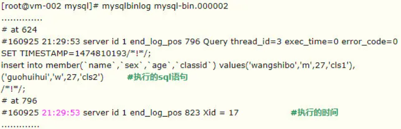


#### `binlog`一般用来做什么

主要有两个作用：**复制和恢复数据**

- MySQL在公司使用的时候往往都是**一主多从**结构的，从服务器需要与主服务器的数据保持一致，这就是通过`binlog`来实现的
- 数据库的数据被干掉了，我们可以通过`binlog`来对数据进行恢复。

因为`binlog`记录了数据库表的变更，所以我们可以用`binlog`进行复制（主从复制)和恢复数据。


#### `binlog`有几种的模式

主从复制有三种模式，分别是基于SQL语句的复制(statement-based replication, SBR)，基于行的复制(row-based replication, RBR)，混合模式复制(mixed-based replication, MBR)。对应的，binlog的格式也有三种：STATEMENT，ROW，MIXED 。

mysql默认的主从复制模式是ROW。

#### `binlog`的刷盘策略


### redo log

假设我们有一条sql语句：

```
update user_table set name='java3y' where id = '3'
```

MySQL执行这条SQL语句，肯定是先把`id=3`的这条记录查出来，然后将`name`字段给改掉。由于Mysql的基本存储结构是**页**(记录都存在页里边)，所以MySQL是先把这条记录所在的**页**找到，然后把该页加载到内存中，将对应记录进行修改。现在就可能存在一个问题：**如果在内存中把数据改了，还没来得及落磁盘，而此时的数据库挂了怎么办**？显然这次更改就丢了。

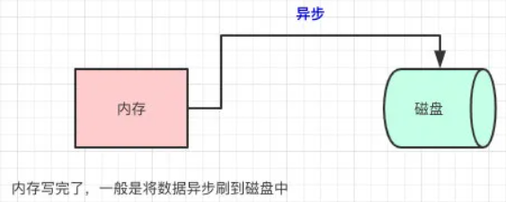

如果每个请求都需要将数据**立马**落磁盘之后，那速度会很慢，MySQL可能也顶不住。所以MySQL引入了`redo log`，内存写完了，然后会写一份`redo log`，这份`redo log`记载着这次**在某个页上做了什么修改**。

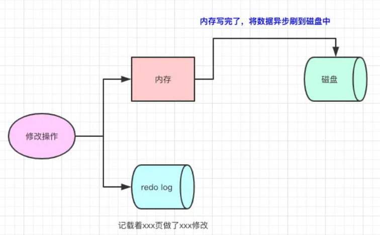

其实写`redo log`的时候，也会有`buffer`，是先写`buffer`，再真正落到磁盘中的，但它的好处就是`顺序IO`（我们都知道顺序IO比随机IO快非常多）。至于从`buffer`什么时候落磁盘，会有配置供我们配置。

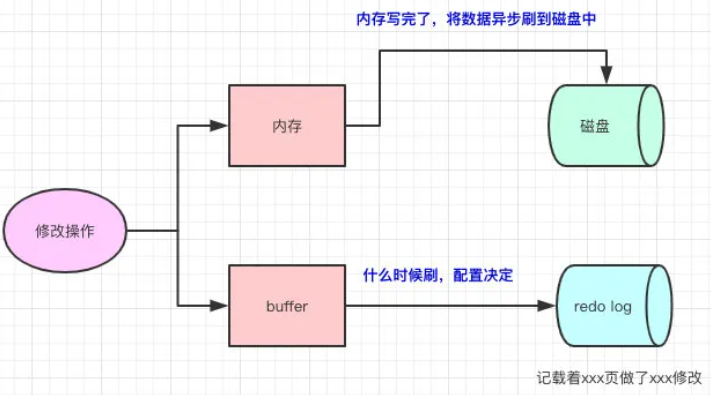

所以，`redo log`的存在为了：当我们修改的时候，写完内存了，但数据还没真正写到磁盘的时候。此时我们的数据库挂了，我们可以根据`redo log`来对数据进行恢复。因为`redo log`是顺序IO，所以**写入的速度很快**，并且`redo log`记载的是物理变化（xxxx页做了xxx修改），文件的体积很小，**恢复速度很快**。


### binlog和redo log 对比

`binlog`和`redo log` 都是用作”恢复“的，但是有以下不同点：


#### 存储的内容

`binlog`记载的是`update/delete/insert`这样的SQL语句，而`redo log`记载的是物理修改的内容（xxxx页修改了xxx）。

所以在搜索资料的时候会有这样的说法：`redo log` 记录的是数据的**物理变化**，`binlog` 记录的是数据的**逻辑变化**


#### 功能

`redo log`的作用是为**持久化**而生的。写完内存，如果数据库挂了，那我们可以通过`redo log`来恢复内存还没来得及刷到磁盘的数据，将`redo log`加载到内存里边，那内存就能恢复到挂掉之前的数据了。

`binlog`的作用是复制和恢复而生的。

- 主从服务器需要保持数据的一致性，通过`binlog`来同步数据。
- 如果整个数据库的数据都被删除了，`binlog`存储着所有的数据变更情况，那么可以通过`binlog`来对数据进行恢复。

又看到这里，你会想：”如果整个数据库的数据都被删除了，那我可以用`redo log`的记录来恢复吗？“**不能**

因为功能的不同，`redo log` 存储的是物理数据的变更，如果我们内存的数据已经刷到了磁盘了，那`redo log`的数据就无效了。所以`redo log`不会存储着**历史**所有数据的变更，**文件的内容会被覆盖的**。


#### binlog和redo log 写入的细节

`redo log`是MySQL的InnoDB引擎所产生的。

`binlog`无论MySQL用什么引擎，都会有的。

InnoDB是有事务的，事务的四大特性之一：持久性就是靠`redo log`来实现的（如果写入内存成功，但数据还没真正刷到磁盘，如果此时的数据库挂了，我们可以靠`redo log`来恢复内存的数据，这就实现了持久性）。

上面也提到，在修改的数据的时候，`binlog`会记载着变更的类容，`redo log`也会记载着变更的内容。（只不过一个存储的是物理变化，一个存储的是逻辑变化）。那他们的写入顺序是什么样的呢？

`redo log`**事务开始**的时候，就开始记录每次的变更信息，而`binlog`是在**事务提交**的时候才记录。

于是新有的问题又出现了：我写其中的某一个`log`，失败了，那会怎么办？现在我们的前提是先写`redo log`，再写`binlog`，我们来看看：

- 如果写`redo log`失败了，那我们就认为这次事务有问题，回滚，不再写`binlog`。
- 如果写`redo log`成功了，写`binlog`，写`binlog`写一半了，但失败了怎么办？我们还是会对这次的**事务回滚**，将无效的`binlog`给删除（因为`binlog`会影响从库的数据，所以需要做删除操作）
- 如果写`redo log`和`binlog`都成功了，那这次算是事务才会真正成功。

简单来说：MySQL需要保证`redo log`和`binlog`的**数据是一致**的，如果不一致，那就乱套了。

- 如果`redo log`写失败了，而`binlog`写成功了。那假设内存的数据还没来得及落磁盘，机器就挂掉了。那主从服务器的数据就不一致了。（从服务器通过`binlog`得到最新的数据，而主服务器由于`redo log`没有记载，没法恢复数据）
- 如果`redo log`写成功了，而`binlog`写失败了。那从服务器就拿不到最新的数据了。

MySQL通过**两阶段提交**来保证`redo log`和`binlog`的数据是一致的。

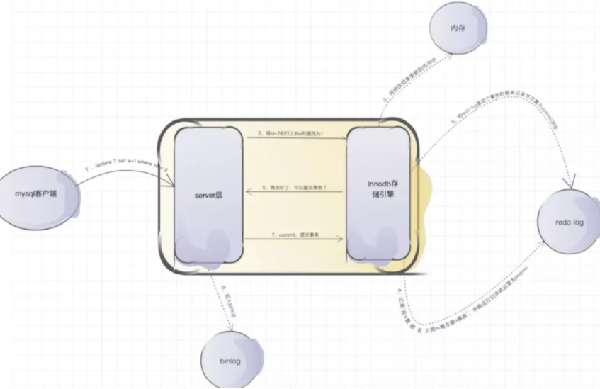

过程：

- 阶段1：InnoDB`redo log` 写盘，InnoDB 事务进入 `prepare` 状态
- 阶段2：`binlog` 写盘，InooDB 事务进入 `commit` 状态
- 每个事务`binlog`的末尾，会记录一个 `XID event`，标志着事务是否提交成功，也就是说，恢复过程中，`binlog` 最后一个 XID event 之后的内容都应该被 purge。

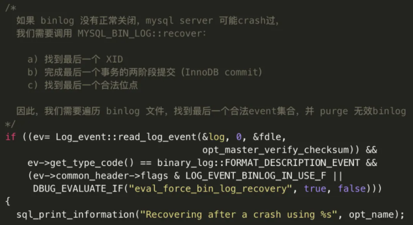


## 数据库自增ID用完了会怎么样？

自增ID达到上限用完了之后，分为两种情况：

1. 如果设置了主键，那么将会报错主键冲突。
2. 如果没有设置主键，数据库则会帮我们自动生成一个全局的row_id，新数据会覆盖老数据

解决方案：

表尽可能都要设置主键，主键尽量使用bigint类型，21亿的上限还是有可能达到的，比如魔兽，虽然说row_id上限高达281万亿，但是覆盖数据显然是不可接受的。


# MySQL索引

## 索引是什么

- 官方介绍索引是帮助MySQL**高效获取数据**的**数据结构**。更通俗的说，数据库索引好比是一本书前面的目录，能**加快数据库的查询速度**。
- 一般来说索引本身也很大，不可能全部存储在内存中，因此**索引往往是存储在磁盘上的文件中的**（可能存储在单独的索引文件中，也可能和数据一起存储在数据文件中）。
- **我们通常所说的索引，包括聚集索引、覆盖索引、组合索引、前缀索引、唯一索引等，没有特别说明，默认都是使用B+树结构组织（多路搜索树，并不一定是二叉的）的索引。**

## 索引的优势和劣势

### **优势：**

- **可以提高数据检索的效率，降低数据库的IO成本**，类似于书的目录。

- 通过**索引列对数据进行排序**，降低数据排序的成本，降低了CPU的消耗。

- - 被索引的列会自动进行排序，包括【单列索引】和【组合索引】，只是组合索引的排序要复杂一些。
  - 如果按照索引列的顺序进行排序，对应order by语句来说，效率就会提高很多。

### **劣势：**

- **索引会占据磁盘空间**
- **索引虽然会提高查询效率，但是会降低更新表的效率**。比如每次对表进行增删改操作，MySQL不仅要保存数据，还有保存或者更新对应的索引文件。

## 索引类型

### 主键索引

索引列中的值必须是唯一的，不允许有空值。

### 普通索引

MySQL中基本索引类型，没有什么限制，允许在定义索引的列中插入重复值和空值。

### 唯一索引

索引列中的值必须是唯一的，但是允许为空值。

### 全文索引

只能在文本类型CHAR,VARCHAR,TEXT类型字段上创建全文索引。字段长度比较大时，如果创建普通索引，在进行like模糊查询时效率比较低，这时可以创建全文索引。MyISAM和InnoDB中都可以使用全文索引。

### 空间索引

MySQL在5.7之后的版本支持了空间索引，而且支持OpenGIS几何数据模型。MySQL在空间索引这方面遵循OpenGIS几何数据模型规则。

### 前缀索引

在文本类型如CHAR,VARCHAR,TEXT类列上创建索引时，可以指定索引列的长度，但是数值类型不能指定。

### 其他（按照索引列数量分类）

1. 单列索引

2. 组合索引

   组合索引的使用，需要遵循**最左前缀匹配原则（最左匹配原则）**。一般情况下在条件允许的情况下使用组合索引替代多个单列索引使用。

## 索引的数据结构

### Hash表

Hash表，在Java中的HashMap，TreeMap就是Hash表结构，以键值对的方式存储数据。我们使用Hash表存储表数据Key可以存储索引列，Value可以存储行记录或者行磁盘地址。Hash表在等值查询时效率很高，时间复杂度为O(1)；但是不支持范围快速查找，范围查找时还是只能通过扫描全表方式。

**显然这种并不适合作为经常需要查找和范围查找的数据库索引使用。**

### 二叉查找树

二叉树，我想大家都会在心里有个图。

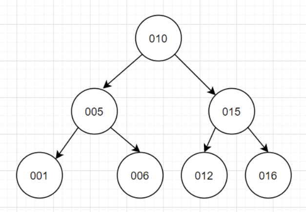

二叉树特点：每个节点最多有2个分叉，左子树和右子树数据顺序左小右大。

这个特点就是为了保证每次查找都可以这折半而减少IO次数，但是二叉树就很考验第一个根节点的取值，因为很容易在这个特点下出现我们并发想发生的情况“树不分叉了”，这就很难受很不稳定。

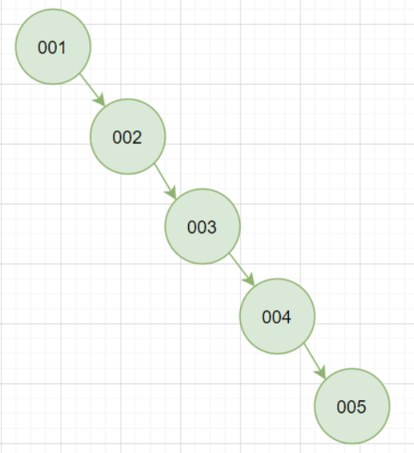

**显然这种情况不稳定的我们再选择设计上必然会避免这种情况的**

### 平衡二叉树

平衡二叉树是采用二分法思维，平衡二叉查找树除了具备二叉树的特点，最主要的特征是树的左右两个子树的层级最多相差1。在插入删除数据时通过左旋/右旋操作保持二叉树的平衡，不会出现左子树很高、右子树很矮的情况。

使用平衡二叉查找树查询的性能接近于二分查找法，时间复杂度是 O(log2n)。查询id=6，只需要两次IO。

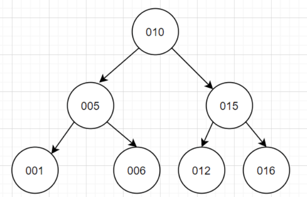

就这个特点来看，可能各位会觉得这就很好，可以达到二叉树的理想的情况了。然而依然存在一些问题：

1. 时间复杂度和树高相关。树有多高就需要检索多少次，每个节点的读取，都对应一次磁盘 IO 操作。树的高度就等于每次查询数据时磁盘 IO 操作的次数。磁盘每次寻道时间为10ms，在表数据量大时，查询性能就会很差。（1百万的数据量，log2n约等于20次磁盘IO，时间20*10=0.2s）
2. 平衡二叉树不支持范围查询快速查找，范围查询时需要从根节点多次遍历，查询效率不高。

### B树：改造二叉树

MySQL的数据是存储在磁盘文件中的，查询处理数据时，需要先把磁盘中的数据加载到内存中，磁盘IO 操作非常耗时，所以我们优化的重点就是尽量减少磁盘 IO 操作。访问二叉树的每个节点就会发生一次IO，如果想要减少磁盘IO操作，就需要尽量降低树的高度。那如何降低树的高度呢？

假如key为bigint=8字节，每个节点有两个指针，每个指针为4个字节，一个节点占用的空间16个字节（8+4*2=16）。

因为在MySQL的InnoDB存储引擎一次IO会读取的一页（默认一页16K）的数据量，而二叉树一次IO有效数据量只有16字节，空间利用率极低。为了最大化利用一次IO空间，一个简单的想法是在每个节点存储多个元素，在每个节点尽可能多的存储数据。每个节点可以存储1000个索引（16k/16=1000），这样就将二叉树改造成了多叉树，通过增加树的叉树，将树从高瘦变为矮胖。构建1百万条数据，树的高度只需要2层就可以（1000*1000=1百万），也就是说只需要2次磁盘IO就可以查询到数据。磁盘IO次数变少了，查询数据的效率也就提高了。

这种数据结构我们称为B树，B树是一种多叉平衡查找树，如下图主要特点：

1. B树的节点中存储着多个元素，每个内节点有多个分叉。
2. 节点中的元素包含键值和数据，节点中的键值从大到小排列。也就是说，在所有的节点都储存数据。
3. 父节点当中的元素不会出现在子节点中。
4. 所有的叶子结点都位于同一层，叶节点具有相同的深度，叶节点之间没有指针连接。

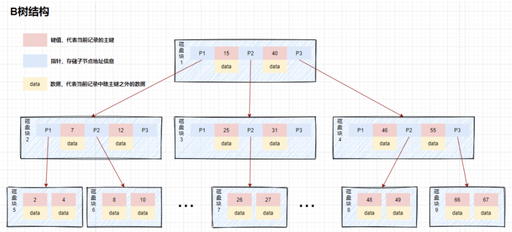

举个例子，在b树中查询数据的情况：

假如我们查询值等于10的数据。查询路径磁盘块1->磁盘块2->磁盘块5。

第一次磁盘IO：将磁盘块1加载到内存中，在内存中从头遍历比较，10<15，走左路，到磁盘寻址磁盘块2。

第二次磁盘IO：将磁盘块2加载到内存中，在内存中从头遍历比较，7<10，到磁盘中寻址定位到磁盘块5。

第三次磁盘IO：将磁盘块5加载到内存中，在内存中从头遍历比较，10=10，找到10，取出data，如果data存储的行记录，取出data，查询结束。如果存储的是磁盘地址，还需要根据磁盘地址到磁盘中取出数据，查询终止。

相比二叉平衡查找树，在整个查找过程中，虽然数据的比较次数并没有明显减少，但是磁盘IO次数会大大减少。同时，由于我们的比较是在内存中进行的，比较的耗时可以忽略不计。B树的高度一般2至3层就能满足大部分的应用场景，所以使用B树构建索引可以很好的提升查询的效率。

过程如图：

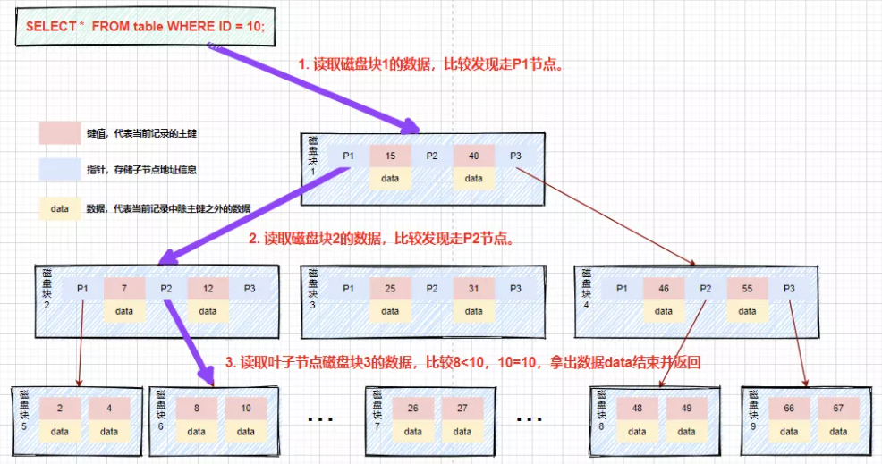

B树索引查询过程

看到这里一定觉得B树就很理想了，但是前辈们会告诉你依然存在可以优化的地方：

> 1. B树不支持范围查询的快速查找，你想想这么一个情况如果我们想要查找10和35之间的数据，查找到15之后，需要回到根节点重新遍历查找，需要从根节点进行多次遍历，查询效率有待提高。
> 2. 如果data存储的是行记录，行的大小随着列数的增多，所占空间会变大。这时，一个页中可存储的数据量就会变少，树相应就会变高，磁盘IO次数就会变大。

### B+树：改造B树

B+树，作为B树的升级版，在B树基础上，MySQL在B树的基础上继续改造，使用B+树构建索引。B+树和B树最主要的区别在于**非叶子节点是否存储数据**的问题

> - B树：非叶子节点和叶子节点都会存储数据。
> - B+树：只有叶子节点才会存储数据，非叶子节点至存储键值。叶子节点之间使用双向指针连接，最底层的叶子节点形成了一个双向有序链表。


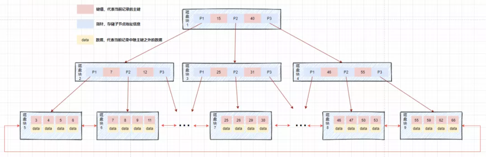


B+树数据结构

> B+树的最底层叶子节点包含了所有的索引项。从图上可以看到，B+树在查找数据的时候，由于数据都存放在最底层的叶子节点上，所以每次查找都需要检索到叶子节点才能查询到数据。
>
> 所以在需要查询数据的情况下每次的磁盘的IO跟树高有直接的关系，但是从另一方面来说，由于数据都被放到了叶子节点，放索引的磁盘块锁存放的索引数量是会跟这增加的，相对于B树来说，B+树的树高理论上情况下是比B树要矮的。
>
> 也存在索引覆盖查询的情况，在索引中数据满足了当前查询语句所需要的全部数据，此时只需要找到索引即可立刻返回，不需要检索到最底层的叶子节点。

举个例子：**等值查询**

假如我们查询值等于9的数据。查询路径磁盘块1->磁盘块2->磁盘块6。

第一次磁盘IO：将磁盘块1加载到内存中，在内存中从头遍历比较，9<15，走左路，到磁盘寻址磁盘块2。

第二次磁盘IO：将磁盘块2加载到内存中，在内存中从头遍历比较，7<9<12，到磁盘中寻址定位到磁盘块6。

第三次磁盘IO：将磁盘块6加载到内存中，在内存中从头遍历比较，在第三个索引中找到9，取出data，如果data存储的行记录，取出data，查询结束。如果存储的是磁盘地址，还需要根据磁盘地址到磁盘中取出数据，查询终止。（这里需要区分的是在InnoDB中Data存储的为行数据，而MyIsam中存储的是磁盘地址。）

过程如图：

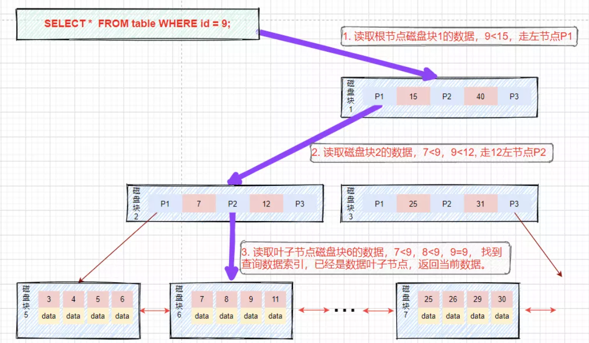

B+树根据索引等值查询过程

**范围查询：**

假如我们想要查找9和26之间的数据。查找路径是磁盘块1->磁盘块2->磁盘块6->磁盘块7。

首先查找值等于9的数据，将值等于9的数据缓存到结果集。这一步和前面等值查询流程一样，发生了三次磁盘IO。

查找到15之后，底层的叶子节点是一个有序列表，我们从磁盘块6，键值9开始向后遍历筛选所有符合筛选条件的数据。

第四次磁盘IO：根据磁盘6后继指针到磁盘中寻址定位到磁盘块7，将磁盘7加载到内存中，在内存中从头遍历比较，9<25<26，9<26<=26，将data缓存到结果集。

主键具备唯一性（后面不会有<=26的数据），不需再向后查找，查询终止。将结果集返回给用户。

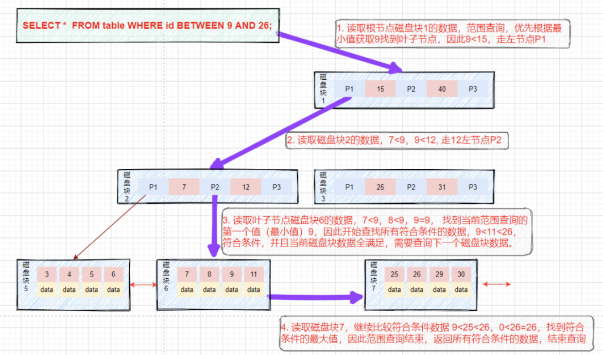


**可以看到B+树可以保证等值和范围查询的快速查找，MySQL的索引就采用了B+树的数据结构。**

## Mysql的索引实现

介绍完了索引数据结构，那肯定是要带入到Mysql里面看看真实的使用场景的，所以这里分析Mysql的两种存储引擎的索引实现：**MyISAM索引**和**InnoDB索引**

### MyIsam索引

以一个简单的user表为例。user表存在两个索引，id列为主键索引，age列为普通索引

```
CREATE TABLE `user`
(
  `id`       int(11) NOT NULL AUTO_INCREMENT,
  `username` varchar(20) DEFAULT NULL,
  `age`      int(11)     DEFAULT NULL,
  PRIMARY KEY (`id`) USING BTREE,
  KEY `idx_age` (`age`) USING BTREE
) ENGINE = MyISAM
  AUTO_INCREMENT = 1
  DEFAULT CHARSET = utf8;
```


MyISAM的数据文件和索引文件是分开存储的。MyISAM使用B+树构建索引树时，叶子节点中存储的键值为索引列的值，数据为索引所在行的磁盘地址。

#### 主键索引

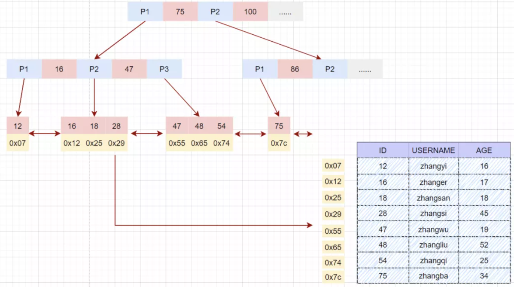

MyIsam主键索引

表user的索引存储在索引文件`user.MYI`中，数据文件存储在数据文件 `user.MYD`中。

简单分析下查询时的磁盘IO情况：

**根据主键等值查询数据：**

```
select * from user where id = 28;
```

1. 先在主键树中从根节点开始检索，将根节点加载到内存，比较28<75，走左路。（1次磁盘IO）
2. 将左子树节点加载到内存中，比较16<28<47，向下检索。（1次磁盘IO）
3. 检索到叶节点，将节点加载到内存中遍历，比较16<28，18<28，28=28。查找到值等于30的索引项。（1次磁盘IO）
4. 从索引项中获取磁盘地址，然后到数据文件user.MYD中获取对应整行记录。（1次磁盘IO）
5. 将记录返给客户端。

**磁盘IO次数：3次索引检索+记录数据检索。**

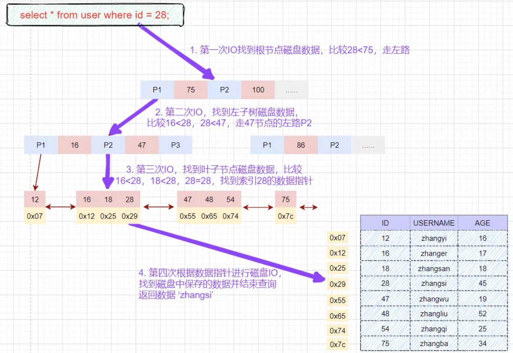

**根据主键范围查询数据：**

```
select * from user where id between 28 and 47;
```

1. 先在主键树中从根节点开始检索，将根节点加载到内存，比较28<75，走左路。（1次磁盘IO）

2. 将左子树节点加载到内存中，比较16<28<47，向下检索。（1次磁盘IO）

3. 检索到叶节点，将节点加载到内存中遍历比较16<28，18<28，28=28<47。查找到值等于28的索引项。

   根据磁盘地址从数据文件中获取行记录缓存到结果集中。（1次磁盘IO）

   我们的查询语句时范围查找，需要向后遍历底层叶子链表，直至到达最后一个不满足筛选条件。

4. 向后遍历底层叶子链表，将下一个节点加载到内存中，遍历比较，28<47=47，根据磁盘地址从数据文件中获取行记录缓存到结果集中。（1次磁盘IO）

5. 最后得到两条符合筛选条件，将查询结果集返给客户端。

**磁盘IO次数：4次索引检索+记录数据检索。**

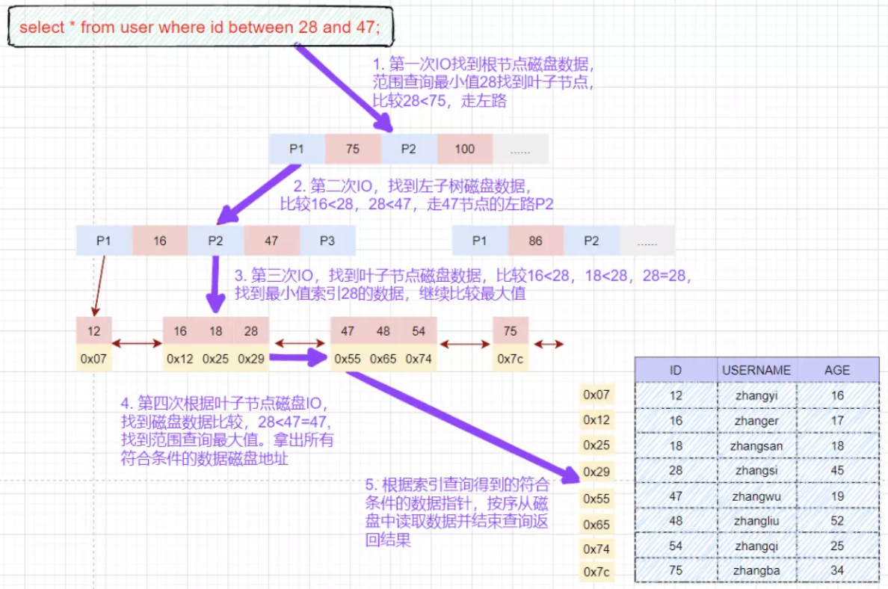

MyIsam索引范围查询过程

**备注**：以上分析仅供参考，MyISAM在查询时，会将索引节点缓存在MySQL缓存中，而数据缓存依赖于操作系统自身的缓存，所以并不是每次都是走的磁盘，这里只是为了分析索引的使用过程。

#### 辅助索引

在 MyISAM 中,辅助索引和主键索引的结构是一样的，没有任何区别，叶子节点的数据存储的都是行记录的磁盘地址。只是主键索引的键值是唯一的，而辅助索引的键值可以重复。

查询数据时，由于辅助索引的键值不唯一，可能存在多个拥有相同的记录，所以即使是等值查询，也需要按照范围查询的方式在辅助索引树中检索数据。

### InnoDB索引

#### 主键索引（聚簇索引）

每个InnoDB表都有一个聚簇索引 ，聚簇索引使用B+树构建，叶子节点存储的数据是整行记录。一般情况下，聚簇索引等同于主键索引，当一个表没有创建主键索引时，InnoDB会自动创建一个ROWID字段来构建聚簇索引。InnoDB创建索引的具体规则如下：

> 1. 在表上定义主键PRIMARY KEY，InnoDB将主键索引用作聚簇索引。
> 2. 如果表没有定义主键，InnoDB会选择第一个不为NULL的唯一索引列用作聚簇索引。
> 3. 如果以上两个都没有，InnoDB 会使用一个6 字节长整型的隐式字段 ROWID字段构建聚簇索引。该ROWID字段会在插入新行时自动递增。

除聚簇索引之外的所有索引都称为辅助索引。在中InnoDB，辅助索引中的叶子节点存储的数据是该行的主键值都。在检索时，InnoDB使用此主键值在聚簇索引中搜索行记录。

这里以user_innodb为例，user_innodb的id列为主键，age列为普通索引。

```
CREATE TABLE `user_innodb`
(
  `id`       int(11) NOT NULL AUTO_INCREMENT,
  `username` varchar(20) DEFAULT NULL,
  `age`      int(11)     DEFAULT NULL,
  PRIMARY KEY (`id`) USING BTREE,
  KEY `idx_age` (`age`) USING BTREE
) ENGINE = InnoDB;
```


InnoDB的数据和索引存储在一个文件t_user_innodb.ibd中。InnoDB的数据组织方式，是聚簇索引。

主键索引的叶子节点会存储数据行，辅助索引只会存储主键值。

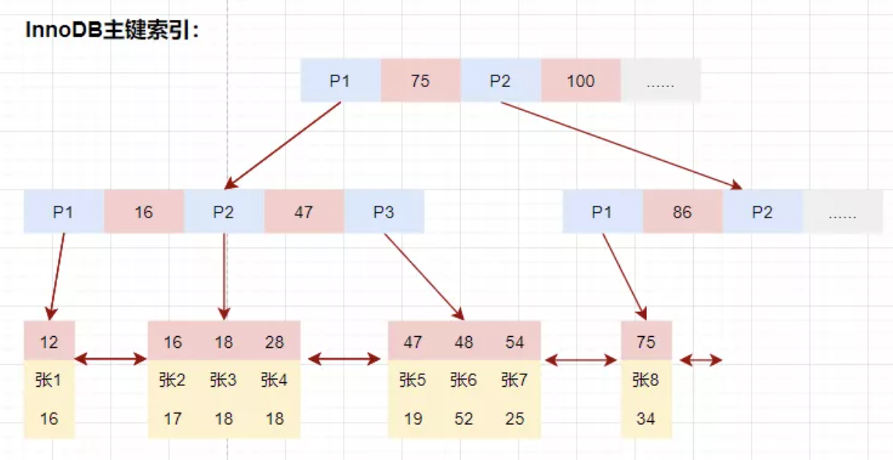


**等值查询数据：**

```
select * from user_innodb where id = 28;
```

1. 先在主键树中从根节点开始检索，将根节点加载到内存，比较28<75，走左路。（1次磁盘IO）

   将左子树节点加载到内存中，比较16<28<47，向下检索。（1次磁盘IO）

   检索到叶节点，将节点加载到内存中遍历，比较16<28，18<28，28=28。查找到值等于28的索引项，直接可以获取整行数据。将改记录返回给客户端。（1次磁盘IO）

   **磁盘IO数量：3次。**

   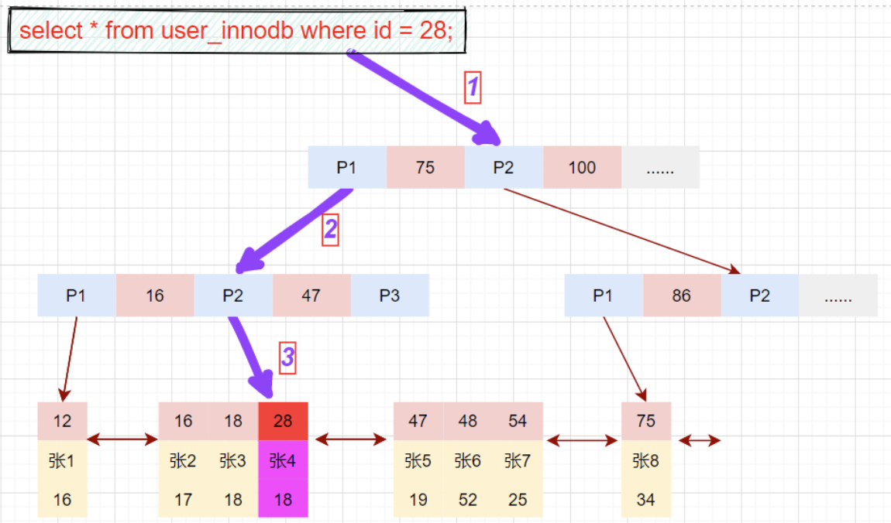

#### 辅助索引

除聚簇索引之外的所有索引都称为辅助索引，InnoDB的辅助索引只会存储主键值而非磁盘地址。

以表user_innodb的age列为例，age索引的索引结果如下图。

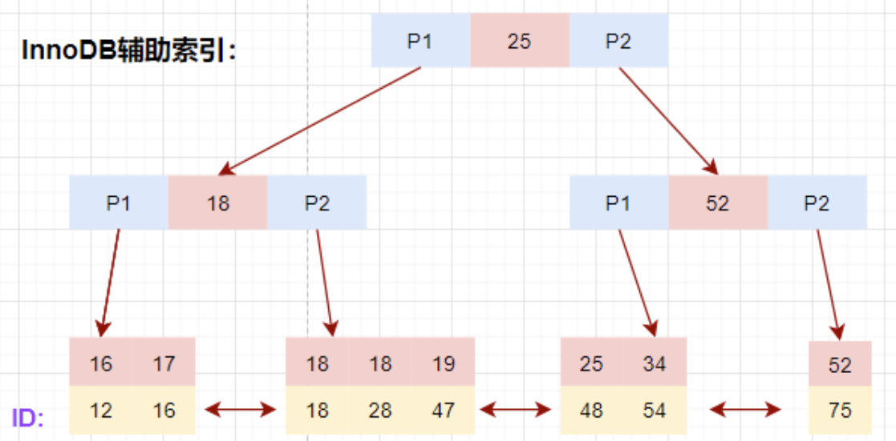

InnoDB辅助索引

底层叶子节点的按照（age，id）的顺序排序，先按照age列从小到大排序，age列相同时按照id列从小到大排序。

使用辅助索引需要检索两遍索引：首先检索辅助索引获得主键，然后使用主键到主索引中检索获得记录。

**画图分析等值查询的情况：**

```
select * from t_user_innodb where age=19;
```


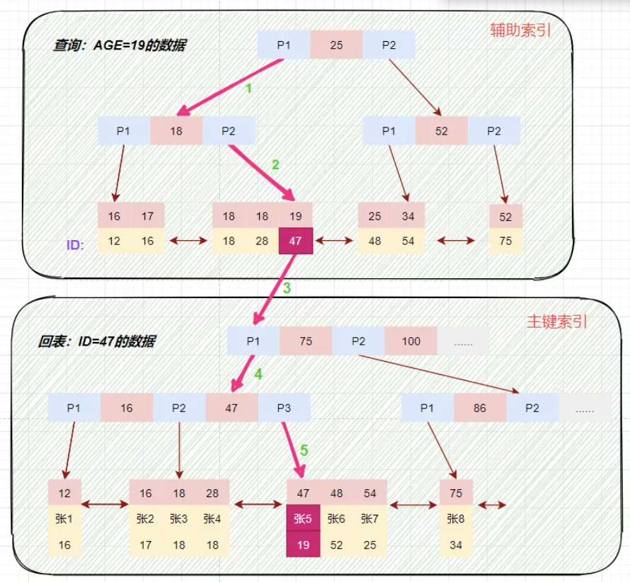

InnoDB辅助索引查询

根据在辅助索引树中获取的主键id，到主键索引树检索数据的过程称为**回表**查询。

**磁盘IO数：辅助索引3次+获取记录回表3次**

#### 组合索引

还是以自己创建的一个表为例：表 abc_innodb，id为主键索引，创建了一个联合索引idx_abc(a,b,c)。

```
CREATE TABLE `abc_innodb`
(
  `id` int(11) NOT NULL AUTO_INCREMENT,
  `a`  int(11)     DEFAULT NULL,
  `b`  int(11)     DEFAULT NULL,
  `c`  varchar(10) DEFAULT NULL,
  `d`  varchar(10) DEFAULT NULL,
  PRIMARY KEY (`id`) USING BTREE,
  KEY `idx_abc` (`a`, `b`, `c`)
) ENGINE = InnoDB;
```

`select * from abc_innodb order by a, b, c, id;`


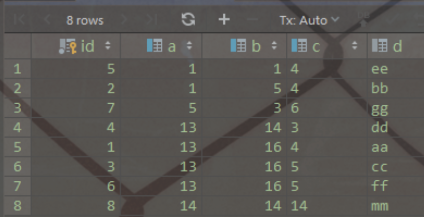

组合索引的数据结构：

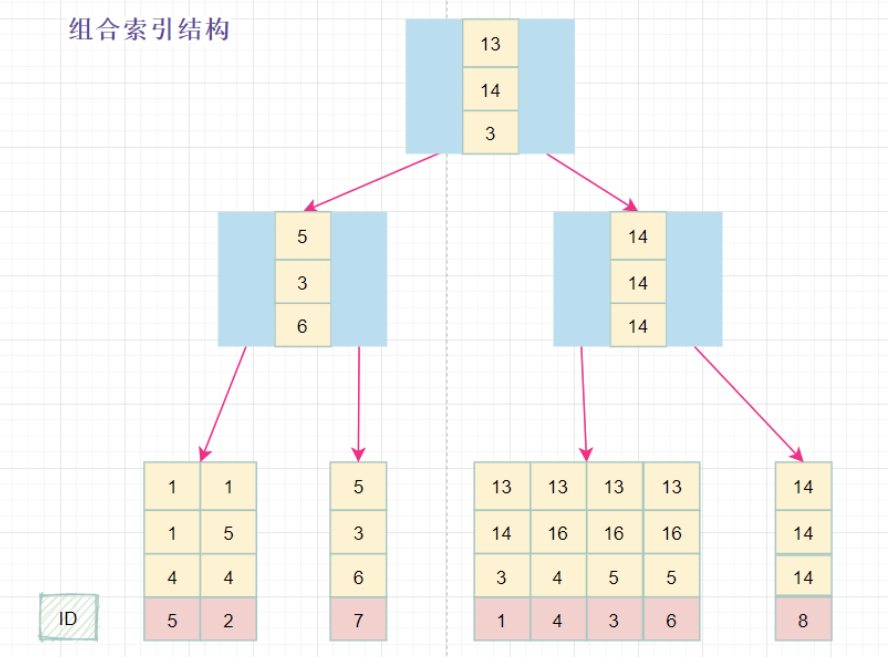


**组合索引的查询过程：**

```
select * from abc_innodb where a = 13 and b = 16 and c = 4;
```

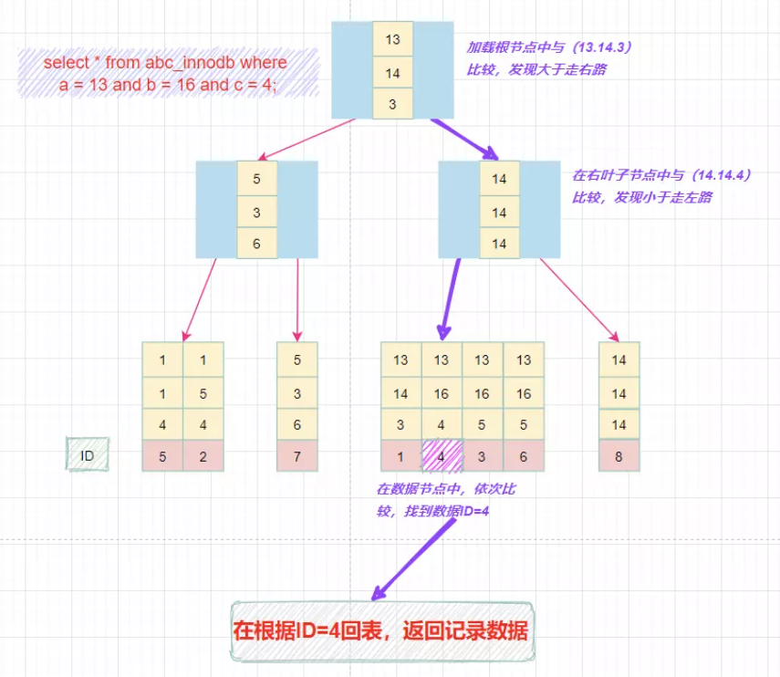

组合索引的查询过程

**最左匹配原则：**

最左前缀匹配原则和联合索引的**索引存储结构和检索方式**是有关系的。

在组合索引树中，最底层的叶子节点按照第一列a列从左到右递增排列，但是b列和c列是无序的，b列只有在a列值相等的情况下小范围内递增有序，而c列只能在a，b两列相等的情况下小范围内递增有序。

就像上面的查询，B+树会先比较a列来确定下一步应该搜索的方向，往左还是往右。如果a列相同再比较b列。但是如果查询条件没有a列，B+树就不知道第一步应该从哪个节点查起。

可以说创建的idx_abc(a,b,c)索引，相当于创建了(a)、（a,b）（a,b,c）三个索引。、

**组合索引的最左前缀匹配原则：使用组合索引查询时，mysql会一直向右匹配直至遇到范围查询(>、<、between、like)就停止匹配。**

#### 覆盖索引

覆盖索引并不是说是索引结构，覆盖索引是一种很常用的优化手段。因为在使用辅助索引的时候，我们只可以拿到主键值，相当于获取数据还需要再根据主键查询主键索引再获取到数据。但是试想下这么一种情况，在上面abc_innodb表中的组合索引查询时，如果我只需要abc字段的，那是不是意味着我们查询到组合索引的叶子节点就可以直接返回了，而不需要回表。这种情况就是覆盖索引。

可以看一下执行计划：

**覆盖索引的情况：**


**未使用到覆盖索引：**

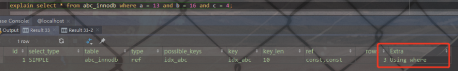


#### 索引下推

MySQL 5.6开始支持**ICP（Index Condition Pushdown）**，不支持ICP之前，当进行索引查询时，首先根据索引来查找数据，然后再根据where条件来过滤，扫描了大量不必要的数据，增加了数据库IO操作。

在支持ICP后，MySQL在取出索引数据的同时，判断是否可以进行where条件过滤，将where的部分过滤操作放在存储引擎层提前过滤掉不必要的数据，减少了不必要数据被扫描带来的IO开销。

在某些查询下，可以减少Server层对存储引擎层数据的读取，从而提供数据库的整体性能。


**ICP具有以下特点**

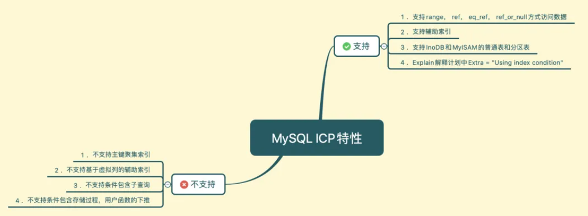


**总结**

介绍了索引条件下推ICP特性，全文索引以以及生成列特性，利用这些特性可以对模糊匹配 `like %xxx%` 或 `like %xxx` 的业务SQL进行优化，可以有效降低不必要的数据读取，减少IO扫描以及CPU开销，提高服务的稳定性。

对于MySQL每个版本发布的新特性，尤其是跟优化器和SQL相关的，应该去关注和了解，可能会发现适合自己业务场景的特性。


## MySQL索引应用设计

看到这里，你是不是对于自己的sql语句里面的索引的有了更多优化想法呢。

### 索引设计准则：三星索引

上文我们得出了一个索引列顺序的经验 法则：将选择性最高的列放在索引的最前列，这种建立在某些场景可能有用，但通常不如避免随机 IO 和 排序那么重要，这里引入索引设计中非常著名的一个准则：三星索引。

如果一个查询满足三星索引中三颗星的所有索引条件，**理论上**可以认为我们设计的索引是最好的索引。什么是三星索引

1. 第一颗星：WHERE 后面参与查询的列可以组成了单列索引或联合索引
2. 第二颗星：避免排序，即如果 SQL 语句中出现 order by colulmn，那么取出的结果集就已经是按照 column 排序好的，不需要再生成临时表
3. 第三颗星：SELECT 对应的列应该尽量是索引列，即尽量避免回表查询。

三星索引只是给我们构建索引提供了一个参考，索引设计应该尽量靠近三星索引的标准，但实际场景我们一般无法同时满足三星索引，一般我们会优先选择满足第三颗星（因为回表代价较大）至于第一，二颗星就要依赖于实际的成本及实际的业务场景考虑。

具体说明如下：

### 避免回表

在InnoDB的存储引擎中，使用辅助索引查询的时候，因为辅助索引叶子节点保存的数据不是当前记录的数据而是当前记录的主键索引，索引如果需要获取当前记录完整数据就必然需要根据主键值从主键索引继续查询。这个过程我们成位回表。想想回表必然是会消耗性能影响性能。那如何避免呢？

使用索引覆盖，举个例子：现有User表（id(PK),name(key),sex,address,hobby...）

如果在一个场景下，`select id,name,sex from user where name ='zhangsan';`这个语句在业务上频繁使用到，而user表的其他字段使用频率远低于它，在这种情况下，如果我们在建立 name 字段的索引的时候，不是使用单一索引，而是使用联合索引（name，sex）这样的话再执行这个查询语句是不是根据辅助索引查询到的结果就可以获取当前语句的完整数据。

这样就可以有效地避免了回表再获取sex的数据。

**这里就是一个典型的使用覆盖索引的优化策略减少回表的情况。**

### 联合索引的使用

**联合索引**，在建立索引的时候，尽量在多个单列索引上判断下是否可以使用联合索引。联合索引的使用不仅可以节省空间，还可以更容易的使用到索引覆盖。

试想一下，索引的字段越多，是不是更容易满足查询需要返回的数据呢。比如联合索引（a_b_c），是不是等于有了索引：a，a_b，a_b_c三个索引，这样是不是节省了空间，当然节省的空间并不是三倍于（a，a_b，a_b_c）三个索引，因为索引树的数据没变，但是索引data字段的数据确实真实的节省了。

**联合索引的创建原则**，在创建联合索引的时候因该把频繁使用的列、区分度高的列放在前面，频繁使用代表索引利用率高，区分度高代表筛选粒度大，这些都是在索引创建的需要考虑到的优化场景，也可以在常需要作为查询返回的字段上增加到联合索引中，如果在联合索引上增加一个字段而使用到了覆盖索引，那我建议这种情况下使用联合索引。

**联合索引的使用**

1. 考虑当前是否已经存在多个可以合并的单列索引，如果有，那么将当前多个单列索引创建为一个联合索引。
2. 当前索引存在频繁使用作为返回字段的列，这个时候就可以考虑当前列是否可以加入到当前已经存在索引上，使其查询语句可以使用到覆盖索引。


### 跳跃索引

一般情况下，如果表users有复合索引idx_status_create_time，我们都知道，单独用create_time去查询，MySQL优化器是不走索引，所以还需要再创建一个单列索引idx_create_time。用过Oracle的同学都知道，是可以走索引跳跃扫描（Index Skip Scan），在MySQL 8.0也实现Oracle类似的索引跳跃扫描，在优化器选项也可以看到skip_scan=on。

```
| optimizer_switch             |use_invisible_indexes=off,skip_scan=on,hash_join=on |
```

**适合复合索引前导列唯一值少，后导列唯一值多的情况，如果前导列唯一值变多了，则MySQL CBO不会选择索引跳跃扫描，取决于索引列的数据分表情况。**

```
mysql> explain select id, user_id，status, phone from users where create_time >='2021-01-02 23:01:00' and create_time <= '2021-01-03 23:01:00';
+----+-------------+-------+------------+------+---------------+------+---------+------+--------+----------+----
| id | select_type | table | partitions | type | possible_keys | key  | key_len | ref  | rows   | filtered | Extra       |
+----+-------------+-------+------------+------+---------------+------+---------+------+--------+----------+----
|  1 | SIMPLE      | users | NULL       | range  | idx_status_create_time          | idx_status_create_time | NULL    | NULL | 15636 |    11.11 | Using where; Using index for skip scan|
```

也可以通过optimizer_switch='skip_scan=off'来关闭索引跳跃扫描特性。


## MySQL索引优化案例

### 索引优化案例

#### 分页查询优化

业务要根据时间范围查询交易记录，接口原始的SQL如下：

```
select  * from trade_info where status = 0 and create_time >= '2020-10-01 00:00:00' and create_time <= '2020-10-07 23:59:59' order by id desc limit 102120, 20;
```

表trade_info上有索引idx_status_create_time(status,create_time)，通过上面分析知道，等价于索引**（status,create_time,id)**，对于典型的分页limit m, n来说，越往后翻页越慢，也就是m越大会越慢，因为要定位m位置需要扫描的数据越来越多，导致IO开销比较大，这里可以利用辅助索引的覆盖扫描来进行优化，先获取id，这一步就是索引覆盖扫描，不需要回表，然后通过id跟原表trade_info进行关联，改写后的SQL如下：

```
select * from trade_info a ,

(select  id from trade_info where status = 0 and create_time >= '2020-10-01 00:00:00' and create_time <= '2020-10-07 23:59:59' order by id desc limit 102120, 20) as b   //这一步走的是索引覆盖扫描，不需要回表
 where a.id = b.id;
```

很多同学只知道这样写效率高，但是未必知道为什么要这样改写，理解索引特性对编写高质量的SQL尤为重要。

#### 分而治之总是不错的

营销系统有一批过期的优惠卷要失效，核心SQL如下：

```
-- 需要更新的数据量500w
update coupons set status = 1 where status =0 and create_time >= '2020-10-01 00:00:00' and create_time <= '2020-10-07 23:59:59';
```

在Oracle里更新500w数据是很快，因为可以利用多个cpu core去执行，但是MySQL就需要注意了，一个SQL只能使用一个cpu core去处理，如果SQL很复杂或执行很慢，就会阻塞后面的SQL请求，造成活动连接数暴增，MySQL CPU 100%，相应的接口Timeout，同时对于主从复制架构，而且做了业务读写分离，更新500w数据需要5分钟，Master上执行了5分钟，binlog传到了slave也需要执行5分钟，那就是Slave延迟5分钟，在这期间会造成业务脏数据，比如重复下单等。

**优化思路：先获取where条件中的最小id和最大id，然后分批次去更新，每个批次1000条，这样既能快速完成更新，又能保证主从复制不会出现延迟。**

**优化如下：**

1. 先获取要更新的数据范围内的最小id和最大id（表没有物理delete，所以id是连续的）

```
mysql> explain select min(id) min_id, max(id) max_id from coupons where status =0 and create_time >= '2020-10-01 00:00:00' and create_time <= '2020-10-07 23:59:59'; 
+----+-------------+-------+------------+-------+------------------------+------------------------+---------+---
| id | select_type | table | partitions | type  | possible_keys          | key                    | key_len | ref  | rows   | filtered | Extra                    |
+----+-------------+-------+------------+-------+------------------------+------------------------+---------+---
|  1 | SIMPLE      | users | NULL       | range | idx_status_create_time | idx_status_create_time | 6       | NULL | 180300 |   100.00 | Using where; Using index |
```

Extra=Using where; Using index使用了索引idx_status_create_time，同时需要的数据都在索引中能找到，所以不需要回表查询数据。

1. 以每次1000条commit一次进行循环update，主要代码如下：

```
current_id = min_id;
for  current_id < max_id do
  update coupons set status = 1 where id >=current_id and id <= current_id + 1000;  //通过主键id更新1000条很快
commit;
current_id += 1000;
done
```

这两个案例告诉我们，要充分利用辅助索引包含主键id的特性，先通过索引获取主键id走覆盖索引扫描，不需要回表，然后再通过id去关联操作是高效的，同时根据MySQL的特性使用分而治之的思想既能高效完成操作，又能避免主从复制延迟产生的业务数据混乱。


## SQL 选用索引的执行成本如何计算

针对无 where_clause 的 **COUNT(\*)**，MySQL 是有优化的，优化器会选择成本最小的辅助索引查询计数，其实反而性能最高

经试验，不管是 COUNT(1)，还是 COUNT(*)，MySQL 都会用**成本最小**的辅助索引查询方式来计数，也就是使用 COUNT(*) 由于 MySQL 的优化已经保证了它的查询性能是最好的！但有个前提，在 MySQL 5.6 之后的版本中才有这种优化。

随带提一句，COUNT(*)是 SQL92 定义的标准统计行数的语法，并且效率高，所以请直接使用COUNT(*)查询表的行数！

那么这个成本最小该怎么定义呢，有时候在 WHERE 中指定了多个条件，为啥最终 MySQL 执行的时候却选择了另一个索引，甚至不选索引？

#### 成本如何计算

在有多个索引的情况下， 在查询数据前，MySQL 会选择成本最小原则来选择使用对应的索引，这里的成本主要包含两个方面。

- IO 成本: 即从磁盘把数据加载到内存的成本，默认情况下，读取数据页的 IO 成本是 1，MySQL 是以页的形式读取数据的，即当用到某个数据时，并不会只读取这个数据，而会把这个数据相邻的数据也一起读到内存中，这就是有名的程序局部性原理，所以 MySQL 每次会读取一整页，一页的成本就是 1。所以 IO 的成本主要和页的大小有关
- CPU 成本：将数据读入内存后，还要检测数据是否满足条件和排序等 CPU 操作的成本，显然它与行数有关，默认情况下，检测记录的成本是 0.2。

#### 实例说明

参考链接：[实例说明](https://mp.weixin.qq.com/s/SNRvdmyS57oWS_CyYKVvSA)

#### 总结

通过深入剖析 MySQL 的执行计划是如何选择的，以及为什么它的选择未必是我们认为的最优的，这也提醒我们，在生产中如果有多个索引的情况，使用 WHERE 进行过滤未必会选中你认为的索引，我们可以提前使用  EXPLAIN, optimizer trace 来优化我们的查询语句。


# 主从复制

## MySQL主从复制的三种模式

主从复制有三种模式，分别是基于SQL语句的复制(statement-based replication, SBR)，基于行的复制(row-based replication, RBR)，混合模式复制(mixed-based replication, MBR)。对应的，binlog的格式也有三种：STATEMENT，ROW，MIXED 。

mysql默认的主从复制模式是ROW。

### STATEMENT模式（SBR）

记录每一条SQL修改

每一条会修改数据的sql语句会记录到binlog中。优点是并不需要记录每一条 sql语句和每一行的数据变化，减少了binlog日志量，节约IO，提高性能。
缺点是在某些情况下会导致 master-slave中的数据不一致(如sleep()函数， last_insert_id()，以及user-defined functions(udf)等会出现问题)

### ROW模式（RBR）

仅记录修改的内容，不记录具体的SQL

不记录每条sql语句的上下文信息，仅需记录哪条数据被修改了，修改成什么样了。而且不会出现某些特定情况下的存储过程、或function、或trigger的调用和触发无法被正确复制的问题。
缺点是会产生大量的日志，尤其是altertable的时候会让日志暴涨。

### MIXED模式（MBR）

以上两种模式的混合使用，一般的复制使用STATEMENT模式保存binlog，对于STATEMENT模式无法复制的操作使用ROW模式保存binlog，MySQL会根据执行的SQL语句选择日志保存方式。


## 概念及原理

主从复制是指将主数据库的DDL和DML操作通过二进制日志传到从数据库上，然后在从数据库上对这些日志进行重新执行，从而使从数据库和主数据库的数据保持一致。

- MySql主库在事务提交时会把数据变更作为事件记录在二进制日志Binlog中；
- 主库推送二进制日志文件Binlog中的事件到从库的中继日志Relay Log中，之后从库根据中继日志重做数据变更操作，通过逻辑复制来达到主库和从库的数据一致性；
- MySql通过三个线程来完成主从库间的数据复制，其中Binlog Dump线程跑在主库上，I/O线程和SQL线程跑着从库上；
- 当在从库上启动复制时，首先创建I/O线程连接主库，主库随后创建Binlog Dump线程读取数据库事件并发送给I/O线程，I/O线程获取到事件数据后更新到从库的中继日志Relay Log中去，之后从库上的SQL线程读取中继日志Relay Log中更新的数据库事件并应用，如下图所示。

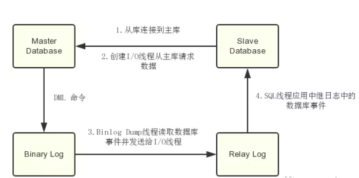


## MySQL数据库主从同步延迟原理。

答：谈到MySQL数据库主从同步延迟原理，得从mysql的数据库主从复制原理说起，mysql的主从复制都是单线程的操作，主库对所有DDL和 DML产生binlog，binlog是顺序写，所以效率很高，slave的Slave_IO_Running线程到主库取日志，效率很比较高，下一步， 问题来了，slave的Slave_SQL_Running线程将主库的DDL和DML操作在slave实施。DML和DDL的IO操作是随即的，不是顺 序的，成本高很多，还可能可slave上的其他查询产生lock争用，由于Slave_SQL_Running也是单线程的，所以一个DDL卡主了，需要 执行10分钟，那么所有之后的DDL会等待这个DDL执行完才会继续执行，这就导致了延时。有朋友会问：“主库上那个相同的DDL也需要执行10分，为什 么slave会延时？”，答案是master可以并发，Slave_SQL_Running线程却不可以。

## MySQL数据库主从同步延迟是怎么产生的。

答：当主库的TPS并发较高时，产生的DDL数量超过slave一个sql线程所能承受的范围，那么延时就产生了，当然还有就是可能与slave的大型query语句产生了锁等待。

## MySQL数据库主从同步延迟解决方案

答：最简单的减少slave同步延时的方案就是在架构上做优化，尽量让主库的DDL快速执行。还有就是主库是写，对数据安全性较高，比如 sync_binlog=1，innodb_flush_log_at_trx_commit = 1 之类的设置，而slave则不需要这么高的数据安全，完全可以讲sync_binlog设置为0或者关闭binlog，innodb_flushlog也 可以设置为0来提高sql的执行效率。另外就是使用比主库更好的硬件设备作为slave。


# 分库分表

## 分库分表相关术语

- 读写分离: 不同的数据库，同步相同的数据，分别只负责数据的读和写；

- 分区: 指定分区列表达式，把记录拆分到不同的区域中(必须是同一服务器，可以是不同硬盘)，应用看来还是同一张表，没有变化；

- 分库：一个系统的多张数据表，存储到多个数据库实例中；

- 分表: 对于一张多行(记录)多列(字段)的二维数据表，又分两种情形：

   (1) 垂直分表: 竖向切分，不同分表存储不同的字段，可以把不常用或者大容量、或者不同业务的字段拆分出去；

   (2) 水平分表(最复杂): 横向切分，按照特定分片算法，不同分表存储不同的记录。


## 评估分库分表必要性

需要注意的是，分库分表会为数据库维护和业务逻辑带来一系列复杂性和性能损耗，`除非预估的业务量大到万不得已，切莫过度设计、过早优化`。 规划期内的数据量和性能问题，尝试能否用下列方式解决：

- 当前数据量：如果没有达到几百万，通常无需分库分表；
- 数据量问题：增加磁盘、增加分库(不同的业务功能表，整表拆分至不同的数据库)；
- 性能问题：升级CPU/内存、读写分离、优化数据库系统配置、优化数据表/索引、优化 SQL、分区、数据表的垂直切分；
- 如果仍未能奏效，才考虑最复杂的方案：数据表的水平切分。


## 全局ID生成策略

### 自动增长列

优点：数据库自带功能，有序，性能佳。 缺点：单库单表无妨，分库分表时如果没有规划，ID可能重复。解决方案：

#### 设置自增偏移和步长


如果采用该方案，在扩容时需要迁移已有数据至新的所属分片。

#### 全局ID映射表

在全局 Redis 中为每张数据表创建一个 ID 的键，记录该表当前最大 ID； 每次申请 ID 时，都自增 1 并返回给应用； Redis 要定期持久至全局数据库。

### UUID(128位)

在一台机器上生成的数字，它保证对在同一时空中的所有机器都是唯一的。通常平台会提供生成UUID的API。 UUID 由4个连字号(-)将32个字节长的字符串分隔后生成的字符串，总共36个字节长。形如：550e8400-e29b-41d4-a716-446655440000。 UUID 的计算因子包括：以太网卡地址、纳秒级时间、芯片ID码和许多可能的数字。 UUID 是个标准，其实现有几种，最常用的是微软的 GUID(Globals Unique Identifiers)。

优点：简单，全球唯一； 缺点：存储和传输空间大，无序，性能欠佳。

### COMB(组合)

参考资料：The Cost of GUIDs as Primary Keys 组合 GUID(10字节) 和时间(6字节)，达到有序的效果，提高索引性能。

### Snowflake(雪花) 算法

参考资料：twitter/snowflake

Snowflake 算法详解 Snowflake 是 Twitter 开源的分布式 ID 生成算法，其结果为 long(64bit) 的数值。 其特性是各节点无需协调、按时间大致有序、且整个集群各节点单不重复。 该数值的默认组成如下(符号位之外的三部分允许个性化调整)：

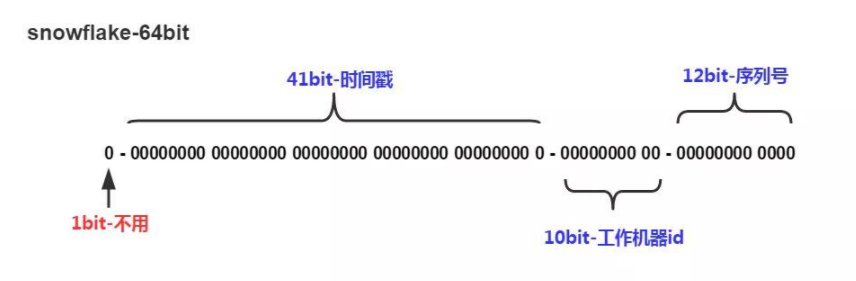

- 1bit: 符号位，总是 0(为了保证数值是正数)。
- 41bit: 毫秒数(可用 69 年)；
- 10bit: 节点ID(5bit数据中心 + 5bit节点ID，支持 32 * 32 = 1024 个节点)
- 12bit: 流水号(每个节点每毫秒内支持 4096 个 ID，相当于 409万的 QPS，相同时间内如 ID 遇翻转，则等待至下一毫秒)

## 3 分片策略

### 3.1 连续分片

根据特定字段(比如用户ID、订单时间)的范围，值在该区间的，划分到特定节点。 优点：集群扩容后，指定新的范围落在新节点即可，无需进行数据迁移。 缺点：如果按时间划分，数据热点分布不均(历史数冷当前数据热)，导致节点负荷不均。

### 3.2 ID取模分片

缺点：扩容后需要迁移数据。

### 3.3 一致性Hash算法

优点：扩容后无需迁移数据。

### 3.4 Snowflake 分片

优点：扩容后无需迁移数据。


## **4 分库分表引入的问题**

### **4.1 分布式事务**

参见 分布式事务的解决方案 由于两阶段/三阶段提交对性能损耗大，可改用事务补偿机制。

### **4.2 跨节点 JOIN**

对于单库 JOIN，MySQL 原生就支持； 对于多库，出于性能考虑，不建议使用 MySQL 自带的 JOIN，可以用以下方案避免跨节点 JOIN：

- 全局表: 一些稳定的共用数据表，在各个数据库中都保存一份；
- 字段冗余: 一些常用的共用字段，在各个数据表中都保存一份；
- 应用组装：应用获取数据后再组装。

另外，某个 ID 的用户信息在哪个节点，他的关联数据(比如订单)也在哪个节点，可以避免分布式查询。

### **4.3 跨节点聚合**

只能在应用程序端完成。 但对于分页查询，每次大量聚合后再分页，性能欠佳。

### **4.4 节点扩容**

节点扩容后，新的分片规则导致数据所属分片有变，因而需要迁移数据。

## **5 节点扩容方案**

相关资料: 数据库秒级平滑扩容架构方案

### **5.1 常规方案**

如果增加的节点数和扩容操作没有规划，那么绝大部分数据所属的分片都有变化，需要在分片间迁移：

- 预估迁移耗时，发布停服公告；
- 停服(用户无法使用服务)，使用事先准备的迁移脚本，进行数据迁移；
- 修改为新的分片规则；
- 启动服务器。

### **5.2 免迁移扩容**

采用双倍扩容策略，避免数据迁移。扩容前每个节点的数据，有一半要迁移至一个新增节点中，对应关系比较简单。 具体操作如下(假设已有 2 个节点 A/B，要双倍扩容至 A/A2/B/B2 这 4 个节点)：

- 无需停止应用服务器；
- 新增两个数据库 A2/B2 作为从库，设置主从同步关系为：A=>A2、B=>B2，直至主从数据同步完毕(早期数据可手工同步)；
- 调整分片规则并使之生效： 原 `ID%2=0 => A` 改为 `ID%4=0 => A, ID%4=2 => A2`； 原 `ID%2=1 => B` 改为 `ID%4=1 => B, ID%4=3 => B2`。
- 解除数据库实例的主从同步关系，并使之生效；
- 此时，四个节点的数据都已完整，只是有冗余(多存了和自己配对的节点的那部分数据)，择机清除即可(过后随时进行，不影响业务)。

## **6 分库分表方案**

### **6.1 代理层方式**

部署一台代理服务器伪装成 MySQL 服务器，代理服务器负责与真实 MySQL 节点的对接，应用程序只和代理服务器对接。对应用程序是透明的。 比如 MyCAT，官网，源码，参考文档：MyCAT+MySQL 读写分离部署 MyCAT 后端可以支持 MySQL, [SQL Server](https://cloud.tencent.com/product/sqlserver?from=10680), Oracle, DB2, [PostgreSQL](https://cloud.tencent.com/product/postgresql?from=10680)等主流数据库，也支持MongoDB这种新型NoSQL方式的存储，未来还会支持更多类型的存储。 MyCAT 不仅仅可以用作读写分离，以及分表分库、容灾管理，而且可以用于多租户应用开发、云平台基础设施，让你的架构具备很强的适应性和灵活性。

### **6.2 应用层方式**

处于业务层和 JDBC 层中间，是以 JAR 包方式提供给应用调用，对代码有侵入性。主要方案有： (1)淘宝网的 TDDL: 已于 2012 年关闭了维护通道，建议不要使用。 (2)当当网的 Sharding-JDBC: 仍在活跃维护中： 是当当应用框架 ddframe 中，从[关系型数据库](https://cloud.tencent.com/product/cdb-overview?from=10680)模块 dd-rdb 中分离出来的数据库水平分片框架，实现透明化数据库分库分表访问，实现了 Snowflake 分片算法； Sharding-JDBC定位为轻量Java框架，使用客户端直连数据库，无需额外部署，无其他依赖，DBA也无需改变原有的运维方式。 Sharding-JDBC分片策略灵活，可支持等号、between、in等多维度分片，也可支持多分片键。 SQL解析功能完善，支持聚合、分组、排序、limit、or等查询，并支持Binding Table以及笛卡尔积表查询。

Sharding-JDBC直接封装JDBC API，可以理解为增强版的JDBC驱动，旧代码迁移成本几乎为零：

- 可适用于任何基于Java的ORM框架，如JPA、Hibernate、Mybatis、Spring JDBC Template或直接使用JDBC。
- 可基于任何第三方的数据库连接池，如DBCP、C3P0、 BoneCP、Druid等。
- 理论上可支持任意实现JDBC规范的数据库。虽然目前仅支持MySQL，但已有支持Oracle、SQLServer等数据库的计划。


# 分库分表带来的问题

通过上面的分表和分库方案的介绍，主要会遇到下面三类问题：

1. MySQL单 Master 的写入性能瓶颈。
2. 分库分表后的 SQL 解析处理，服务调用链路变长，系统变得不稳定。
3. 分库分表后动态扩容不好实现，例如开始分了20个表，不影响业务的情况下扩容至50个表不好实现。


### 垂直拆分

#### 跨库Join问题

在垂直拆分之前，系统中所需的数据是可以通过表 Join 来完成的，而拆分之后，数据库可能分布式在不同 RDS 实例，Join 处理起来比较麻烦，根据 MySQL 开发规范，一般是禁止跨库 Join 的，那该怎么处理呢？

首先要考虑这种垂直拆分的合理性，如果可以调整，那就优先调整，如果无法调整，根据以往的实际经验，总结几种常见的解决思路。

##### 全局表

所谓全局表，就是有可能系统中所有模块都可能会依赖到的一些表。比较类似我们理解的“数据字典”。为了避免跨库join查询，我们可以将这类表在其他每个数据库中均保存一份。同时，这类数据通常也很少发生修改（甚至几乎不会），所以也不用太担心“一致性”问题。

用过 mycat 做分库分表的朋友都清楚，有个全局表的概念，也就是每个 DataNode 上都有一份全量数据，例如一些数据字典表，数据很少修改，可以避免跨库 Join 的性能问题。

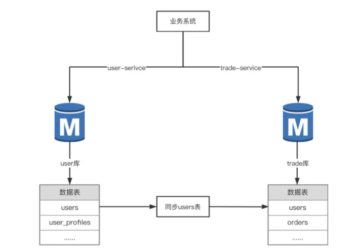

通过数据同步工具将 user 库的 users 表实时同步到trade库中，这样就可以直接在 trade 库做 Join 操作，比较依赖于同步工具的稳定性，如果同步有延迟，就会导致数据不一致，产生脏数据，需要做好风险评估和兜底方案。

##### 数据同步

对于分布式系统，不同的服务的数据库是分布在不同的 RDS 实例上的，在禁止跨库 Join 的情况下，数据同步是一种解决方案。

A库中的tab_a表和B库中tbl_b有关联，可以定时将指定的表做同步。当然，同步本来会对数据库带来一定的影响，需要性能影响和数据时效性中取得一个平衡。这样来避免复杂的跨库查询。

##### 字段冗余

这是一种典型的反范式设计，在互联网行业中比较常见，通常是为了性能来避免join查询。

举个电商业务中很简单的场景：

“订单表”中保存“卖家Id”的同时，将卖家的“Name”字段也冗余，这样查询订单详情的时候就不需要再去查询“卖家用户表”。

字段冗余能带来便利，是一种“空间换时间”的体现。但其适用场景也比较有限，比较适合依赖字段较少的情况。最复杂的还是数据一致性问题，这点很难保证，可以借助数据库中的触发器或者在业务代码层面去保证。当然，也需要结合实际业务场景来看一致性的要求。就像上面例子，如果卖家修改了Name之后，是否需要在订单信息中同步更新呢？

##### 系统层组装

在系统层面，通过调用不同模块的组件或者服务，获取到数据并进行字段拼装。说起来很容易，但实践起来可真没有这么简单，尤其是数据库设计上存在问题但又无法轻易调整的时候。具体情况通常会比较复杂。组装的时候要避免循环调用服务，循环RPC，循环查询数据库，最好一次性返回所有信息，在代码里做组装。


#### 分布式事务问题

拆分之后，数据分布在不同的 RDS 实例上，对表的 DML 操作就变成了多个子表的 DML 操作，就涉及到分布式事务，也要遵循事务 ACID 特性，同时也会提到两个重要的理论：**CAP**（Consistency一致性，Availability可用性，Partition tolerance分区容忍性Partitiontolerance）和**BASE**（Basically Available基本可用， Soft state软状态，Eventually consistent最终一致性），进而产生了解决分布式事务问题不同的方案。

##### MySQL XA事务

MySQL支持分布式事务（XA 事务或者 2PC 两阶段提交），分为两个阶段：**Prepare 和  Commit**，事务处理过程如下

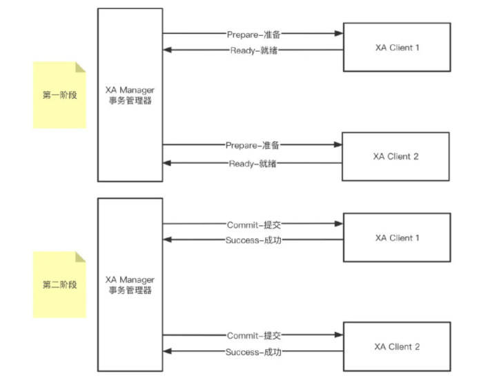

如果任何一个 XA Client 否决了此次提交，所有数据库都要求 XA Manager 回滚它们在事务中的信息，优点是可以最大程度保证了数据的强一致，适合对数据强一致要求很高的业务场景；缺点就是实现复杂，牺牲了可用性，对性能影响较大，不适合高并发高性能场景。

##### 本地消息表

本地消息表实现方式应该是业界使用最多的，其核心思想是将分布式事务拆分成本地事务进行处理，其基本的设计思想是将远程分布式事务拆分成一系列的本地事务。

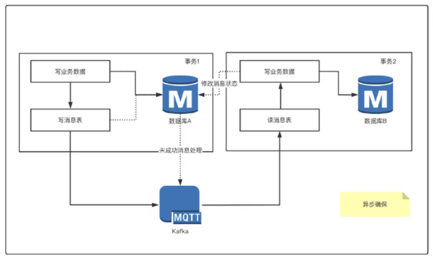


**处理过程**

**消息生产方**：需要额外建一个消息表，并记录消息发送状态，消息表和业务数据要在一个事务里提交，也就是说他们要在一个数据库里面。然后消息会经过 MQ 发送到消息的消费方，如果消息发送失败，会进行重试发送。

**消息消费方**：需要处理这个消息，并完成自己的业务逻辑，此时如果本地事务处理成功，表明已经处理成功了，如果处理失败，那么就会重试执行。如果是业务上面的失败，可以给生产方发送一个业务补偿消息，通知生产方进行回滚等操作。

生产方和消费方定时扫描本地消息表，把还没处理完成的消息或者失败的消息再发送一遍。如果有靠谱的自动对账补账逻辑，这种方案还是非常实用的。


### 水平拆分

#### 分布式全局唯一ID

MySQL InnoDB的表都是使用自增的主键ID，分库分表之后，数据表分布不同的分片上，如果使用自增 ID 作为主键，就会出现不同分片上的主机 ID 重复现象，可以利用 Snowflake 算法生成唯一ID。

#### 分片键选择

选择分片键时，需要先统计该表上的所有的 SQL，尽量选择使用频率高且唯一值多的字段作为分片键，既能做到数据均匀分布，又能快速定位到数据位置，例如user_id，order_id等。

#### 数据扩容

举个例子，目前交易数据库 trade 中的订单表 orders 已经做了水平分库（位于两个不同RDS实例上），这时发现两个 RDS 写入性能还是不够，需要再扩容一个RDS，同时将 orders 从原来的 20 个子表扩容到 40个（user_id % 40），这就需要迁移数据来实现数据重平衡，既要停机迁移数据，又要修改代码，有点出力不讨好的感觉啦。

#### 跨库Join问题

跟垂直拆分中的跨库 Join 问题是一样的。

#### 跨库排序分页

在处理`order by user_id limit n`场景是，当排序字段就是分片字段 user_id 的时候，通过分片键可以很容易定位到具体的分片，而当排序字段非分片字段的时候，例如`order by create_time`，处理起来就会变得复杂，需要在不同的分片节中将数据进行排序并返回，并将不同分片返回的结果集进行汇总和再次排序，最后再返回给用户。

#### 跨库函数处理

在使用max，min，sum，count之类的函数进行统计和计算的时候，需要先在每个分片数据源上执行相应的函数处理，然后将各个结果集进行二次处理，最终再将处理结果返回。

#### ER分片

在 RDBMS 系统中，表之间往往存在一些关联的关系，如果可以先确定好关联关系，并将那些存在关联关系的表记录存放在同一个分片上，就能很好地避免跨分片 join 问题。

#### 非分片键过滤

大部分业务场景都可以根据分片键来过滤，但是有些场景没有分片键过滤，例如按照状态和时间范围来查询订单表 orders，常见的SQL 这样的。


这种就很痛苦了，只能全部分片数据扫描一遍，将每个分片的数据Union之后再回复给客户端，这种场景可以考虑创建复合索引`（status，create_time）`让SQL走索引范围扫描，同时减少返回的数据量，如果是核心业务场景，可以考虑试试实时数仓（例如基于MPP架构的分析型数据库 ADB，分布式列式数据库 Clickhouse），将需要的表实时同步到数仓，然后再做处理，这也是实际业务中常见一种解决方案。


## 总结

通过总结 MySQ L的分表方案，分库方案，拆分后的问题，给出了常用的解决方案，在实际开发中，会遇到核心业务表增长很快，数据量很大，MySQL 写入性能瓶颈的问题，这时需要根据业务的特性考虑分库分表，可以调研下相关的解决方案，主要有两种方案：代码改造（数据库中间件mycat，sharding-sphere）和分布式数据库（实际业务中使用比较多的有 PingCAP TiDB，阿里云 DRDS），可以优先使用分布式数据库方案，虽然成本会有所增加，但对应用程序没有侵入性，同时也可以比较好的支撑业务增长和系统快速迭代，


## 雪花算法

### 算法原理

下图是 Snowflake 算法的 ID 构成图：


- **1 位标识部分**，该位不用主要是为了保持 ID 的自增特性，若使用了最高位，int64_t 会表示为负数。在 Java 中由于 long 类型的最高位是符号位，正数是 0，负数是 1，一般生成的 ID 为正整数，所以最高位为 0；
- 41 位时间戳部分，这个是毫秒级的时间，一般实现上不会存储当前的时间戳，而是时间戳的差值（当前时间减去固定的开始时间），这样可以使产生的 ID 从更小值开始；41 位的时间戳可以使用 69 年，(1L << 41) / (1000L 60 60 24 365) = (2199023255552 / 31536000000) ≈ 69.73 年；
- **10 位工作机器 ID 部分**，Twitter 实现中使用前 5 位作为数据中心标识，后 5 位作为机器标识，可以部署 1024 （2^10）个节点；
- **12 位序列号部分**，支持同一毫秒内同一个节点可以生成 4096 （2^12）个 ID；

Snowflake 算法生成的 ID 大致上是按照时间递增的，用在分布式系统中时，需要注意数据中心标识和机器标识必须唯一，这样就能保证每个节点生成的 ID 都是唯一的。我们不一定需要像 Twitter 那样使用 5 位作为数据中心标识，另 5 位作为机器标识，可以根据我们业务的需要，灵活分配工作机器 ID 部分。比如：若不需要数据中心，完全可以使用全部 10 位作为机器标识；若数据中心不多，也可以只使用 3 位作为数据中心，7 位作为机器标识。


### Snowflake 解惑

#### 既然是 64 位，为何第一位不使用？

首位不用主要是为了保持 ID 的自增特性，若使用了最高位，int64_t 会表示为负数。在 Java 中由于 long 类型的最高位是符号位，正数是 0，负数是 1，一般生成的 ID 为正整数，所以最高位为 0。

#### 怎么生成 41 位的时间戳？

41 位的时间戳，这个是毫秒级的时间，一般实现上不会存储当前的时间戳，而是时间戳的差值（当前时间减去固定的开始时间）。41 位只是预留位（主要目的是约定使用年限，固定的开始时间），不用的位数填 0 就好了。

#### 工作机器 id 如果使用 MAC 地址的话，怎么转成 10 bit？

**网络中每台设备都有一个唯一的网络标识，这个地址叫 MAC 地址或网卡地址，由网络设备制造商生产时写在硬件内部。**MAC 地址则是 48 位的（6 个字节），通常表示为 12 个 16 进制数，每 2 个 16 进制数之间用冒号隔开，如08：00：20：0A：8C：6D 就是一个 MAC 地址。

具体如下图所示，其前 3 字节表示OUI（Organizationally Unique Identifier），是 IEEE （电气和电子工程师协会）区分不同的厂家，后 3 字节由厂家自行分配。


很明显 Mac 地址是 48 位，而我们的工作机器 ID 部分只有 10 位，因此并不能直接使用 Mac 地址作为工作机器 ID。若要选用 Mac 地址的话，还需使用一个额外的工作机器 ID 分配器，用来实现 ID 与 Mac 地址间的唯一映射。

#### 怎么生成 12 bit 的序列号？

序列号不需要全局维护，在 Java 中可以使用 AtomicInteger（保证线程安全） 从 0 开始自增。当序列号超过了 4096，序列号在这一毫秒就用完了，等待下一个毫秒归 0 重置就可以了。

### Snowflake 优缺点

理论上 Snowflake 方案的 QPS 约为 409.6w/s（1000 * 2^12），这种分配方式可以保证在任何一个 IDC 的任何一台机器在任意毫秒内生成的 ID 都是不同的。

#### 优点

- 毫秒数在高位，自增序列在低位，整个 ID 都是趋势递增的。趋势递增的目的是：在 MySQL InnoDB 引擎中使用的是聚集索引，由于多数 RDBMS 使用 B-tree 的数据结构来存储索引数据，在主键的选择上面我们应该尽量使用有序的主键保证写入性能。
- 不依赖数据库等第三方系统，以服务的方式部署，稳定性更高，生成 ID 的性能也是非常高的。
- 可以根据自身业务特性分配 bit 位，非常灵活。

####  缺点

- 强依赖机器时钟，如果机器上时钟回拨，会导致发号重复或者服务会处于不可用状态。

除了时钟回拨问题之外，Snowflake 算法会存在并发限制，当然对于这些问题，以本人目前的 Java 功力根本解决不了。但这并不影响我们使用它。在实际项目中我们可以使用基于 Snowflake 算法的开源项目，比如百度的 [UidGenerator](https://github.com/baidu/uid-generator/blob/master/README.zh_cn.md) 或美团的 [Leaf](https://github.com/Meituan-Dianping/Leaf)。下面我们简单介绍一下这两个项目，感兴趣的小伙伴可以自行查阅相关资料。


#### UidGenerator

[UidGenerator](https://github.com/baidu/uid-generator) 是 Java 实现的，基于 Snowflake 算法的唯一 ID 生成器。UidGenerator 以组件形式工作在应用项目中，支持自定义 workerId 位数和初始化策略，从而适用于 [docker](https://www.docker.com/) 等虚拟化环境下实例自动重启、漂移等场景。 在实现上，UidGenerator 通过借用未来时间来解决 sequence 天然存在的并发限制；采用 RingBuffer 来缓存已生成的 UID，并行化 UID 的生产和消费，同时对 CacheLine 补齐，避免了由 RingBuffer 带来的硬件级「伪共享」问题。最终单机 QPS 可达 600 万。

依赖版本：[Java8](http://www.oracle.com/technetwork/java/javase/downloads/jdk8-downloads-2133151.html) 及以上版本，[MySQL](https://dev.mysql.com/downloads/mysql/) (内置 WorkerID 分配器，启动阶段通过 DB 进行分配；如自定义实现，则 DB非必选依赖）。

####  Leaf

[Leaf](https://github.com/Meituan-Dianping/Leaf) 最早期需求是各个业务线的订单 ID 生成需求。在美团早期，有的业务直接通过 DB 自增的方式生成 ID，有的业务通过 Redis 缓存来生成 ID，也有的业务直接用 UUID 这种方式来生成 ID。以上的方式各自有各自的问题，因此我们决定实现一套分布式 ID 生成服务来满足需求。具体 Leaf 设计文档见： [Leaf 美团分布式ID生成服务](https://tech.meituan.com/MT_Leaf.html)。

目前 Leaf 覆盖了美团点评公司内部金融、餐饮、外卖、酒店旅游、猫眼电影等众多业务线。在 4C8G VM 基础上，通过公司 RPC 方式调用，QPS 压测结果近5w/s，TP999 1ms。


## 一致性hash

### 概念及原理

一致性hash对应着普通的Hash的方式（即使用哈希值后对数量取模的方法：`hash(a.png) % 4 = 2` ），普通方式会出现一些缺陷，主要体现在服务器数量变动的时候，所有hash定位的位置都要发生改变！这对于扩容（服务器数量或者数据分片增加）会产生问题。

为了解决这些问题，Hash一致性算法（一致性Hash算法）诞生了！一致性Hash算法也是使用取模的方法，只是，刚才描述的取模法是对服务器的数量进行取模，而一致性Hash算法是对2^32 取模，什么意思呢？简单来说，一致性Hash算法将整个哈希值空间组织成一个虚拟的圆环，如假设某哈希函数H的值空间为0-2^32-1（即哈希值是一个32位无符号整形），整个哈希环如下图。

整个空间按**顺时针方向组织**，圆环的正上方的点代表0，0点右侧的第一个点代表1，以此类推，2、3、4、5、6……直到2^32-1 ，也就是说0点左侧的第一个点代表2^32-1， 0和2^32-1 在零点中方向重合，我们把这个由2^32个点组成的圆环称为**Hash环**。

下一步将各个服务器使用Hash进行一个哈希，具体可以选择**服务器的IP或主机名**作为**关键字**进行哈希，这样每台机器就能确定其在哈希环上的位置，这里假设将上文中四台服务器使用IP地址哈希后在环空间的位置如下图中Node A/B/C/D。

接下来使用如下算法定位数据访问到相应服务器：将数据key使用相同的函数Hash计算出哈希值，并确定此数据在环上的位置，从此位置沿环顺时针“行走”，第一台遇到的服务器就是其应该定位到的服务器！

例如我们有Object A、Object B、Object C、Object D四个数据对象，经过哈希计算后，在环空间上的位置如下，根据一致性Hash算法，数据A会被定为到Node A上，B被定为到Node B上，C被定为到Node C上，D被定为到Node D上。

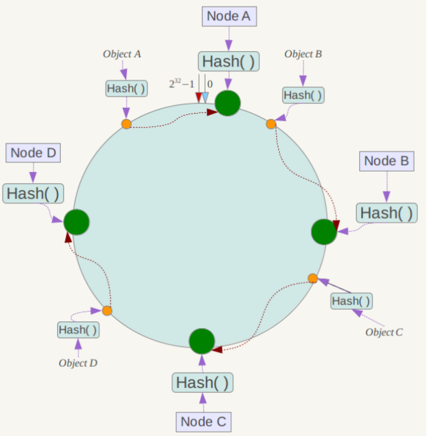


### 一致性Hash算法的容错性和可扩展性

现假设Node C不幸宕机，可以看到此时对象A、B、D不会受到影响，只有C对象被重定位到Node D。一般的，在一致性Hash算法中，如果一台服务器不可用，则受影响的数据仅仅是此服务器到其环空间中前一台服务器（即沿着逆时针方向行走遇到的第一台服务器）之间数据，其它不会受到影响，如下所示：

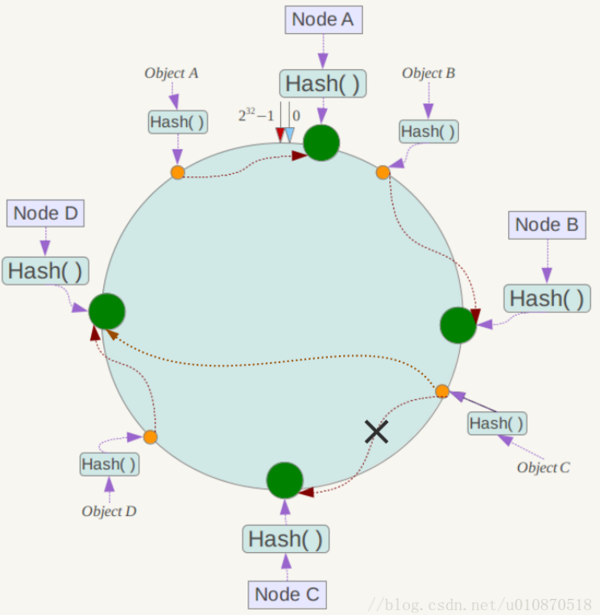

下面考虑另外一种情况，如果在系统中增加一台服务器Node X，此时对象Object A、B、D不受影响，只有对象C需要重定位到新的Node X ！一般的，在一致性Hash算法中，如果增加一台服务器，则受影响的数据仅仅是新服务器到其环空间中前一台服务器（即沿着逆时针方向行走遇到的第一台服务器）之间数据，其它数据也不会受到影响。

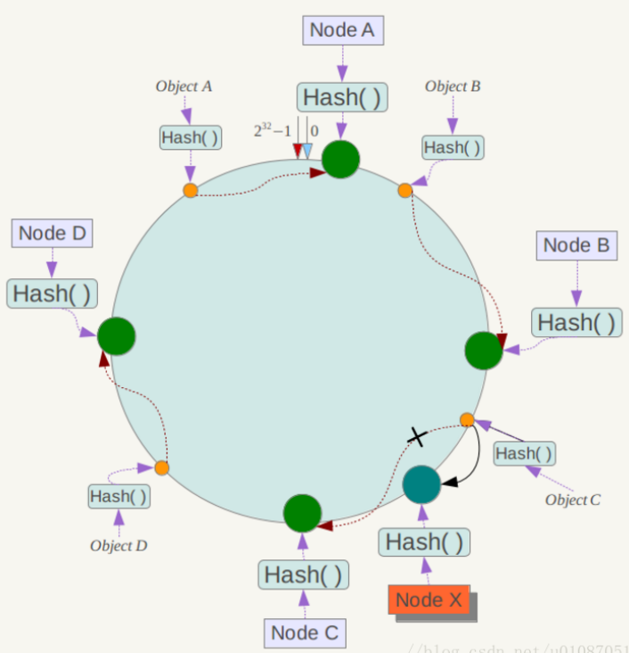

综上所述，**一致性Hash算法对于节点的增减都只需重定位环空间中的一小部分数据，具有较好的容错性和可扩展性。**


### Hash环的数据倾斜问题

一致性Hash算法在**服务节点太少时**，容易因为节点分部不均匀而造成**数据倾斜**（被缓存的对象大部分集中缓存在某一台服务器上）问题，例如系统中只有两台服务器，其环分布如下图，此时必然造成大量数据集中到Node A上，而只有极少量会定位到Node B上。

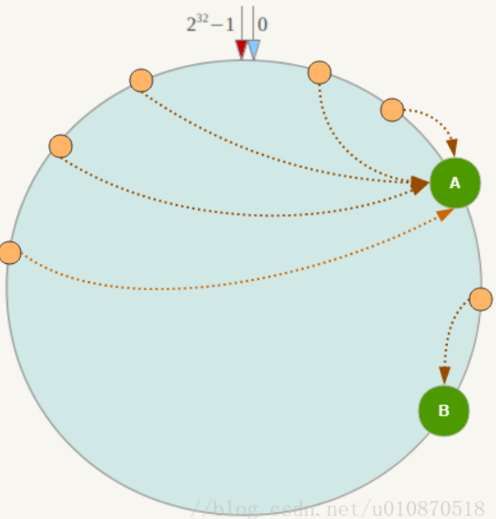

为了解决这种数据倾斜问题，一致性Hash算法引入了**虚拟节点机制**，即对每一个服务节点计算多个哈希，每个计算结果位置都放置一个此服务节点，称为**虚拟节点**。具体做法可以在服务器IP或主机名的后面增加编号来实现。

同时数据定位算法不变，**只是多了一步虚拟节点到实际节点的映射**，例如定位到“Node A#1”、“Node A#2”、“Node A#3”三个虚拟节点的数据均定位到Node A上。这样就解决了服务节点少时数据倾斜的问题。在实际应用中，通常将虚拟节点数设置为32甚至更大，因此即使很少的服务节点也能做到相对均匀的数据分布。

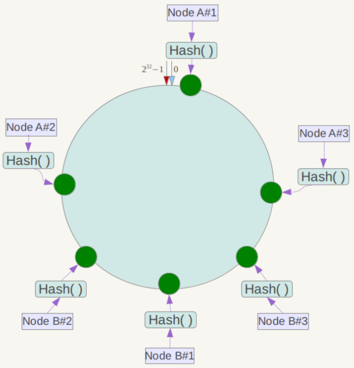


# 实战：数据库连接池数量选择

**问题抛出：**

想象你有一个网站，有1万上下的并发访问——也就是说差不多2万左右的TPS。那么这个网站的数据库连接池应该设置成多大呢？结果可能会让你惊讶，因为这个问题的正确问法是：**“这个网站的数据库连接池应该设置成多小呢？”**

### 有限的资源

即使是单核CPU的计算机也能“同时”运行数百个线程。但我们都[应该]知道这只不过是操作系统用时间分片玩的一个小把戏。一颗CPU核心同一时刻只能执行一个线程，然后操作系统切换上下文，核心开始执行另一个线程的代码，以此类推。给定一颗CPU核心，其顺序执行A和B永远比通过时间分片“同时”执行A和B要快，这是一条计算机科学的基本法则。一旦线程的数量超过了CPU核心的数量，再增加线程数系统就只会更慢，而不是更快。推荐：[多线程内容聚合](http://mp.weixin.qq.com/s?__biz=MzI4Njc5NjM1NQ==&mid=2247488811&idx=6&sn=a769526cf5c4dfc5b0f8e5a40f984cff&chksm=ebd62a07dca1a3116cc6c45ceb7a81d47293b9811c8df97b5ca363c6370ffccfd913bab3599f&scene=21#wechat_redirect)


上面的说法只能说是接近真理，但还并没有这么简单，有一些其他的因素需要加入。当我们寻找数据库的性能瓶颈时，总是可以将其归为三类：CPU、磁盘、网络。把内存加进来也没有错，但比起磁盘和网络，内存的带宽要高出好几个数量级，所以就先不加了。

如果我们无视磁盘和网络，那么结论就非常简单。在一个8核的服务器上，设定连接/线程数为8能够提供最优的性能，再增加连接数就会因上下文切换的损耗导致性能下降。数据库通常把数据存储在磁盘上，磁盘又通常是由一些旋转着的金属碟片和一个装在步进马达上的读写头组成的。

读/写头同一时刻只能出现在一个地方，然后它必须“寻址”到另外一个位置来执行另一次读写操作。所以就有了寻址的耗时，此外还有旋回耗时，读写头需要等待碟片上的目标数据“旋转到位”才能进行操作。使用缓存当然是能够提升性能的，但上述原理仍然成立。

在这一时间段（即"I/O等待"）内，线程是在“阻塞”着等待磁盘，此时操作系统可以将那个空闲的CPU核心用于服务其他线程。所以，由于线程总是在I/O上阻塞，我们可以让线程/连接数比CPU核心多一些，这样能够在同样的时间内完成更多的工作。

那么应该多多少呢？这要取决于磁盘。较新型的SSD不需要寻址，也没有旋转的碟片。可别想当然地认为“SSD速度更快，所以我们应该增加线程数”，恰恰相反，**无需寻址和没有旋回耗时意味着更少的阻塞，所以更少的线程[更接近于CPU核心数]会发挥出更高的性能。只有当阻塞创造了更多的执行机会时，更多的线程数才能发挥出更好的性能。**

网络和磁盘类似。通过以太网接口读写数据时也会形成阻塞，10G带宽会比1G带宽的阻塞少一些，1G带宽又会比100M带宽的阻塞少一些。不过网络通常是放在第三位考虑的，有些人会在性能计算中忽略它们。


### 计算公式

下面的公式是由PostgreSQL提供的，不过我们认为可以广泛地应用于大多数数据库产品。你应该模拟预期的访问量，并从这一公式开始测试你的应用，寻找最合适的连接数值。

> 连接数 = ((核心数 * 2) + 有效磁盘数)

核心数不应包含超线程(hyper thread)，即使打开了hyperthreading也是。如果活跃数据全部被缓存了，那么有效磁盘数是0，随着缓存命中率的下降，有效磁盘数逐渐趋近于实际的磁盘数。这一公式作用于SSD时的效果如何尚未有分析。

按这个公式，你的4核i7数据库服务器的连接池大小应该为((4 * 2) + 1) = 9。取个整就算是是10吧。是不是觉得太小了？跑个性能测试试一下，我们保证它能轻松搞定3000用户以6000TPS的速率并发执行简单查询的场景。如果连接池大小超过10，你会看到响应时长开始增加，TPS开始下降。扩展：[用了这么久的数据库连接池，你知道原理吗？](http://mp.weixin.qq.com/s?__biz=MzI4Njc5NjM1NQ==&mid=2247490668&idx=2&sn=229c7bf8df9a3750eeb68b4eeee38a8f&chksm=ebd62340dca1aa56678800efeeae3b54649bdbed8472cd1340f39b02bb20ddc262b8ae61cc69&scene=21#wechat_redirect)

> 笔者注：
> 这一公式其实不仅适用于数据库连接池的计算，大部分涉及计算和I/O的程序，线程数的设置都可以参考这一公式。我之前在对一个使用Netty编写的消息收发服务进行压力测试时，最终测出的最佳线程数就刚好是CPU核心数的一倍。

### 公理：你需要一个小连接池，和一个充满了等待连接的线程的队列

如果你有10000个并发用户，设置一个10000的连接池基本等于失了智。1000仍然很恐怖。即是100也太多了。你需要一个10来个连接的小连接池，然后让剩下的业务线程都在队列里等待。连接池中的连接数量应该等于你的数据库能够有效同时进行的查询任务数（通常不会高于2*CPU核心数）。

我们经常见到一些小规模的web应用，应付着大约十来个的并发用户，却使用着一个100连接数的连接池。这会对你的数据库造成极其不必要的负担。

### 请注意

连接池的大小最终与系统特性相关。

比如一个混合了长事务和短事务的系统，通常是任何连接池都难以进行调优的。最好的办法是创建两个连接池，一个服务于长事务，一个服务于短事务。

再例如一个系统执行一个任务队列，只允许一定数量的任务同时执行，此时并发任务数应该去适应连接池连接数，而不是反过来。


# 实战：热点数据处理

我们在做各种业务研发的时候经常会碰到[热点问题](https://link.zhihu.com/?target=https%3A//coding.imooc.com/class/338.html%3Fmc_marking%3Da566eb709af4433cd5c0cb07052338be%26mc_channel%3Dshouji)影响系统稳定性和性能瓶颈，例如支付系统中的热点账户进出款，电商系统中的热点商品参与秒杀，金融系统中的热点理财产品抢购等。

首先，热点问题包含两个字：一个是点，一个是热。点表示我们在系统的业务路径上有一个地方存在性能的瓶颈，比如数据库，文件系统，网络，甚至于内存等，这个点一般有io，锁等问题构成。热表示其被访问的频率很高，就是说一个被访问频率很高的io或锁自然而然就变成了我们系统业务路径上的性能瓶颈。

其次，我们需要弄清楚热点问题是属于**读热点问题**还是**写热点问题**，还是**读写混合的热点问题**。几种问题的处理方案完全不一样，比如我们对一个热门的秒杀商品详情页的访问就属于是读热点问题，对一个秒杀商品的库存抢操作就是一个写热点问题。虽然分离了读热点问题和写热点问题，但是往往在读热点问题中也需要处理写热点问题的解决方案，比如我对一个热门的秒杀商品详情的读热点问题使用了缓存解决方案，但因为商家对商品做了更新价格的东西，立马需要对写热点而造成的缓存脏数据做清理的操作，因此就变成了一个**读写混合的热点问题**。

### 读热点问题的解决方案

读热点问题比较容易解决。一般我们做系统之初使用数据库，直接对用户的请求做sql的select操作，那对于此类的热点问题我们首先想到的是需要**优化数据库的读操作**，我们对应的查询**是否走了索引**，走的**是否是唯一索引甚至于主健索引**效果最佳，优化了sql性能后我们可以**借助于mysql innodb的buffer**做一些文章，在数据库层面就提供足够的缓冲区，加速对应的性能，实验证明，只要走的是主健或唯一索引，在innodb缓冲区足够大的情况下，mysql抗上亿的数据也是没有任何问题的。

**真正出问题的不是点而是热，由于访问频次太高，mysql的cpu扛不住了**，这个时候我们**考虑**到的是**将对应的读热点放到例如redis的缓存中用于卸载压力**，由于redis4版本以后就可以支持cluster的集群模式，其借助分片集群的效果理论上可以扩展到1000个左右的节点，如此一来我们可以依靠缓存去解决读热点问题，一旦商家**变更了读热点的数据**，我们可以在**业务应用中使用提交后异步清除缓存的方式将redis的数据清除，这样在下一次的请求中可以依靠数据库的回源更新redis数据**。

那既然我们讨论的是**读热点问题，就和redis的水平扩展能力无关，因为是个热点数据，则必定会被分片路由到一个redis节点上，当热度大到连redis节点都无法承受的时候，我们可以考虑将原本的一个热点做三分拷贝**，比如我们的热点key叫"miaosha_item_1"，我们可以考虑随机的生成三个key分别叫"miaosha_item_1_key_1","miaosha_item_1_key_2","miaosha_item_1_key_3"，对应的value都是这个商品value本身，这样当用户请求过来后我们可以随机的生成1-3的数字以决定这次请求我们访问哪个key，这样**人为的将一个热点的tps降到了原来的三分之一，以空间换时间**，另外我们**还可以考虑在应用服务器上做本地的cache内存**，由于应用服务器本身容量有限，内存中不能放太多数据，也不能存很长时间，我们推荐使用google研发的guava cache包，提供给我们很好的lru cache队列的能力，**一般本地的缓存不要设置太长时间，一是出于内存容量考虑，二是出于清理本地缓存不像清理redis，需要我们的每台应用服务感知到数据的变更，一般可以用广播型的mq消息解决**，推荐rocketmq 的广播型消息，使得订阅对应商品信息变更的所有应用服务器都有机会清理本地缓存。

### 写热点问题的解决方案

**难点：**写热点问题处理起来比读热点更难，因为读操作可以并发，但是写操作都需要加锁以防并发的方式写入数据库或者文件存储中。

**针对热点数据中“点”的问题**，有以下几种解决思路：

**（1）可以基于数据库顺序追加写事务日志的形式来提高写入性能。**

我们一般**写操作**会选用数据库之类的文件存储设备，mysql对数据存储有比较好的优化，其**基于写事务日志**，也就是**redo，undo log**，然后等系统空闲的时候将数据刷入磁盘的，由于事务日志的存在，即使系统挂了再启动的时候也可以根据redo log恢复数据，那为啥写log比写数据快那么多的，因为写日志是一个顺序追加写的方式，磁盘的磁头不需要随机的移动寻找写入点，只要顺序的写下去即可，配合ssd固态硬盘，整个写入性能可以做到很高。

**（2）可以将写入的目标点移到缓存中（需要解决缓存可靠性问题）**

但是磁盘操作终究是磁盘操作，我们试着可以**将写入的目标点移到缓存中**，比如我们将秒杀的库存移到redis中，这么一来，点的瓶颈的天花板瞬间就提升到了很多倍，但是一旦将数据落到没有办法保证磁盘落地能力的**缓存中就需要依靠一些机制去保证可靠性，不至于在缓存丢失的情况下造成超卖等灾难**，我们**可以依靠rocketmq异步事务型的消息保持redis和数据库之间的数据同步**，解决缓存异常情况下我们可以依靠数据库恢复对应的数据。

**（3）对热点的写入访问操作队列化，使用单线程的方式去队列中取得下一个写入操作（"缓冲入账"）**

那异步化是解决问题的最终方案吗？显然不是，异步化只是将对应的写热点问题延迟到后面去解决，不至于卡住前端的用户体验，但是一旦这个点热了起来，后端服务器和磁盘的压力还在，那我们还有什么方法去解决呢？我们都知道写入操作之所以在热点问题的情况下那么难解决，是因为写同一份数据的操作不能并发，必须得要通过竞争锁的机制去竞争以获得线程的写入权限，我们突然可以想到，锁这个东西本身就是一个耗性能的来源，试想两个人要抢同一个食堂阿姨拿出来的饭，你争我抢，我抢到了吃晚了再给后面的其他人在争，在竞争的过程中所有人，所有线程的资源都被白白消耗掉了，最终还是只有一个人在那个时刻可以吃到饭。那针对这种情况我们是否可以有更好的解决方案呢？还是考虑抢饭吃这个场景，在现实生活中最高效的方式是什么，就是排队，大家都不要竞争，按照先到先得的方式将所有对热点的写入访问操作队列化，使用单线程的方式去队列中取得下一个写入操作，然后写完后再取下一个，这样可以避免掉写锁竞争的无谓cpu和内存消耗，也可以使用单线程的方式解决，没有cpu调度切换的开销，这就是我们常说的在无锁的情况下，单线程排队比多线程更高效，我们把这种解决写热点的方式叫做"缓冲入账"～

### 限流

除了以上讲的方法，还需要关注无论是读热点还是写热点问题的解决方案，如果流量超过我的系统能力的上限，就需要拒绝服务，将内部的等待队列先处理完再进行，保证系统可以高效的处理请求。


# 数据库系统概念及工具

## 概念扫盲

**参考：** [数据库建模各种概念学习](https://blog.csdn.net/u010098331/article/details/51455085)

### cdm ldm pdm 区别、转化

#### PowerDesigner

简称PD，是一种数据建模工具，适合于开发大型应用系统时的数据模型设计过程。总共有5种模型。


#### 模型

##### CDM

以实体为单元，进行实体以及实体对应关系的建立。即实体-联系图（E-R图），CDM就是以其自身方式来描述E-R图。

此时不考虑物理实现的细节，只表示数据库的整体逻辑结构，独立于任何软件和数据存储结构。 在CDM中用来标识实体的是属性（Attribute）。

##### LDM

逻辑模型是概念模型的延伸，逻辑模型中一方面显示了实体、实体的属性和实体之间的关系，另一方面又将继承、实体关系中的引用等在实体的属性中进行展示。逻辑模型主要是使得整个概念模型更易于理解，同时又不依赖于具体的数据库实现。

　　 具体表现 ： 

　　在概念模型中的多对多关系，在逻辑模型中将会以增加中间实体的一对多关系的方式来实现。 

　　 和其他模型的联系 ：

使用逻辑模型可以生成针对具体数据库管理系统的物理模型。逻辑模型并不是在整个步骤中必须的，可以直接通过概念模型来生成物理模型。


##### PDM

PDM更接近与关系数据库里的关系表，PDM可以直接与RDBMS（关系型数据库管理系统）发生关联。PDM考虑了数据库的物理实现，包括软件和数据存储结构。

PDM的对象：表（Table）、表中的列（Table column）、主外键（Primary、Foreign key）、参照（Reference）、索引（Index）、视图（View）等。

在PDM中用来表示实体属性的是列（Column）。


##### OOM

一个OOM包含一系列包，类，接口 , 和他们的关系。 这些对象一起形成所有的( 或部份) 一个软件系统的逻辑的设计视图的类结构。 一个OOM 本质上是软件系统的一个静态的概念模型。可以直接生成JavaBean文件。 


##### 总结

CDM和LDM的区别有些地方解释不一样，认为概念模型中只有实体和实体之间的关系，并没有实体的属性、唯一标识这些具体的内容。但是有一点是一样的，就是逻辑模型比概念模型更详细，目的是更详尽的描述数据，使得整个概念模型更易于理解。

OOM是整个软件系统的一个概念模型，不仅仅是对数据的建模，而且从思想上也是面向对象的思想。

个人认为，一些区别可能大家理解得不一致，这是正常的，类似于“狭义”和“广义”的区别，我们只需把握住每种模型的侧重点就可以了。

在软件工程文档的数据库设计书需要有CDM,LDM,PDM三种模型。


## 数据库选型

数据库选型是非常重要的环节，一般在需求分析完成之后，通过架构评审会进行确认，数据库方面主要包括数据存储，检索，安全，读写分离，分库分表，数据归档，接入数据仓库都要进行确认，根据业务的场景对相关的数据库产品进行调研比对，选择最适合业务场景的数据库作为存储。

举个例子：

对于一个DAU 1000W  TPS 3W的交易的业务场景，如果使用MySQL来存储，我们知道原生的MySQL写入瓶颈，以及订单相关表数据量增长过快导致的性能问题，不太适合这种高并发写的场景，可以考虑使用分布式MySQL，例如常见的DRDS，TiDB，OceanBase。既可以解决原生MySQL写入瓶颈，同时也可以处理单表数据量大导致的分库分表问题。

同样对于优酷，爱奇艺这种视频类系统，使用MySQL来存储就不太合适了，应该采用MongoDB集群来存储；对于京东，淘宝的这种搜索服务采用ElastSearch数据库集群处理会更高效。


**补充：**[TPS/QPS等概念含义](https://www.cnblogs.com/ghl1024/p/12078274.html)


## 数据库脚本规范性检查

规范性检查可以借助开源的SQL审核工具，如Yearning，Archery都可以设置规则，检查之后会给出整改建议，能够帮我们自动实现SQL Review。Yearning是用go开发，目前只支持MySQL数据库，Archery可以支持多种数据库。下面是Yearning自动化SQL审核平台的一个DDL工单的检测示例。

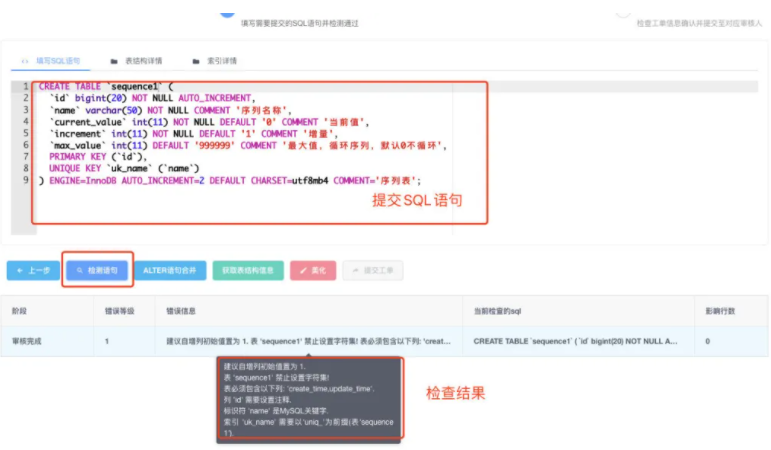


## 数据库维护阶段

数据库维护阶段主要包括业务支撑和数据库运维，简单总结了下，如下图所示。

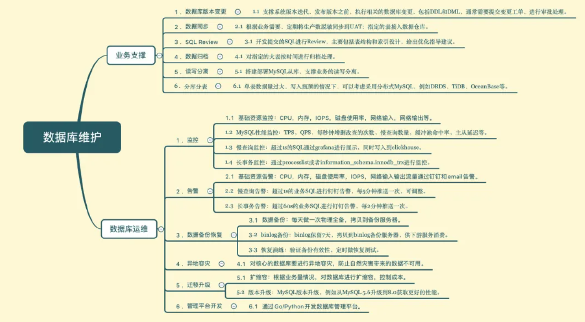


# MySQL付费课


## 架构解读


问题：

什么是长连接？短连接？

同步和异步？

连接池的原理？


## 存储引擎


## 表锁/行锁/实战表设计


