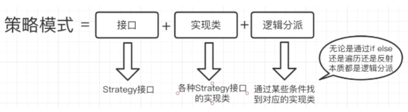

#  Java动态代理

## 实现动态代理的步骤

1. 创建接口，定义目标类要完成的功能
2. 创建目标类实现接口
3. 创建InvocationHandler接口的实现类，在invoke方法中完成代理类的功能：

​        1）调用目标方法

​        2）增强功能

1. 使用Proxy类的静态方法，创建代理对象。并把返回值转为接口类型。

# 策略模式

## 定义

一个类的行为或其算法可以在运行时更改。我们把它降维到代码层面，用人话翻译一下就是，运行时我给你这个类的方法传不同的“key”，你这个方法会执行不同的业务逻辑。细品一下，这不就是 if else 干的事吗？

## 作用

策略模式优化了什么？

其实策略模式的核心思想和 if else如出一辙，根据不同的key动态的找到不同的业务逻辑，那它就只是如此吗？

实际上，我们口中的策略模式其实就是在代码结构上调整，用接口+实现类+分派逻辑来使代码结构可维护性好点。

一般教科书上讲解到接口与实现类就结束了，其他博客上会带上提及分派逻辑。这里就不啰嗦了。

小结一下，即使用了策略模式，你该写的业务逻辑照常写，到逻辑分派的时候，还是变相的if else。而它的优化点是抽象了出了接口，将业务逻辑封装成一个一个的实现类，任意地替换。在复杂场景（业务逻辑较多）时比直接 if else 来的好维护些

# 极客时间付费课

## 03 | 面向对象、设计原则、设计模式、编程规范、重构，这五者有何关系？

在上一节课中，我们讲到，要具备编写高质量代码的能力，你需要学习一些编程方法论，其中就包含面向对象（我们可以把它看成一种设计思想）、设计原则、设计模式、编程规范、重构技巧等。而我们整个专栏的内容也是围绕着这几块展开讲解的。所以，今天我就先来简单介绍一下这几个概念，并且说一说它们之间的联系。今天的内容相当于专栏的一个教学大纲，或者说学习框架。它能让你对整个专栏所涉及的知识点，有一个全局性的了解，能帮你将后面零散的知识更系统地组织在大脑里。话不多说，我们就一块来看一下，接下来的这 8 个月我们到底要学习哪些内容吧！

### 面向对象

现在，主流的编程范式或者是编程风格有三种，它们分别是面向过程、面向对象和函数式编程。面向对象这种编程风格又是这其中最主流的。现在比较流行的编程语言大部分都是面向对象编程语言。大部分项目也都是基于面向对象编程风格开发的。面向对象编程因为其具有丰富的特性（封装、抽象、继承、多态），可以实现很多复杂的设计思路，是很多设计原则、设计模式编码实现的基础。所以，在专栏的最开始，我们会详细地讲解面向对象编程的相关的知识，为学习后面的内容做铺垫。对于这部分内容，你需要掌握下面这 7 个大的知识点。

- 面向对象的四大特性：封装、抽象、继承、多态
- 面向对象编程与面向过程编程的区别和联系
- 面向对象分析、面向对象设计、面向对象编程
- 接口和抽象类的区别以及各自的应用场景
- 基于接口而非实现编程的设计思想
- 多用组合少用继承的设计思想
- 面向过程的贫血模型和面向对象的充血模型

### 设计原则

设计原则是指导我们代码设计的一些经验总结。设计原则这块儿的知识有一个非常大的特点，那就是这些原则听起来都比较抽象，定义描述都比较模糊，不同的人会有不同的解读。所以，如果单纯地去记忆定义，对于编程、设计能力的提高，意义并不大。对于每一种设计原则，我们需要掌握它的设计初衷，能解决哪些编程问题，有哪些应用场景。只有这样，我们才能在项目中灵活恰当地应用这些原则。

对于这一部分内容，你需要透彻理解并且掌握，如何应用下面这样几个常用的设计原则。

- SOLID 原则 -SRP 单一职责原则
- SOLID 原则 -OCP 开闭原则
- SOLID 原则 -LSP 里式替换原则
- SOLID 原则 -ISP 接口隔离原则
- SOLID 原则 -DIP 依赖倒置原则
- DRY 原则、KISS 原则、YAGNI 原则、LOD 法则

### 设计模式

设计模式是针对软件开发中经常遇到的一些设计问题，总结出来的一套解决方案或者设计思路。大部分设计模式要解决的都是代码的可扩展性问题。设计模式相对于设计原则来说，没有那么抽象，而且大部分都不难理解，代码实现也并不复杂。这一块的学习难点是了解它们都能解决哪些问题，掌握典型的应用场景，并且懂得不过度应用。

经典的设计模式有 23 种。随着编程语言的演进，一些设计模式（比如 Singleton）也随之过时，甚至成了反模式，一些则被内置在编程语言中（比如 Iterator），另外还有一些新的模式诞生（比如 Monostate）。

在专栏中，我们会重点讲解 23 种经典的设计模式。它们又可以分为三大类：创建型、结构型、行为型。对于这 23 种设计模式的学习，我们要有侧重点，因为有些模式是比较常用的，有些模式是很少被用到的。对于常用的设计模式，我们要花多点时间理解掌握。对于不常用的设计模式，我们只需要稍微了解即可。

我按照类型和是否常用，对专栏中讲到的这些设计模式，进行了简单的分类，具体如下所示。

1、创建型

常用的有：单例模式、工厂模式（工厂方法和抽象工厂）、建造者模式。

不常用的有：原型模式。

2、结构型

常用的有：代理模式、桥接模式、装饰者模式、适配器模式。

不常用的有：门面模式、组合模式、享元模式。

3、行为型

常用的有：观察者模式、模板模式、策略模式、职责链模式、迭代器模式、状态模式。

不常用的有：访问者模式、备忘录模式、命令模式、解释器模式、中介模式。

