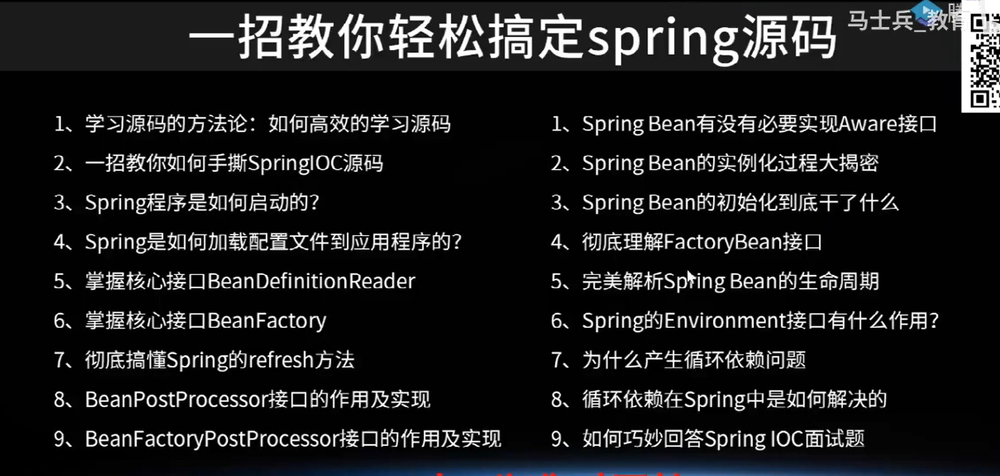
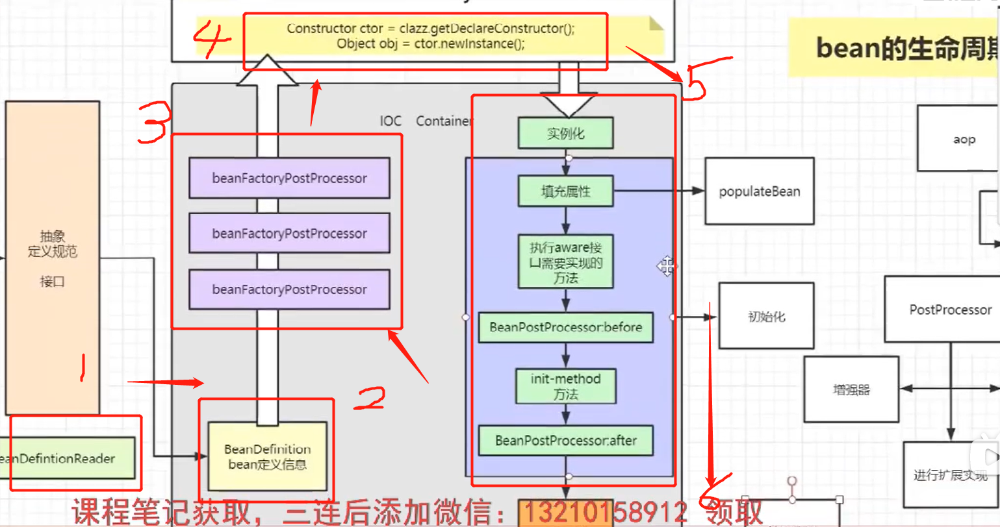
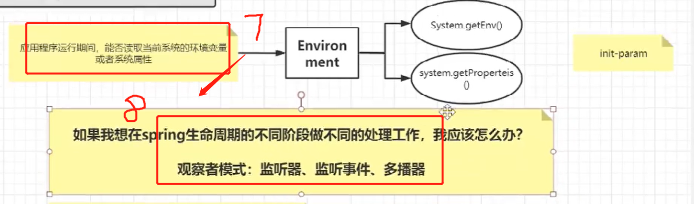
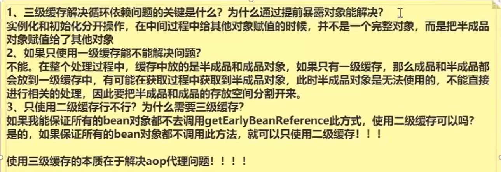
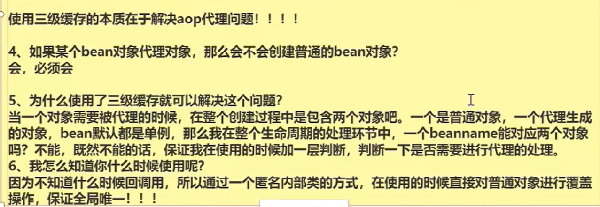
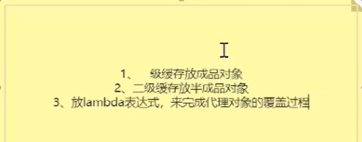
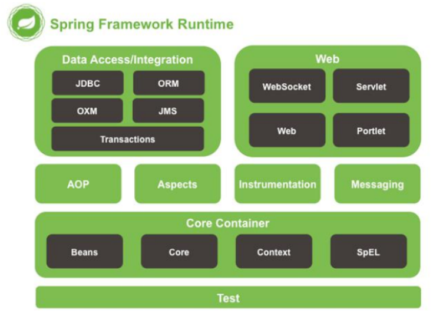
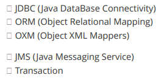
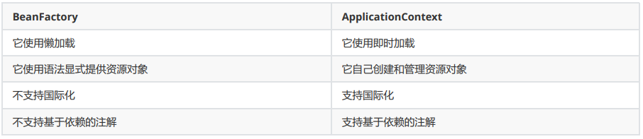

# 概念明确

## Spring AOP模块
AOP(Aspect-Oriented Programming), 即面向切面编程, 它与OOP( Object-Oriented Programming, 面向对象编程) 相辅相成, 提供了与OOP 不同的抽象软件结构的视角. 在 OOP 中, 我们以类(class)作为我们的基本单元, 而 AOP 中的基本单元是 Aspect(切面) 

Spring AOP 模块
AOP 模块用于发给我们的 Spring 应用做面向切面的开发，很多支持由 AOP 联盟提供，这样就确保了 Spring 和其他 AOP 框架的共通性。这个模块将元数据编程引入 Spring。

### 什么是 Aspect？
aspect 由 pointcount 和 advice 组成, 它既包含了横切逻辑的定义, 也包括了连接点的定义. 
Spring AOP 就是负责实施切面的框架, 它将切面所定义的横切逻辑编织到切面所指定的连接点中. 
AOP 的工作重心在于如何将增强编织目标对象的连接点上, 这里包含两个工作:
1. 如何通过 pointcut 和 advice 定位到特定的 joinpoint 上
2. 如何在advice 中编写切面代码. 

以简单地认为, 使用 @Aspect 注解的类就是切面. 

### 什么是切点（JoinPoint）
程序运行中的一些时间点, 例如一个方法的执行, 或者是一个异常的处理.在 Spring AOP 中, join point 总是方法的执行点。

### 什么是通知（Advice）？有哪些类型的通知（Advice）？
特定 JoinPoint 处的 Aspect 所采取的动作称为 Advice。Spring AOP 使用一个 Advice 作为拦截器，在 JoinPoint “周围”维护一系列的拦截器。

- Before - 这些类型的 Advice 在 joinpoint 方法之前执行，并使用@Before 注解标记进行配置
- After Returning - 这些类型的 Advice 在连接点方法正常执行后执行，并使用@AfterReturning 注解标记进行配置。
- After Throwing - 这些类型的 Advice 仅在 joinpoint 方法通过抛出异常退出并使用 @AfterThrowing 注解标记配置时执行。
- After (finally) - 这些类型的 Advice 在连接点方法之后执行，无论方法退出是正常还是异常返回，并使用 @After 注解标记进行配置。
- Around - 这些类型的 Advice 在连接点之前和之后执行，并使用@Around 注解标记进行配置。 

### AOP 有哪些实现方式？
实现 AOP 的技术，主要分为两大类： 静态代理指使用 AOP 框架提供的命令进行编译，从而在编译阶段就可生成 AOP 代理类，因此也称为编译时增强；
- 编译时编织（特殊编译器实现）
- 类加载时编织（特殊的类加载器实现）。

动态代理在运行时在内存中“临时”生成 AOP 动态代理类，因此也被称为运行时增强。
-  JDK 动态代理
-  CGLIB 

## IOC概念及Spring IOC模块

# Spring框架学习

IoC设计大略图：

## 什么是 Spring Framework？优点? 优点？
Spring 是一个开源应用框架，旨在降低应用程序开发的复杂度。它是轻量级、松散耦合的。它具有分层体系结构，允许用户选择组件，同时还为 J2EE 应用程序开发提供了一个有凝聚力的框架。它可以集成其他框架，如 Structs、Hibernate、EJB 等，所以又称为框架的框架。
由于 Spring Frameworks 的分层架构，用户可以自由选择自己需要的组件。Spring Framework 支持 POJO(Plain Old Java Object) 编程，从而具备持续集成和可测试性。由于依赖注入和控制反转，JDBC 得以简化。它是开源免费的。

- 轻量级 - Spring 在代码量和透明度方面都很轻便。
- IOC - 控制反转、AOP - 面向切面编程可以将应用业务逻辑和系统服务分离，以实现高内聚。
- 容器 - Spring 负责创建和管理对象（Bean）的生命周期和配置。
- MVC - 对 web 应用提供了高度可配置性，其他框架的集成也十分方便。
- 事务管理 - 提供了用于事务管理的通用抽象层。Spring 的事务支持也可用于容器较少的环境。
- JDBC 异常 - Spring的 JDBC 抽象层提供了一个异常层次结构，简化了错误处理策略。

## Spring Framework 中有多少个模块，它们分别是什么？

**Spring 核心容器** – 该层基本上是 Spring Framework 的核心。它包含以下模块：

**数据访问/集成** – 该层提供与数据库交互的支持。它包含以下模块：

**Web** – 该层提供了创建 Web 应用程序的支持。它包含以下模块：
Web
Web – Servlet
Web – Socket
Web – Portlet

**AOP**
该层支持面向切面编程

**Instrumentation**
该层为类检测和类加载器实现提供支持。

**Test**
该层为使用 JUnit 和 TestNG 进行测试提供支持。

**几个杂项模块:** 
Messaging – 该模块为 STOMP 提供支持。它还支持注解编程模型，该模型用于从 WebSocket 客户端路由和处理 STOMP 消息。
Aspects –该模块为与 AspectJ 的集成提供支持。 

**补充说明：**

- Spring Core：核心类库，提供IOC服务；
- Spring Context：提供框架式的Bean访问方式，以及企业级功能（JNDI、定时任务等）；
- Spring AOP：AOP服务；
- Spring DAO：对JDBC的抽象，简化了数据访问异常的处理 
- Spring ORM：对现有的ORM框架的支持；
- Spring Web：提供了基本的面向Web的综合特性，例如多方文件上传；
- Spring MVC：提供面向Web应用的Model-View-Controller实现。 

## 什么是依赖注入？可以通过多少种方式完成依赖注入？
在依赖注入中，您不必创建对象，但必须描述如何创建它们。您不是直接在代码中将组件和服务连接在一起，而是描述配置文件中哪些组件需要哪些服务。由 IoC容器将它们装配在一起。 

通常，依赖注入可以通过三种方式完成，即：
- 构造函数注入
- setter 注入
- 接口注入

在 Spring Framework 中，仅使用构造函数和 setter 注入。

## 什么是 Spring IOC 容器？spring 中有多少种 IOC 容器？
Spring 框架的核心是 Spring 容器。容器创建对象，将它们装配在一起，配置它们并管理它们的完整生命周期。
Spring 容器使用依赖注入来管理组成应用程序的组件。容器通过读取提供的配置元数据来接收对象进行实例化，配置和组装的指令。该元数据可以通过 XML，Java 注解或 Java 代码提供。

IOC 容器包括：
**BeanFactory** 
BeanFactory 就像一个包含 bean 集合的工厂类。它会在客户端要求时实例化 bean。

**ApplicationContext**
ApplicationContext 接口扩展了 BeanFactory 接口。它在 BeanFactory 基础上提供了一些额外的功能。 

二者区别：

列举 IoC 的一些好处

IoC 的一些好处是：
- 它将最小化应用程序中的代码量。
- 它将使您的应用程序易于测试，因为它不需要单元测试用例中的任何单例或 JNDI 查找机制。
- 它以最小的影响和最少的侵入机制促进松耦合。
- 它支持即时的实例化和延迟加载服务。

## Spring IoC 的实现机制
Spring 中的 IoC 的实现原理就是工厂模式加反射机制。 

spring作为目前我们开发的基础框架,每天的开发工作基本和他形影不离,作为管理bean的最经典、优秀的框架，它的复杂程度往往令人望而却步。

不过作为朝夕相处的框架，我们必须得明白一个问题就是spring是如何加载bean的，我们常在开发中使用的注解比如@Component、@AutoWired、@Socpe等注解，Spring是如何解析的，明白这些原理将有助于我们更深刻的理解spring。

需要说明一点的是spring的源码非常精密、复杂，限于篇幅的关系，本篇博客不会细致的分析源码，**会采取抽丝剥茧的方式，避轻就重，抓住重点来分析整个流程(不会分析具体的细节)，本次将会基于spring5.0的版本**

**
**

本篇博客的目录：

- spring读取配置或注解的过程
- spring的bean的生命周期
- spring的BeanPostProcessor处理器
- 一些关键性的问题
- 测试
- 总结

 

## spring读取配置或注解的过程

1、先通过扫描指定包路径下的spring注解，比如@Component、@Service、@Lazy @Sope等spring识别的注解或者是xml配置的属性(通过读取流,解析成Document，Document)然后spring会解析这些属性，将这些属性封装到BeanDefintaion这个接口的实现类中.

在springboot中，我们也可以采用注解配置的方式：

比如这个配置Bean,spring也会将className、scope、lazy等这些属性装配到PersonAction对应的BeanDefintaion中.具体采用的是BeanDefinitionParser接口中的parse(Element element, ParserContext parserContext)方法,该接口有很多不同的实现类。

通过实现类去解析注解或者xml然后放到BeanDefination中,BeanDefintaion的作用是集成了我们的配置对象中的各种属性，重要的有这个bean的ClassName，还有是否是Singleton、对象的属性和值等（如果是单例的话，后面会将这个单例对象放入到spring的单例池中）。spring后期如果需要这些属性就会直接从它中获取。

然后，再注册到一个ConcurrentHashMap中，在spring中具体的方法就是registerBeanDefinition()，这个Map存的key是对象的名字，比如Person这个对象，它的名字就是person,值是BeanDefination,它位于DefaultListableBeanFactory类下面的beanDefinitionMap类属性中，同时将所有的bean的名字放入到beanDefinitionNames这个list中,目的就是方便取beanName;

## **spring的bean的生命周期**

spring的bean生命周期其实最核心的分为4个步骤，只要理清三个关键的步骤，其他的只是在这三个细节中添加不同的细节实现,也就是spring的bean生明周期：

实例化和初始化的区别：实例化是在jvm的堆中创建了这个对象实例，此时它只是一个空的对象，所有的属性为null。而初始化的过程就是讲对象依赖的一些属性进行赋值之后，调用某些方法来开启一些默认加载。比如spring中配置的数据库属性Bean，在初始化的时候就会将这些属性填充，比如driver、jdbcurl等,然后初始化连接

### 1、实例化 Instantiation

AbstractAutowireCapableBeanFactory.doCreateBean中会调用createBeanInstance()方法,该阶段主要是从beanDefinitionMap循环读取bean,获取它的属性，然后利用反射(core包下有ReflectionUtil会先强行将构造方法setAccessible(true))读取对象的构造方法(spring会自动判断是否是有参数还是无参数，以及构造方法中的参数是否可用),然后再去创建实例（newInstance）

###  

### 2、初始化

初始化主要包括两个步骤,一个是属性填充，另一个就是具体的初始化过程

####  

#### 2.1、属性赋值

PopulateBean()会对bean的依赖属性进行填充，@AutoWired注解注入的属性就发生这个阶段，假如我们的bean有很多依赖的对象，那么spring会依次调用这些依赖的对象进行实例化，注意这里可能会有循环依赖的问题。后面我们会讲到spring是如何解决循环依赖的问题

#### 2.2、初始化 Initialization

初始化的过程包括将初始化好的bean放入到spring的缓存中、填充我们预设的属性进一步做后置处理等

####  

#### 3: 使用和销毁 Destruction

在Spring将所有的bean都初始化好之后，我们的业务系统就可以调用了。而销毁主要的操作是销毁bean，主要是伴随着spring容器的关闭，此时会将spring的bean移除容器之中。此后spring的生命周期到这一步彻底结束，不再接受spring的管理和约束。

## **spring的BeanPostProcessor处理器**

**
**

spring的另一个强大之处就是允许开发者自定义扩展bean的初始化过程，最主要的实现思路就是通过BeanPostProcessor来实现的,spring有各种前置和后置处理器，这些处理器渗透在bean创建的前前后后,穿插在spring生命周期的各个阶段，每一步都会影响着spring的bean加载过程。接下来我们就来分析具体的过程：

###  

### 1、实例化阶段**

该阶段会调用对象的空构造方法进行对象的实例化，在进行实例化之后，会调用InstantiationAwareBeanPostProcessor的postProcessBeforeInstantiation方法

BeanPostProcessor(具体实现是InstantiationAwareBeanPostProcessor). postProcessBeforeInstantiation();

这个阶段允许在Bena进行实例化之前，允许开发者自定义逻辑，如返回一个代理对象。不过需要注意的是假如在这个阶段返回了一个不为null的实例，spring就会中断后续的过程。

BeanPostProcessor.postProcessAfterInstantiation();

这个阶段是Bean实例化完毕后执行的后处理操作，所有在初始化逻辑、装配逻辑之前执行

2、初始化阶段

2.1、BeanPostProcessor.postProcessBeforeInitialization

该方法在bean初始化方法前被调用，Spring AOP的底层处理也是通过实现BeanPostProcessor来执行代理逻辑的

2.2、InitializingBean.afterPropertiesSet

自定义属性值 该方法允许我们进行对对象中的属性进行设置，假如在某些业务中，一个对象的某些属性为null,但是不能显示为null，比如显示0或者其他的固定数值，我们就可以在这个方法实现中将null值转换为特定的值

2.3、BeanPostProcessor.postProcessAfterInitialization(Object bean, String beanName)。

可以在这个方法中进行bean的实例化之后的处理，比如我们的自定义注解，对依赖对象的版本控制自动路由切换。比如有一个服务依赖了两种版本的实现，我们如何实现自动切换呢？

这时候可以自定义一个路由注解,假如叫@RouteAnnotaion，然后实现BeanPostProcessor接口，在其中通过反射拿到自定义的注解@RouteAnnotaion再进行路由规则的设定。

2.4、SmartInitializingSingleton.afterSingletonsInstantiated

###  

### 4.容器启动运行阶段

4.1、SmartLifecycle.start

容器正式渲染完毕，开始启动阶段,bean已经在spring容器的管理下,程序可以随时调用

### 4.容器停止销毁

### 5.1、SmartLifecycle.stop(Runnable callback) 

spring容器停止运行

5.2、DisposableBean.destroy()

spring会将所有的bean销毁,实现的bean实例被销毁的时候释放资源被调用

 

## **一些关键性的问题**

### 1:FactoryBean和BeanFactory的区别？

BeanFactory是个bean 工厂类接口，是负责生产和管理bean的工厂，是IOC容器最底层和基础的接口，spring用它来管理和装配普通bean的IOC容器,它有多种实现，比如AnnotationConfigApplicationContext、XmlWebApplicationContext等。

FactoryBean是FactoryBean属于spring的一个bean，在IOC容器的基础上给Bean的实现加上了一个简单工厂模式和装饰模式，是一个可以生产对象和装饰对象的工厂bean，由spring管理，生产的对象是由getObject()方法决定的。

> 注意：它是泛型的，只能固定生产某一类对象，而不像BeanFactory那样可以生产多种类型的Bean。在对于某些特殊的Bean的处理中，比如Bean本身就是一个工厂，那么在其进行单独的实例化操作逻辑中，可能我们并不想走spring的那一套逻辑，此时就可以实现FactoryBean接口自己控制逻辑。

###  

### 2、spring如何解决循环依赖问题

循环依赖问题就是A->B->A，spring在创建A的时候,发现需要依赖B,因为去创建B实例,发现B又依赖于A,又去创建A,因为形成一个闭环，无法停止下来就可能会导致cpu计算飙升

如何解决这个问题呢？spring解决这个问题主要靠巧妙的三层缓存，所谓的缓存主要是指这三个map,singletonObjects主要存放的是单例对象，属于第一级缓存；singletonFactories属于单例工厂对象，属于第三级缓存；

earlySingletonObjects属于第二级缓存，如何理解early这个标识呢？它表示只是经过了实例化尚未初始化的对象。Spring首先从singletonObjects（一级缓存）中尝试获取，如果获取不到并且对象在创建中，则尝试从earlySingletonObjects(二级缓存)中获取，如果还是获取不到并且允许从singletonFactories通过getObject获取，则通过singletonFactory.getObject()(三级缓存)获取。

如果获取到了则移除对应的singletonFactory,将singletonObject放入到earlySingletonObjects，其实就是将三级缓存提升到二级缓存,这个就是缓存升级。spring在进行对象创建的时候，会依次从一级、二级、三级缓存中寻找对象，如果找到直接返回。

由于是初次创建，只能从第三级缓存中找到(实例化阶段放入进去的)，创建完实例，然后将缓存放到第一级缓存中。下次循环依赖的再直接从一级缓存中就可以拿到实例对象了。

 

