# 消息队列基础知识


### 消息队列基本概念

消息队列有两种模型：**队列模型**和**发布/订阅模型**。


#### 队列模型

生产者往某个队列里面发送消息，一个队列可以存储多个生产者的消息，一个队列也可以有多个消费者， 但是消费者之间是竞争关系，即每条消息只能被一个消费者消费。

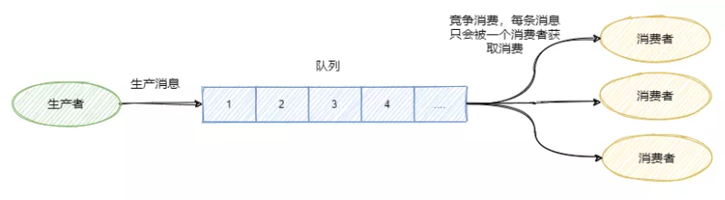


#### 发布/订阅模型

**为了解决一条消息能被多个消费者消费的问题**，发布/订阅模型就来了。该模型是将消息发往一个`Topic`即主题中，所有订阅了这个 `Topic` 的订阅者都能消费这条消息。

其实可以这么理解，发布/订阅模型等于我们都加入了一个群聊中，我发一条消息，加入了这个群聊的人都能收到这条消息。那么队列模型就是一对一聊天，我发给你的消息，只能在你的聊天窗口弹出，是不可能弹出到别人的聊天窗口中的。

讲到这有人说，那我一对一聊天对每个人都发同样的消息不就也实现了一条消息被多个人消费了嘛。

是的，通过多队列全量存储相同的消息，即数据的冗余可以实现一条消息被多个消费者消费。`RabbitMQ` 就是采用队列模型，通过 `Exchange` 模块来将消息发送至多个队列，解决一条消息需要被多个消费者消费问题。

这里还能看到假设群聊里除我之外只有一个人，那么此时的发布/订阅模型和队列模型其实就一样了。

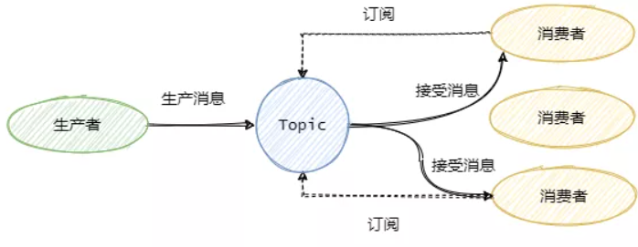


#### 小结一下

队列模型每条消息只能被一个消费者消费，而发布/订阅模型就是为让一条消息可以被多个消费者消费而生的，当然队列模型也可以通过消息全量存储至多个队列来解决一条消息被多个消费者消费问题，但是会有数据的冗余。

**发布/订阅模型兼容队列模型**，即只有一个消费者的情况下和队列模型基本一致。

`RabbitMQ` 采用队列模型，`RocketMQ`和`Kafka` 采用发布/订阅模型。


**接下来的内容都基于发布/订阅模型**。

### 常用术语

一般我们称发送消息方为生产者 `Producer`，接受消费消息方为消费者`Consumer`，消息队列服务端为`Broker`。

消息从`Producer`发往`Broker`，`Broker`将消息存储至本地，然后`Consumer`从`Broker`拉取消息，或者`Broker`推送消息至`Consumer`，最后消费。

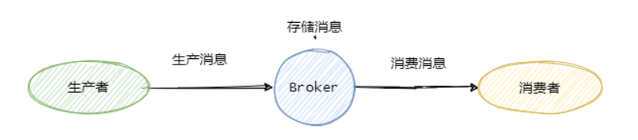

为了提高并发度，往往**发布/订阅模型**还会引入**队列**或者**分区**的概念。即消息是发往一个主题下的某个队列或者某个分区中。`RocketMQ`中叫队列，`Kafka`叫分区，本质一样。

例如某个主题下有 5 个队列，那么这个主题的并发度就提高为 5 ，同时可以有 5 个消费者**并行消费**该主题的消息。一般可以采用轮询或者 `key hash` 取余等策略来将同一个主题的消息分配到不同的队列中。

与之对应的消费者一般都有组的概念 `Consumer Group`, 即消费者都是属于某个消费组的。一条消息会发往多个订阅了这个主题的消费组。

假设现在有两个消费组分别是`Group 1` 和 `Group 2`，它们都订阅了`Topic-a`。此时有一条消息发往`Topic-a`，那么这两个消费组都能接收到这条消息。

然后这条消息实际是写入`Topic`某个队列中，消费组中的某个消费者对应消费一个队列的消息。

在物理上除了副本拷贝之外，一条消息在`Broker`中只会有一份，每个消费组会有自己的`offset`即消费点位来标识消费到的位置。在消费点位之前的消息表明已经消费过了。当然这个`offset`是队列级别的。每个消费组都会维护订阅的`Topic`下的每个队列的`offset`。

来个图看看应该就很清晰了。

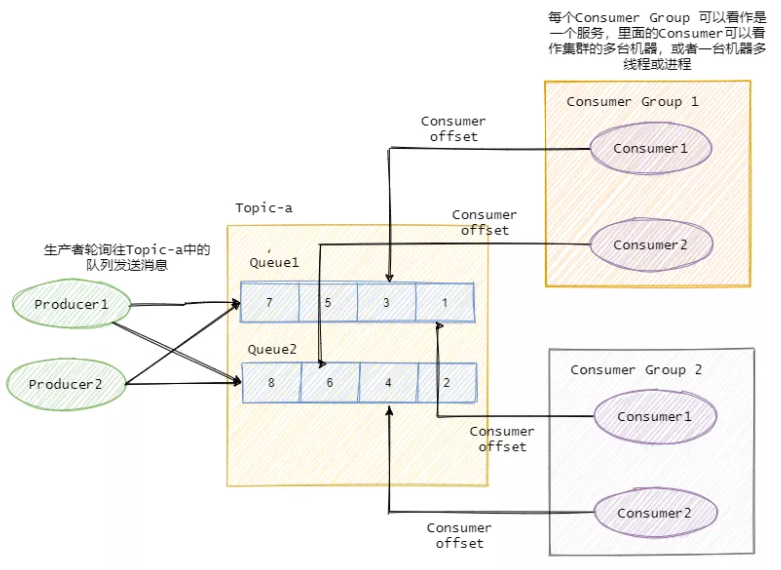

基本上熟悉了消息队列常见的术语和一些概念之后，咱们再来看看消息队列常见的核心面试点。


### 项目中为啥用消息队列？

面试官你好：我们公司本身的业务体量很小，所以直接**单机一把梭**啥都能搞定了，但是后面业务体量不断扩大，采用**微服务的设计思想**，**分布式的部署方式**，所以拆分了很多的服务，随着体量的增加以及业务场景越来越复杂了，很多场景单机的技术栈和中间件已经不够用了，而且对系统的友好性也下降了，最后做了很多技术选型的工作，我们决定引入**消息队列中间件**。

### 消息队列使用的业务场景

从三个方面说一下使用的场景：

**Tip**：这三个场景也是消息队列的经典场景，大家基本上要烂熟于心那种，就是一说到消息队列你脑子就要想到**异步、削峰、解耦**。

#### 异步：

我们之前的场景里面有很多步骤都是在一个流程里面需要做完的，就比如说我的下单系统吧，本来我们业务简单，下单了付了钱就好了，流程就走完了。

但是后面来了个产品经理，搞了个**优惠券系统**，OK问题不大，流程里面多100ms去扣减优惠券。

后来产品经理灵光一闪说我们可以搞个**积分系统**啊，也行吧，流程里面多了200ms去增减积分。

再后来后来隔壁的产品老王说：下单成功后我们要给用户发短信，也将就吧，100ms去发个短信。

再后来。。。


可以看到这才加了三个，我可以**斩钉截铁**的告诉你真正的下单流程涉及的系统绝对在10个以上（主流电商），越大的越多。

这个链路这样下去，**时间长得一批**，用户发现我买个东西你特么要花几十秒，此时只能优化系统了。

Tip：我之前在的电商老东家要求所有接口的**Rt**（**ResponseTime响应时间**）在200ms内，超出的全部优化，我现在所负责的系统QPS也是**9W+**就是抖动一下网络集群都可能炸锅那种，**RT**基本上都要求在50ms以内。


##### 链路长了就慢了，那你怎么解决的？

那链路长了就慢了，但是我们发现上面的流程其实可以**同时做**的呀，你支付成功后，我去校验优惠券的同时我可以去增减积分啊，还可以同时发个短信啊。

那正常的流程我们是没办法实现的呀，怎么办，**异步**。

你对比一下是不是发现，这样子最多只用100毫秒用户知道下单成功了，至于短信你迟几秒发给他他根本不在意是吧。


#### 解耦：

##### 消息中间件的异步，与用线程，线程池去做不是一样的么？

因为用线程去做，你是不是要写代码？你一个订单流程，你扣积分，扣优惠券，发短信，扣库存。。。等等这么多业务要调用这么多的接口，每次加一个你要调用一个接口然后还要重新发布系统，写一次两次还好，写多了你就说：老子不干了！

而且真的全部都写在一起的话，不单单是耦合这一个问题，你出问题排查也麻烦，流程里面随便一个地方出问题搞不好会影响到其他的点，小伙伴说我每个流程都**try catch**不就行了，相信我别这么做，这样的代码就像个定时炸弹，你不知道什么时候爆炸，平时不炸偏偏在你做活动的时候炸，你就领个P0故障收拾书包提前回家过年吧。

但是你用了**消息队列**，耦合这个问题就迎刃而解了呀：

你下单了，你就把你**支付成功的消息告诉别的系统**，他们收到了去处理就好了，你只用走完自己的流程，把自己的消息发出去，那后面要接入什么系统简单，直接订阅你发送的支付成功消息，你支付成功了我**监听就好了**。

##### 那你的流程走完了，你不用管别人是否成功么？比如你下单了积分没加，优惠券没扣怎么办？

这其实是使用消息队列的一个缺点，涉及到**分布式事务**的知识点，下面会提到。

#### 削峰：

就拿秒杀来说，你平时流量很低，但是你要做秒杀活动00 ：00的时候流量疯狂怼进来，你的服务器，**Redis**，**MySQL**各自的承受能力都不一样，你直接**全部流量照单全收**肯定有问题啊，直接就打挂了。

##### 那怎么办？

简单，把请求放到队列里面，然后至于每秒消费多少请求，就看自己的**服务器处理能力**，你能处理5000QPS你就消费这么多，可能会比正常的慢一点，但是**不至于打挂服务器**，等流量高峰下去了，你的服务也就没压力了。


### 消息队列使用的缺点

主要的缺点有三点：

#### 系统复杂性

本来蛮简单的一个系统，我代码随便写都没事，现在你凭空接入一个中间件在那，我是不是要考虑去维护他，而且使用的过程中是不是要考虑各种问题，比如消息**重复消费**、**消息丢失**、**消息的顺序消费**等等，反正用了之后就是贼烦。


#### 数据一致性

这个问题不仅是消息队列的问题，也是分布式服务本身就存在的一个问题，在消息队列使用中这个问题会暴露得比较严重一点。

**所有的服务都成功才能算这一次下单是成功的**，那怎么才能保证数据一致性呢？

**分布式事务**：把下单，优惠券，积分。。。都放在一个事务里面一样，要成功一起成功，要失败一起失败。


#### 可用性

你搞个系统本身没啥问题，你现在突然接入一个中间件在那放着，万一挂了怎么办？我下个单**MQ挂了**，优惠券不扣了，积分不减了，这不是杀一个程序员能搞定的吧，感觉得杀一片。


# 消息处理主要关注问题


**面试题：**如何保证消息不丢失？处理重复消息？消息有序性？消息堆积处理？


## 如何保证消息不丢失？

就我们市面上常见的消息队列而言，只要**配置得当**，我们的消息就不会丢。先来看看这个图，


可以看到一共有三个阶段，分别是**生产消息、存储消息和消费消息**。我们从这三个阶段分别入手来看看如何确保消息不会丢失。

### 生产消息

生产者发送消息至`Broker`，需要处理`Broker`的响应，不论是同步还是异步发送消息，同步和异步回调都需要做好`try-catch`，妥善的处理响应，如果`Broker`返回写入失败等错误消息，需要重试发送。当多次发送失败需要作报警，日志记录等。

这样就能保证在生产消息阶段消息不会丢失。

### 存储消息

存储消息阶段需要在**消息刷盘之后**再给生产者响应，假设消息写入缓存中就返回响应，那么机器突然断电这消息就没了，而生产者以为已经发送成功了。

如果`Broker`是集群部署，有多副本机制，即消息不仅仅要写入当前`Broker`,还需要写入副本机中。那配置成至少写入两台机子后再给生产者响应。这样基本上就能保证存储的可靠了。一台挂了还有一台还在呢（假如怕两台都挂了..那就再多些）。

那假如来个地震机房机子都挂了呢？大公司基本上都有异地多活。

那要是这几个地都地震了呢？这时候还是先关心关心人吧。

### 消费消息

这里经常会有同学犯错，有些同学当消费者拿到消息之后直接存入内存队列中就直接返回给`Broker`消费成功，这是不对的。

你需要考虑拿到消息放在内存之后消费者就宕机了怎么办。所以我们应该在**消费者真正执行完业务逻辑之后，再发送给`Broker`消费成功**，这才是真正的消费了。

所以只要我们在消息业务逻辑处理完成之后再给`Broker`响应，那么消费阶段消息就不会丢失。

### 小结一下

可以看出，保证消息的可靠性需要**三方配合**。

`生产者`需要处理好`Broker`的响应，出错情况下利用重试、报警等手段。

`Broker`需要控制响应的时机，单机情况下是消息刷盘后返回响应，集群多副本情况下，即发送至两个副本及以上的情况下再返回响应。

`消费者`需要在执行完真正的业务逻辑之后再返回响应给`Broker`。

但是要注意**消息可靠性增强了，性能就下降了**，等待消息刷盘、多副本同步后返回都会影响性能。因此还是看业务，例如日志的传输可能丢那么一两条关系不大，因此没必要等消息刷盘再响应。


## 如何处理消息重复？

消息**重复消费**是使用消息队列之后，必须考虑的一个问题，也是比较严重和常见的问题，但凡用到消息队列，第一时间考虑的就是**重复消费**的问题。

对于正常业务而言**消息重复是不可避免的**，因此我们只能从**另一个角度**来解决重复消息的问题。

解决问题关键点就是**幂等**。既然我们不能防止重复消息的产生，那么我们只能在业务上处理重复消息所带来的影响。


### 重复消费场景

假设我们发送消息，就管发，不管`Broker`的响应，那么我们发往`Broker`是不会重复的。

但是一般情况我们是不允许这样的，这样消息就完全不可靠了，我们的基本需求是消息至少得发到`Broker`上，那就得等`Broker`的响应，那么就可能存在`Broker`已经写入了，当时响应由于网络原因生产者没有收到，然后生产者又重发了一次，此时消息就重复了。

再看消费者消费的时候，假设我们消费者拿到消息消费了，业务逻辑已经走完了，事务提交了，此时需要更新`Consumer offset`了，然后这个消费者挂了，另一个消费者顶上，此时`Consumer offset`还没更新，于是又拿到刚才那条消息，业务又被执行了一遍。于是消息又重复了。


### 幂等处理

在开发过程中我们一般对接口做幂等处理。

```java
幂等（idempotent、idempotence）是一个数学与计算机学概念，常见于抽象代数中。

在编程中一个幂等操作的特点是其任意多次执行所产生的影响均与一次执行的影响相同。

幂等函数，或幂等方法，是指可以使用相同参数重复执行，并能获得相同结果的函数。这些函数不会影响系统状态，也不用担心重复执行会对系统造成改变。

例如，“setTrue()”函数就是一个幂等函数,**无论多次执行，其结果都是一样的.更复杂的操作幂等保证是利用唯一交易号(流水号)实现.
```


通俗了讲就是你**同样的参数调用我这个接口，调用多少次结果都是一个**。

### 如何保证幂等

一般**幂等**，我会**分场景去考虑**，看是**强校验**还是**弱校验**，比如跟金钱相关的场景那就很关键呀，就做强校验，别不是很重要的场景做弱校验。

#### 强校验：

比如你监听到用户支付成功的消息，你监听到了去加GMV是不是要调用加钱的接口，那加钱接口下面再调用一个加流水的接口，**两个放在一个事务，成功一起成功失败一起失败**。

每次消息过来都要拿着**订单号+业务场景这样的唯一标识**去流水表查，看看有没有这条流水，有就直接return不要走下面的流程了，没有就执行后面的逻辑。

之所以用**流水表**，是因为涉及到金钱这样的活动，有啥问题后面也可以去流水表**对账**，还有就是帮助开发人员定位问题。


#### 弱校验：

对一些不重要的场景，比如给谁发短信啥的，我就把这个id+场景唯一标识作为**Redis**的key，放到缓存里面失效时间看你场景，**一定时间内**的这个消息就去Redis判断。用KV就算消息丢了可能这样的场景也没关系，反正丢条**无关痛痒**的通知短信。


还有很多公司的弱校验用**token**啊什么的，反正花样很多，但是**重要的场景一定要强校验**，真正查问题的时候没有在磁盘持久化的数据，心里还是空空的。

## 如何保证消息有序性？

**首先说明，该种场景不多。**


### 有序性分类

#### 全局有序

如果要保证消息的全局有序，首先只能由一个生产者往`Topic`发送消息，并且一个`Topic`内部只能有一个队列（分区）。消费者也必须是单线程消费这个队列。这样的消息就是全局有序的！

不过一般情况下我们都不需要全局有序，即使是同步`MySQL Binlog`也只需要保证单表消息有序即可。

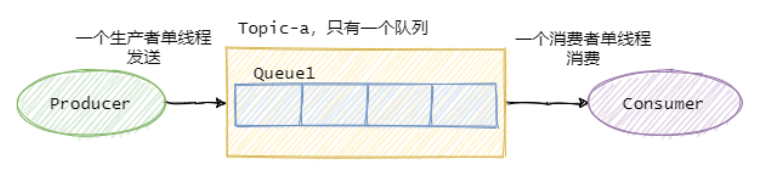

#### 部分有序

因此绝大部分的有序需求是部分有序，部分有序我们就可以将`Topic`内部划分成我们需要的队列数，把消息通过特定的策略发往固定的队列中，然后每个队列对应一个单线程处理的消费者。这样即完成了部分有序的需求，又可以通过队列数量的并发来提高消息处理效率。

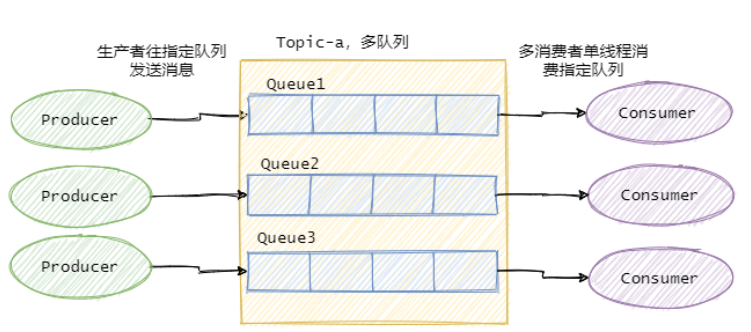

图中有多个生产者，一个生产者也可以，只要同类消息发往指定的队列即可。


一般都是**同个业务场景下不同几个操作的消息同时过去**，本身顺序是对的，但是你发出去的时候同时发出去了，消费的时候却乱掉了，这样就有问题了。

我之前做电商活动也是有这样的例子，我们都知道数据量大的时候数据同步压力还是很大的，有时候数据量大的表需要同步几个亿的数据。（并不是主从同步，主从延迟大会有问题，可能是从数据库或者主数据库同步到**备库**）

这种情况我们都是怼到队列里面去，然后慢慢消费的，那问题就来了呀，我们在数据库同时对一个Id的数据进行了增、改、删三个操作，但是你消息发过去消费的时候变成了改，删、增，这样数据就不对了。

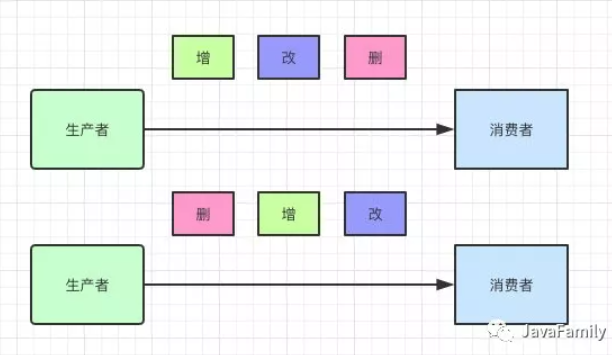

两者的结果是不是完全不一样了 **↑**

### 如何解决？

我简单的说一下我们使用的**RocketMQ**里面的一个简单实现（部分有序）吧。

生产者消费者一般需要保证顺序消息的话，可能就是一个业务场景下的，比如订单的创建、支付、发货、收货。通过唯一编号来保证有序：

**一个topic下有多个队列**，为了保证发送有序，**RocketMQ**提供了**MessageQueueSelector**队列选择机制，他有三种实现:

- Hash取模法，让同一个订单发送到同一个队列中，再使用同步发送，只有同个订单的创建消息发送成功，再发送支付消息。这样，我们保证了发送有序。
- RocketMQ的topic内的队列机制,可以保证存储满足**FIFO**（First Input First Output 简单说就是指先进先出）,剩下的只需要消费者顺序消费即可。
- RocketMQ仅保证顺序发送，顺序消费由消费者业务保证


综上，真正的顺序消费不同的中间件都有自己的不同实现，需要结合业务场景具体实现。


## 如何处理消息堆积

消息的堆积往往是因为**生产者的生产速度与消费者的消费速度不匹配**。有可能是因为消息消费失败反复重试造成的，也有可能就是消费者消费能力弱，渐渐地消息就积压了。

因此我们需要**先定位消费慢的原因**，如果是`bug`则处理 `bug` ，如果是因为本身消费能力较弱，我们可以优化下消费逻辑，比如之前是一条一条消息消费处理的，这次我们批量处理，比如数据库的插入，一条一条插和批量插效率是不一样的。

假如逻辑我们已经都优化了，但还是慢，那就得考虑水平扩容了，增加`Topic`的队列数和消费者数量，**注意队列数一定要增加**，不然新增加的消费者是没东西消费的。**一个Topic中，一个队列只会分配给一个消费者**。

当然你消费者内部是单线程还是多线程消费那看具体场景。不过要注意上面提高的消息丢失的问题，如果你是将接受到的消息写入**内存队列**之后，然后就返回响应给`Broker`，然后多线程向内存队列消费消息，假设此时消费者宕机了，内存队列里面还未消费的消息也就丢了。


# Kafka架构与原理


## Kafka原理

### 概念入门

众所周知，Kafka是一个消息队列，把消息放到队列里边的叫**生产者**，从队列里边消费的叫**消费者**。

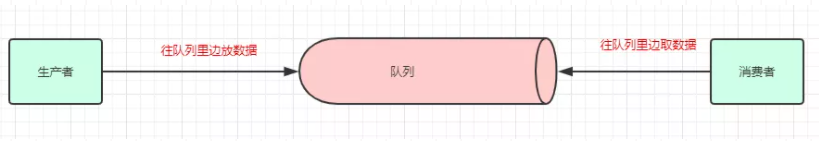

一个消息中间件，队列不单单只有一个，我们往往会有多个队列，而我们生产者和消费者就得知道：把数据丢给哪个队列，从哪个队列消息。我们需要给队列取名字，叫做**topic**(相当于数据库里边**表**的概念)

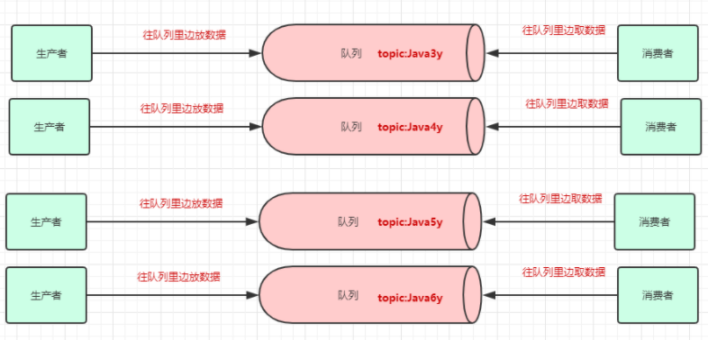

现在我们给队列取了名字以后，生产者就知道往哪个队列丢数据了，消费者也知道往哪个队列拿数据了。我们可以有多个生产者**往同一个队列(topic)**丢数据，多个消费者**往同一个队列(topic)**拿数据

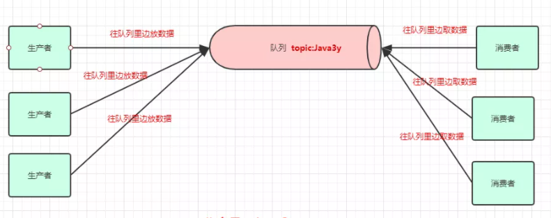

为了提高一个队列(topic)的**吞吐量**，Kafka会把topic进行分区(**Partition**)

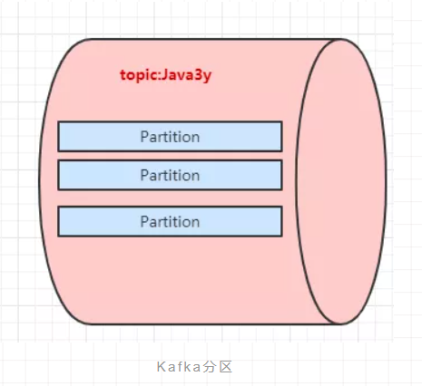

所以，生产者实际上是往一个topic名为Java3y中的分区(**Partition**)丢数据，消费者实际上是往一个topic名为Java3y的分区(**Partition**)取数据

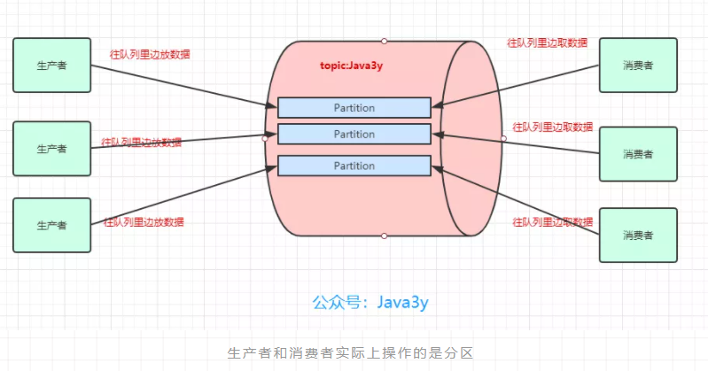


一台Kafka服务器叫做**Broker**，Kafka集群就是多台Kafka服务器：

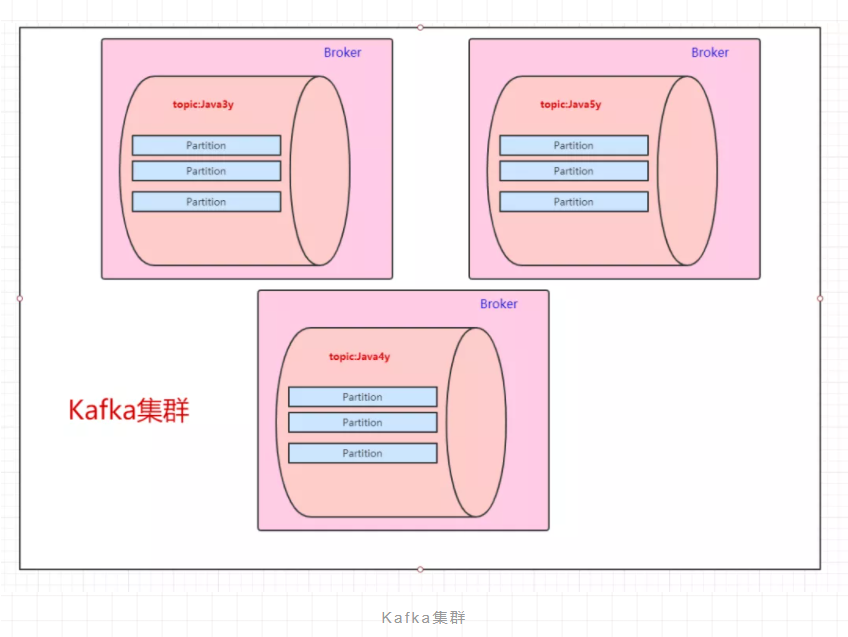

一个topic会分为多个partition，实际上partition会**分布**在不同的broker中，举个例子：

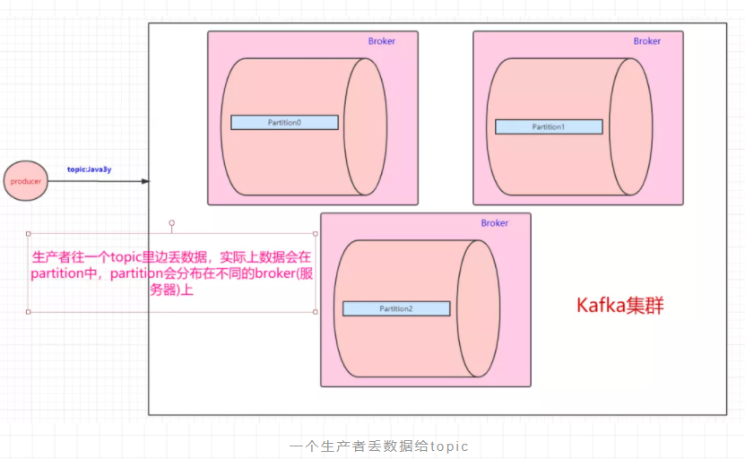

由此得知：**Kafka是天然分布式的**。


现在我们已经知道了往topic里边丢数据，实际上这些数据会分到不同的partition上，这些partition存在不同的broker上。分布式肯定会带来问题：“万一其中一台broker(Kafka服务器)出现网络抖动或者挂了，怎么办？”

Kafka是这样做的：我们数据存在不同的partition上，那kafka就把这些partition做**备份**。比如，现在我们有三个partition，分别存在三台broker上。每个partition都会备份，这些备份散落在**不同**的broker上。

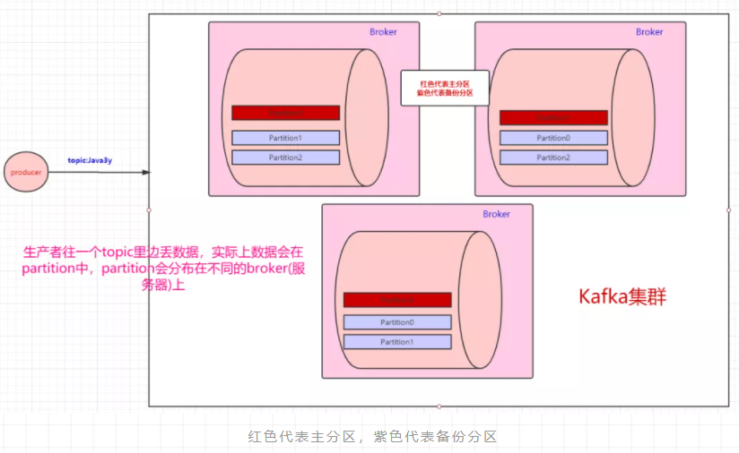

红色块的partition代表的是**主**分区，紫色的partition块代表的是**备份**分区。生产者往topic丢数据，是与**主**分区交互，消费者消费topic的数据，也是与主分区交互。

**备份分区仅仅用作于备份，不做读写。**如果某个Broker挂了，那就会选举出其他Broker的partition来作为主分区，这就实现了**高可用**。

另外值得一提的是：当生产者把数据丢进topic时，我们知道是写在partition上的，那partition是怎么将其持久化的呢？（不持久化如果Broker中途挂了，那肯定会丢数据嘛)。

Kafka是将partition的数据写在**磁盘**的(消息日志)，不过Kafka只允许**追加写入**(顺序访问)，避免缓慢的随机 I/O 操作。

- Kafka也不是partition一有数据就立马将数据写到磁盘上，它会先**缓存**一部分，等到足够多数据量或等待一定的时间再批量写入(flush)。


上面balabala地都是讲生产者把数据丢进topic是怎么样的，下面来讲讲消费者是怎么消费的。既然数据是保存在partition中的，那么**消费者实际上也是从partition中取**数据。

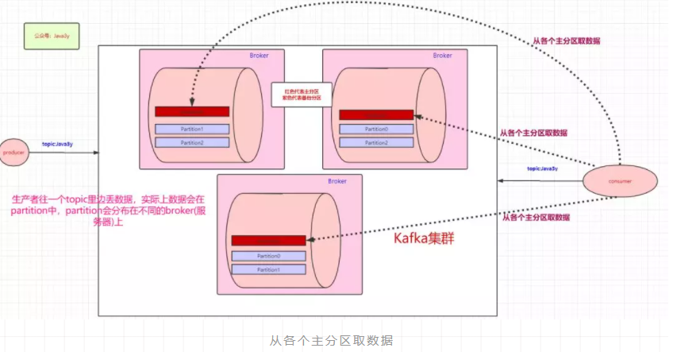

生产者可以有多个，消费者也可以有多个。像上面图的情况，是一个消费者消费三个分区的数据。多个消费者可以组成一个**消费者组**。

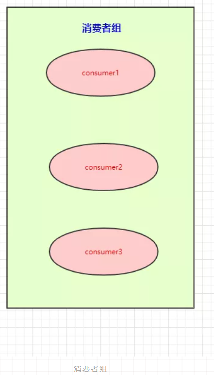

本来是一个消费者消费三个分区的，现在我们有消费者组，就可以**每个消费者去消费一个分区**（也是为了提高吞吐量）

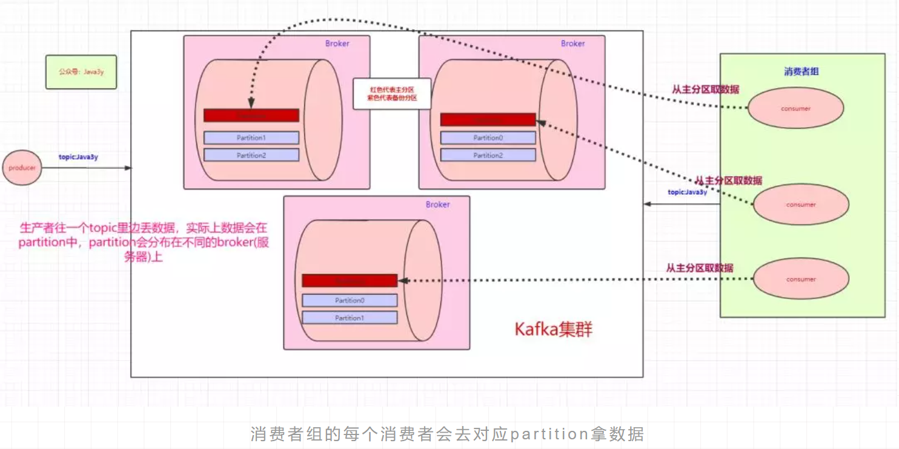

按图上所示的情况，这里想要说明的是：

- 如果消费者组中的某个消费者挂了，那么其中一个消费者可能就要消费两个partition了
- 如果只有三个partition，而消费者组有4个消费者，那么一个消费者会空闲
- 如果多加入一个**消费者组**，无论是新增的消费者组还是原本的消费者组，都能消费topic的全部数据。（消费者组之间从逻辑上它们是**独立**的）

前面讲解到了生产者往topic里丢数据是存在partition上的，而partition持久化到磁盘是IO顺序访问的，并且是先写缓存，隔一段时间或者数据量足够大的时候才批量写入磁盘的。

消费者在读的时候也很有讲究：正常的读磁盘数据是需要将内核态数据拷贝到用户态的，而Kafka 通过调用`sendfile()`直接从内核空间（DMA的）到内核空间（Socket的），**少做了一步拷贝**的操作。

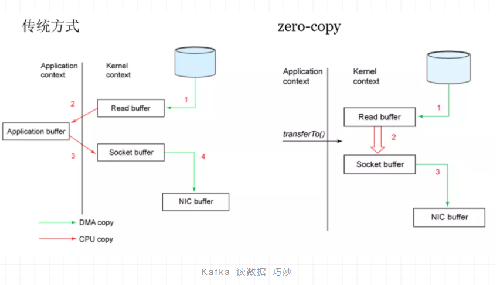

有的同学可能会产生疑问：消费者是怎么知道自己消费到哪里的呀？Kafka不是支持**回溯**吗？那是怎么做的呀？

- 比如上面也提到：如果一个消费者组中的某个消费者挂了，那挂掉的消费者所消费的分区可能就由存活的消费者消费。那**存活的消费者是需要知道挂掉的消费者消费到哪了**，不然怎么玩。

这里要引出`offset`了，Kafka就是用`offset`来表示消费者的消费进度到哪了，每个消费者会都有自己的`offset`。说白了`offset`就是表示消费者的**消费进度**。

在以前版本的Kafka，这个`offset`是由Zookeeper来管理的，后来Kafka开发者认为Zookeeper不合适大量的删改操作，于是把`offset`在broker以内部topic(`__consumer_offsets`)的方式来保存起来。

每次消费者消费的时候，都会提交这个`offset`，Kafka可以让你选择是自动提交还是手动提交。

既然提到了Zookeeper，那就多说一句。Zookeeper虽然在新版的Kafka中没有用作于保存客户端的`offset`，但是Zookeeper是Kafka一个重要的依赖。

- 探测broker和consumer的添加或移除。
- 负责维护所有partition的领导者/从属者关系（主分区和备份分区），如果主分区挂了，需要选举出备份分区作为主分区。
- 维护topic、partition等元配置信息

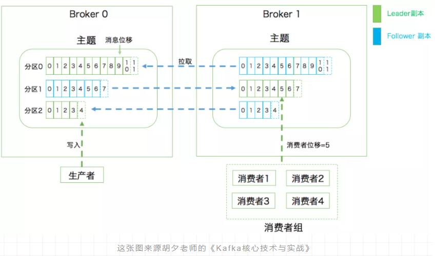


### 消息队列中的应用

通过这篇文章，文章开头那几个问题估计多多少少都懂一些啦。我来简要回答一下：

> 使用消息队列不可能是单机的（必然是分布式or集群）

Kafka天然是分布式的，往一个topic丢数据，实际上就是往多个broker的partition存储数据

> 数据写到消息队列，可能会存在数据丢失问题，数据在消息队列需要**持久化**(磁盘？数据库？Redis？分布式文件系统？)

Kafka会将partition以消息日志的方式(落磁盘)存储起来，通过 顺序访问IO和缓存(等到一定的量或时间)才真正把数据写到磁盘上，来提高速度。

> 想要保证消息（数据）是有序的，怎么做？

Kafka会将数据写到partition，单个partition的写入是有顺序的。如果要保证全局有序，那只能写入一个partition中。如果要消费也有序，消费者也只能有一个。

> 为什么在消息队列中重复消费了数据

凡是分布式就无法避免网络抖动/机器宕机等问题的发生，很有可能消费者A读取了数据，还没来得及消费，就挂掉了。Zookeeper发现消费者A挂了，让消费者B去消费原本消费者A的分区，等消费者A重连的时候，发现已经重复消费同一条数据了。(各种各样的情况，消费者超时等等都有可能…)

如果业务上不允许重复消费的问题，最好消费者那端做业务上的校验（如果已经消费过了，就不消费了）


## Kafka日志段读写原理

### Kafka的存储结构

众所周知，Kafka的Topic可以有多个分区，分区其实就是最小的读取和存储结构，即Consumer看似订阅的是Topic，实则是从Topic下的某个分区获得消息，Producer也是发送消息也是如此。

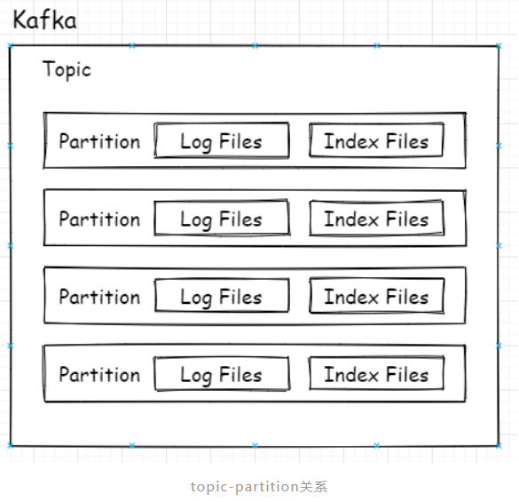

上图是总体逻辑上的关系，映射到实际代码中在磁盘上的关系则是如下图所示：

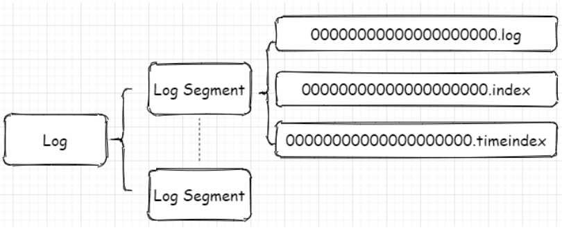

每个分区对应一个Log对象，在磁盘中就是一个子目录，子目录下面会有多组日志段即多Log Segment，每组日志段包含：消息日志文件(以log结尾)、位移索引文件(以index结尾)、时间戳索引文件(以timeindex结尾)。其实还有其它后缀的文件，例如.txnindex、.deleted等等。篇幅有限，暂不提起。

以下为日志的定义

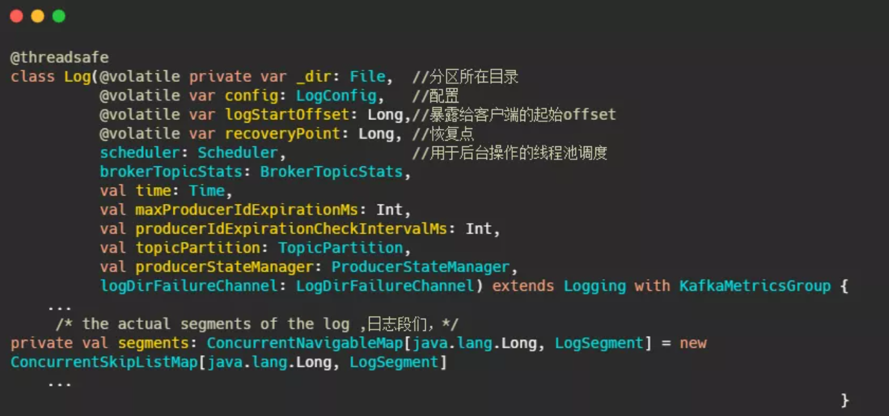

以下为日志段的定义

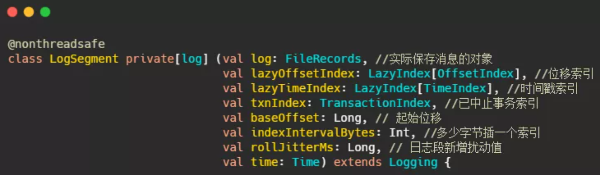

`indexIntervalBytes`可以理解为插了多少消息之后再建一个索引，由此可以看出**Kafka的索引其实是稀疏索引**，这样可以避免索引文件占用过多的内存，从而可以**在内存中保存更多的索引**。对应的就是Broker 端参数`log.index.interval.bytes` 值，默认4KB。

实际的**通过索引**查找消息过程是先通过offset找到索引所在的文件，然后**通过二分法**找到离目标最近的索引，再顺序遍历消息文件找到目标文件。这波操作时间复杂度为`O(log2n)+O(m)`,n是索引文件里索引的个数，m为稀疏程度。

**这就是空间和时间的互换，又经过数据结构与算法的平衡，妙啊！**

再说下`rollJitterMs`,这其实是个扰动值，对应的参数是`log.roll.jitter.ms`,这其实就要说到日志段的切分了，`log.segment.bytes`,这个参数控制着日志段文件的大小，默认是1G，即当文件存储超过1G之后就新起一个文件写入。这是以大小为维度的，还有一个参数是`log.segment.ms`,以时间为维度切分。

那配置了这个参数之后如果有很多很多分区，然后因为这个参数是全局的，因此同一时刻需要做很多文件的切分，这磁盘IO就顶不住了啊，因此需要设置个`rollJitterMs`，来岔开它们。

**怎么样有没有联想到redis缓存的过期时间？过期时间加个随机数，防止同一时刻大量缓存过期导致缓存击穿数据库。看看知识都是通的啊！**


### 日志段的写入


1、判断下当前日志段是否为空，空的话记录下时间，来作为之后日志段的切分依据

2、确保位移值合法，最终调用的是`AbstractIndex.toRelative(..)`方法，即使判断offset是否小于0，是否大于int最大值。

3、append消息，实际上就是通过`FileChannel`将消息写入，当然只是写入内存中及页缓存，是否刷盘看配置。

4、更新日志段最大时间戳和最大时间戳对应的位移值。这个时间戳其实用来作为定期删除日志的依据

5、更新索引项，如果需要的话`(bytesSinceLastIndexEntry > indexIntervalBytes)`

最后再来个流程图：

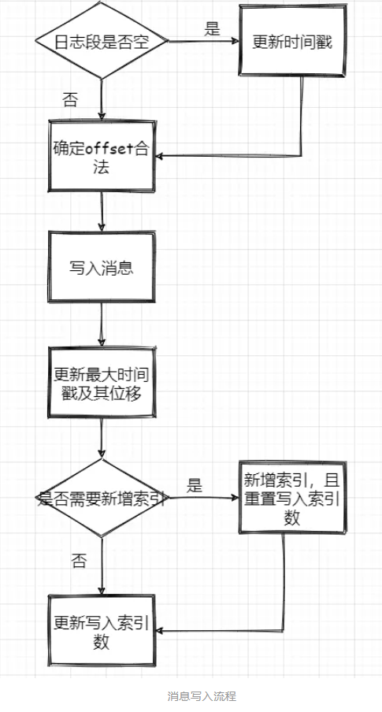


### 日志段的读取

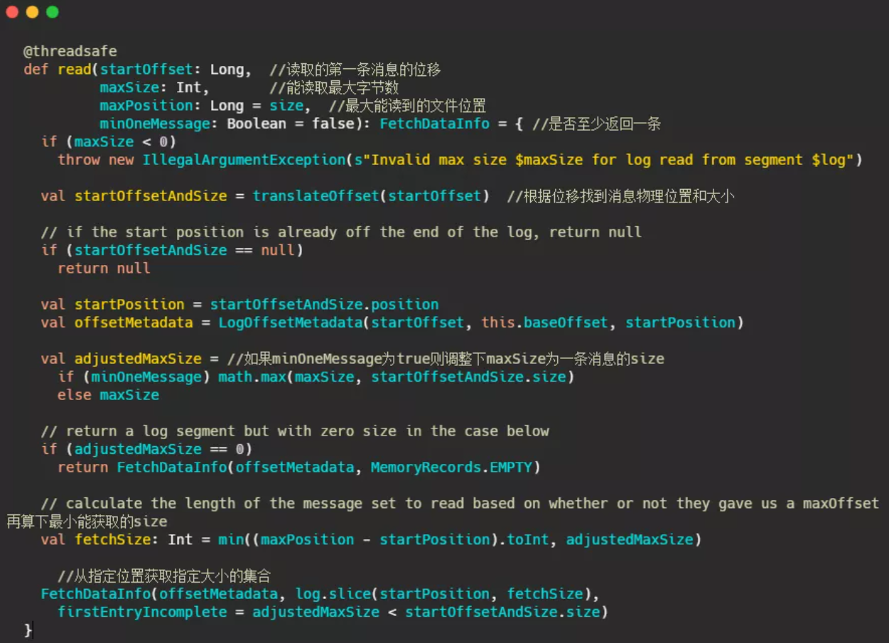

1、根据第一条消息的offset，通过`OffsetIndex`找到对应的消息所在的物理位置和大小。

2、获取`LogOffsetMetadata`,元数据包含消息的offset、消息所在segment的起始offset和物理位置

3、判断`minOneMessage`是否为`true`,若是则调整为必定返回一条消息大小，其实就是在单条消息大于`maxSize`的情况下得以返回，防止消费者饿死

4、再计算最大的`fetchSize`,即（最大物理位移-此消息起始物理位移）和`adjustedMaxSize`的最小值(这波我不是很懂，因为以上一波操作`adjustedMaxSize`已经最小为一条消息的大小了)

5、调用 `FileRecords` 的 `slice` 方法从指定位置读取指定大小的消息集合，并且构造`FetchDataInfo`返回

再来个流程图：

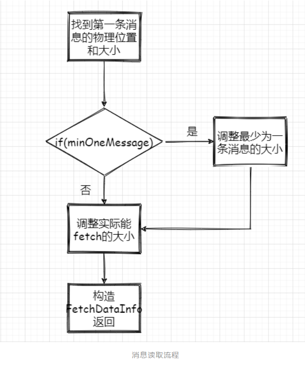


## 应用必知


### Kafka 为什么快？

Kafka 的消息是保存或缓存在磁盘上的，一般认为在磁盘上读写数据是会降低性能的，因为寻址会比较消耗时间，但

是实际上，Kafka 的特性之一就是高吞吐率。Kafka 之所以能这么快，无非是：**「顺序写磁盘、大量使用内存页 、零拷贝技术的使用」**...

下面我就从数据写入和读取两方面分析，为大家分析下为什么 Kafka 速度这么快。

> 数据写入 Kafka 会把收到的消息都写入到硬盘中，它绝对不会丢失数据。为了优化写入速度 Kafka 采用了两个技术， 顺序写入和 Memory Mapped File 。


#### 顺序写入

Kafka 会把收到的消息都写入到硬盘中，它绝对不会丢失数据。为了优化写入速度 Kafka 采用了两个技术， 顺序写入和 MMFile（Memory Mapped File）。

磁盘读写的快慢取决于你怎么使用它，也就是顺序读写或者随机读写。在顺序读写的情况下，磁盘的顺序读写速度和内存持平。因为硬盘是机械结构，每次读写都会寻址->写入，其中寻址是一个“机械动作”，它是最耗时的。**「所以硬盘最讨厌随机 I/O，最喜欢顺序 I/O」**。为了提高读写硬盘的速度，Kafka 就是使用顺序 I/O。

而且 Linux 对于磁盘的读写优化也比较多，包括 read-ahead 和 write-behind，磁盘缓存等。

如果在内存做这些操作的时候，一个是 Java 对象的内存开销很大，另一个是随着堆内存数据的增多，Java 的 GC 时间会变得很长。

使用磁盘操作有以下几个好处：

- 磁盘顺序读写速度超过内存随机读写。
- JVM 的 GC 效率低，内存占用大。使用磁盘可以避免这一问题。
- 系统冷启动后，磁盘缓存依然可用。

下图就展示了 Kafka 是如何写入数据的， 每一个 Partition 其实都是一个文件 ，收到消息后 Kafka 会把数据插入到文件末尾（虚框部分）：

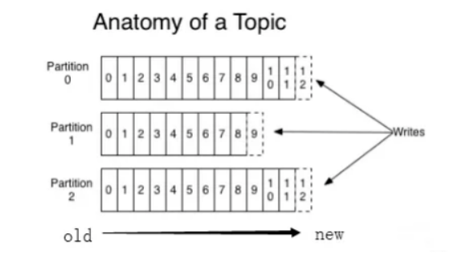


这种方法有一个缺陷——没有办法删除数据 ，所以 Kafka 是不会删除数据的，它会把所有的数据都保留下来，每个 消费者（Consumer）对每个 Topic 都有一个 `Offset` 用来表示读取到了第几条数据 。

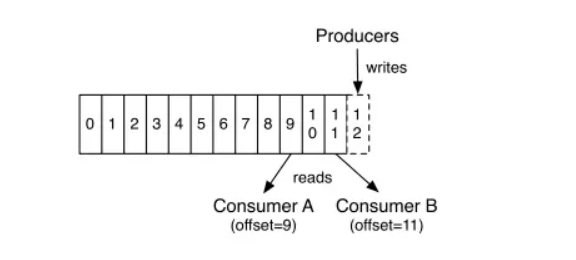

一般情况下 Offset 由客户端 SDK 负责保存 ，会保存到 Zookeeper 里面 。关于存在硬盘中的消息，Kafka 也有它的解决方法，可以基于时间和 Partition 文件的大小，正常 Kafka 是默认七天的保存，也可以通过命令来修改，以 users topic 为例。

- 

```
修改kafka 7天 默认保存周期
kafka-topics.sh --zookeeper 6 --alter --topic users --config 
retention.ms=100000
```

所以，为了避免磁盘被撑满的情况，Kakfa 提供了两种策略来删除数据：

1. **「基于时间」** （默认七天）
2. **「基于 Partition 文件大小」**


#### Memory Mapped Files

这个和Java NIO中的内存映射基本相同，在大学的计算机原理里我们学过（划重点），mmf （Memory Mapped Files）直接利用操作系统的Page来实现文件到物理内存的映射，完成之后对物理内存的操作会直接同步到硬盘。mmf 通过内存映射的方式大大提高了IO速率，省去了用户空间到内核空间的复制。它的缺点显而易见--不可靠，当发生宕机而数据未同步到硬盘时，数据会丢失，Kafka 提供了produce.type参数来控制是否主动的进行刷新，如果 Kafka 写入到 mmf 后立即flush再返回给生产者则为同步模式，反之为异步模式。

Kafka 提供了一个参数 producer.type 来控制是不是主动 Flush：

- 如果 Kafka 写入到 mmf 之后就立即 Flush，然后再返回 Producer 叫同步 (Sync)。
- 如果 Kafka 写入 mmf 之后立即返回 Producer 不调用 Flush 叫异步 (Async)。

#### 基于 Sendfile 实现零拷贝（Zero Copy）

作为一个消息系统，不可避免的便是消息的拷贝，常规的操作，一条消息，需要从创建者的socket到应用，再到操作系统内核，然后才能落盘。同样，一条消息发送给消费者也要从磁盘到内核到应用再到接收者的socket，中间经过了多次不是很有必要的拷贝。

传统 Read/Write 方式进行网络文件传输，在传输过程中，文件数据实际上是经过了四次 Copy 操作，其具体流程细节如下：

- 调用 Read 函数，文件数据被 Copy 到内核缓冲区。
- Read 函数返回，文件数据从内核缓冲区 Copy 到用户缓冲区
- Write 函数调用，将文件数据从用户缓冲区 Copy 到内核与 Socket 相关的缓冲区。
- 数据从 Socket 缓冲区 Copy 到相关协议引擎。

- 

```
硬盘—>内核 buf—>用户 buf—>Socket 相关缓冲区—>协议引擎
```

而 Sendfile 系统调用则提供了一种减少以上多次 Copy，提升文件传输性能的方法。在内核版本 2.1 中，引入了 Sendfile 系统调用，以简化网络上和两个本地文件之间的数据传输。Sendfile 的引入不仅减少了数据复制，还减少了上下文切换。相较传统 Read/Write 方式，2.1 版本内核引进的 Sendfile 已经减少了内核缓冲区到 User 缓冲区，再由 User 缓冲区到 Socket 相关缓冲区的文件 Copy。而在内核版本 2.4 之后，文件描述符结果被改变，Sendfile 实现了更简单的方式，再次减少了一次 Copy 操作。

Kafka 把所有的消息都存放在一个一个的文件中，当消费者需要数据的时候 Kafka 直接把文件发送给消费者，配合 mmap 作为文件读写方式，直接把它传给 Sendfile。


#### 批量发送

Kafka允许进行批量发送消息，producter发送消息的时候，可以将消息缓存在本地，等到了固定条件发送到 Kafka 。

- 等消息条数到固定条数。
- 一段时间发送一次。


#### 数据压缩

Kafka还支持对消息集合进行压缩，Producer可以通过GZIP或Snappy格式对消息集合进行压缩。压缩的好处就是减少传输的数据量，减轻对网络传输的压力。

Producer压缩之后，在Consumer需进行解压，虽然增加了CPU的工作，但在对大数据处理上，瓶颈在网络上而不是CPU，所以这个成本很值得。

注意：**「批量发送」**和**「数据压缩」**一起使用，单条做数据压缩的话，效果不明显


#### 总结

以上，便是Apache Kafka虽然使用了硬盘存储，但是仍然可以速度很快的原因。它把所有的消息都变成一个批量的文件，并且进行合理的批量压缩，减少网络 IO 损耗，通过 mmap 提高 I/O 速度。写入数据的时候由于单个 Partion 是末尾添加，所以速度最优；读取数据的时候配合 Sendfile 直接暴力输出


### Kafka 和其他消息队列的区别？

Kafka的设计目标是高吞吐量，那它与其它消息队列的区别就显而易见了：

1、Kafka操作的是序列文件I / O（序列文件的特征是按顺序写，按顺序读），为保证顺序，Kafka强制点对点的按顺序传递消息，这意味着，一个consumer在消息流（或分区）中只有一个位置。

2、Kafka不保存消息的状态，即消息是否被“消费”。一般的消息系统需要保存消息的状态，并且还需要以随机访问的形式更新消息的状态。而Kafka 的做法是保存Consumer在Topic分区中的位置offset，在offset之前的消息是已被“消费”的，在offset之后则为未“消费”的，并且offset是可以任意移动的，这样就消除了大部分的随机IO。

3、Kafka支持点对点的批量消息传递。

4、Kafka的消息存储在OS pagecache（页缓存，page cache的大小为一页，通常为4K，在Linux读写文件时，它用于缓存文件的逻辑内容，从而加快对磁盘上映像和数据的访问）。

总结：

- RabbitMQ:分布式，支持多种MQ协议，重量级 
- ActiveMQ：与RabbitMQ类似 
- ZeroMQ：以库的形式提供，使用复杂，无持久化 
- Redis：单机、纯内存性好，持久化较差 
- Kafka：分布式，消息不是使用完就丢失【较长时间持久化】，吞吐量高【高性能】，轻量灵活


### Kafka 这么快，它是如何保证不丢失消息？

我想，如果小伙伴直接遇到面试官问：Kafka 为什么这么快，又能保证不丢失消息？肯定是蒙蔽的，但如果前面回答的井井有条，这个时候再回答消息不丢失，就很容易啦 ！

#### 关于 ACK 机制

关于 ACK 机制 ，不了解的小伙伴，可以看这里：Kafka 架构深入 ，通过 ACK 机制保证消息送达。Kafka 采用的是至少一次（At least once），消息不会丢，但是可能会重复传输。

acks 的默认值即为1，代表我们的消息被leader副本接收之后就算被成功发送。我们可以配置 `acks = all` ，代表则所有副本都要接收到该消息之后该消息才算真正成功被发送。

#### 关于设置分区

为了保证 leader 副本能有 follower 副本能同步消息，我们一般会为 topic 设置 `replication.factor >= 3`。这样就可以保证每个 分区(partition) 至少有 3 个副本，以确保消息队列的安全性。


#### 关闭 unclean leader 选举

我们最开始也说了我们发送的消息会被发送到 leader 副本，然后 follower 副本才能从 leader 副本中拉取消息进行同步。多个 follower 副本之间的消息同步情况不一样，当我们配置了 `unclean.leader.election.enable = false` 的话，当 leader 副本发生故障时就不会从 follower 副本中和 leader 同步程度达不到要求的副本中选择出 leader ，这样降低了消息丢失的可能性。


#### 关于发送消息

为了得到更好的性能，Kafka 支持在生产者一侧进行本地buffer，也就是累积到一定的条数才发送，如果这里设置不当是会丢消息的。

生产者端设置：`producer.type=async, sync`，默认是 sync。

当设置为 async，会大幅提升性能，因为生产者会在本地缓冲消息，并适时批量发送。

如果对可靠性要求高，那么这里可以设置为 sync 同步发送。

一般时候我们还需要设置：`min.insync.replicas> 1` ，消息至少要被写入到这么多副本才算成功，也是提升数据持久性的一个参数，与acks配合使用。

但如果出现两者相等，我们还需要设置 `replication.factor = min.insync.replicas + 1` ，避免在一个副本挂掉，整个分区无法工作的情况！


#### Consumer 端丢失消息

consumer端丢失消息的情形比较简单：

如果在消息处理完成前就提交了offset，那么就有可能造成数据的丢失。

由于Kafka consumer默认是自动提交位移的，所以在后台提交位移前一定要保证消息被正常处理了，因此不建议采用很重的处理逻辑，如果处理耗时很长，则建议把逻辑放到另一个线程中去做。

为了避免数据丢失，现给出几点建议：设置 `enable.auto.commit=false`

关闭自动提交位移，在消息被完整处理之后再手动提交位移。


# RocketMQ


# 消息队列之推还是拉？

RocketMQ 和 Kafka是如何做的？


# 消息中间件技术选型

目前在市面上比较主流的消息队列中间件主要有，**Kafka、ActiveMQ、RabbitMQ、RocketMQ** 等这几种。

其中，ActiveMQ和RabbitMQ这两者因为吞吐量还有GitHub的社区活跃度的原因，在各大互联网公司都已经基本上绝迹了，业务体量一般的公司会是有在用的，但是越来越多的公司更青睐RocketMQ这样的消息中间件了。

**Kafka**和**RocketMQ**一直在各自擅长的领域发光发亮，不过写这篇文章的时候我问了蚂蚁金服，字节跳动和美团的朋友，好像大家用的都有点不一样，应该都是各自的中间件，可能做过修改，也可能是**自研**的，大多**没有开源**。

就像我们公司就是是基于**Kafka**和**RocketMQ**两者的优点自研的消息队列中间件，吞吐量、可靠性、时效性等都很可观。

我们回归正题，我这里用网上找的对比图让大家看看差距到底在哪里：

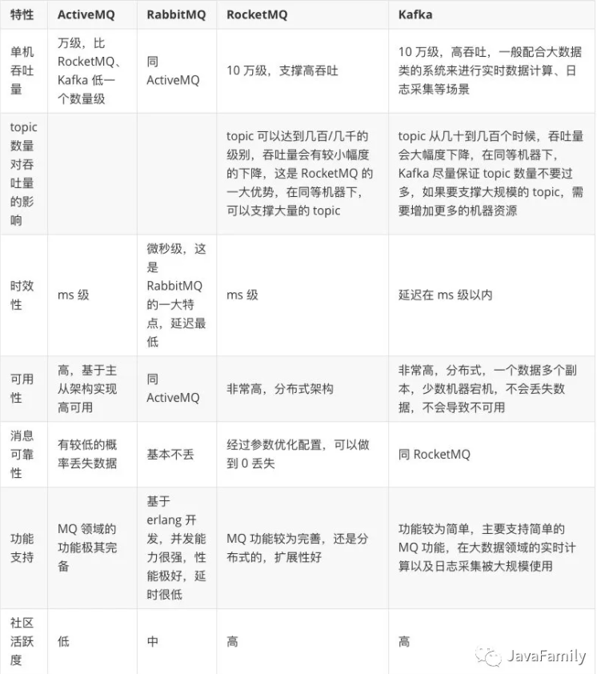


大家其实一下子就能看到差距了，就拿**吞吐量**来说，早期比较活跃的**ActiveMQ** 和**RabbitMQ**基本上不是后两者的对手了，在现在这样大数据的年代**吞吐量是真的很重要**。

比如现在突然爆发了一个超级热点新闻，你的APP注册用户高达亿数，你要想办法第一时间把突发全部推送到每个人手上，你没有**大吞吐量的消息队列**中间件用啥去推？

再说这些用户大量涌进来看了你的新闻产生了一系列的附带流量，你怎么应对这些数据，**很多场景离开消息队列基本上难以为继**。

就**部署方式**而言前两者也是大不如后面两个天然分布式架构，都是高可用的分布式架构，而且数据多个副本的数据也能做到0丢失。

我们再聊一下**RabbitMQ**这个中间件其实还行，但是这玩意开发语言居然是**erlang**，我敢说绝大部分工程师肯定不会为了一个中间件去刻意学习一门语言的，开发维护成本你想都想不到，出个问题查都查半天。

至于**RocketMQ**（阿里开源的），git活跃度还可以。基本上你push了自己的bug确认了有问题都有阿里大佬跟你试试解答并修复的，我个人推荐的也是这个，他的架构设计部分跟同样是阿里开源的一个**RPC**框架是真的很像（**Dubbo**）可能是因为师出同门的原因吧。

**Kafka**我放到最后说，你们也应该知道了，压轴的这是个大哥，广泛应用于大数据领域，公司的日志采集，实时计算等场景，基本上算得上是**世界范围级别的消息队列标杆**了。

以上这些都只是一些我自己的**个人意见**，真正的选型还是要去**深入研究**的，不然那你公司一天UV就1000你告诉我你要去用**Kafka**我只能说你吃饱撑的。


# ZooKeeper

从上面我们也可以发现，好像哪都有ZooKeeper的身影，那什么是ZooKeeper呢？官网简单概括一下：

- ZooKeeper主要**服务于分布式系统**，可以用ZooKeeper来做：统一配置管理、统一命名服务、分布式锁、集群管理。
- 使用分布式系统就无法避免对节点管理的问题(需要实时感知节点的状态、对节点进行统一管理等等)，而由于这些问题处理起来可能相对麻烦和提高了系统的复杂性，ZooKeeper作为一个能够**通用**解决这些问题的中间件就应运而生了。


## ZooKeeper原理？

### ZooKeeper的数据结构

从上面我们可以知道，可以用ZooKeeper来做：统一配置管理、统一命名服务、分布式锁、集群管理。

那为什么ZooKeeper可以干那么多事？来看看ZooKeeper究竟是何方神物，在Wiki中其实也有提到：

> ZooKeeper nodes store their data in a hierarchical name space, much like a file system or a tree data structure

ZooKeeper的数据结构，跟Unix文件系统非常类似，可以看做是一颗**树**，每个节点叫做**ZNode**。每一个节点可以通过**路径**来标识，结构图如下：

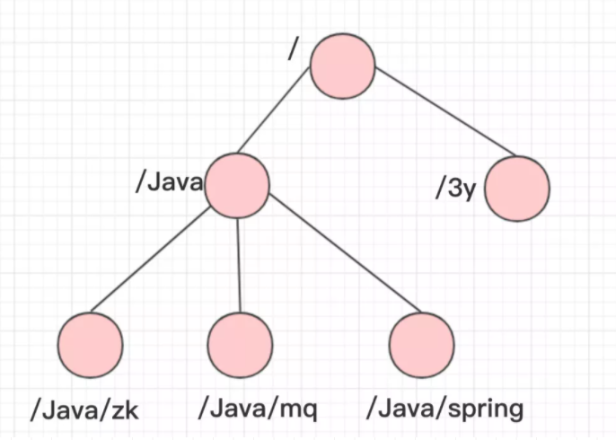


那ZooKeeper这颗"树"有什么特点呢？？ZooKeeper的节点我们称之为**Znode**，Znode分为**两种**类型：

- **短暂/临时(Ephemeral)**：当客户端和服务端断开连接后，所创建的Znode(节点)**会自动删除**
- **持久(Persistent)**：当客户端和服务端断开连接后，所创建的Znode(节点)**不会删除**

> ZooKeeper和Redis一样，也是C/S结构(分成客户端和服务端)


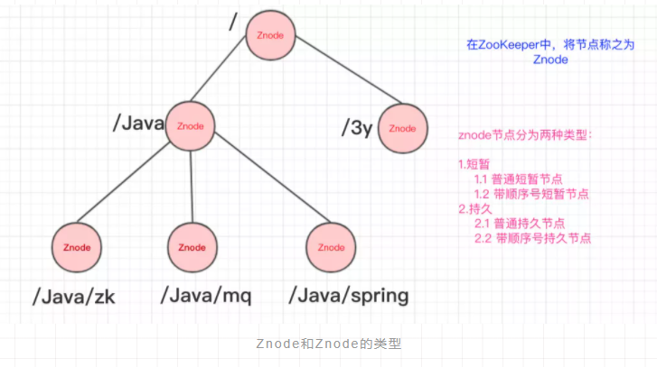


### 监听器

在上面我们已经简单知道了ZooKeeper的数据结构了，ZooKeeper还配合了**监听器**才能够做那么多事的。

**常见**的监听场景有以下两项：

- 监听Znode节点的**数据变化**
- 监听子节点的**增减变化**

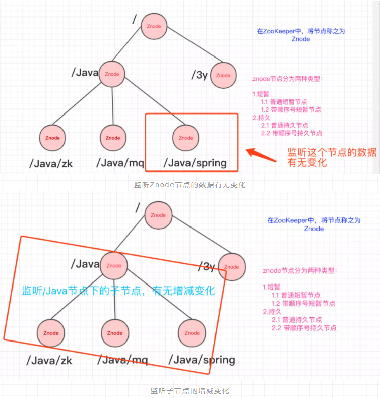


没错，通过**监听+Znode节点(持久/短暂[临时])**，ZooKeeper就可以玩出这么多花样了。


## ZooKeeper应用？

下面我们来看看用ZooKeeper怎么来做：统一配置管理、统一命名服务、分布式锁、集群管理。

### 统一配置管理

比如我们现在有三个系统A、B、C，他们有三份配置，分别是`ASystem.yml、BSystem.yml、CSystem.yml`，然后，这三份配置又非常类似，很多的配置项几乎都一样。

- 此时，如果我们要改变其中一份配置项的信息，很可能其他两份都要改。并且，改变了配置项的信息**很可能就要重启系统**

于是，我们希望把`ASystem.yml、BSystem.yml、CSystem.yml`相同的配置项抽取出来成一份**公用**的配置`common.yml`，并且即便`common.yml`改了，也不需要系统A、B、C重启。

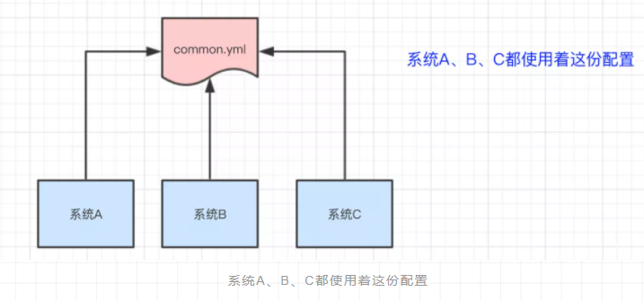


做法：我们可以将`common.yml`这份配置放在ZooKeeper的Znode节点中，系统A、B、C监听着这个Znode节点有无变更，如果变更了，**及时**响应。


### 统一命名服务

统一命名服务的理解其实跟**域名**一样，是我们为这某一部分的资源给它**取一个名字**，别人通过这个名字就可以拿到对应的资源。

比如说，现在我有一个域名`www.java3y.com`，但我这个域名下有多台机器：

- 192.168.1.1
- 192.168.1.2
- 192.168.1.3
- 192.168.1.4

别人访问`www.java3y.com`即可访问到我的机器，而不是通过IP去访问。

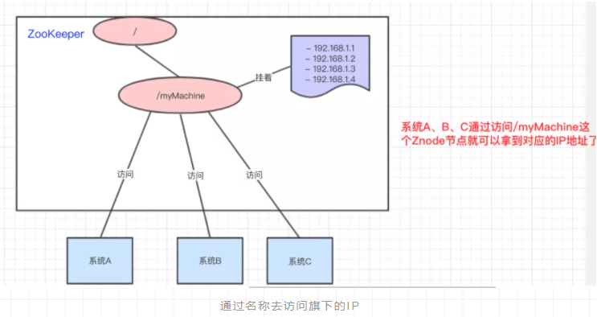


### 分布式锁

锁的概念在这我就不说了，如果对锁概念还不太了解的同学，可参考下面的文章

- [Java锁？分布式锁？乐观锁？行锁？](https://mp.weixin.qq.com/s?__biz=MzI4Njg5MDA5NA==&mid=2247484989&idx=1&sn=7beaa0db8b29cc8758c7846fe04dfbd2&chksm=ebd7473cdca0ce2a7aea8e6e2a22a5c183b8be3f1cdc93f8d7c3842a560eb5668071cebe5e37&token=948022247&lang=zh_CN&scene=21#wechat_redirect)

我们可以使用ZooKeeper来实现分布式锁，那是怎么做的呢？？下面来看看：

系统A、B、C都去访问`/locks`节点

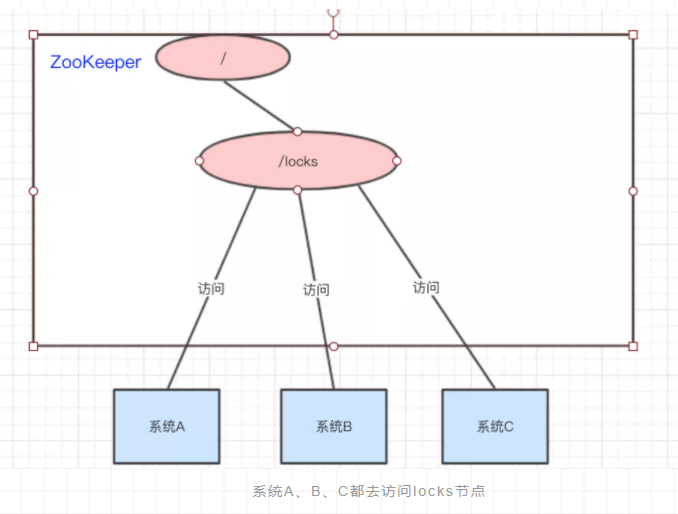


访问的时候会创建**带顺序号的临时/短暂**(`EPHEMERAL_SEQUENTIAL`)节点，比如，系统A创建了`id_000000`节点，系统B创建了`id_000002`节点，系统C创建了`id_000001`节点。

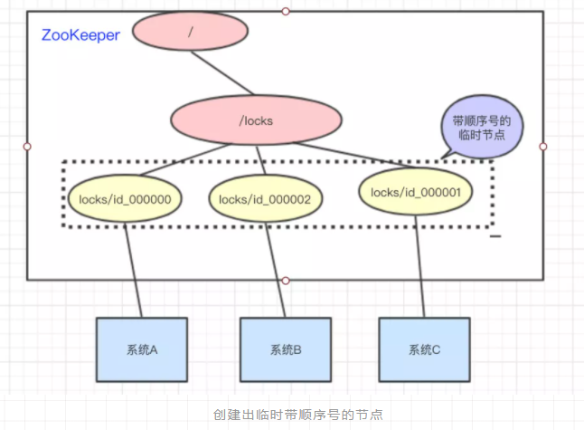


接着，拿到`/locks`节点下的所有子节点(id_000000,id_000001,id_000002)，**判断自己创建的是不是最小的那个节点**

- 如果是，则拿到锁。

- - 释放锁：执行完操作后，把创建的节点给删掉

- 如果不是，则监听比自己要小1的节点变化

举个例子：

- 系统A拿到`/locks`节点下的所有子节点，经过比较，发现自己(`id_000000`)，是所有子节点最小的。所以得到锁
- 系统B拿到`/locks`节点下的所有子节点，经过比较，发现自己(`id_000002`)，不是所有子节点最小的。所以监听比自己小1的节点`id_000001`的状态
- 系统C拿到`/locks`节点下的所有子节点，经过比较，发现自己(`id_000001`)，不是所有子节点最小的。所以监听比自己小1的节点`id_000000`的状态
- ……
- 等到系统A执行完操作以后，将自己创建的节点删除(`id_000000`)。通过监听，系统C发现`id_000000`节点已经删除了，发现自己已经是最小的节点了，于是顺利拿到锁
- ….系统B如上


### 集群状态

经过上面几个例子，我相信大家也很容易想到ZooKeeper是怎么"**感知**"节点的动态新增或者删除的了。

还是以我们三个系统A、B、C为例，在ZooKeeper中创建**临时节点**即可：

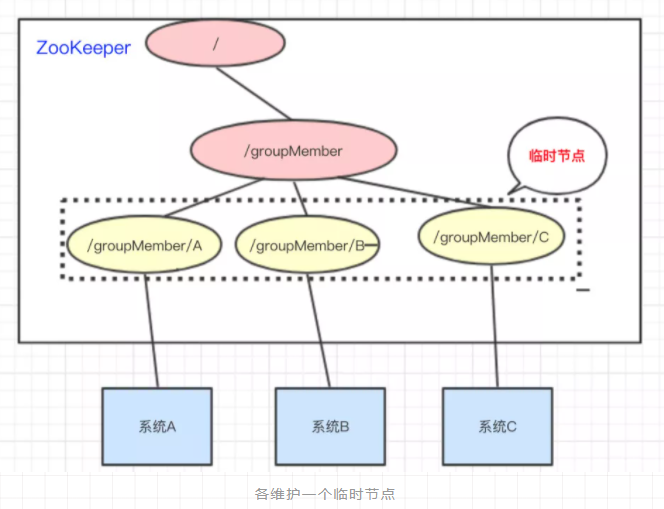


只要系统A挂了，那`/groupMember/A`这个节点就会删除，通过**监听**`groupMember`下的子节点，系统B和C就能够感知到系统A已经挂了。(新增也是同理)

除了能够感知节点的上下线变化，ZooKeeper还可以实现**动态选举Master**的功能。(如果集群是主从架构模式下)

原理也很简单，如果想要实现动态选举Master的功能，Znode节点的类型是带**顺序号的临时节点**(`EPHEMERAL_SEQUENTIAL`)就好了。

- Zookeeper会每次选举最小编号的作为Master，如果Master挂了，自然对应的Znode节点就会删除。然后让**新的最小编号作为Master**，这样就可以实现动态选举的功能了。


