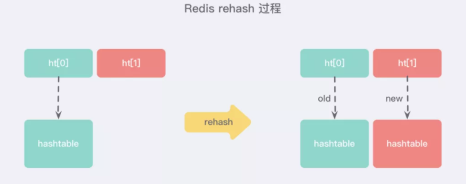

# Redis基础知识点

## Redis有哪些数据结构？

初级：

String、Hash、List、Set、SortedSet

中级：

HyperLogLog、Geo、Pub/Sub

高级：

Redis Module，RedisSearch，Redis-ML，BloomFilter（布隆过滤器）

### 底层结构及常用命令

#### 字符串 string

Redis 中的字符串是一种 **动态字符串**，这意味着使用者可以修改，它的底层实现有点类似于 Java 中的 **ArrayList**，有一个字符数组，从源码的 **sds.h/sdshdr 文件** 中可以看到 Redis 底层对于字符串的定义 **SDS**，即 *Simple Dynamic String* 结构。同样一组结构 Redis 使用泛型定义了好多次，**为什么不直接使用 int 类型呢？**这是因为当字符串比较短的时候，len 和 alloc 可以使用 byte 和 short 来表示，**Redis 为了对内存做极致的优化，不同长度的字符串使用不同的结构体来表示。**

SDS 与 C 字符串的区别：不考虑直接使用 C 语言的字符串是因为 C 语言这种简单的字符串表示方式 **不符合 Redis 对字符串在安全性、效率以及功能方面的要求**：

- **获取字符串长度为 O(N) 级别的操作** → 因为 C 不保存数组的长度，每次都需要遍历一遍整个数组；
- 不能很好的杜绝 **缓冲区溢出/内存泄漏** 的问题 → 跟上述问题原因一样，如果执行拼接 or 缩短字符串的操作，如果操作不当就很容易造成上述问题；
- C 字符串 **只能保存文本数据** → 因为 C 语言中的字符串必须符合某种编码（比如 ASCII），例如中间出现的 `'\0'` 可能会被判定为提前结束的字符串而识别不了；

通常使用 `SET` 和 `GET` 来设置和获取字符串值；`mset`批量设置键值对

使用 `EXISTS` 和 `DEL` 关键字来查询是否存在和删除键值对;

 `SET` + `EXPIRE` 的 `SETNX` 命令：设置过期时间

使用 `INCR` 命令进行 **原子性** 的自增操作

返回原值的 GETSET 命令

#### 列表 list

Redis 的列表相当于 Java 语言中的 **LinkedList**，注意它是链表而不是数组。这意味着 list 的插入和删除操作非常快，时间复杂度为 O(1)，但是索引定位很慢，时间复杂度为 O(n)。

**链表的基本操作**

- `LPUSH` 和 `RPUSH` 分别可以向 list 的左边（头部）和右边（尾部）添加一个新元素；
- LPOP 和 RPOP分别从左右两端取出元素；
- `LRANGE` 命令可以从 list 中取出一定范围的元素；
- `LINDEX` 命令可以从 list 中取出指定下表的元素，相当于 Java 链表操作中的 `get(int index)` 操作；

**list 实现队列**

队列是先进先出的数据结构，常用于消息排队和异步逻辑处理，它会确保元素的访问顺序：

RPUSH + LPOP

**list 实现栈**

栈是先进后出的数据结构，跟队列正好相反：

RPUSH + RPOP

#### 字典 hash

Redis 中的字典相当于 Java 中的 **HashMap**，内部实现也差不多类似，都是通过 **"数组 + 链表"** 的链地址法来解决部分 **哈希冲突**，同时这样的结构也吸收了两种不同数据结构的优点。

源码中看到，**实际上字典结构的内部包含两个 hashtable**，通常情况下只有一个 hashtable 是有值的，但是在字典扩容缩容时，需要分配新的 hashtable，然后进行 **渐进式搬迁** ：

**渐进式 rehash**

大字典的扩容是比较耗时间的，需要重新申请新的数组，然后将旧字典所有链表中的元素重新挂接到新的数组下面，这是一个 O(n) 级别的操作，作为单线程的 Redis 很难承受这样耗时的过程，所以 Redis 使用 **渐进式 rehash** 小步搬迁。渐进式 rehash 会在 rehash 的同时，保留新旧两个 hash 结构，如上图所示，查询时会同时查询两个 hash 结构，然后在后续的定时任务以及 hash 操作指令中，循序渐进的把旧字典的内容迁移到新字典中。当搬迁完成了，就会使用新的 hash 结构取而代之。

**字典的基本操作**

\> HSET books java "think in java"    *# 命令行的字符串如果包含空格则需要使用引号包裹*
(integer) 1
\> HSET books python "python cookbook"
(integer) 1
\> HGETALL books    *# key 和 value 间隔出现*
1) "java"
2) "think in java"
3) "python"
4) "python cookbook"
\> HGET books java
"think in java"
\> HSET books java "head first java"  
(integer) 0        # 因为是更新操作，所以返回 0
\> HMSET books java "effetive  java" python "learning python"    *# 批量操作*

\> OK 

#### 集合 set

Redis 的集合相当于 Java 语言中的 **HashSet**，它内部的键值对是无序、唯一的。它的内部实现相当于一个特殊的字典，字典中所有的 value 都是一个值 NULL。

**集合 set 的基本使用**

由于该结构比较简单，我们直接来看看是如何使用的：

\> SADD books java
(integer) 1
\> SADD books java    *# 重复*
(integer) 0
\> SADD books python golang
(integer) 2
\> SMEMBERS books    *# 注意顺序，set 是无序的*
1) "java"
2) "python"
3) "golang"
\> SISMEMBER books java    *# 查询某个 value 是否存在，相当于 contains*
(integer) 1
\> SCARD books    *# 获取长度*
(integer) 3
\> SPOP books     *# 弹出一个*
"java"

#### 有序列表 zset

这可能使 Redis 最具特色的一个数据结构了，它类似于 Java 中 **SortedSet** 和 **HashMap** 的结合体，一方面它是一个 set，保证了内部 value 的唯一性，另一方面它可以为每个 value 赋予一个 score 值，用来代表排序的权重。

它的内部实现用的是一种叫做 **「跳跃表」** 的数据结构，由于比较复杂，所以在这里简单提一下原理就好了：

跳跃表采用层级结构，最下面一层所有的元素都会串起来，然后每隔几个元素就会挑选出一个代表，再把这几个代表使用另外一级指针串起来。然后再在这些代表里面挑出二级代表，再串起来。**最终形成了一个金字塔的结构。**

\> ZADD books 9.0 "think in java"
\> ZADD books 8.9 "java concurrency"
\> ZADD books 8.6 "java cookbook"

\> ZRANGE books 0 -1     *# 按 score 排序列出，参数区间为排名范围*
1) "java cookbook"
2) "java concurrency"
3) "think in java"

\> ZREVRANGE books 0 -1  *# 按 score 逆序列出，参数区间为排名范围*
1) "think in java"
2) "java concurrency"
3) "java cookbook"

\> ZCARD books           *# 相当于 count()*
(integer) 3

\> ZSCORE books "java concurrency"   *# 获取指定 value 的 score*
"8.9000000000000004"                # 内部 score 使用 double 类型进行存储，所以存在小数点精度问题

\> ZRANK books "java concurrency"    *# 排名*
(integer) 1

\> ZRANGEBYSCORE books 0 8.91        *# 根据分值区间遍历 zset*
1) "java cookbook"
2) "java concurrency"

\> ZRANGEBYSCORE books -inf 8.91 withscores  *# 根据分值区间 (-∞, 8.91] 遍历 zset，同时返回分值。inf 代表 infinite，无穷大的意思。*
1) "java cookbook"
2) "8.5999999999999996"
3) "java concurrency"
4) "8.9000000000000004"

\> ZREM books "java concurrency"             *# 删除 value*
(integer) 1
\> ZRANGE books 0 -1
1) "java cookbook"
2) "think in java"

#### HyperLogLog （待整理）

**HyperLogLog** 是最早由 Flajolet 及其同事在 2007 年提出的一种 **估算基数的近似最优算法**。

##### 关于基数统计

**基数统计(Cardinality Counting)** 通常是用来统计一个集合中不重复的元素个数。

**思考这样的一个场景：** 如果你负责开发维护一个大型的网站，有一天老板找产品经理要网站上每个网页的 **UV(独立访客，每个用户每天只记录一次)**，然后让你来开发这个统计模块，你会如何实现？

##### 基数统计的常用方法

对于上述这样需要 **基数统计** 的事情，通常来说有两种比 set 集合更好的解决方案：

###### 第一种：B 树

**B 树最大的优势就是插入和查找效率很高**，如果用 B 树存储要统计的数据，可以快速判断新来的数据是否存在，并快速将元素插入 B 树。要计算基础值，只需要计算 B 树的节点个数就行了。

不过将 B 树结构维护到内存中，能够解决统计和计算的问题，但是 **并没有节省内存**。

###### 第二种：bitmap

**bitmap** 可以理解为通过一个 bit 数组来存储特定数据的一种数据结构，**每一个 bit 位都能独立包含信息**，bit 是数据的最小存储单位，因此能大量节省空间，也可以将整个 bit 数据一次性 load 到内存计算。如果定义一个很大的 bit 数组，基础统计中 **每一个元素对应到 bit 数组中的一位**，例如：

bitmap 还有一个明显的优势是 **可以轻松合并多个统计结果**，只需要对多个结果求异或就可以了，也可以大大减少存储内存。可以简单做一个计算，如果要统计 **1 亿** 个数据的基数值，**大约需要的内存**：`100_000_000/ 8/ 1024/ 1024 ≈ 12 M`，如果用 **32 bit** 的 int 代表 **每一个** 统计的数据，**大约需要内存**：`32 * 100_000_000/ 8/ 1024/ 1024 ≈ 381 M`

可以看到 bitmap 对于内存的节省显而易见，但仍然不够。统计一个对象的基数值就需要 `12 M`，如果统计 1 万个对象，就需要接近 `120 G`，对于大数据的场景仍然不适用。

###### 第三种：概率算法

实际上目前还没有发现更好的在 **大数据场景** 中 **准确计算** 基数的高效算法，因此在不追求绝对精确的情况下，使用概率算法算是一个不错的解决方案。

概率算法 **不直接存储** 数据集合本身，通过一定的 **概率统计方法预估基数值**，这种方法可以大大节省内存，同时保证误差控制在一定范围内。目前用于基数计数的概率算法包括:

- **Linear Counting(LC)**：早期的基数估计算法，LC 在空间复杂度方面并不算优秀，实际上 LC 的空间复杂度与上文中简单 bitmap 方法是一样的（但是有个常数项级别的降低），都是 O(Nmax)
- **LogLog Counting(LLC)**：LogLog Counting 相比于 LC 更加节省内存，空间复杂度只有 O(log2(log2(Nmax)))
- **HyperLogLog Counting(HLL)**：HyperLogLog Counting 是基于 LLC 的优化和改进，在同样空间复杂度情况下，能够比 LLC 的基数估计误差更小

其中，**HyperLogLog** 的表现是惊人的，上面我们简单计算过用 **bitmap** 存储 **1 个亿** 统计数据大概需要 `12 M` 内存，而在 **HyperLoglog** 中，只需要不到 **1 K** 内存就能够做到！在 Redis 中实现的 **HyperLoglog** 也只需要 **12 K** 内存，在 **标准误差 0.81%** 的前提下，**能够统计 264 个数据**！

##### HyperLogLog 原理

##### Redis 中的 HyperLogLog 实现

从上面我们算是对 **HyperLogLog** 的算法和思想有了一定的了解，并且知道了一个 **HyperLogLog** 实际占用的空间大约是 `12 KB`，但 Redis 对于内存的优化非常变态，当 **计数比较小** 的时候，大多数桶的计数值都是 **零**，这个时候 Redis 就会适当节约空间，转换成另外一种 **稀疏存储方式**，与之相对的，正常的存储模式叫做 **密集存储**，这种方式会恒定地占用 `12 KB`。

###### 密集型存储结构

密集型的存储结构非常简单，就是 **16384 个 6 bit 连续串成** 的字符串位图：

###### 稀疏存储结构

稀疏存储适用于很多计数值都是零的情况。下图表示了一般稀疏存储计数值的状态

当 **多个连续桶的计数值都是零** 时，Redis 提供了几种不同的表达形式：

- `00xxxxxx`：前缀两个零表示接下来的 6bit 整数值加 1 就是零值计数器的数量，注意这里要加 1 是因为数量如果为零是没有意义的。比如 `00010101` 表示连续 `22` 个零值计数器。
- `01xxxxxx yyyyyyyy`：6bit 最多只能表示连续 `64` 个零值计数器，这样扩展出的  14bit 可以表示最多连续 `16384` 个零值计数器。这意味着 HyperLogLog 数据结构中 `16384` 个桶的初始状态，所有的计数器都是零值，可以直接使用 2 个字节来表示。
- `1vvvvvxx`：中间 5bit 表示计数值，尾部 2bit 表示连续几个桶。它的意思是连续 `(xx +1)` 个计数值都是 `(vvvvv + 1)`。比如 `10101011` 表示连续 `4` 个计数值都是 `11`。

注意 *上面第三种方式* 的计数值最大只能表示到 `32`，而 HyperLogLog 的密集存储单个计数值用 6bit 表示，最大可以表示到 `63`。**当稀疏存储的某个计数值需要调整到大于 `32` 时，Redis 就会立即转换 HyperLogLog 的存储结构，将稀疏存储转换成密集存储。**

###### 对象头

HyperLogLog 除了需要存储 16384 个桶的计数值之外，它还有一些附加的字段需要存储，比如总计数缓存、存储类型。所以它使用了一个额外的对象头来表示

##### HyperLogLog 的使用

**HyperLogLog** 提供了两个指令 `PFADD` 和 `PFCOUNT`，字面意思就是一个是增加，另一个是获取计数。`PFADD` 和 `set` 集合的 `SADD` 的用法是一样的，来一个用户 ID，就将用户 ID 塞进去就是，`PFCOUNT` 和 `SCARD` 的用法是一致的，直接获取计数值

`PFMEGER` 指令，用于将多个计数值累加在一起形成一个新的 `pf` 值

# 应用问题

## Redis缓存雪崩

## Redis缓存穿透

## Redis缓存击穿

## 三者区别

## 大量的key同一时间过期，一般需要注意什么？

如果大量的key过期时间设置的过于集中，到过期的那个时间点，Redis可能会出现短暂的卡顿现象。严重的话会出现缓存雪崩，我们一般需要在时间上加一个随机值，使得过期时间分散一些。

电商首页经常会使用定时任务刷新缓存，可能大量的数据失效时间都十分集中，如果失效时间一样，又刚好在失效的时间点大量用户涌入，就有可能造成缓存雪崩

## Redis分布式锁？

先拿**setnx**来争抢锁，抢到之后，再用**expire**给锁加一个过期时间防止锁忘记了释放。为了避免在setnx之后执行expire之前进程意外crash或者要重启维护了，可以利用set指令的参数，同时把**setnx**和**expire**合成一条指令来用的。

## 海量数据筛选

假如Redis里面有1亿个key，其中有10w个key是以某个固定的已知的前缀开头的，如何将它们全部找出来？若Redis正在给线上的业务提供服务，使用keys指令会有什么问题？

使用**keys**指令可以扫出指定模式的key列表。Redis关键的一个特性：Redis的单线程的。keys指令会导致线程阻塞一段时间，线上服务会停顿，直到指令执行完毕，服务才能恢复。这个时候可以使用**scan**指令，**scan**指令可以无阻塞的提取出指定模式的key列表，但是会有一定的重复概率，在客户端做一次去重就可以了，但是整体所花费的时间会比直接用keys指令长。

## 使用Redis做异步队列？

一般使用list结构作为队列，**rpush**生产消息，**lpop**消费消息。当lpop没有消息的时候，要适当sleep一会再重试。

若不用sleep，则list还有个指令叫**blpop**，在没有消息的时候，它会阻塞住直到消息到来。

若想实现能不能生产一次消费多次，可以使用pub/sub主题订阅者模式，可以实现 1:N 的消息队列。其缺点在于在消费者下线的情况下，生产的消息会丢失，这种得使用专业的消息队列如**RocketMQ**等。

## Redis如何实现延时队列？

使用sortedset，拿时间戳作为score，消息内容作为key调用zadd来生产消息，消费者用**zrangebyscore**指令获取N秒之前的数据轮询进行处理。

## Pipeline有什么好处，为什么要用pipeline？

可以将多次IO往返的时间缩减为一次，前提是**pipeline**执行的指令之间没有因果相关性。使用**redis-benchmark**进行压测的时候可以发现影响redis的QPS峰值的一个重要因素是**pipeline**批次指令的数目。

# Redis集群高可用

## 持久化

### Redis是怎么持久化的？服务主从数据怎么交互的？

RDB做镜像全量持久化，AOF做增量持久化。因为RDB会耗费较长时间，不够实时，在停机的时候会导致大量丢失数据，所以需要AOF来配合使用。

在redis实例重启时，会使用RDB持久化文件重新构建内存，再使用AOF重放近期的操作指令来实现完整恢复重启之前的状态。

**这里很好理解，把RDB理解为一整个表全量的数据，AOF理解为每次操作的日志就好了，服务器重启的时候先把表的数据全部搞进去，但是他可能不完整，你再回放一下日志，数据不就完整了嘛。**

**不过Redis本身的机制是 AOF持久化开启且存在AOF文件时，优先加载AOF文件；AOF关闭或者AOF文件不存在时，加载RDB文件；加载AOF/RDB文件成功后，Redis启动成功；AOF/RDB文件存在错误时，Redis启动失败并打印错误信息**

### RDB的原理是什么？

fork是指redis通过创建子进程来进行RDB操作，cow指的是**copy on write**，子进程创建后，父子进程共享数据段，父进程继续提供读写服务，写脏的页面数据会逐渐和子进程分离开来。

### AOF和RDB的优缺点

### Redis服务器突然掉电会怎样？

取决于AOF日志sync属性的配置，如果不要求性能，在每条写指令时都sync一下磁盘，就不会丢失数据。但是在高性能的要求下每次都sync是不现实的，一般都使用定时sync，比如1s1次，这个时候最多就会丢失1s的数据。

## 主从同步

### Redis集群的数据同步

Redis可以使用主从同步，从从同步。第一次同步时，主节点做一次**bgsave**，并同时将后续修改操作记录到内存buffer，待完成后将RDB文件全量同步到复制节点，复制节点接受完成后将RDB镜像加载到内存。加载完成后，再通知主节点将期间修改的操作记录同步到复制节点进行重放就完成了同步过程。后续的增量数据通过AOF日志同步即可，有点类似数据库的binlog。

## Redis集群高可用

### 集群高可用怎么保证，集群的原理？

**Redis Sentinal** 着眼于高可用，在master宕机时会自动将slave提升为master，继续提供服务。

**Redis Cluster** 着眼于扩展性，在单个redis内存不足时，使用Cluster进行分片存储。

### 哨兵模式

## LRU

