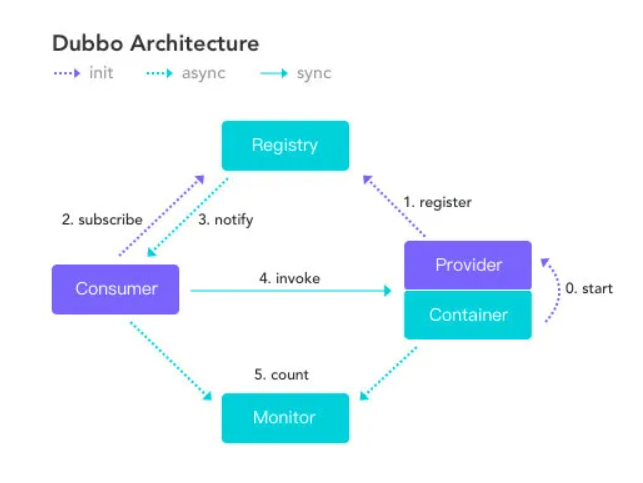
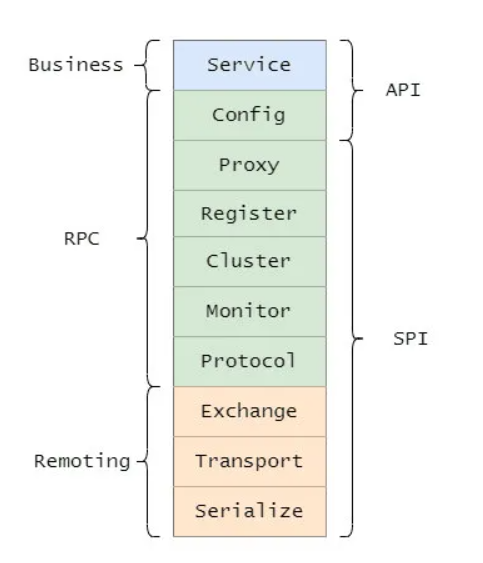
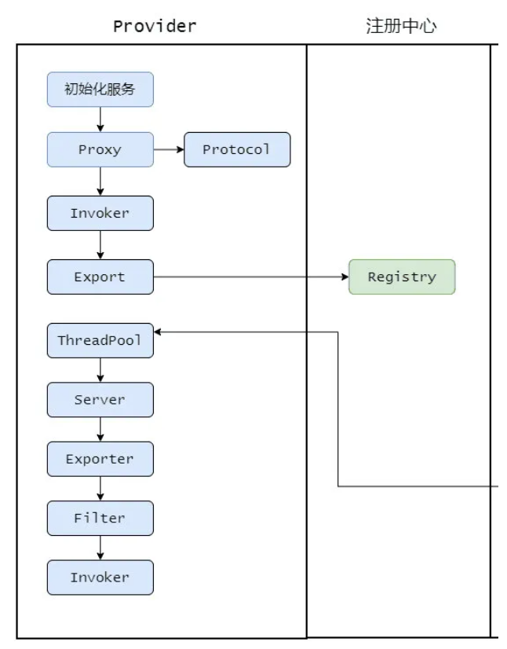
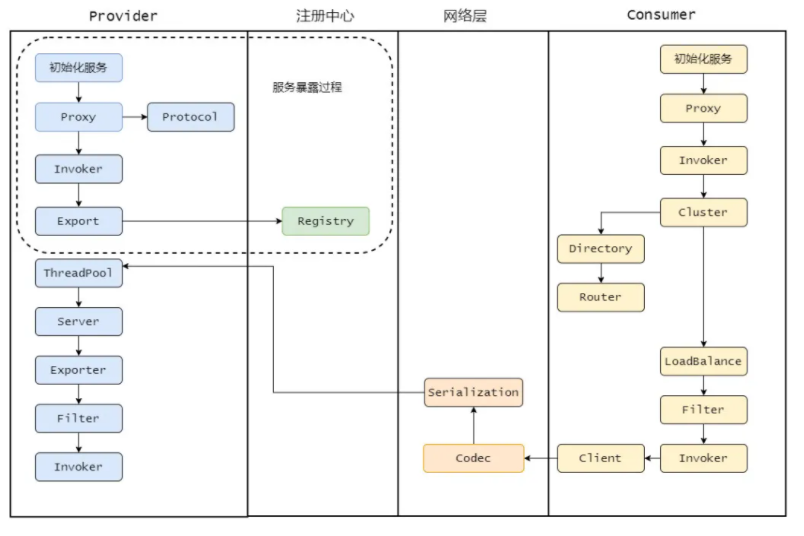

# 一、总体介绍

# 什么是 RPC

RPC，Remote Procedure Call 即远程过程调用。RPC 对标的是本地过程调用，至于 RPC 要如何调用远程的方法可以走 HTTP、也可以是基于 TCP 自定义协议。

 **RPC 和 HTTP 就不是一个层级的东西。**

**RPC 框架的目的就是让我们使用远程调用像本地调用一样简单方便，并且解决一些远程调用会发生的一些问题**，使用户用的无感知。

# 如何设计一个 RPC 框架

大致上一个 RPC 框架需要做的就是约定要通信协议，序列化的格式、容错机制、负载均衡策略、监控运维和一个注册中心

## 服务消费者

首先消费者面向接口编程，需要得知有哪些接口可以调用，可以通过**公用 jar 包**的方式来维护接口。

接口具体的实现交由框架处理了。需要来个**代理类**，消费者只管调用方法及传参，其他事项由代理搞定。

代理通过**注册中心**知晓可以调用哪些服务提供方。

一般而言提供方提供方都是集群部署，所以调用方需要通过**负载均衡策略**来选择一个调用。

还需要有**容错机制**，以应对远程调用过程中的网络等问题。

还要和服务提供方**约定一个协议**，例如我们就用 HTTP 来通信就好啦，也就是大家要讲一样的话，不然可能听不懂了。

当然序列化必不可少，毕竟我们本地的结构是“立体”的，需要序列化之后才能传输，因此还需要**约定序列化格式**。

并且这过程中间可能还需要掺入一些 **Filter，来作一波统一的处理**，例如调用计数啊等等。

这些都是框架需要做的，让消费者像在调用本地方法一样，无感知。

## 服务提供者

服务提供者要**实现对应的接口**。

然后需要把自己的接口暴露出去，向**注册中心注册自己**，暴露自己所能提供的服务。

然后有消费者请求过来需要处理，提供者需要用和消费者**协商好的协议**来处理这个请求，然后做**反序列化**。

序列化完的请求应该**扔到线程池里面做处理**，某个线程接受到这个请求之后找到对应的实现调用，然后再**将结果原路返回**。

## 注册中心

上面其实我们都提到了注册中心，这东西就相当于一个平台，大家在上面暴露自己的服务，也在上面得知自己能调用哪些服务。

当然还能做配置中心，将配置集中化处理，动态变更通知订阅者。

## 监控运维

面对众多的服务，精细化的监控和方便的运维必不可少。

# Dubbo 简介

Dubbo 实现了面向接口的代理 RPC 调用，并且可以配合 ZooKeeper 等组件实现服务注册和发现功能，并且拥有负载均衡、容错机制等。

# Dubbo 总体架构

| 节点      | 角色说明                     |
| :-------- | :--------------------------- |
| Consumer  | 需要调用远程服务的服务消费方 |
| Registry  | 注册中心                     |
| Provider  | 服务提供方                   |
| Container | 服务运行的容器               |
| Monitor   | 监控中心                     |

# Dubbo 分层架构

总的而言 Dubbo 分为三层，如果每一层再细分下去，一共有十层。

大的三层分别为 Business（业务层）、RPC 层、Remoting，并且还分为 API 层和 SPI 层。

分为大三层其实就是和我们知道的网络分层一样的意思，**只有层次分明，职责边界清晰才能更好的扩展**。

而分 API 层和 SPI 层这是 Dubbo 成功的一点，**采用微内核设计+SPI扩展**，使得有特殊需求的接入方可以自定义扩展，做定制的二次开发。

接下来咱们再来看看每一层都是干嘛的。

- Service，业务层，就是咱们开发的业务逻辑层。
- Config，配置层，主要围绕 ServiceConfig 和 ReferenceConfig，初始化配置信息。
- Proxy，代理层，服务提供者还是消费者都会生成一个代理类，使得服务接口透明化，代理层做远程调用和返回结果。
- Register，注册层，封装了服务注册和发现。
- Cluster，路由和集群容错层，负责选取具体调用的节点，处理特殊的调用要求和负责远程调用失败的容错措施。
- Monitor，监控层，负责监控统计调用时间和次数。
- Portocol，远程调用层，主要是封装 RPC 调用，主要负责管理 Invoker，Invoker代表一个抽象封装了的执行体，之后再做详解。
- Exchange，信息交换层，用来封装请求响应模型，同步转异步。
- Transport，网络传输层，抽象了网络传输的统一接口，这样用户想用 Netty 就用 Netty，想用 Mina 就用 Mina。
- Serialize，序列化层，将数据序列化成二进制流，当然也做反序列化。

**补充：**

**SPI**（Service Provider Interface），是 JDK 内置的一个服务发现机制，**它使得接口和具体实现完全解耦**。我们只声明接口，具体的实现类在配置中选择。

具体的就是你定义了一个接口，然后在`META-INF/services`目录下**放置一个与接口同名的文本文件**，文件的内容为**接口的实现类**，多个实现类用换行符分隔。这样就通过配置来决定具体用哪个实现！而 Dubbo SPI 还做了一些改进

# Dubbo 调用过程

整体的流程，首先服务提供者 **Provider 启动然后向注册中心注册**自己所能提供的服务。

服务消费者 **Consumer 启动向注册中心订阅**自己所需的服务。然后注册中心将提供者元信息通知给 Consumer， 之后 Consumer 因为已经从注册中心获取提供者的地址，因此可以**通过负载均衡选择一个 Provider 直接调用** 。

之后服务提供方元数据变更的话**注册中心会把变更推送给服务消费者**。

服务提供者和消费者都会在内存中记录着调用的次数和时间，然后**定时的发送统计数据到监控中心**。

先从服务提供者开始，看看它是如何工作的。

## 服务暴露过程

首先 Provider 启动，通过 Proxy 组件根据具体的协议 Protocol 将需要暴露出去的接口封装成 Invoker，Invoker 是 Dubbo 一个很核心的组件，代表一个可执行体。

然后再通过 Exporter 包装一下，这是为了在注册中心暴露自己套的一层，然后将 Exporter 通过 Registry 注册到注册中心。这就是整体服务暴露过程。

## 消费过程

接着我们来看消费者调用流程（把服务者暴露的过程也在图里展示出来了，这个图其实算一个挺完整的流程图了）。

首先消费者启动会向注册中心拉取服务提供者的元信息，然后调用流程也是从 Proxy 开始，毕竟都需要代理才能无感知。

Proxy 持有一个 Invoker 对象，调用 invoke 之后需要通过 Cluster 先从 Directory 获取所有可调用的远程服务的 Invoker 列表，如果配置了某些路由规则，比如某个接口只能调用某个节点的那就再过滤一遍 Invoker 列表。

剩下的 Invoker 再通过 LoadBalance 做负载均衡选取一个。然后再经过 Filter 做一些统计什么的，再通过 Client 做数据传输，比如用 Netty 来传输。

传输需要经过 Codec 接口做协议构造，再序列化。最终发往对应的服务提供者。

服务提供者接收到之后也会进行 Codec 协议处理，然后反序列化后将请求扔到线程池处理。某个线程会根据请求找到对应的 Exporter ，而找到 Exporter 其实就是找到了 Invoker，但是还会有一层层 Filter，经过一层层过滤链之后最终调用实现类然后原路返回结果。

# 二、细节介绍

# 三、面试题

### 知道什么是 RPC 么？

一般面试官会以这样的问题来切入、热场，毕**面试也是循序渐进的过程**，所以你也不用太心急一开始就芭芭拉说一堆，要抓住关键点简单阐述先。

而且面试官能从这个问题鉴定出你平日的工作内容会不会连 RPC 都没接触过，会不会就只是一条龙的 Spring MVC ?

确实有很多同学没接触过 RPC ，也很正常比如一些外包或者一些小项目都接触不到的，不过平日接触不到和你不知道这个东西是两个概念。

能从侧面反映出这个人工作之余应该不怎么学习，**连 RPC 都不知道，所以怎么都说不过去**，基本上要凉凉，对你的初始印象就差了，除非你能从后面有亮眼的表现。

答：RPC 就是 Remote Procedure Call，远程过程调用，它相对应的是本地过程调用。

### 那为什么要有 RPC，HTTP 不好么？

这时候面试官就开始追问了。

这个问题其实很有意思，有些面试官可能自己不太清楚，然后以为自己很清楚，所以问出这个问题，还有一种是真的清楚，问这个问题是为了让你跳坑里。

**因为 RPC 和 HTTP 就不是一个层级的东西，所以严格意义上这两个没有可比性，也不应该来作比较**，而题目问的就是把这两个作为比较了。

HTTP 只是传输协议，协议只是规范了一定的交流格式，而且 RPC 是早于 HTTP 的，所以真要问也是问有 RPC 为什么还要 HTTP。

RPC 对比的是本地过程调用，是用来作为分布式系统之间的通信，它可以用 HTTP 来传输，也可以基于 TCP 自定义协议传输。

所以你要**先提出这两个不是一个层级的东西，没有可比性**，然后再表现一下，可以说 HTTP 协议比较冗余，所以 RPC 大多都是基于 TCP 自定义协议，定制化的才是最适合自己的。

当然也有基于 HTTP 协议的 RPC 框架，毕竟 HTTP 是公开的协议，比较通用，像 HTTP2 已经做了相应的压缩了，而且系统之间的调用都在内网，所以说影响也不会很大。

这波回答下来，面试官会觉得你有点东西，开始对你有点兴趣了，要开始深入你了。

### 说说你对 Dubbo 的了解？

面试官会先问个大点的问题，然后从你的回答中找到一些突破口来深入问，所以这个问题其实挺开放性的，你可以从历史的发展来答，也可以从整体架构来答。

如果从历史发展的角度来答，说明你平日里也是挺关注一些开源软件的，侧面也能体现你的对开源的拥抱。

如果从总体架构答，毋庸置疑肯定也是可以的，建议先浅显的说，等着追问。

**历史发展**，这个其实丙之前文章已经提到了：

Dubbo 是阿里巴巴开源的一个基于 Java 的 RPC 框架，中间沉寂了一段时间，但在 2017 年阿里巴巴又重启了对 Dubbo 维护。

并且在 2018 年和 当当的 Dubbox 进行了合并，进入 Apache 孵化器，在 2019 年毕业正式成为 Apache 顶级项目。

目前 Dubbo 社区主力维护的是 2.6.x 和 2.7.x 两大版本，2.6.x 版本主要是 bug 修复和少量功能增强为准，是稳定版本。

2.7.5 版本的发布被 Dubbo 认为是里程碑式的版本发布，支持 gRPC，并且性能提升了 30%（这里不了解gRPC 和为什么性能提升的话就别说了，别给自己挖坑）。

最新的 3.0 版本往云原生方向上探索着。

**注意了**，如果对历史各个版本不太熟，也不知道最新的版本要干啥就别往这方向答了，运气好点就是面试官自己也不太了解，他可能不会问，运气背点就追问了。

**总体架构**，上面也提到了先浅显的说，等追问，因为面试官如果懂，他肯定会问深入，如果不懂你芭芭拉一堆他无感的。

你就简单的提一下现在这几个角色。

| 节点      | 角色说明                     |
| :-------- | :--------------------------- |
| Consumer  | 需要调用远程服务的服务消费方 |
| Registry  | 注册中心                     |
| Provider  | 服务提供方                   |
| Container | 服务运行的容器               |
| Monitor   | 监控中心                     |

比如， Dubbo 总体分了以上这么几个角色，分别的作用是xxxx。

这里停顿下看下面试官的反应，如果没搭话，就继续说大致的流程。

首先服务提供者 Provider 启动然后向注册中心注册自己所能提供的服务。

服务消费者 Consumer 启动向注册中心订阅自己所需的服务。然后注册中心将提供者元信息通知给 Consumer， 之后 Consumer 因为已经从注册中心获取提供者的地址，因此可以通过负载均衡选择一个 Provider 直接调用 。

之后服务提供方元数据变更的话注册中心会把变更推送给服务消费者。

服务提供者和消费者都会在内存中记录着调用的次数和时间，然后定时的发送统计数据到监控中心。

到这基本上就差不多了，如果之前看过丙的 Dubbo 系列文章的话，那就算看过源码了，肯定对一系列过程很清晰了，所以在适当的时机可以说自己看过 Dubbo 源码。

众所周知，看过源码肯定是加分项，所以这点是要提的。

面试官一听，好家伙看过源码是吧，来说说。

接下来就开始连击了。

### 看过源码，那说下服务暴露的流程？

服务的暴露起始于 Spring IOC 容器刷新完毕之后，会根据配置参数组装成 URL， 然后根据 URL 的参数来进行本地或者远程调用。

会通过 `proxyFactory.getInvoker`，利用 javassist 来进行动态代理，封装真的实现类，然后再通过 URL 参数选择对应的协议来进行 protocol.export，默认是 Dubbo 协议。

在第一次暴露的时候会调用 createServer 来创建 Server，默认是 NettyServer。

然后将 export 得到的 exporter 存入一个 Map 中，供之后的远程调用查找，然后会向注册中心注册提供者的信息。

基本上就是这么个流程，说了这些差不多了，太细的谁都记住不。

### 看过源码，那说下服务引入的流程？

服务的引入时机有两种，第一种是饿汉式，第二种是懒汉式。

饿汉式就是加载完毕就会引入，懒汉式是只有当这个服务被注入到其他类中时启动引入流程，默认是懒汉式。

会先根据配置参数组装成 URL ，一般而言我们都会配置的注册中心，所以会构建 RegistryDirectory 向注册中心注册消费者的信息，并且订阅提供者、配置、路由等节点。

得知提供者的信息之后会进入 Dubbo 协议的引入，会创建 Invoker ，期间会包含 NettyClient，来进行远程通信，最后通过 Cluster 来包装 Invoker，默认是 FailoverCluster，最终返回代理类。

说这么多差不多了，关键的点都提到了。

**切忌不要太过细**，不要把你知道的都说了，这样会抓不住重点，比如上面的流程你要插入，引入的三种方式：本地引入、直连远程引入、通过注册中心引入。

然后再分别说本地引入怎样的，芭芭拉的就会很乱，所以**面试的时候是需要删减的，要直击重点。**

其实真实说的应该比我上面说的还要精简点才行，我是怕大家不太清楚说的稍微详细了一些。

### 看过源码，那说下服务调用的流程？

调用某个接口的方法会调用之前生成的代理类，然后会从 cluster 中经过路由的过滤、负载均衡机制选择一个 invoker 发起远程调用，此时会记录此请求和请求的 ID 等待服务端的响应。

服务端接受请求之后会通过参数找到之前暴露存储的 map，得到相应的 exporter ，然后最终调用真正的实现类，再组装好结果返回，这个响应会带上之前请求的 ID。

消费者收到这个响应之后会通过 ID 去找之前记录的请求，然后找到请求之后将响应塞到对应的 Future 中，唤醒等待的线程，最后消费者得到响应，一个流程完毕。

关键的就是 cluster、路由、负载均衡，然后 Dubbo 默认是异步的，所以请求和响应是如何对应上的。

之后可能还会追问 Dubbo 异步转同步如何实现的之类的，在丙之前文章里面都说了，忘记的同学可以回去看看。

### 知道什么是 SPI 嘛？

这又是一个方向了，从上面的回答中，不论是从 Dubbo 协议，还是 cluster ，什么 export 方法等等无处不是 SPI 的影子，所以如果是问 Dubbo 方面的问题，问 SPI 是毋庸置疑的，因为源码里 SPI 无处不在，而且 SPI 也是 Dubbo 可扩展性的基石。

所以这个题目没什么套路，直接答就行。

SPI 是 Service Provider Interface，主要用于框架中，框架定义好接口，不同的使用者有不同的需求，因此需要有不同的实现，而 SPI 就通过定义一个特定的位置，Java SPI 约定在 Classpath 下的 META-INF/services/ 目录里创建一个**以服务接口命名的文件**，然后**文件里面记录的是此 jar 包提供的具体实现类的全限定名**。

所以就可以通过接口找到对应的文件，获取具体的实现类然后加载即可，做到了灵活的替换具体的实现类。

### 为什么 Dubbo 不用 JDK 的 SPI，而是要自己实现?

问这个问题就是**看你有没有深入的了解，或者自己思考过**，不是死板的看源码，或者看一些知识点。

很多点是要思考的，不是书上说什么就是什么，你要知道这样做的理由，有什么好处和坏处，这很容易看出一个人是死记硬背还是有自己的思考。

答：因为 Java SPI 在查找扩展实现类的时候遍历 SPI 的配置文件并且**将实现类全部实例化**，假设一个实现类初始化过程比较消耗资源且耗时，但是你的代码里面又用不上它，这就产生了资源的浪费。

因此 Dubbo 就自己实现了一个 SPI，给每个实现类配了个名字，通过名字去文件里面找到对应的实现类全限定名然后加载实例化，按需加载。

这答出来就加分了，面试官心里在拍手了，不错不错有点东西。

### Dubbo 为什么默认用 Javassist

上面你回答 Dubbo 用 Javassist 动态代理，所以很可能会问你为什么要用这个代理，可能还会引申出 JDK 的动态代理、ASM、CGLIB。

所以这也是个注意点，如果你不太清楚的话上面的回答就不要扯到动态代理了，如果清楚的话那肯定得提，来诱导面试官来问你动态代理方面的问题，这很关键。

**面试官是需要诱导的**，毕竟他也想知道你优秀的方面到底有多优秀，你也取长补短，双赢双赢。

来回答下为什么用 Javassist，很简单，**就是快，且字节码生成方便**。

ASM 比 Javassist 更快，但是没有快一个数量级，而Javassist 只需用字符串拼接就可以生成字节码，而 ASM 需要手工生成，成本较高，比较麻烦。

### 如果让你设计一个 RPC 框架，如何设计？

面试官都很喜欢问这类问题，来考验候选人的设计能力，和平日有无全方面的了解过一个框架。

如果你平时没有思考，没有往这方面想过答出来的东西就会没有条理性，会显得杂乱无章，不过你也不用慌张，不用想的很全面，答的很细致，没有必要，面试官要的是那些关键的重点。

**你可以从底层向上开始说起**。

首先需要实现高性能的网络传输，可以采用 Netty 来实现，不用自己重复造轮子，然后需要自定义协议，毕竟远程交互都需要遵循一定的协议，然后还需要定义好序列化协议，网络的传输毕竟都是二进制流传输的。

然后可以搞一套描述服务的语言，即 IDL（Interface description language），让所有的服务都用 IDL 定义，再由框架转换为特定编程语言的接口，这样就能跨语言了。

此时最近基本的功能已经有了，但是只是最基础的，工业级的话首先得易用，所以框架需要把上述的细节对使用者进行屏蔽，让他们感觉不到本地调用和远程调用的区别，所以需要代理实现。

然后还需要实现集群功能，因此的要服务发现、注册等功能，所以需要注册中心，当然细节还是需要屏蔽的。

最后还需要一个完善的监控机制，埋点上报调用情况等等，便于运维。

这样一个 RPC 框架的雏形就差不多了

