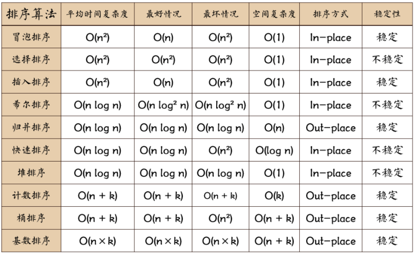
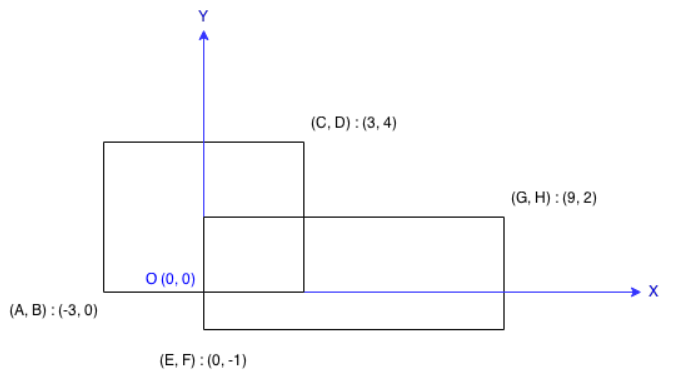
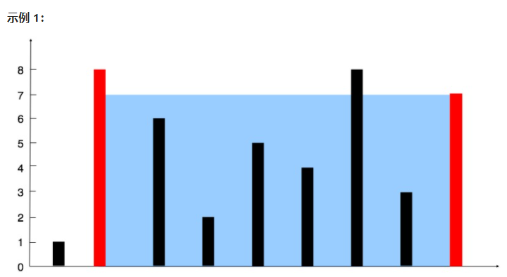
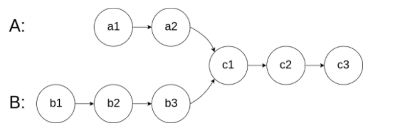
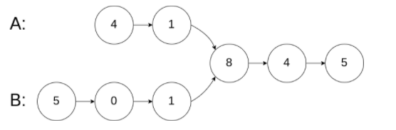
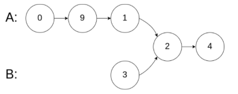
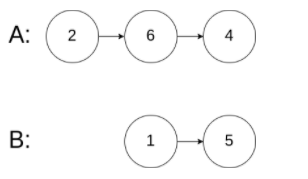

# 基础算法

## 排序



### 冒泡

```java
/**
     * 冒泡排序
     *
     * @param array
     * @return
     */
    public static int[] bubbleSort(int[] array) {
        if (array.length == 0)
            return array;
        for (int i = 0; i < array.length; i++)
            for (int j = 0; j < array.length - 1 - i; j++)
                if (array[j + 1] < array[j]) {
                    int temp = array[j + 1];
                    array[j + 1] = array[j];
                    array[j] = temp;
                }
        return array;
    }
```


### 选择

```java
/**
     * 选择排序
     * @param array
     * @return
     */
    public static int[] selectionSort(int[] array) {
        if (array.length == 0)
            return array;
        for (int i = 0; i < array.length; i++) {
            int minIndex = i;
            for (int j = i; j < array.length; j++) {
                if (array[j] < array[minIndex]) //找到最小的数
                    minIndex = j; //将最小数的索引保存
            }
            int temp = array[minIndex];
            array[minIndex] = array[i];
            array[i] = temp;
        }
        return array;
    }
```


### 插入

```java
/**
     * 插入排序
     * @param array
     * @return
     */
    public static int[] insertionSort(int[] array) {
        if (array.length == 0)
            return array;
        int current;
        for (int i = 0; i < array.length - 1; i++) {
            current = array[i + 1];
            int preIndex = i;
            while (preIndex >= 0 && current < array[preIndex]) {
                array[preIndex + 1] = array[preIndex];
                preIndex--;
            }
            array[preIndex + 1] = current;
        }
        return array;
    }
```


### 快速

```java
/**
     * 快速排序方法
     * @param array
     * @param start
     * @param end
     * @return
     */
    public static int[] QuickSort(int[] array, int start, int end) {
        if (array.length < 1 || start < 0 || end >= array.length || start > end) return null;
        int smallIndex = partition(array, start, end);
        if (smallIndex > start)
            QuickSort(array, start, smallIndex - 1);
        if (smallIndex < end)
            QuickSort(array, smallIndex + 1, end);
        return array;
    }
    /**
     * 快速排序算法——partition
     * @param array
     * @param start
     * @param end
     * @return
     */
    public static int partition(int[] array, int start, int end) {
        int pivot = (int) (start + Math.random() * (end - start + 1));
        int smallIndex = start - 1;
        swap(array, pivot, end);
        for (int i = start; i <= end; i++)
            if (array[i] <= array[end]) {
                smallIndex++;
                if (i > smallIndex)
                    swap(array, i, smallIndex);
            }
        return smallIndex;
    }

    /**
     * 交换数组内两个元素
     * @param array
     * @param i
     * @param j
     */
    public static void swap(int[] array, int i, int j) {
        int temp = array[i];
        array[i] = array[j];
        array[j] = temp;
    }
```

```java 
public class QuickSort {
    
    public static void main(String[] args) {

        int a[] = { 49, 38, 65, 97, 76, 13, 27, 49 };
        quickSort(a);
        System.out.println(Arrays.toString(a));
    }
    
    public static void quickSort(int a[]) {
        sort(a, 0, a.length - 1);
    }    
    
    public static void sort(int a[], int low, int hight) {
        int i, j, index;
        if (low > hight) {
            return;
        }
        i = low;
        j = hight;
        index = a[i]; // 用子表的第一个记录做基准
        while (i < j) { // 从表的两端交替向中间扫描
            while (i < j && a[j] >= index)
                j--;
            if (i < j)
                a[i++] = a[j];// 用比基准小的记录替换低位记录
            while (i < j && a[i] < index)
                i++;
            if (i < j) // 用比基准大的记录替换高位记录
                a[j--] = a[i];
        }
        a[i] = index;// 将基准数值替换回 a[i]
        sort(a, low, i - 1); // 对低子表进行递归排序
        sort(a, i + 1, hight); // 对高子表进行递归排序

    }


}
```


### 递归

```java

```


## 查找

### 二分

```java
/**
 * 折半查找
 * @param a 数组
 * @param key 待查找关键字
 * @return 返回折半下标， -1表示不存在该关键字
 */
public static int binarySearch(int[] a, int key) {
	int low, mid, high;
	low = 0;// 最小下标
	high = a.length - 1;// 最大小标
	while (low <= high) {
		mid = (high + low) / 2;// 折半下标
		if (key > a[mid]) {
			low = mid + 1; // 关键字比 折半值 大，则最小下标 调成 折半下标的下一位
		} else if (key < a[mid]) {
			high = mid - 1;// 关键字比 折半值 小，则最大下标 调成 折半下标的前一位
		} else {
			return mid; // 当 key == a[mid] 返回 折半下标
		}
	}
	return -1;
}
```


## 树遍历

### 前序

```java
    public void PreOrder(BinaryTreeNode node){
        if(node!=null){
            System.out.println(node.getData()); //先访问根节点
            PreOrder(node.getLeftChirld());  //先根遍历左子树
            PreOrder(node.getRightChirld());  //先根遍历右子树
        }
    }
```

**非递归**：

```java
	public static ArrayList preOrder1(TreeNode root){
		Stack<TreeNode> stack = new Stack<TreeNode>();
		ArrayList alist = new ArrayList();
		TreeNode p = root;
		while(p != null || !stack.empty()){
			while(p != null){
				alist.add(p.val);
				stack.push(p);
				p = p.left;
			}
			if(!stack.empty()){
				TreeNode temp = stack.pop();
				p = temp.right;
			}
		}
		return alist;
	}

```


### 中序

```java
    public void InOrder(BinaryTreeNode node){
        if(node!=null){
            InOrder(node.getLeftChirld());  //中根遍历左子树
            System.out.println(node);    //访问根节点
            InOrder(node.getRightChirld());  //中根遍历右子树
        }
    }
```

**非递归**：

```java
	public static ArrayList inOrder1(TreeNode root){
		ArrayList alist = new ArrayList();
		Stack<TreeNode> stack = new Stack<TreeNode>();
		TreeNode p = root;
		while(p != null || !stack.empty()){
			while(p != null){
				stack.push(p);
				p = p.left;
			}
			if(!stack.empty()){
				TreeNode temp = stack.pop();
				alist.add(temp.val);
				p = temp.right;
			}
		}
		return alist;
	}

```


### 后序

```java
    public void PostOrder(BinaryTreeNode node){
        if(node!=null){
            PostOrder(node.getLeftChirld());  //后根遍历左子树
            PostOrder(node.getRightChirld());  //后根遍历右子树
            System.out.println(node);   //访问根节点
        }
    }
}
```

**非递归**：

```java
public static ArrayList postOrder1(TreeNode root){
	ArrayList alist = new ArrayList();
	Stack<TreeNode> stack = new Stack<TreeNode>();
	if(root == null)
		return alist;
	TreeNode cur,pre = null;
	stack.push(root);
	while(!stack.empty()){
		cur = stack.peek();
		if((cur.left == null && cur.right == null) || (pre != null && (cur.left == pre || cur.right == pre))){
			TreeNode temp = stack.pop();
			alist.add(temp.val);
			pre = temp;
		}
		else{
			if(cur.right != null)
				stack.push(cur.right);
			if(cur.left != null)
				stack.push(cur.left);
		}
	}
	return alist;
}

```


# 常考知识点

## 复杂度分析

## 模拟法

## 链表

## 二分法

## 贪心算法

## 双指针算法

## 递归

## 分治

## 回溯

## 深度优先

## 广度优先

## 堆&二叉树

## 栈&队列

## 高级排序及其应用

## 高级二叉树及其应用

## 二叉搜索树

## 前缀及其应用

## 双指针及其进阶

## 高级搜索

## 初高级动态规划

## 单调栈

## 单调队列

## 字典树

## 并查集

## LRU Cache

## LFU Cache


# 常考题目

## 移动零

给定一个数组 nums，编写一个函数将所有 0 移动到数组的末尾，同时保持非零元素的相对顺序。

示例:

输入: [0,1,0,3,12]
输出: [1,3,12,0,0]
说明:

必须在原数组上操作，不能拷贝额外的数组。
尽量减少操作次数。

```java
class Solution {
    public void moveZeroes(int[] nums) {
        int indexNow = 0;
        int indexNum = 0;
        int m = nums.length;

        while(indexNum<m){
            if(nums[indexNum] != 0) {
                nums[indexNow++] = nums[indexNum];
            }
            ++indexNum;
        }

        for(int i = indexNow; i < m; i++){
            nums[i] = 0;
        }
    }
}

```


## 两数之和

给定一个整数数组 nums 和一个整数目标值 target，请你在该数组中找出 和为目标值 的那 两个 整数，并返回它们的数组下标。

你可以假设每种输入只会对应一个答案。但是，数组中同一个元素不能使用两遍。

你可以按任意顺序返回答案。

示例 1：

输入：nums = [2,7,11,15], target = 9
输出：[0,1]
解释：因为 nums[0] + nums[1] == 9 ，返回 [0, 1] 。
示例 2：

输入：nums = [3,2,4], target = 6
输出：[1,2]
示例 3：

输入：nums = [3,3], target = 6
输出：[0,1]

```java 
class Solution {
    public int[] twoSum(int[] nums, int target) {
        Map<Integer, Integer> hashtable = new HashMap<Integer, Integer>();
        for (int i = 0; i < nums.length; ++i) {
            if (hashtable.containsKey(target - nums[i])) {
                return new int[]{hashtable.get(target - nums[i]), i};
            }
            hashtable.put(nums[i], i);
        }
        return new int[0];
    }
}
```


## 反转链表

定义一个函数，输入一个链表的头节点，反转该链表并输出反转后链表的头节点。

示例:

输入: 1->2->3->4->5->NULL
输出: 5->4->3->2->1->NULL


```java 
class Solution {
    public ListNode reverseList(ListNode head) {
        ListNode prev = null;
        ListNode curr = head;
        while (curr != null) {
            ListNode next = curr.next;
            curr.next = prev;
            prev = curr;
            curr = next;
        }
        return prev;
    }
}
```


```java
class Solution {
    public ListNode reverseList(ListNode head) {
        if (head == null || head.next == null) {
            return head;
        }
        ListNode newHead = reverseList(head.next);
        head.next.next = head;
        head.next = null;
        return newHead;
    }
}

```


## 矩形图面积！！！！

### 计算重叠面积

在二维平面上计算出两个由直线构成的矩形重叠后形成的总面积。

每个矩形由其左下顶点和右上顶点坐标表示，如图所示。



示例:

输入: -3, 0, 3, 4, 0, -1, 9, 2
输出: 45
说明: 假设矩形面积不会超出 int 的范围。

```java


```


### 计算最小面积

给定在 xy 平面上的一组点，确定由这些点组成的矩形的最小面积，其中矩形的边平行于 x 轴和 y 轴。

如果没有任何矩形，就返回 0。

示例 1：

输入：[[1,1],[1,3],[3,1],[3,3],[2,2]]
输出：4
示例 2：

输入：[[1,1],[1,3],[3,1],[3,3],[4,1],[4,3]]
输出：2

```java
class Solution {
    public int minAreaRect(int[][] points) {
        Map<Integer, List<Integer>> rows = new TreeMap();
        for (int[] point: points) {
            int x = point[0], y = point[1];
            rows.computeIfAbsent(x, z-> new ArrayList()).add(y);
        }

        int ans = Integer.MAX_VALUE;
        Map<Integer, Integer> lastx = new HashMap();
        for (int x: rows.keySet()) {
            List<Integer> row = rows.get(x);
            Collections.sort(row);
            for (int i = 0; i < row.size(); ++i)
                for (int j = i+1; j < row.size(); ++j) {
                    int y1 = row.get(i), y2 = row.get(j);
                    int code = 40001 * y1 + y2;
                    if (lastx.containsKey(code))
                        ans = Math.min(ans, (x - lastx.get(code)) * (y2-y1));
                    lastx.put(code, x);
                }
        }

        return ans < Integer.MAX_VALUE ? ans : 0;
    }
}
```


## 盛最多水的容器

给你 n 个非负整数 a1，a2，...，an，每个数代表坐标中的一个点 (i, ai) 。在坐标内画 n 条垂直线，垂直线 i 的两个端点分别为 (i, ai) 和 (i, 0) 。找出其中的两条线，使得它们与 x 轴共同构成的容器可以容纳最多的水。

说明：你不能倾斜容器。



输入：[1,8,6,2,5,4,8,3,7]
输出：49 
解释：图中垂直线代表输入数组 [1,8,6,2,5,4,8,3,7]。在此情况下，容器能够容纳水（表示为蓝色部分）的最大值为 49。
示例 2：

输入：height = [1,1]
输出：1
示例 3：

输入：height = [4,3,2,1,4]
输出：16
示例 4：

输入：height = [1,2,1]
输出：2

```java 
class Solution {
    public int maxArea(int[] height) {
        int i = 0, j = height.length - 1, res = 0;
        while(i < j){
            res = height[i] < height[j] ? 
                Math.max(res, (j - i) * height[i++]): 
                Math.max(res, (j - i) * height[j--]); 
        }
        return res;
    }
}
```


```java
public class Solution {
    public int maxArea(int[] height) {
        int l = 0, r = height.length - 1;
        int ans = 0;
        while (l < r) {
            int area = Math.min(height[l], height[r]) * (r - l);
            ans = Math.max(ans, area);
            if (height[l] <= height[r]) {
                ++l;
            }
            else {
                --r;
            }
        }
        return ans;
    }
}
```


## 有效的括号

给定一个只包括 '('，')'，'{'，'}'，'['，']' 的字符串 s ，判断字符串是否有效。

有效字符串需满足：

左括号必须用相同类型的右括号闭合。
左括号必须以正确的顺序闭合。


示例 1：

输入：s = "()"
输出：true
示例 2：

输入：s = "()[]{}"
输出：true
示例 3：

输入：s = "(]"
输出：false
示例 4：

输入：s = "([)]"
输出：false
示例 5：

输入：s = "{[]}"
输出：true

```java
class Solution {
    public boolean isValid(String s) {
        int n = s.length();
        if (n % 2 == 1) {
            return false;
        }

        Map<Character, Character> pairs = new HashMap<Character, Character>() {{
            put(')', '(');
            put(']', '[');
            put('}', '{');
        }};
        Deque<Character> stack = new LinkedList<Character>();
        for (int i = 0; i < n; i++) {
            char ch = s.charAt(i);
            if (pairs.containsKey(ch)) {
                if (stack.isEmpty() || stack.peek() != pairs.get(ch)) {
                    return false;
                }
                stack.pop();
            } else {
                stack.push(ch);
            }
        }
        return stack.isEmpty();
    }
}
```


## 爬楼梯

假设你正在爬楼梯。需要 n 阶你才能到达楼顶。

每次你可以爬 1 或 2 个台阶。你有多少种不同的方法可以爬到楼顶呢？

注意：给定 n 是一个正整数。

示例 1：

输入： 2
输出： 2
解释： 有两种方法可以爬到楼顶。
1.  1 阶 + 1 阶
2.  2 阶
示例 2：

输入： 3
输出： 3
解释： 有三种方法可以爬到楼顶。
1.  1 阶 + 1 阶 + 1 阶
2.  1 阶 + 2 阶
3.  2 阶 + 1 阶

```java 
class Solution {
    public int climbStairs(int n) {
        int p = 0, q = 0, r = 1;
        for (int i = 1; i <= n; ++i) {
            p = q; 
            q = r; 
            r = p + q;
        }
        return r;
    }
}

```

```java

```


## 二叉树的最大深度


## 最长公共子序列！！！

给定两个字符串 text1 和 text2，返回这两个字符串的最长公共子序列的长度。

一个字符串的 子序列 是指这样一个新的字符串：它是由原字符串在不改变字符的相对顺序的情况下删除某些字符（也可以不删除任何字符）后组成的新字符串。
例如，"ace" 是 "abcde" 的子序列，但 "aec" 不是 "abcde" 的子序列。两个字符串的「公共子序列」是这两个字符串所共同拥有的子序列。

若这两个字符串没有公共子序列，则返回 0。

 

示例 1:

输入：text1 = "abcde", text2 = "ace" 
输出：3  
解释：最长公共子序列是 "ace"，它的长度为 3。
示例 2:

输入：text1 = "abc", text2 = "abc"
输出：3
解释：最长公共子序列是 "abc"，它的长度为 3。
示例 3:

输入：text1 = "abc", text2 = "def"
输出：0
解释：两个字符串没有公共子序列，返回 0。

```java
class Solution {

    public int longestCommonSubsequence(String text1, String text2) {

        int n = text1.length();
        int m = text2.length();
        if (n == 0 || m == 0) return 0;

        int[][] dp = new int[n + 1][m + 1];
        for (int i=1;i<=n;i++) {

            for (int j=1;j<=m;j++) {

                if (text1.charAt(i - 1) == text2.charAt(j - 1)) {

                    dp[i][j] = dp[i - 1][j - 1] + 1;
                } else {

                    dp[i][j] = Math.max(dp[i - 1][j], dp[i][j - 1]);
                }
            }
        }
        return dp[n][m];
    }
}
```


## N皇后


## 括号生成

数字 n 代表生成括号的对数，请你设计一个函数，用于能够生成所有可能的并且 有效的 括号组合。

 

示例 1：

输入：n = 3
输出：["((()))","(()())","(())()","()(())","()()()"]
示例 2：

输入：n = 1
输出：["()"]

```java 
class Solution {
    ArrayList[] cache = new ArrayList[100];

    public List<String> generate(int n) {
        if (cache[n] != null) {
            return cache[n];
        }
        ArrayList<String> ans = new ArrayList<String>();
        if (n == 0) {
            ans.add("");
        } else {
            for (int c = 0; c < n; ++c) {
                for (String left: generate(c)) {
                    for (String right: generate(n - 1 - c)) {
                        ans.add("(" + left + ")" + right);
                    }
                }
            }
        }
        cache[n] = ans;
        return ans;
    }

    public List<String> generateParenthesis(int n) {
        return generate(n);
    }
}
```


## 买卖股票最佳时机1

给定一个数组 prices ，它的第 i 个元素 prices[i] 表示一支给定股票第 i 天的价格。

你只能选择 某一天 买入这只股票，并选择在 未来的某一个不同的日子 卖出该股票。设计一个算法来计算你所能获取的最大利润。

返回你可以从这笔交易中获取的最大利润。如果你不能获取任何利润，返回 0 。

 

示例 1：

输入：[7,1,5,3,6,4]
输出：5
解释：在第 2 天（股票价格 = 1）的时候买入，在第 5 天（股票价格 = 6）的时候卖出，最大利润 = 6-1 = 5 。
     注意利润不能是 7-1 = 6, 因为卖出价格需要大于买入价格；同时，你不能在买入前卖出股票。
示例 2：

输入：prices = [7,6,4,3,1]
输出：0
解释：在这种情况下, 没有交易完成, 所以最大利润为 0。

```java
public class Solution {
    public int maxProfit(int prices[]) {
        int minprice = Integer.MAX_VALUE;
        int maxprofit = 0;
        for (int i = 0; i < prices.length; i++) {
            if (prices[i] < minprice) {
                minprice = prices[i];
            } else if (prices[i] - minprice > maxprofit) {
                maxprofit = prices[i] - minprice;
            }
        }
        return maxprofit;
    }
}
```


# 剑指offer

## 左旋转字符串

字符串的左旋转操作是把字符串前面的若干个字符转移到字符串的尾部。请定义一个函数实现字符串左旋转操作的功能。比如，输入字符串"abcdefg"和数字2，该函数将返回左旋转两位得到的结果"cdefgab"。

 

```java
class Solution {
    public String reverseLeftWords(String s, int n) {
        return s.substring(n, s.length()) + s.substring(0, n);
    }
}
```


```java
class Solution {
    public String reverseLeftWords(String s, int n) {
        StringBuilder res = new StringBuilder();
        for(int i = n; i < s.length(); i++)
            res.append(s.charAt(i));
        for(int i = 0; i < n; i++)
            res.append(s.charAt(i));
        return res.toString();
    }
}

```


## 二叉树的镜像

请完成一个函数，输入一个二叉树，该函数输出它的镜像。

例如输入：

  4   

/   \
  2     7
 / \   / \
1   3 6   9
镜像输出：

​    4 

  /   \
  7     2
 / \   / \
9   6 3   1


```java
class Solution {
    public TreeNode mirrorTree(TreeNode root) {
        if(root == null) return null;
        TreeNode tmp = root.left;
        root.left = mirrorTree(root.right);
        root.right = mirrorTree(tmp);
        return root;
    }
}
```


## 二叉树的深度

输入一棵二叉树的根节点，求该树的深度。从根节点到叶节点依次经过的节点（含根、叶节点）形成树的一条路径，最长路径的长度为树的深度。

例如：

给定二叉树 [3,9,20,null,null,15,7]，

    3
   / \
  9  20
    /  \
   15   7
返回它的最大深度 3 。


```java
class Solution {
    public int maxDepth(TreeNode root) {
        if(root == null) return 0;
        return Math.max(maxDepth(root.left), maxDepth(root.right)) + 1;
    }
}
```


```java
class Solution {
    public int maxDepth(TreeNode root) {
        if(root == null) return 0;
        List<TreeNode> queue = new LinkedList<>() {{ add(root); }}, tmp;
        int res = 0;
        while(!queue.isEmpty()) {
            tmp = new LinkedList<>();
            for(TreeNode node : queue) {
                if(node.left != null) tmp.add(node.left);
                if(node.right != null) tmp.add(node.right);
            }
            queue = tmp;
            res++;
        }
        return res;
    }
}
```


## 链表中倒数第k个节点

输入一个链表，输出该链表中倒数第k个节点。为了符合大多数人的习惯，本题从1开始计数，即链表的尾节点是倒数第1个节点。

例如，一个链表有 6 个节点，从头节点开始，它们的值依次是 1、2、3、4、5、6。这个链表的倒数第 3 个节点是值为 4 的节点。

示例：

```
给定一个链表: 1->2->3->4->5, 和 k = 2.

返回链表 4->5.
```


```java
class Solution {
    public ListNode getKthFromEnd(ListNode head, int k) {
        ListNode former = head, latter = head;
        for(int i = 0; i < k; i++)
            former = former.next;
        while(former != null) {
            former = former.next;
            latter = latter.next;
        }
        return latter;
    }
}
```


```java
class CQueue {
    LinkedList<Integer> A, B;
    public CQueue() {
        A = new LinkedList<Integer>();
        B = new LinkedList<Integer>();
    }
    public void appendTail(int value) {
        A.addLast(value);
    }
    public int deleteHead() {
        if(!B.isEmpty()) return B.removeLast();
        if(A.isEmpty()) return -1;
        while(!A.isEmpty())
            B.addLast(A.removeLast());
        return B.removeLast();
    }
}
```


## 打印从1到最大的n位数

输入数字 n，按顺序打印出从 1 到最大的 n 位十进制数。比如输入 3，则打印出 1、2、3 一直到最大的 3 位数 999。

示例 1:

输入: n = 1
输出: [1,2,3,4,5,6,7,8,9]


说明：

用返回一个整数列表来代替打印
n 为正整数


```java
class Solution {
    public int[] printNumbers(int n) {
        int end = (int)Math.pow(10, n) - 1;
        int[] res = new int[end];
        for(int i = 0; i < end; i++)
            res[i] = i + 1;
        return res;
    }
}
```


```java
class Solution {
    StringBuilder res;
    int count = 0, n;
    char[] num, loop = {'0', '1', '2', '3', '4', '5', '6', '7', '8', '9'};
    public String printNumbers(int n) {
        this.n = n;
        res = new StringBuilder(); // 数字字符串集
        num = new char[n]; // 定义长度为 n 的字符列表
        dfs(0); // 开启全排列递归
        res.deleteCharAt(res.length() - 1); // 删除最后多余的逗号
        return res.toString(); // 转化为字符串并返回
    }
    void dfs(int x) {
        if(x == n) { // 终止条件：已固定完所有位
            res.append(String.valueOf(num) + ","); // 拼接 num 并添加至 res 尾部，使用逗号隔开
            return;
        }
        for(char i : loop) { // 遍历 ‘0‘ - ’9‘
            num[x] = i; // 固定第 x 位为 i
            dfs(x + 1); // 开启固定第 x + 1 位
        }
    }
}
```


## 替换空格

请实现一个函数，把字符串 s 中的每个空格替换成"%20"。

示例 1：

输入：s = "We are happy."
输出："We%20are%20happy."


限制：

0 <= s 的长度 <= 10000

```java
class Solution {
    public String replaceSpace(String s) {
        StringBuilder res = new StringBuilder();
        for(Character c : s.toCharArray())
        {
            if(c == ' ') res.append("%20");
            else res.append(c);
        }
        return res.toString();
    }
}
```


## [从尾到头打印链表](https://leetcode-cn.com/problems/cong-wei-dao-tou-da-yin-lian-biao-lcof/)

输入一个正整数 target ，输出所有和为 target 的连续正整数序列（至少含有两个数）。

序列内的数字由小到大排列，不同序列按照首个数字从小到大排列。

示例 1：

输入：target = 9
输出：[[2,3,4],[4,5]]
示例 2：

输入：target = 15
输出：[[1,2,3,4,5],[4,5,6],[7,8]]

```java
class Solution {
    public int[] reversePrint(ListNode head) {
        LinkedList<Integer> stack = new LinkedList<Integer>();
        while(head != null) {
            stack.addLast(head.val);
            head = head.next;
        }
        int[] res = new int[stack.size()];
        for(int i = 0; i < res.length; i++)
            res[i] = stack.removeLast();
    return res;
    }
}
```


## [二叉搜索树的第k大节点](https://leetcode-cn.com/problems/er-cha-sou-suo-shu-de-di-kda-jie-dian-lcof/)

给定一棵二叉搜索树，请找出其中第k大的节点。

示例 1:

输入: root = [3,1,4,null,2], k = 1
   3
  / \
 1   4
  \
   2
输出: 4
示例 2:

输入: root = [5,3,6,2,4,null,null,1], k = 3
       5
      / \
     3   6
    / \
   2   4
  /
 1
输出: 4


```java
class Solution {
    int res, k;
    public int kthLargest(TreeNode root, int k) {
        this.k = k;
        dfs(root);
        return res;
    }
    void dfs(TreeNode root) {
        if(root == null) return;
        dfs(root.right);
        if(k == 0) return;
        if(--k == 0) res = root.val;
        dfs(root.left);
    }
}
```


## [反转链表](https://leetcode-cn.com/problems/fan-zhuan-lian-biao-lcof/)

定义一个函数，输入一个链表的头节点，反转该链表并输出反转后链表的头节点。

示例:

输入: 1->2->3->4->5->NULL
输出: 5->4->3->2->1->NULL

```java
class Solution {
	public ListNode reverseList(ListNode head) {
		//申请节点，pre和 cur，pre指向null
		ListNode pre = null;
		ListNode cur = head;
		ListNode tmp = null;
		while(cur!=null) {
			//记录当前节点的下一个节点
			tmp = cur.next;
			//然后将当前节点指向pre
			cur.next = pre;
			//pre和cur节点都前进一位
			pre = cur;
			cur = tmp;
		}
		return pre;
	}
}
```


## [二进制中1的个数](https://leetcode-cn.com/problems/er-jin-zhi-zhong-1de-ge-shu-lcof/)

请实现一个函数，输入一个整数（以二进制串形式），输出该数二进制表示中 1 的个数。例如，把 9 表示成二进制是 1001，有 2 位是 1。因此，如果输入 9，则该函数输出 2。

示例 1：

输入：00000000000000000000000000001011
输出：3
解释：输入的二进制串 00000000000000000000000000001011 中，共有三位为 '1'。
示例 2：

输入：00000000000000000000000010000000
输出：1
解释：输入的二进制串 00000000000000000000000010000000 中，共有一位为 '1'。
示例 3：

输入：11111111111111111111111111111101
输出：31
解释：输入的二进制串 11111111111111111111111111111101 中，共有 31 位为 '1'。

```java
public class Solution {
    public int hammingWeight(int n) {
        int res = 0;
        while(n != 0) {
            res += n & 1;
            n >>>= 1;
        }
        return res;
    }
}
```


## [合并两个排序的链表](https://leetcode-cn.com/problems/he-bing-liang-ge-pai-xu-de-lian-biao-lcof/)

输入两个递增排序的链表，合并这两个链表并使新链表中的节点仍然是递增排序的。

示例1：

输入：1->2->4, 1->3->4
输出：1->1->2->3->4->4

```java
class Solution {
    public ListNode mergeTwoLists(ListNode l1, ListNode l2) {
        ListNode dum = new ListNode(0), cur = dum;
        while(l1 != null && l2 != null) {
            if(l1.val < l2.val) {
                cur.next = l1;
                l1 = l1.next;
            }
            else {
                cur.next = l2;
                l2 = l2.next;
            }
            cur = cur.next;
        }
        cur.next = l1 != null ? l1 : l2;
        return dum.next;
    }
}

```


## [用两个栈实现队列](https://leetcode-cn.com/problems/yong-liang-ge-zhan-shi-xian-dui-lie-lcof/)

用两个栈实现一个队列。队列的声明如下，请实现它的两个函数 appendTail 和 deleteHead ，分别完成在队列尾部插入整数和在队列头部删除整数的功能。(若队列中没有元素，deleteHead 操作返回 -1 )

示例 1：

输入：
["CQueue","appendTail","deleteHead","deleteHead"]
[[],[3],[],[]]
输出：[null,null,3,-1]
示例 2：

输入：
["CQueue","deleteHead","appendTail","appendTail","deleteHead","deleteHead"]
[[],[],[5],[2],[],[]]
输出：[null,-1,null,null,5,2]

```java
class CQueue {
    Deque<Integer> stack1;
    Deque<Integer> stack2;
    
    public CQueue() {
        stack1 = new LinkedList<Integer>();
        stack2 = new LinkedList<Integer>();
    }
    
    public void appendTail(int value) {
        stack1.push(value);
    }
    
    public int deleteHead() {
        // 如果第二个栈为空
        if (stack2.isEmpty()) {
            while (!stack1.isEmpty()) {
                stack2.push(stack1.pop());
            }
        } 
        if (stack2.isEmpty()) {
            return -1;
        } else {
            int deleteItem = stack2.pop();
            return deleteItem;
        }
    }
}

```


## [和为s的连续正数序列](https://leetcode-cn.com/problems/he-wei-sde-lian-xu-zheng-shu-xu-lie-lcof/)

输入一个正整数 target ，输出所有和为 target 的连续正整数序列（至少含有两个数）。

序列内的数字由小到大排列，不同序列按照首个数字从小到大排列。

 

示例 1：

输入：target = 9
输出：[[2,3,4],[4,5]]
示例 2：

输入：target = 15
输出：[[1,2,3,4,5],[4,5,6],[7,8]]


```java 
public int[][] findContinuousSequence(int target) {
    int i = 1; // 滑动窗口的左边界
    int j = 1; // 滑动窗口的右边界
    int sum = 0; // 滑动窗口中数字的和
    List<int[]> res = new ArrayList<>();

    while (i <= target / 2) {
        if (sum < target) {
            // 右边界向右移动
            sum += j;
            j++;
        } else if (sum > target) {
            // 左边界向右移动
            sum -= i;
            i++;
        } else {
            // 记录结果
            int[] arr = new int[j-i];
            for (int k = i; k < j; k++) {
                arr[k-i] = k;
            }
            res.add(arr);
            // 左边界向右移动
            sum -= i;
            i++;
        }
    }

    return res.toArray(new int[res.size()][]);
}

```


## [调整数组顺序使奇数位于偶数前面](https://leetcode-cn.com/problems/diao-zheng-shu-zu-shun-xu-shi-qi-shu-wei-yu-ou-shu-qian-mian-lcof/)

输入一个整数数组，实现一个函数来调整该数组中数字的顺序，使得所有奇数位于数组的前半部分，所有偶数位于数组的后半部分。

示例：

输入：nums = [1,2,3,4]
输出：[1,3,2,4] 
注：[3,1,2,4] 也是正确的答案之一。

```java
class Solution {
    public int[] exchange(int[] nums) {
        int p = 0;
        int len = nums.length;
        for(int i = 0; i < len; i ++){
            if((nums[i]&1)==1){
                int tmp = nums[i];
                nums[i] = nums[p];
                nums[p++] = tmp;
            }
        }
        return nums;
    }
}

```


## [圆圈中最后剩下的数字](https://leetcode-cn.com/problems/yuan-quan-zhong-zui-hou-sheng-xia-de-shu-zi-lcof/)

0,1,···,n-1这n个数字排成一个圆圈，从数字0开始，每次从这个圆圈里删除第m个数字（删除后从下一个数字开始计数）。求出这个圆圈里剩下的最后一个数字。

例如，0、1、2、3、4这5个数字组成一个圆圈，从数字0开始每次删除第3个数字，则删除的前4个数字依次是2、0、4、1，因此最后剩下的数字是3。

示例 1：

输入: n = 5, m = 3
输出: 3
示例 2：

输入: n = 10, m = 17
输出: 2

```java
class Solution {
    public int lastRemaining(int n, int m) {
        int ans = 0;
        // 最后一轮剩下2个人，所以从2开始反推
        for (int i = 2; i <= n; i++) {
            ans = (ans + m) % i;
        }
        return ans;
    }
}
```


## [两个链表的第一个公共节点](https://leetcode-cn.com/problems/liang-ge-lian-biao-de-di-yi-ge-gong-gong-jie-dian-lcof/)

输入两个链表，找出它们的第一个公共节点。

如下面的两个链表：

在节点 c1 开始相交。



示例 1：



输入：intersectVal = 8, listA = [4,1,8,4,5], listB = [5,0,1,8,4,5], skipA = 2, skipB = 3
输出：Reference of the node with value = 8
输入解释：相交节点的值为 8 （注意，如果两个列表相交则不能为 0）。从各自的表头开始算起，链表 A 为 [4,1,8,4,5]，链表 B 为 [5,0,1,8,4,5]。在 A 中，相交节点前有 2 个节点；在 B 中，相交节点前有 3 个节点。


示例 2：



输入：intersectVal = 2, listA = [0,9,1,2,4], listB = [3,2,4], skipA = 3, skipB = 1
输出：Reference of the node with value = 2
输入解释：相交节点的值为 2 （注意，如果两个列表相交则不能为 0）。从各自的表头开始算起，链表 A 为 [0,9,1,2,4]，链表 B 为 [3,2,4]。在 A 中，相交节点前有 3 个节点；在 B 中，相交节点前有 1 个节点。


示例 3：



输入：intersectVal = 0, listA = [2,6,4], listB = [1,5], skipA = 3, skipB = 2
输出：null
输入解释：从各自的表头开始算起，链表 A 为 [2,6,4]，链表 B 为 [1,5]。由于这两个链表不相交，所以 intersectVal 必须为 0，而 skipA 和 skipB 可以是任意值。
解释：这两个链表不相交，因此返回 null。


注意：

如果两个链表没有交点，返回 null.
在返回结果后，两个链表仍须保持原有的结构。
可假定整个链表结构中没有循环。
程序尽量满足 O(n) 时间复杂度，且仅用 O(1) 内存。

```java
public class Solution {
    public ListNode getIntersectionNode(ListNode headA, ListNode headB) {
        ListNode A = headA, B = headB;
        while (A != B) {
            A = A != null ? A.next : headB;
            B = B != null ? B.next : headA;
        }
        return A;
    }
}

```


说明：此方法过于巧妙，没必要深究，双指针方法即可


## [第一个只出现一次的字符](https://leetcode-cn.com/problems/di-yi-ge-zhi-chu-xian-yi-ci-de-zi-fu-lcof/)

在字符串 s 中找出第一个只出现一次的字符。如果没有，返回一个单空格。 s 只包含小写字母。

示例:

s = "abaccdeff"
返回 "b"

s = "" 
返回 " "

```java

class Solution {
    public char firstUniqChar(String s) {
        HashMap<Character, Boolean> dic = new HashMap<>();
        char[] sc = s.toCharArray();
        for(char c : sc)
            dic.put(c, !dic.containsKey(c));
        for(char c : sc)
            if(dic.get(c)) return c;
        return ' ';
    }
}

```


## [连续子数组的最大和](https://leetcode-cn.com/problems/lian-xu-zi-shu-zu-de-zui-da-he-lcof/)

输入一个整型数组，数组中的一个或连续多个整数组成一个子数组。求所有子数组的和的最大值。

要求时间复杂度为O(n)。

示例1:

输入: nums = [-2,1,-3,4,-1,2,1,-5,4]
输出: 6
解释: 连续子数组 [4,-1,2,1] 的和最大，为 6。

```java
class Solution {
    public int maxSubArray(int[] nums) {
        int res = nums[0];
        for(int i = 1; i < nums.length; i++) {
            nums[i] += Math.max(nums[i - 1], 0);
            res = Math.max(res, nums[i]);
        }
        return res;
    }
}

```


## [删除链表的节点](https://leetcode-cn.com/problems/shan-chu-lian-biao-de-jie-dian-lcof/)

给定单向链表的头指针和一个要删除的节点的值，定义一个函数删除该节点。

返回删除后的链表的头节点。

注意：此题对比原题有改动

示例 1:

输入: head = [4,5,1,9], val = 5
输出: [4,1,9]
解释: 给定你链表中值为 5 的第二个节点，那么在调用了你的函数之后，该链表应变为 4 -> 1 -> 9.
示例 2:

输入: head = [4,5,1,9], val = 1
输出: [4,5,9]
解释: 给定你链表中值为 1 的第三个节点，那么在调用了你的函数之后，该链表应变为 4 -> 5 -> 9.


说明：

题目保证链表中节点的值互不相同
若使用 C 或 C++ 语言，你不需要 free 或 delete 被删除的节点


```java
class Solution {
    public ListNode deleteNode(ListNode head, int val) {
        if(head.val == val) return head.next;
        ListNode pre = head, cur = head.next;
        while(cur != null && cur.val != val) {
            pre = cur;
            cur = cur.next;
        }
        if(cur != null) pre.next = cur.next;
        return head;
    }
}

```


## [平衡二叉树](https://leetcode-cn.com/problems/ping-heng-er-cha-shu-lcof/)

输入一棵二叉树的根节点，判断该树是不是平衡二叉树。如果某二叉树中任意节点的左右子树的深度相差不超过1，那么它就是一棵平衡二叉树。

 

示例 1:

给定二叉树 [3,9,20,null,null,15,7]

    3
   / \
  9  20
    /  \
   15   7
返回 true 。

示例 2:

给定二叉树 [1,2,2,3,3,null,null,4,4]

       1
      / \
     2   2
    / \
   3   3
  / \
 4   4
返回 false 。


```java


```


## [对称的二叉树](https://leetcode-cn.com/problems/dui-cheng-de-er-cha-shu-lcof/)

请实现一个函数，用来判断一棵二叉树是不是对称的。如果一棵二叉树和它的镜像一样，那么它是对称的。

例如，二叉树 [1,2,2,3,4,4,3] 是对称的。

    1
   / \
  2   2
 / \ / \
3  4 4  3
但是下面这个 [1,2,2,null,3,null,3] 则不是镜像对称的:

    1
   / \
  2   2
   \   \
   3    3

 

示例 1：

输入：root = [1,2,2,3,4,4,3]
输出：true
示例 2：

输入：root = [1,2,2,null,3,null,3]
输出：false

```java


```


## [不用加减乘除做加法](https://leetcode-cn.com/problems/bu-yong-jia-jian-cheng-chu-zuo-jia-fa-lcof/)

写一个函数，求两个整数之和，要求在函数体内不得使用 “+”、“-”、“*”、“/” 四则运算符号。

示例:

输入: a = 1, b = 1
输出: 2


提示：

a, b 均可能是负数或 0
结果不会溢出 32 位整数

```java
class Solution {
    public int add(int a, int b) {
        while(b != 0) { // 当进位为 0 时跳出
            int c = (a & b) << 1;  // c = 进位
            a ^= b; // a = 非进位和
            b = c; // b = 进位
        }
        return a;
    }
}
```


## [包含min函数的栈](https://leetcode-cn.com/problems/bao-han-minhan-shu-de-zhan-lcof/)

定义栈的数据结构，请在该类型中实现一个能够得到栈的最小元素的 min 函数在该栈中，调用 min、push 及 pop 的时间复杂度都是 O(1)。

示例:

MinStack minStack = new MinStack();
minStack.push(-2);
minStack.push(0);
minStack.push(-3);
minStack.min();   --> 返回 -3.
minStack.pop();
minStack.top();      --> 返回 0.
minStack.min();   --> 返回 -2.


提示：

各函数的调用总次数不超过 20000 次

```java
class MinStack {
    Stack<Integer> A, B;
    public MinStack() {
        A = new Stack<>();
        B = new Stack<>();
    }
    public void push(int x) {
        A.add(x);
        if(B.empty() || B.peek() >= x)
            B.add(x);
    }
    public void pop() {
        if(A.pop().equals(B.peek()))
            B.pop();
    }
    public int top() {
        return A.peek();
    }
    public int min() {
        return B.peek();
    }
}
```


## [最小的k个数](https://leetcode-cn.com/problems/zui-xiao-de-kge-shu-lcof/)

输入整数数组 arr ，找出其中最小的 k 个数。例如，输入4、5、1、6、2、7、3、8这8个数字，则最小的4个数字是1、2、3、4。

 

示例 1：

输入：arr = [3,2,1], k = 2
输出：[1,2] 或者 [2,1]
示例 2：

输入：arr = [0,1,2,1], k = 1
输出：[0]

```java
class Solution {
    public int[] getLeastNumbers(int[] arr, int k) {
        if (k == 0 || arr.length == 0) {
            return new int[0];
        }
        // 最后一个参数表示我们要找的是下标为k-1的数
        return quickSearch(arr, 0, arr.length - 1, k - 1);
    }

    private int[] quickSearch(int[] nums, int lo, int hi, int k) {
        // 每快排切分1次，找到排序后下标为j的元素，如果j恰好等于k就返回j以及j左边所有的数；
        int j = partition(nums, lo, hi);
        if (j == k) {
            return Arrays.copyOf(nums, j + 1);
        }
        // 否则根据下标j与k的大小关系来决定继续切分左段还是右段。
        return j > k? quickSearch(nums, lo, j - 1, k): quickSearch(nums, j + 1, hi, k);
    }

    // 快排切分，返回下标j，使得比nums[j]小的数都在j的左边，比nums[j]大的数都在j的右边。
    private int partition(int[] nums, int lo, int hi) {
        int v = nums[lo];
        int i = lo, j = hi + 1;
        while (true) {
            while (++i <= hi && nums[i] < v);
            while (--j >= lo && nums[j] > v);
            if (i >= j) {
                break;
            }
            int t = nums[j];
            nums[j] = nums[i];
            nums[i] = t;
        }
        nums[lo] = nums[j];
        nums[j] = v;
        return j;
    }
}

```


## [在排序数组中查找数字 I](https://leetcode-cn.com/problems/zai-pai-xu-shu-zu-zhong-cha-zhao-shu-zi-lcof/)

统计一个数字在排序数组中出现的次数。

示例 1:

输入: nums = [5,7,7,8,8,10], target = 8
输出: 2
示例 2:

输入: nums = [5,7,7,8,8,10], target = 6
输出: 0

```java
class Solution:
    def search(self, nums: [int], target: int) -> int:
        # 搜索右边界 right
        i, j = 0, len(nums) - 1
        while i <= j:
            m = (i + j) // 2
            if nums[m] <= target: i = m + 1
            else: j = m - 1
        right = i
        # 若数组中无 target ，则提前返回
        if j >= 0 and nums[j] != target: return 0
        # 搜索左边界 left
        i = 0
        while i <= j:
            m = (i + j) // 2
            if nums[m] < target: i = m + 1
            else: j = m - 1
        left = j
        return right - left - 1

```


```java
class Solution {
    public int search(int[] nums, int target) {
        return helper(nums, target) - helper(nums, target - 1);
    }
    int helper(int[] nums, int tar) {
        int i = 0, j = nums.length - 1;
        while(i <= j) {
            int m = (i + j) / 2;
            if(nums[m] <= tar) i = m + 1;
            else j = m - 1;
        }
        return i;
    }
}

```


## [旋转数组的最小数字](https://leetcode-cn.com/problems/xuan-zhuan-shu-zu-de-zui-xiao-shu-zi-lcof/)

把一个数组最开始的若干个元素搬到数组的末尾，我们称之为数组的旋转。输入一个递增排序的数组的一个旋转，输出旋转数组的最小元素。例如，数组 [3,4,5,1,2] 为 [1,2,3,4,5] 的一个旋转，该数组的最小值为1。  

示例 1：

输入：[3,4,5,1,2]
输出：1
示例 2：

输入：[2,2,2,0,1]
输出：0


```java
class Solution {
    public int minArray(int[] numbers) {
        int i = 0, j = numbers.length - 1;
        while (i < j) {
            int m = (i + j) / 2;
            if (numbers[m] > numbers[j]) i = m + 1;
            else if (numbers[m] < numbers[j]) j = m;
            else j--;
        }
        return numbers[i];
    }
}

```


# 工具使用

## IEDA

### 代码重构

**抽取：**

ctrl+alt+m：抽取成公共方法

ctrl+alt+c：抽取常量

ctrl+alt+f：抽取公共信息

ctrl+alt+v：抽取变量

ctrl+alt+p：抽取方法参数


**重构：**

ctrl+F6：重构方法

shift+F6：方法重命名


# Docker

## MySQL容器命令

### 新建容器

```shell
docker run -p 3306:3306 --name mysql \

 	-v /mydata/mysql/conf:/etc/mysql/ \

 	-v /mydata/mysql/log:/var/log/mysql \

 	-v /mydata/mysql/data:/var/lib/mysql \

 	-e MYSQL_ROOT_PASSWORD=root \

 	-d mysql:5.7

```

### 查看容器ID

```shell
docker ps -a
```

### 启动容器

```shell
docker start $#{containerID}
```

### 重启

```shell
docker restart mysql
```

### 设置开机自启动

```shell
docker update mysql --restart=always
```


## redis容器命令

### 新建容器

```shell
docker run -p 6379:6379 --name redis \
-v /mydata/redis/data:/data \
-v /mydata/redis/conf/redis.conf:/etc/redis/redis.conf \
-d redis:4.0 redis-server /etc/redis/redis.conf
```

### 启动容器

```shell
docker start $#{containerID}
```

### 设置开机自启动

```shell
docker update redis--restart=always
```


