# 一、Spring家族主流成员介绍

## 1 简要介绍

Spring 就像一个大家族，有众多衍生产品例如 Boot，Security，JPA等等。但他们的基础都是**Spring 的 IOC 和 AOP**，**IOC提供了依赖注入的容器，而AOP解决了面向切面的编程**，然后在此两者的基础上实现了其他衍生产品的高级功能；Spring MVC是基于 Servlet 的一个 MVC 框架，主要解决 WEB 开发的问题;而Spring Boot 是基于Spring的一套快速开发整合包，Spring Boot遵循的也是约定优于配置原则,它的目的在于实现自动配置，降低项目搭建的复杂度;Spring Cloud是一系列框架的有序集合。它利用Spring Boot的开发便利性巧妙地简化了分布式系统基础设施的开发，如服务发现注册、配置中心、消息总线、负载均衡、断路器、数据监控等，都可以用Spring Boot的开发风格做到一键启动和部署。

对于大部分开发者而言，平时接触最多的应该就是Spring MVC以及Spring Boot了，本文将分别对Spring，Spring MVC,Spring Boot以及SpringCloud做总体概述，并分析阐述它们各自想要解决的问题，以便初学者能更好的了解Spring及相关概念。


**说明：Spring，Spring MVC，Spring Boot 三者比较**

这三者专注的领域不同，解决的问题也不一样；总的来说，Spring 就像一个大家族，有众多衍生产品例如 Boot，Security，JPA等等。但他们的基础都是Spring 的 IOC 和 AOP，IOC提供了依赖注入的容器，而AOP解决了面向切面的编程，然后在此两者的基础上实现了其他衍生产品的高级功能；Spring MVC是基于 Servlet 的一个 MVC 框架，主要解决 WEB 开发的问题，因为 Spring 的配置非常复杂，各种xml，properties处理起来比较繁琐。于是为了简化开发者的使用，Spring社区创造性地推出了Spring Boot，它遵循约定优于配置，极大降低了Spring使用门槛，但又不失Spring原本灵活强大的功能


## 2 概念解读

### 2.1 什么是Spring？

2.1.1 简介

Spring是一个轻量级的控制反转(IoC)和面向切面(AOP)的容器框架。

Spring是一个开源框架，Spring是于2003 年兴起的一个轻量级的Java 开发框架。它是为了解决企业应用开发的复杂性而创建的。框架的主要优势之一就是其分层架构，分层架构允许使用者选择使用哪一个组件，同时为 J2EE 应用程序开发提供集成的框架。然而，Spring的用途不仅限于服务器端的开发。从简单性、可测试性和松耦合的角度而言，任何Java应用都可以从Spring中受益。Spring的核心是控制反转（IoC）和面向切面（AOP）。简单来说，Spring是一个分层的JavaSE/EE full-stack(一站式) 轻量级开源框架。

2.1.2 Spring的初衷

1、JAVA EE开发应该更加简单。

2、使用接口而不是使用类，是更好的编程习惯。Spring将使用接口的复杂度几乎降低到了零。

3、为JavaBean提供了一个更好的应用配置框架。

4、更多地强调面向对象的设计，而不是现行的技术如JAVA EE。

5、尽量减少不必要的异常捕捉。

6、使应用程序更加容易测试。

2.1.3 Spring的目标

1、可以令人方便愉快的使用Spring。

2、应用程序代码并不依赖于Spring APIs。

3、Spring不和现有的解决方案竞争，而是致力于将它们融合在一起。

2.1.4　Spring的基本组成

1、最完善的轻量级核心框架。

2、通用的事务管理抽象层。

3、JDBC抽象层。

4、集成了Toplink, Hibernate, JDO, and iBATIS SQL Maps。

5、AOP功能。

6、灵活的MVC Web应用框架。

2.1.５　Spring的发展

Spring框架几乎涉及到了Java企业级服务开发的所有方面，也几乎针对所有开发常用的模式、中间件、数据库进行了整合适配。

Spring框架经历了几个阶段：

1.第一个阶段推出的Core、Security、Data是把单体应用开发服务好。不仅仅提供了便捷的数据库访问、Web MVC等必要功能，而且通过AOP、IOC两大利器让我们的程序内在能够做到低耦合可扩展。

2.第二个阶段推出的Boot的意义不仅仅是加速了开发效率而且能让我们的程序从可用变为好用，应用程序核心业务逻辑可能只有70%的工作量，要让程序在线上跑的愉快还有30%的监控日志打点等工作量需要去做。

3.第三个阶段推出的Cloud的意义在于推动了微服务架构的落地。让不具备开发微服务基础套件的小型互联网公司也能享受到免费的开箱即用的微服务解决方案。其实很多人不是看了微服务的架构思想去寻找解决方案，而是了解到了Spring Cloud才去了解微服务思想从而落地的。

4.目前属于第四个阶段，大力发展Cloud Dataflow+容器。Dataflow的思想是不管是做实时消息处理的服务还是临时运行的任务，都可以认为是服务的组件，如果可以有一套DSL来定义这些组件之间的交互方式，然后在容器中进行自由组合、部署、伸缩，那么架构会非常灵活。下图是Dataflow管理界面的一个示意图。

Spring的发展可以看到互联网架构的发展，Spring给我们带来相当多的技术启发，从软件设计模式的启发慢慢到了架构的启发，甚至我觉得Spring是为Java开发打造了架构风格的模板，接下去Spring继续发展2到3年有望成为架构标准，我在想这个时候应用架构师何去何从？


### 2.2 什么是SpringMVC?

2.2.1 简介

Spring MVC是基于 Servlet 的一个 MVC 框架，主要解决 WEB 开发的问题。

2.2.2 用途介绍

Spring MVC是Spring的一部分，主要用于开发WEB应用和网络接口，它是Spring的一个模块，通过Dispatcher Servlet, ModelAndView 和 View Resolver，让应用开发变得很容易。

一个典型的Spring MVC应用开发分为下面几步：
首先通过配置文件声明Dispatcher Servlet：

通过配置文件声明servlet详情，如MVC resource，data source，bean等

若需添加其它功能，如security，则需添加对应配置：

增加业务代码，如controller，service，model等，最后生成war包，通过容器进行启动

2.2.3 SpringMVC常用注解

  @Controller

　　负责注册一个bean 到spring 上下文中
@RequestMapping

　　注解为控制器指定可以处理哪些 URL 请求
@RequestBody

　　该注解用于读取Request请求的body部分数据，使用系统默认配置的HttpMessageConverter进行解析，然后把相应的数据绑定到要返回的对象上 ,再把HttpMessageConverter返回的对象数据绑定到 controller中方法的参数上

@ResponseBody

　　 该注解用于将Controller的方法返回的对象，通过适当的HttpMessageConverter转换为指定格式后，写入到Response对象的body数据区

@ModelAttribute 　　

　　在方法定义上使用 @ModelAttribute 注解：Spring MVC 在调用目标处理方法前，会先逐个调用在方法级上标注了@ModelAttribute 的方法

　　在方法的入参前使用 @ModelAttribute 注解：可以从隐含对象中获取隐含的模型数据中获取对象，再将请求参数 –绑定到对象中，再传入入参将方法入参对象添加到模型中 

@RequestParam　

　　在处理方法入参处使用 @RequestParam 可以把请求参 数传递给请求方法

@PathVariable

　　绑定 URL 占位符到入参
@ExceptionHandler

　　注解到方法上，出现异常时会执行该方法
@ControllerAdvice

　　使一个Contoller成为全局的异常处理类，类中用@ExceptionHandler方法注解的方法可以处理所有Controller发生的异常


### 2.3 什么是SpringBoot?

2.3.1 简介

Spring Boot 是基于Spring的一套快速开发整合包。

Spring Boot 简化了基于Spring的应用开发，只需要“run”就能创建一个独立的、生产级别的Spring应用。Spring Boot为Spring平台及第三方库提供开箱即用的设置（提供默认设置），这样我们就可以简单的开始。多数SpringBoot应用只需要很少的Spring配置。

2.3.2 用途介绍

Spring Boot的核心思想就是约定大于配置,一切自动完成。采用 Spring Boot可以大大的简化你的开发模式,所有你想集成的常用框架,它都有对应的组件支持。你甚至都不用额外的WEB容器，直接生成jar包执行即可，因为spring-boot-starter-web模块中包含有一个内置tomcat，可以直接提供容器使用；基于Spring Boot，不是说原来的配置没有了，而是Spring Boot有一套默认配置，我们可以把它看做比较通用的约定，而Spring Boot遵循的也是约定优于配置原则，同时，如果你需要使用到Spring以往提供的各种复杂但功能强大的配置功能，SpringBoot一样支持

在Spring Boot中，你会发现你引入的所有包都是starter形式，如：

· spring-boot-starter-web-services，针对SOAP Web Services

· spring-boot-starter-web，针对Web应用与网络接口

· spring-boot-starter-jdbc，针对JDBC

· spring-boot-starter-data-jpa，一套JPA应用框架

· spring-boot-starter-cache，针对缓存支持

· 等等

Spring Boot对starter的解释如下：

Starters are a set of convenient dependency descriptors that you can include in your application. You get a one-stop-shop for all the Spring and related technology that you need, without having to hunt through sample code and copy paste loads of dependency descriptors. For example, if you want to get started using Spring and JPA for database access, just include the spring-boot-starter-data-jpa dependency in your project, and you are good to go

 

这句话的译意为：

Starters是一系列极其方便的依赖描述，通过在你的项目中包含这些starter，你可以一站式获得你所需要的服务，而无需像以往那样copy各种示例配置及代码，然后调试，真正做到开箱即用；比如你想使用Spring JPA进行数据操作，只需要在你的项目依赖中引入spring-boot-starter-data-jpa即可。

 

2.3.3 主要目标

1.为所有Spring的开发提供一个从根本上更快的入门体验

2.开箱即用，但通过自己设置参数，即可快速摆脱这种方式。

3.提供了一些大型项目中常见的非功能性特性，如内嵌服务器、安全、指标，健康检测、外部化配置等

4.绝对没有代码生成，也无需 XML 配置。


### 2.4 什么是SpringCloud?

2.4.1 简介

SpringCloud是一系列框架的有序集合。它利用Spring Boot的开发便利性巧妙地简化了分布式系统基础设施的开发，如服务发现注册、配置中心、消息总线、负载均衡、断路器、数据监控等，都可以用Spring Boot的开发风格做到一键启动和部署。

2.4.2 Spring Cloud组成

Spring Cloud的子项目，大致可分成两类，一类是对现有成熟框架”Spring Boot化”的封装和抽象，也是数量最多的项目；第二类是开发了一部分分布式系统的基础设施的实现，如Spring Cloud Stream扮演的就是kafka, ActiveMQ这样的角色。对于我们想快速实践微服务的开发者来说，第一类子项目就已经足够使用，如：

.Spring Cloud Netflix
　　是对Netflix开发的一套分布式服务框架的封装，包括服务的发现和注册，负载均衡、断路器、REST客户端、请求路由等。

.Spring Cloud Config
　　将配置信息中央化保存, 配置Spring Cloud Bus可以实现动态修改配置文件

.Spring Cloud Bus
　　分布式消息队列，是对Kafka, MQ的封装

.Spring Cloud Security
　　对Spring Security的封装，并能配合Netflix使用

.Spring Cloud Zookeeper
　　对Zookeeper的封装，使之能配置其它Spring Cloud的子项目使用

.Spring Cloud Eureka

Spring Cloud Eureka 是 Spring Cloud Netflix 微服务套件中的一部分，它基于Netflix Eureka 做了二次封装，主要负责完成微服务架构中的服务治理功能。

2.4.3  Spring Cloud架构

　我们从整体来看一下 Spring Cloud主要的组件,以及它的访间流程
 1、外部或者内部的非 Spring Cloud目都统一通过API网关(Zuul)来访可内部服务.
 2、网关接收到请求后,从注册中心( Eureka)获取可用服务
 3、由 Ribbon进行均负载后,分发到后端的具体实例
 4、徹服务之间通过 Feign进行通信处理业务
 5、 Hystrix负责处理服务超时熔断
 6、 Turbine监控服务间的调用和焠断相关指标


# 二、Mybatis介绍

## 1 什么是Mybatis

MyBatis 本是apache的一个开源项目iBatis, 2010年这个项目由apache software foundation 迁移到了google code，并且改名为MyBatis 。iBATIS一词来源于“internet”和“abatis”的组合，是一个基于Java的持久层框架。iBATIS提供的持久层框架包括SQL Maps和Data Access Objects（DAO）。

官网对Mybatis的介绍更加具有权威性：

```tiki wiki
MyBatis 是支持定制化 SQL、存储过程以及高级映射的优秀的持久层框架。MyBatis 避免了几乎所有的 JDBC 代码和手工设置参数以及抽取结果集。MyBatis 使用简单的 XML 或注解来配置和映射基本体，将接口和 Java 的 POJOs(Plain Old Java Objects,普通的 Java对象)映射成数据库中的记录。
```

MyBatis是iBatis的升级版，用法有很多的相似之处，但是MyBatis进行了重要的改进。


## 2 MyBatis的优缺点

### 2.1 优点：

2.1.1、简单易学

mybatis本身就很小且简单。没有任何第三方依赖，最简单安装只要两个jar文件+配置几个sql映射文件易于学习，易于使用，通过文档和源代码，可以比较完全的掌握它的设计思路和实现。

2.1.2、灵活

mybatis不会对应用程序或者数据库的现有设计强加任何影响。 sql写在xml里，便于统一管理和优化。通过sql基本上可以实现我们不使用数据访问框架可以实现的所有功能，或许更多。

2.1.3、解除sql与程序代码的耦合

通过提供DAL层，将业务逻辑和数据访问逻辑分离，使系统的设计更清晰，更易维护，更易单元测试。sql和代码的分离，提高了可维护性。

2.1.4、提供映射标签，支持对象与数据库的orm字段关系映射

2.1.5、提供对象关系映射标签，支持对象关系组建维护

2.1.6、提供xml标签，支持编写动态sql。

### 2.2 缺点：

2.2.1、编写SQL语句时工作量很大，尤其是字段多、关联表多时，更是如此。

2.2.2、SQL语句依赖于数据库，导致数据库移植性差，不能更换数据库。

2.2.3、框架还是比较简陋，功能尚有缺失，虽然简化了数据绑定代码，但是整个底层数据库查询实际还是要自己写的，工作量也比较大，而且不太容易适应快速数据库修改。

2.2.4、二级缓存机制不佳

### 2.3 总结

mybatis的优点同样是mybatis的缺点，正因为mybatis使用简单，数据的可靠性、完整性的瓶颈便更多依赖于程序员对sql的使用水平上了。sql写在xml里，虽然方便了修改、优化和统一浏览，但可读性很低，调试也非常困难，也非常受限。


## 3 MyBatis与MyBatis Plus

### 3.1 区别一

MyBatis：一种操作数据库的框架，提供一种Mapper类，支持让你用java代码进行增删改查的数据库操作，省去了每次都要手写sql语句的麻烦。但是！有一个前提，你得先在xml中写好sql语句，是不是很麻烦？于是有下面的Mybatis Generator。

Mybatis Generator：自动为Mybatis生成简单的增删改查sql语句的工具，省去一大票时间，两者配合使用，开发速度快到飞起。

Mybatis Plus：国人团队苞米豆在Mybatis的基础上开发的框架，在Mybatis基础上扩展了许多功能，荣获了2018最受欢迎国产开源软件第5名，当然也有配套的Mybatis Plus Generator
Mybatis Plus Generator：同样为苞米豆开发，比Mybatis Generator更加强大，支持功能更多，自动生成Entity、Mapper、Service、Controller等

总结：
数据库框架：Mybatis Plus > Mybatis
代码生成器：Mybatis Plus Generator > Mybatis Generator

### 3.2 区别二

Mybatis-Plus是一个Mybatis的增强工具，它在Mybatis的基础上做了增强，却不做改变。我们在使用Mybatis-Plus之后既可以使用Mybatis-Plus的特有功能，又能够正常使用Mybatis的原生功能。Mybatis-Plus(以下简称MP)是为简化开发、提高开发效率而生，但它也提供了一些很有意思的插件，比如SQL性能监控、乐观锁、执行分析等。

Mybatis虽然已经给我们提供了很大的方便，但它还是有不足之处，实际上没有什么东西是完美的，MP的存在就是为了稍稍弥补Mybatis的不足。在我们使用Mybatis时会发现，每当要写一个业务逻辑的时候都要在DAO层写一个方法，再对应一个SQL，即使是简单的条件查询、即使仅仅改变了一个条件都要在DAO层新增一个方法，针对这个问题，MP就提供了一个很好的解决方案，可自行研究。


# 三、如何用idea创建springboot项目

1.File->new->project；

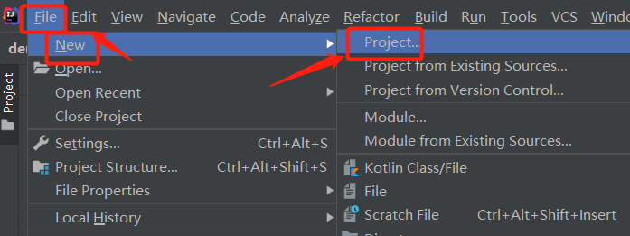

2.选择“Spring Initializr”，点击next；（jdk1.8默认即可）

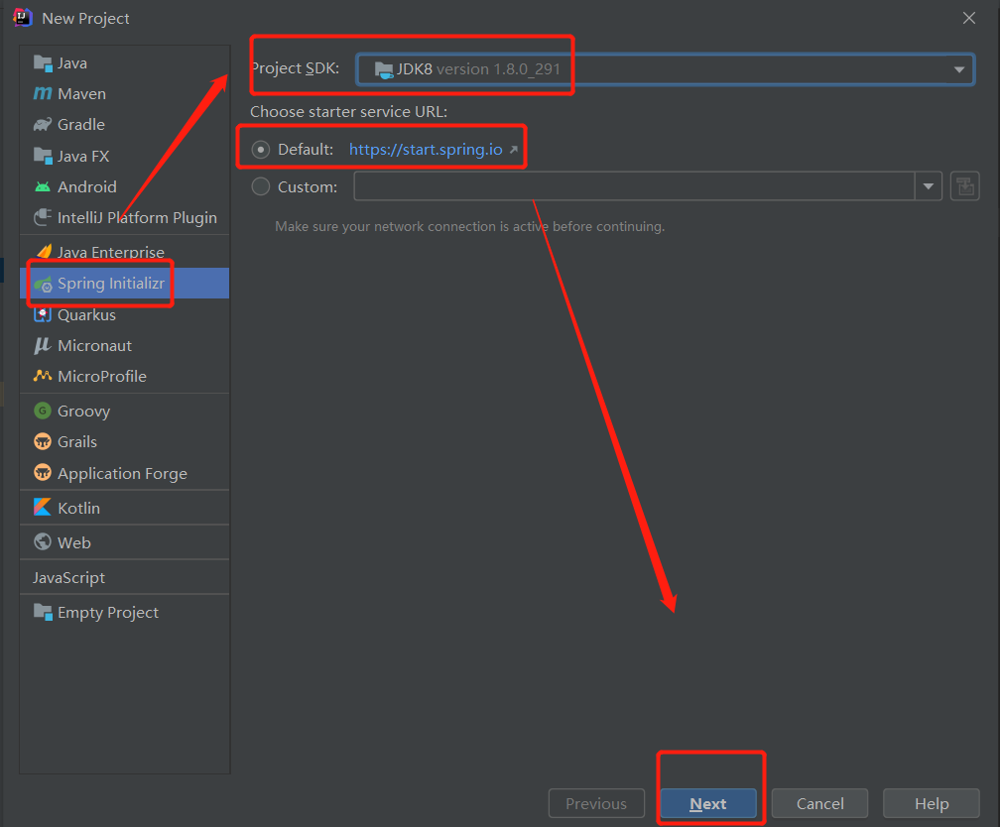

3.完善项目信息，组名可不做修改，项目名可做修改；最终建的项目名为：springbootdemo，src->main->java下包名会是：com->cupdata->springbootdemo；点击next；

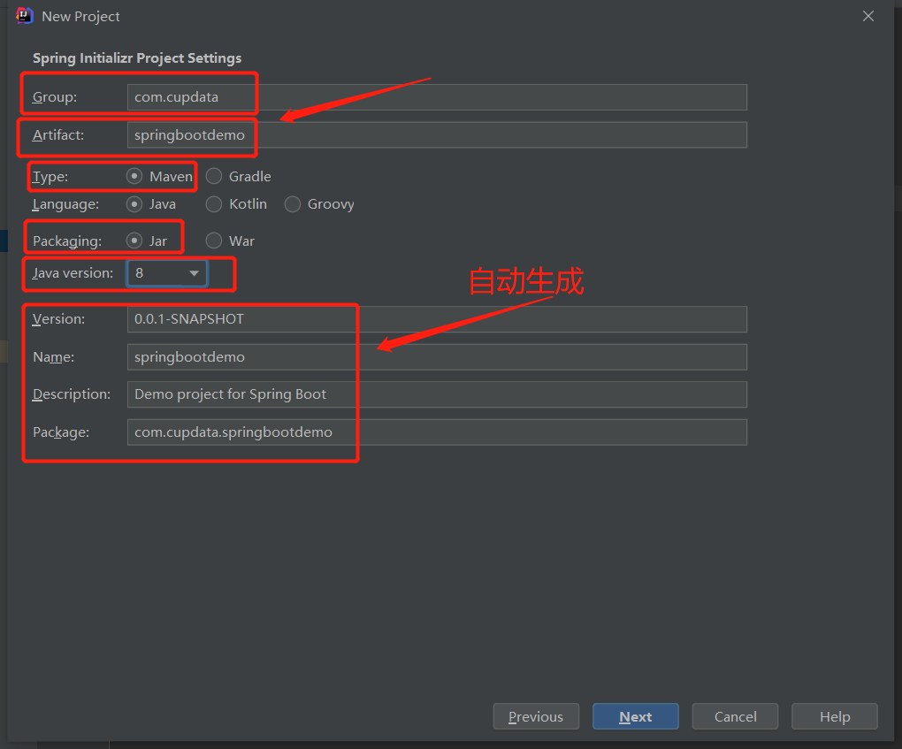

4.Web下勾选Spring Web Start；Template Englines勾选Thymeleaf；SQL勾选：MySQL Driver，JDBC API 和 MyBatis Framework三项；点击next；

（网上创建springboot项目多是勾选Web选项，而较高版本的Springboot没有此选项，勾选Spring Web Start即可，2.1.8版本是Spring Web）

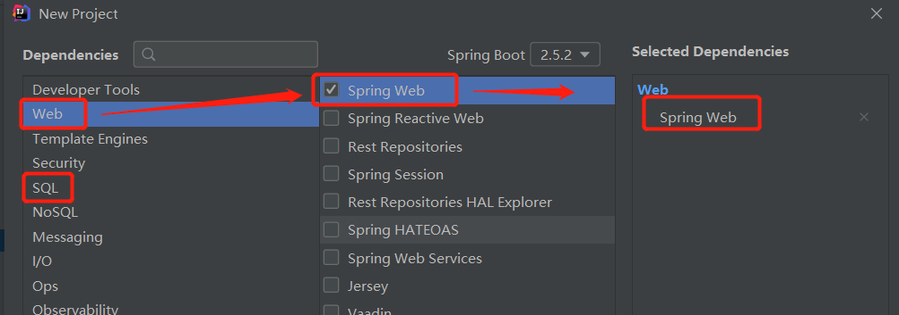

最终勾选完毕如图：

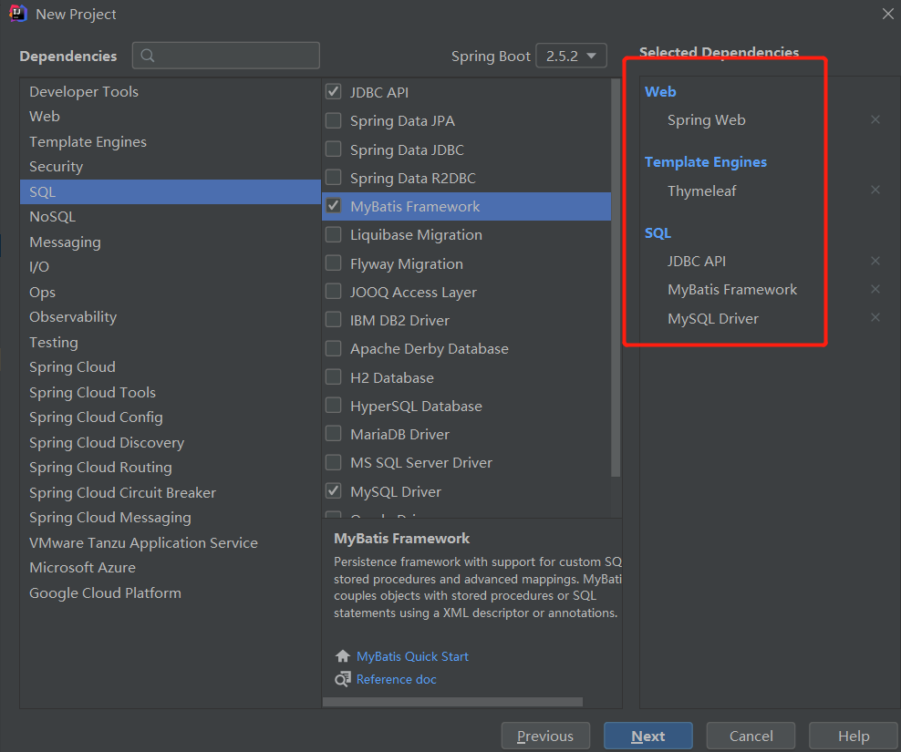

5.选择项目路径，点击finish；打开新的窗口；

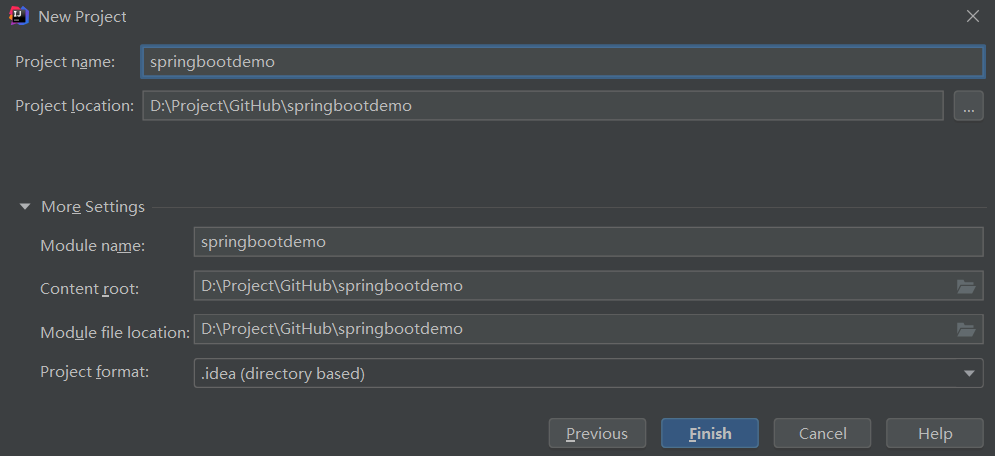

7.点击右侧的Maven，点击设置（扳手图标）进行项目Maven仓库的配置；

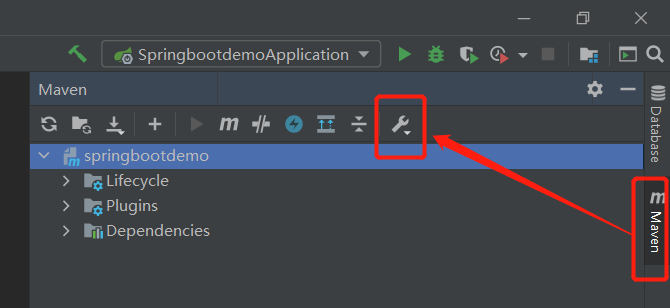

8.（1）选择本地Maven路径；

​	（2）勾选配置文件后边的选项，然后修改为本地Maven的配置文件，它会根据配置文件直接找到本地仓库位置；

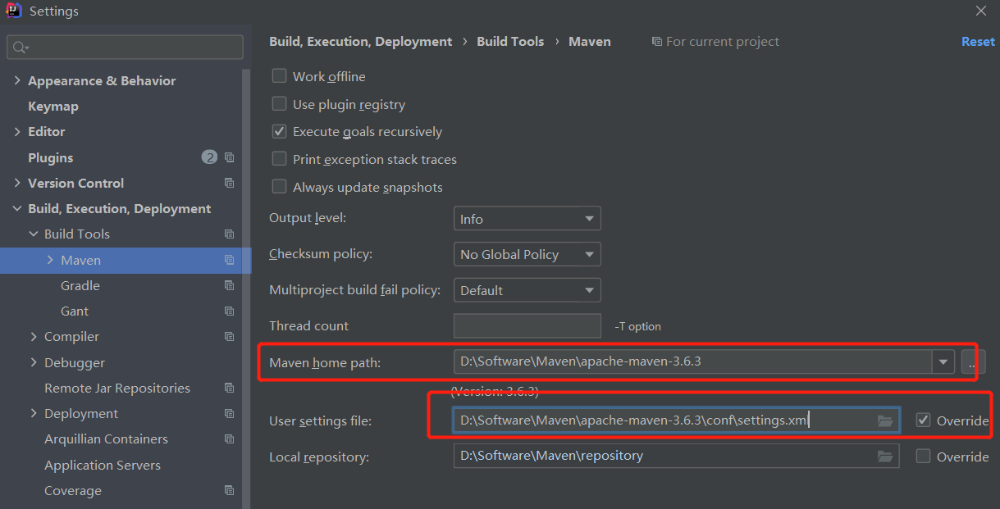

9.配置完后，如果没有自动导包，可以点击左上角重新导包按钮

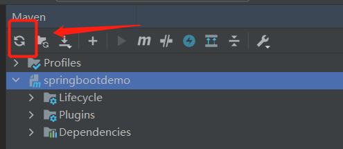

10.在templates文件下新建index.html页面，作为启动的初始页面；

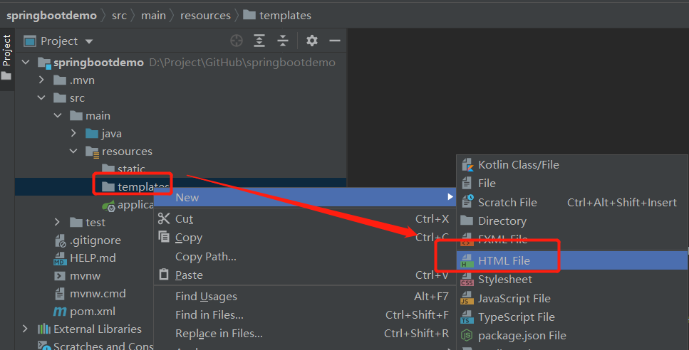

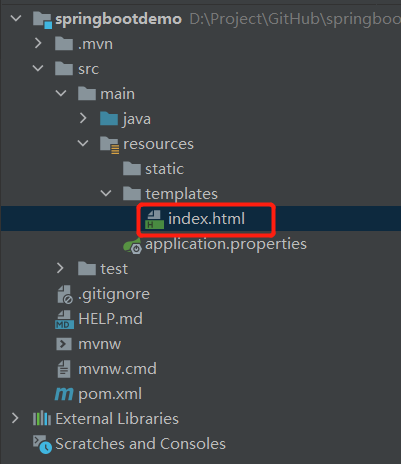


```html
<!DOCTYPE html>
<html lang="en" xmlns:th="http://www.thymeleaf.org">
<head>
    <meta charset="UTF-8">
    <title>hello</title>
</head>
<body>
    你好, CUPDATA！！！
</body>
</html>
```


11.在com.cupdata.springbootdemo下新建controller文件夹，在controller文件夹下建一个简单的HelloController类；（Controller类要添加@Controller注解，项目启动时，SpringBoot会自动扫描加载Controller）

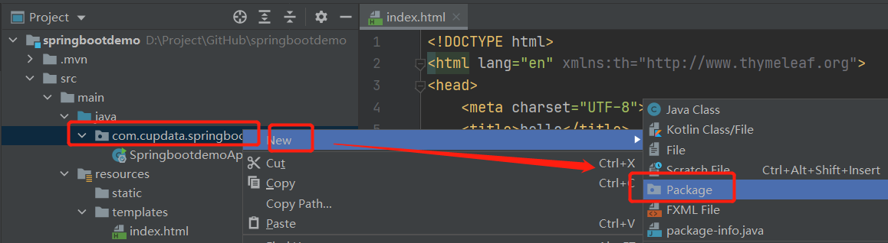

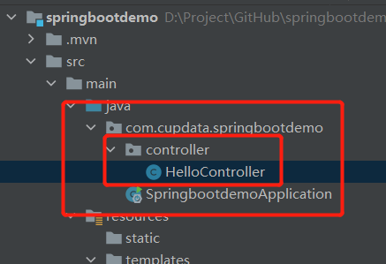


```java
package com.cupdata.springbootdemo.controller;

import org.springframework.stereotype.Controller;
import org.springframework.web.bind.annotation.RequestMapping;

@Controller
public class HelloController {
    @RequestMapping("/index")
    public String sayhello(){
        return "index";
    }
}
```


12.在resources文件夹下application中先配置DataSource等基本信息，application文件有两种文件格式，一种是以.properties为后缀，一种是以.yml为后缀的，两种配置方式略有差别，详情可参考这个网址：https://blog.csdn.net/qq_29648651/article/details/78503853；在这我是用.yml后缀的文件格式。右键application文件选择Refact，选择Rename，将后缀改为yml；

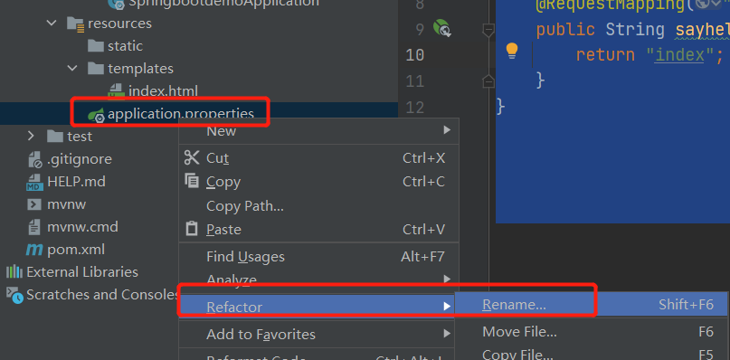

```yaml
spring:
  datasource:
    name: test  #数据库名
    url: jdbc:mysql://192.168.17.121:3306/cruze #url
    username: root  #用户名
    password: root  #密码
    driver-class-name: com.mysql.cj.jdbc.Driver #数据库链接驱动
  thymeleaf:
    prefix: classpath:/templates/
    suffix: .html
    cache: false
    check-template: true
    content-type: text/html
    encoding: UTF-8
 
```


13.运行项目启动类SpringbootdemoApplication.java

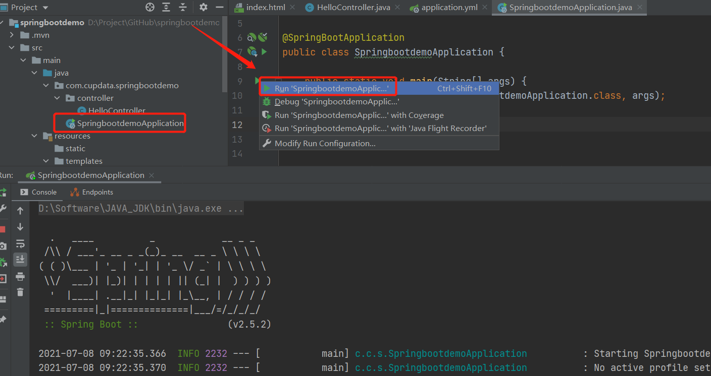

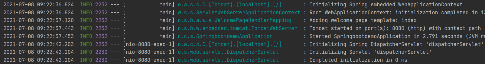

14.在浏览器中输入localhost:8080/index,回车显示初始的index界面；到这项目的初步搭建已经完成，下面可以下一些简单的业务逻辑，比如从数据库获取信息；

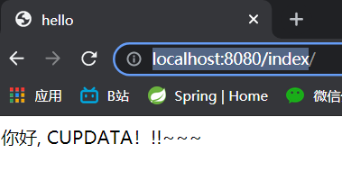


# 四、进行 数据库、mybatis的配置

1、在IDEA链接数据库

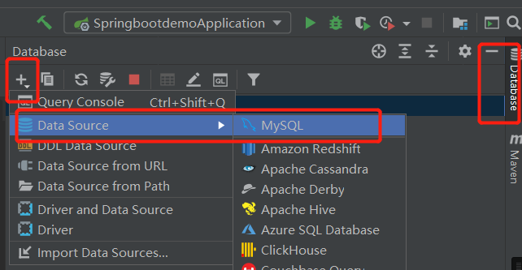

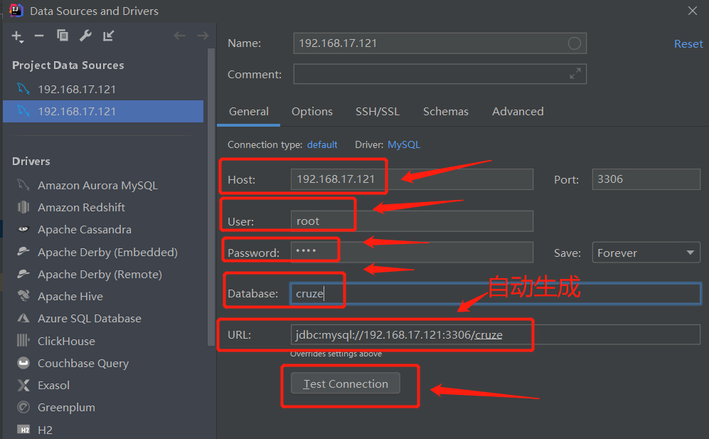

如果点击Test Connection连接失败，可能是驱动的问题，点击左上角的小扳手，进入数据库设置界面

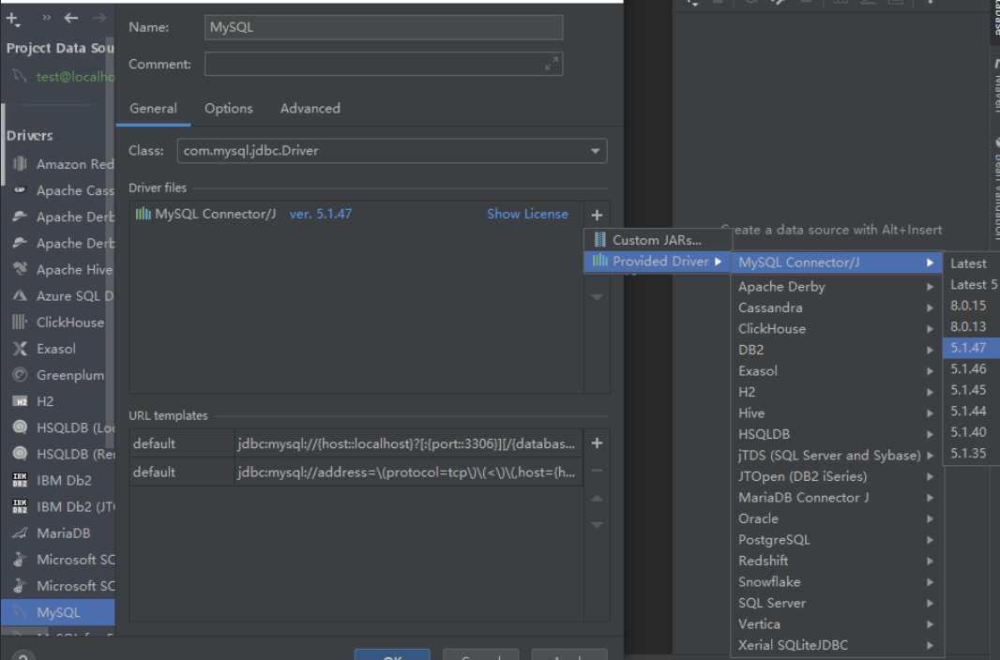


2、mybatis配置

依赖引入（如之前创建工程时未选中mybatis，则需要自行手工修改pom.xml文件）

```xml
<dependency>
    <groupId>org.mybatis.spring.boot</groupId>
    <artifactId>mybatis-spring-boot-starter</artifactId>
    <version>2.2.0</version>
</dependency>
```

在application.yml中添加mybatis配置信息：

```yaml
# mapper-locations表示映射文件在工程中的位置（需要根据自己工程的路径自行修改）
# type-aliases-package表示数据库对象类的存放位置（需要根据自己工程的路径自行修改）
mybatis:
  mapper-locations: classpath:mapping/*.xml
  type-aliases-package: com.cupdata.springbootdemo.entity
```

# 五、如何使用mybatis generator 自动生成代码

1、添加插件
只需要将如下依赖添加到pom.xml文件中即可。（注意此处是以plugin的方式，放在 中间即可）

```xml
<plugin>
    <groupId>org.mybatis.generator</groupId>
    <artifactId>mybatis-generator-maven-plugin</artifactId>
    <version>1.3.2</version>
</plugin>
```


2、编写generatorConfig.xml
需要特别注意的是：在IDEA开发环境下，这个文件需要放置在resources的根目录下面（与application.yml文件同级），文件内容如下

```xml
<?xml version="1.0" encoding="UTF-8"?>
<!DOCTYPE generatorConfiguration
        PUBLIC "-//mybatis.org//DTD MyBatis Generator Configuration 1.0//EN"
        "http://mybatis.org/dtd/mybatis-generator-config_1_0.dtd">
<generatorConfiguration>
    <!-- 数据库驱动:选择你的本地硬盘上面的数据库驱动包-->
    <classPathEntry  location="D:\Software\Maven\repository\mysql\mysql-connector-java\8.0.25\mysql-connector-java-8.0.25.jar"/>
    <context id="DB2Tables"  targetRuntime="MyBatis3">
        <commentGenerator>
            <property name="suppressDate" value="true"/>
            <!-- 是否去除自动生成的注释 true：是 ： false:否 -->
            <property name="suppressAllComments" value="true"/>
        </commentGenerator>
        
        <!--数据库链接URL，用户名、密码 -->
        <jdbcConnection driverClass="com.mysql.cj.jdbc.Driver" connectionURL="jdbc:mysql://192.168.17.121:3306/cruze" userId="root" password="root">
        </jdbcConnection>
        <javaTypeResolver>
            <property name="forceBigDecimals" value="false"/>
        </javaTypeResolver>
        
        <!-- 生成模型的包名和位置-->
        <javaModelGenerator targetPackage="com.cupdata.springbootdemo.entity" targetProject="src/main/java">
            <property name="enableSubPackages" value="true"/>
            <property name="trimStrings" value="true"/>
        </javaModelGenerator>

        <!-- 生成映射文件的包名和位置-->
        <sqlMapGenerator targetPackage="mapping" targetProject="src/main/resources">
            <property name="enableSubPackages" value="true"/>
        </sqlMapGenerator>
        
        <!-- 生成mapper位置-->
        <javaClientGenerator type="XMLMAPPER" targetPackage="com.cupdata.springbootdemo.mapper" targetProject="src/main/java">
            <property name="enableSubPackages" value="true"/>
        </javaClientGenerator>

        <!-- 要生成的表 tableName是数据库中的表名或视图名 domainObjectName是实体类名-->
        <table tableName="prpri" domainObjectName="Prpri" enableCountByExample="false" enableUpdateByExample="false" enableDeleteByExample="false" enableSelectByExample="false" selectByExampleQueryId="false"></table>

    </context>
</generatorConfiguration>
```


3、运行maven

打开maven窗口，双击执行插件，生成相关文件（注意application.yml文件中数据库相关信息要配置好）

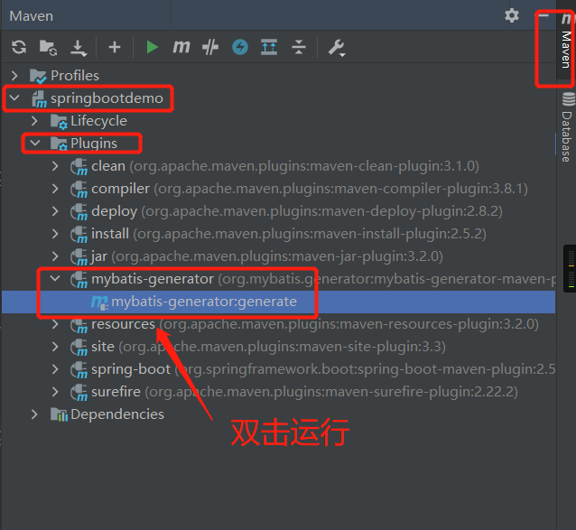


# 六、本周作业

1、搭建Springboot工程，并将第二周作业改成Springboot项目

2、使用Mybatis、Mybatis generator完成数据库操作相关代码生成

说明：涉及到maven的安装、Springboot的注解，请网络搜索相关教程或询问相关指导人员


