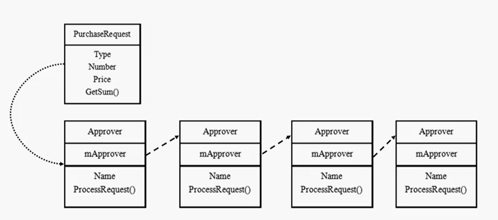

# 设计模式之策略模式

## 设计模式入门

## 策略模式原理

分别封装行为接口，实现算法族，超类里放行为接口对象，在子类里具体设定行为对象。

原则就是：分离变化部分，封装接口，基于接口编程各种功能。

此模式兰行为算法的变化对路玉算法的使用者。

## 策略模式示例演示

## 策略模式的注意点

分析项目变化与不变部分，提取变化部分抽象成接口+实现

多用组合少用继承；用行为类组合，而不是行为的继承。更有弹性。

# 设计模式之观察者模式

## 观察者模式原理

对象之间存在多对一的依赖关系，其中呗依赖的对象为subject，依赖的对象为observer，subject通知observer变化。

## 观察者模式示例演示

observer定义update接口，用于更新数据

subject需要定义一下三个接口：

​		注册

​		移除

​		通知

## Java 内置观察者

## 观察者模式关键点

松耦合，高内聚，隔离影响

解决多（observer）对一（subject）的依赖问题，可以有效将subject的变动通知到observer

JAVA内置的观察者有自身的实现，注意其使用规范

# 设计模式之装饰者模式

装饰者模式原理

装饰者模式示例演示

Java里装饰者介绍

装饰者模式关键点

# 设计模式之单例模式

经典单例模式原理

经典单例模式代码示例

经典单例模式的优化

# 设计模式之工厂模式

简单工厂模式

工厂方法模式

抽象工厂模式

工厂模式关键点

# 设计模式之命令模式

命令模式原理

命令模式项目代码讲解

命令模式关键点

# 设计模式之适配器模式

适配器模式原理

对象适配器与类适配器

从枚举器到迭代器的适配

适配器模式关键点

# 设计模式之外观模式

外观模式原理

最少知识原则

外观模式关键点

# 设计模式之模板模式

模板模式原理

身边模板模式

好莱坞原则

模板模式关键点

# 设计模式之迭代器模式

迭代器模式原理

Java 内置迭代器

迭代器模式关键点

# 设计模式之组合模式

组合模式原理

组合模式示例代码讲解

组合模式关键点

# 设计模式之状态模式

状态模式原理

状态模式示例代码讲解

状态模式关键点

# 设计模式之代理模式

代理模式原理

Java RMI 介绍

代理模式示例代码讲解

几种常见的代理模式介绍

代理模式关键点

# 设计模式之复合模式

复合模式原理

MVC 复合模式讲解

复合模式关键点

# 设计模式之桥接模式

桥接模式原理

桥接模式示例代码讲解

桥接模式关键点

# 设计模式之生成器模式

生成器模式原理

生成器模式演化形式

生成器模式关键点

# 设计模式之责任链模式

## 责任链模式原理

如果有多个对象都有机会处理请求，责任链可以使请求的发送者和接受者解耦，请求沿着责任链传递，直到有一个对象处理了他为止。

优点：

- 解耦
- 简化对象，无需知道链的结构
- 可以动态增删处理的链结构

缺点

- 处理链需要遍历，对性能有影响
- 并不保证请求一定被处理

## 责任链模式示例代码讲解

## 责任链模式关键点

使用场合：

- 有多个对象可以处理一个请求
- 不明确接受者的情况
- 有序、无序链，线型、树形、环形链

与状态模式的区别：

- 责任链模式注重请求的传递
- 状态模式注重对象状态的转换

# 设计模式之蝇量模式

蝇量模式原理

蝇量模式示例代码讲解

蝇量模式关键点

# 设计模式之解释器模式

解释器模式原理

解释器模式示例代码讲解

解释器模式关键点

# 设计模式之中介者模式

中介者模式原理

中介者模式示例代码讲解

中介者模式关键点

# 设计模式之备忘录模式

备忘录模式原理

备忘录模式示例代码讲解

备忘录模式关键点

# 设计模式之原型模式

## 原型模式原理

通过复制现有实例来创建新的对象，无需知道对象类信息；

使用原型模式创建对象比直接new一个对象更有效；

隐藏制造新实例的复杂性；

重复创建相似对象时可以考虑使用原型模式。

缺点：

每个类必须配备一个克隆方法

深层赋值比较复杂

## 原型模式示例代码讲解

实现cloneal接口，override其中的clone（）方法，即可在使用对象时通过clone创建新对象

## 原型模式关键点

单例模式和原型模式时冲突的

类中final对象不能有，否则将不能复制

object的clone方法只拷贝对箱子的基本数据类型，对于数组、容器对象、引用对象都不会拷贝，属于浅拷贝，若要实现深拷贝，必须将上述对象另行拷贝

使用场合：

复制对象数据与结构

希望对目标对象的修改不影响基友的原型对象

创建对象的成本比较大的情况下

# 设计模式之访问者模式

访问者模式原理

访问者模式示例代码讲解

访问者模式关键点

# 设计模式之最后总结

设计模式的三个分类

对象设计的六大原则

用模式来思考